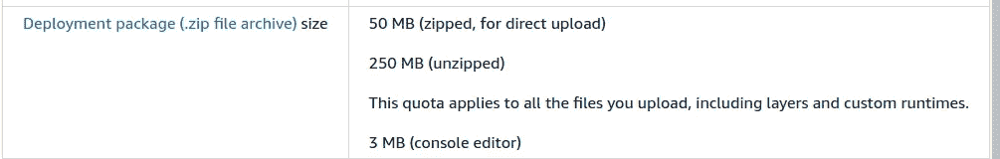
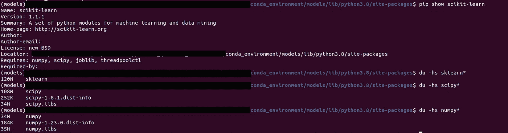
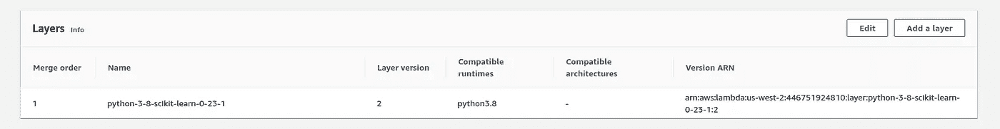
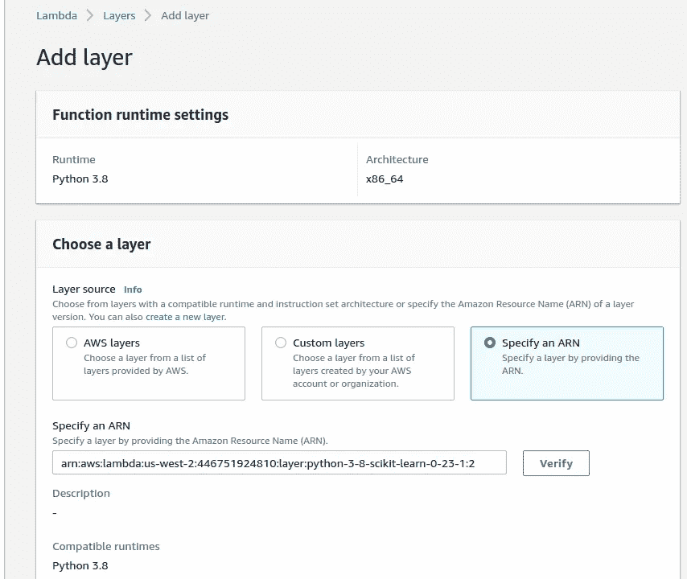
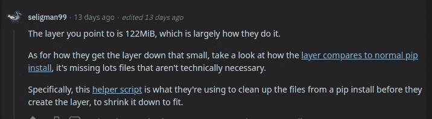
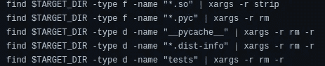

# 在 AWS Lambda 上部署 Sklearn 模型

> 原文：<https://medium.com/geekculture/deploying-a-sklearn-model-on-aws-lambda-b649ce58bac2?source=collection_archive---------2----------------------->

## 使用层和 scikit-learn 在 AWS Lambda 中部署预训练的线性回归(Python 代码示例)


[Created with Dall-E](https://labs.openai.com/s/ZCF3H407fdPtad0IsTycGtJZ) — Image by author

# 介绍

使用 AWS Lambda 作为预测服务可以帮助我们节省大量资金(如下所示)。这就是为什么我决定将它用于 Python 中内置的简单**预测服务(线性回归)，其中我们使用**预训练模型**基于一些输入特征预测目标值。**

在这篇文章中，我们还将看到**如何在使用的库超过允许大小(250 MB)的情况下应对 Lambda 部署大小限制**。该项目是一个简单的线性回归，使用预训练的模型，并在调用 [Lambda URL 函数](https://docs.aws.amazon.com/lambda/latest/dg/lambda-urls.html)时返回新的预测。

它分为两个不同的部分:

*   在第一个例子中，我们有代码来训练一个模型(使用 SQLite 中的数据)并把它(以及缩放器)存储在本地。
*   在第二篇文章中，我们将看到如何使用之前创建的文件在 AWS Lambda 中部署预测服务。

## 为什么将 AWS Lambda 用于预测服务？

1 - [一篇比较 Lambda 和 SageMaker](https://towardsdatascience.com/saving-95-on-infrastructure-costs-using-aws-lambda-for-scikit-learn-predictions-3ff260a6cd9d) 的好文章。虽然那篇文章的一些概念有点过时:Lambda 现在允许用 128 MB 到 10240 MB 的 RAM 执行函数。

[2 -与 SageMaker](https://modelzoo.dev/lambda-vs-sagemaker-cost/) 相比，如果我们的模型足够小，能够适合 Lambda，那么理解我们如何能够轻松节省大量资金也非常有帮助。

3 - [Lambda 函数 URL](https://docs.aws.amazon.com/lambda/latest/dg/lambda-urls.html) 。[几个月前](https://aws.amazon.com/es/blogs/aws/announcing-aws-lambda-function-urls-built-in-https-endpoints-for-single-function-microservices/)，AWS 包含了这个功能，所以我们现在可以调用一个端点来执行我们的 Lambdas。在我们的例子中，这个调用将返回由我们的 Lambda 计算的预测。

# 1-训练模型并将其保存到本地

对于我们的解决方案，我们需要:

*   **Python 3.8** 作为编程语言。
*   [**熊猫**](https://pandas.pydata.org/) 将我们的 SQLite 数据转换成 Dataframe。
*   [**Scikit——学习**](https://scikit-learn.org) 使用[线性回归](https://en.wikipedia.org/wiki/Linear_regression)算法和[定标器](https://stackoverflow.com/questions/40758562/can-anyone-explain-me-standardscaler)准备数据。
*   [**Pickle**](https://docs.python.org/3/library/pickle.html) 为存储输出文件的格式。
*   [**SQLite**](https://www.sqlite.org/index.html) 作为存储我们数据的 DB。

现在，使用存储在 SQLite DB 中的数据创建一个 ***线性回归*** 模型的代码(对其应用一些转换)并将输出模型存储在一个文件中:

作为前面执行的输出，我们将有两个文件:

*   *scaler.pkl*
*   *model.sav*

为了预测一个新值，我们必须使用代码:

由于我们只需要一个值(作为预测获得的目标值)，我们并不仅仅为此创建一个完整的*数据帧*，而是将特征参数作为普通变量传递给*缩放器*。每当我们这样做时， *StandardScaler* 就会发出一个恼人的警告，但这只是一个警告(如果我们注意使用正确的列顺序的话):

```
UserWarning: X does not have valid feature names, but StandardScaler was fitted with feature names
```

# 2-在 AWS Lambda 中创建预测服务

众所周知，我是 AWS Lambda 及其简单性的忠实粉丝:

[](https://aws.plainenglish.io/part-1-design-how-to-deploy-and-automate-your-projects-with-aws-free-tier-79eeab5fff62) [## 如何使用 AWS 自由层部署和自动化项目—第 1 部分

### 自动气象站 Lambda，S3，自动气象站 Cloudwatch，SQLite，Telegram

aws .平原英语. io](https://aws.plainenglish.io/part-1-design-how-to-deploy-and-automate-your-projects-with-aws-free-tier-79eeab5fff62) 

但是就像生活中的所有事情一样，没有什么是完美的，部署 Lambda 项目的复杂性相当高。根据[官方文件](https://docs.aws.amazon.com/lambda/latest/dg/python-package.html):

首先，我们必须压缩安装在虚拟环境中用于项目的库:

```
~/my-function$ cd myvenv/lib/python3.8/site-packages
zip -r ../../../../my-deployment-package.zip .
```

然后，我们将代码添加到该文件的根目录，并将其部署在 Lambda 中，这就是问题开始的地方:



[https://docs.aws.amazon.com/lambda/latest/dg/gettingstarted-limits.html](https://docs.aws.amazon.com/lambda/latest/dg/gettingstarted-limits.html) — Image by author

*   如果压缩文件大于 50 兆字节，有必要上传到 S3，并从那里链接。
*   如果文件解压缩后大于 250 Mb，就不能在 Lambda 中使用。

对于我们的用例(使用 Lambda URL 函数预测值的线性回归),我们需要:

*   **scikit-learn** (要求: *scipy* ， *numpy* ，threadpoolctl，joblib)。



Libraries size count — Image by author

拥有一个只有普通 *scikit-learn* 安装的环境所需的所有库的总数将是:120+188+34+34+35 = **411 MB**

正如你所看到的，只有 *scikit-learn* 和它的依赖(不算熊猫)**已经超过 250mb 解压**。

## 问题:Lambda 部署大小

**解决方案**

使用[层](https://aws.amazon.com/en/about-aws/whats-new/2018/11/aws-lambda-now-supports-custom-runtimes-and-layers/):

> Lambda 层是一种新型的工件，可以包含任意代码和数据，并且可以同时被零个、一个或多个函数引用。无服务器应用程序中的 Lambda 函数通常共享公共依赖项，如 SDK、框架和运行时。通过层，您可以集中管理多个功能的通用组件，从而实现更好的代码重用。

可以看出，层的使用促进了共享，而在促进共享的地方，社区完成了其余的工作:

[](https://github.com/mthenw/awesome-layers) [## GitHub-mth enw/awesome-Layers:λAWS Lambda 图层的精选列表。由…赞助

### 令人敬畏的 AWS Lambda 层的精选列表 Lambda 层是一种新类型的工件，可以包含任意代码…

github.com](https://github.com/mthenw/awesome-layers) 

添加一个层就像为我们的 Python 版本和 AWS 区域获取它的 ARN (Amazon 资源名称)一样简单([一个 scikit-learn 层可以从 Github](https://github.com/model-zoo/scikit-learn-lambda/blob/master/layers.csv) 中获取)。然后在我们的 Lambda 函数中，我们寻找“*图层*”选项:



scikit-learn layer added to Lambda function — Image by author

我们进入之前复制的 ARN:



Specifying ARN of layer in Lambda function — Image by author

就这样，从代码中我们可以引用安装在层中的包，就好像我们已经将它们包含在我们的"*"中一样。zip"* 部署，或者好像我们已经用" *pip* "安装了它们。这样我们也可以减少部署时间，因为有了“T21”。该项目的 zip" 将更小，我们将有更多的空间为我们的预训练模型。

## 为什么有可能在一个小于 250 MB 的层中压缩 scikit-learn +及其所有依赖项？

感谢以下 Reddit 用户，我们有了答案:



[Original Reddit post](https://www.reddit.com/r/aws/comments/vwoch8/comment/ifs39za/?context=3) — Image by author

可以看出，根据他们的[助手脚本](https://github.com/model-zoo/scikit-learn-lambda/blob/master/tools/install-pip-packages.sh#L14):

> 需要两个参数:一个 pip 包和一个目标目录。安装 pip 包并从生成的包中删除不必要的构建工件

他们称之为“不必要的构建工件”是什么？：



[Removed files from Scikit-Learn installation](https://github.com/model-zoo/scikit-learn-lambda/blob/master/tools/install-pip-packages.sh#L14) — Image by author

所以他们设法创建了一个只有 122 MB 的安装，允许我们在 AWS Lambda 层中使用 Scikit-Learn (+它的依赖项)!

## 其他选择:使用容器

容器的使用超出了本文的范围，但是在我的分析中，我为对这个选项感兴趣的人找到了一些文章:

[](https://stackoverflow.com/questions/54632009/how-to-increase-the-maximum-size-of-the-aws-lambda-deployment-package-requesten) [## 如何增加 AWS lambda 部署包的最大大小…

### 我自己没有试过，但是 Zappa 的人描述了一个可能有帮助的技巧。引用自…

stackoverflow.com](https://stackoverflow.com/questions/54632009/how-to-increase-the-maximum-size-of-the-aws-lambda-deployment-package-requesten) [](/geekculture/3-ways-to-overcome-aws-lambda-deployment-size-limit-part-1-f2eb2170b75b) [## 克服 AWS Lambda 部署规模限制的 3 种方法—第 1 部分

medium.com](/geekculture/3-ways-to-overcome-aws-lambda-deployment-size-limit-part-1-f2eb2170b75b) 

## 奖励:使用电报监控你的 Lambda 函数

[](/@ivangomezarnedo/how-to-improve-the-monitoring-of-your-lambda-processes-with-telegram-45b2edf1a250) [## 如何使用 Telegram 改进对 Lambda 函数的监控

### 使用机器人将 Cloudwatch 日志发送到 Telegram。

medium.com](/@ivangomezarnedo/how-to-improve-the-monitoring-of-your-lambda-processes-with-telegram-45b2edf1a250) 

```
“The success formula: solve your own problems and freely share the solutions.”
― [**Naval Ravikant**](https://twitter.com/naval/status/1444741381579177984)
```

# 结论

在这篇文章中，我们看到:

*   为什么 Lambda 是实现预测服务的好选择。
*   使用 Python 和 scikit-learn 在本地训练模型，并将输出模型存储为文件的代码。
*   如何使用之前训练的模型(和定标器)来预测新的目标值。
*   如何创建带有层的 Lambda 函数来应对 Lambda 部署大小限制。
*   如何创建一个比普通软件包安装更小的层。
*   寻找结果的神奇问题(应用于数据工程领域)

我们没有看到的是:

*   如何使用容器处理这些限制(虽然有用的文档已经链接)。
*   如何将 Lambda URL 函数配置为[有很多可用的文档](https://docs.aws.amazon.com/lambda/latest/dg/lambda-urls.html)(如果你想让我也涵盖这个主题，请在评论中告诉我)

```
**Want to Connect?**[@data_cyborg](https://twitter.com/data_cyborg)
[https://www.linkedin.com/in/ivan-gomez-arnedo/](https://www.linkedin.com/in/ivan-gomez-arnedo/)
```