# 在 Docker Hub 中部署 Spring Boot 应用程序

> 原文：<https://medium.com/geekculture/deploying-a-spring-boot-app-in-docker-hub-4951a52a703?source=collection_archive---------3----------------------->

自从 Spring Boot 框架诞生以来，Web 应用程序的创建已经简化了很多。正如他们的官方主页所说" **Spring Boot 使创建独立的**"生产级的基于 Spring 的应用程序变得很容易，你可以**"直接运行"**

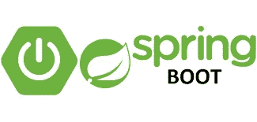

***今天我们将使用 Eclipse 创建一个基本的 Spring Boot 应用程序，然后继续编写 docker 文件，创建 docker 映像，然后将其推送到 docker hub。***

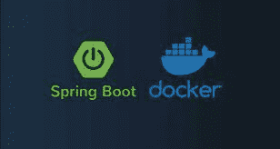

让我们按照以下步骤完成上述过程:

**步骤 1)** 在 Eclipse 中安装 Java 和 Eclipse IDE 以及 STS(Spring Tool Suite)插件

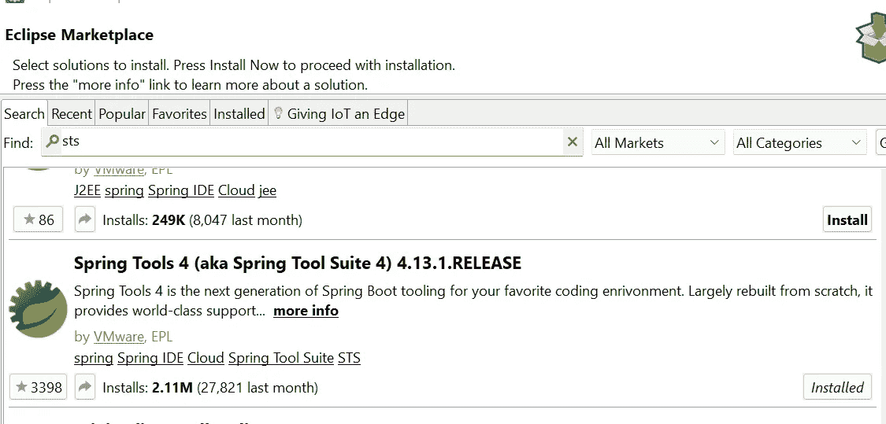

STS Plugin in Eclipse Marketplace

一旦安装了上述插件，重启 eclipse，就可以创建一个基本的 Spring Boot Hello 应用程序了

在 Eclipse 中，让我们创建一个 Spring starter 项目

新项目-> Spring starter 项目

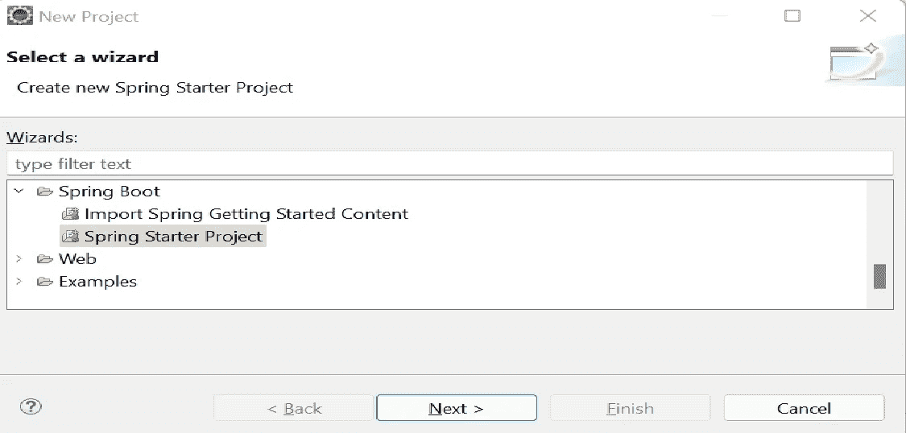

Starter Project in Spring

让我们在下一个屏幕上更改几个字段，我们就准备好了，

**name = demo，java-version = 8，我保持最新版本。**

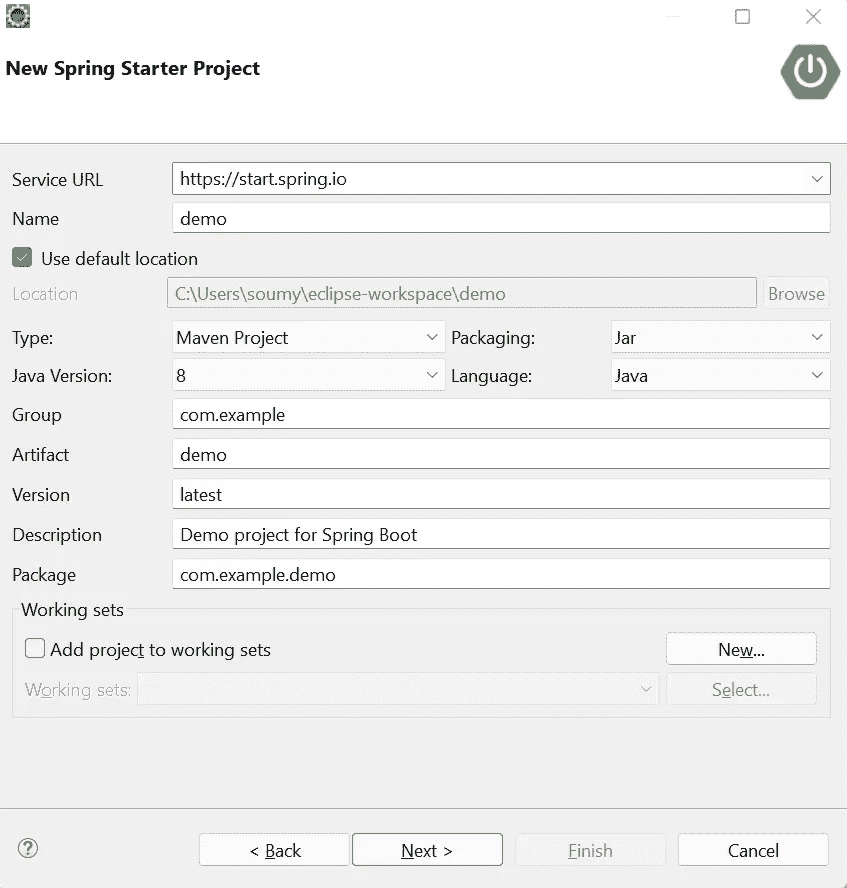

保持其他一切默认，你就可以开始了

**步骤 3)** 现在让我们创建一个**控制器类，用于 Hello World 的基本 rest 调用**和**在 POM.xml 中添加 spring-boot-web 依赖关系**，

如果您不熟悉 POM 和 Maven，POM 是项目对象模型的缩写**。pom。xml 文件包含项目信息和 maven 构建项目的配置信息，如依赖项、构建目录、源目录、测试源目录、插件、目标等。Maven 读 pom。xml 文件然后执行目标。**

我们需要在 POM.xml 中添加以下依赖项

```
 <dependency>
    <groupId>org.springframework.boot</groupId>
    <artifactId>spring-boot-starter-web</artifactId>
    <version>2.6.3</version>
</dependency>
```

现在我们将创建**控制器类，它将负责在用户点击我们的 API** 时向用户问好

```
package com.example.demo.controller;import org.springframework.web.bind.annotation.GetMapping;import org.springframework.web.bind.annotation.RestController; @RestControllerpublic class GreetingController { @GetMapping("/greeting") public String greetConsumer() { return "Hello from a basic app.";
    }}
```

这里我们添加了“ **@RestController”，这个注释被应用到一个类，将其标记为请求处理程序**，Spring 将在运行时进行构建并提供 RESTful web 服务。还有“ **@GetMapping”注释用于将 HTTP GET 请求映射到特定的处理程序方法。("/问候语")**

**步骤 4)** 让我们通过主类(通过 Spring Boot 启动模板创建)启动我们的应用程序，以 Spring Boot 应用程序的方式运行主方法，应用程序将在**嵌入式 tomcat 服务器**中自动运行

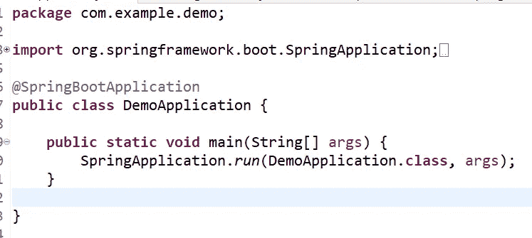

Main Application

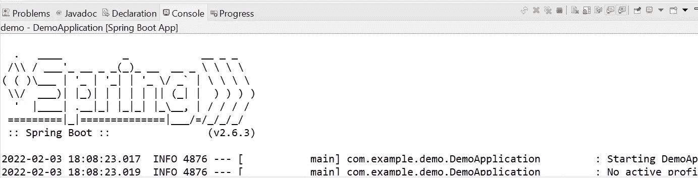

Spring app Started

**步骤 5)** 让我们在浏览器中测试我们的应用程序，在您的浏览器中点击以下 URL，瞧，我们收到了欢迎消息。

[https://localhost:8080/greeting](https://localhost:8080/greeting)

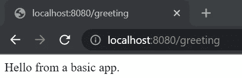

**我们基本的 Spring Boot 应用程序**的创建到此结束，现在让我们深入了解一下这个应用程序在 Docker 上的部署

# **部署在码头**

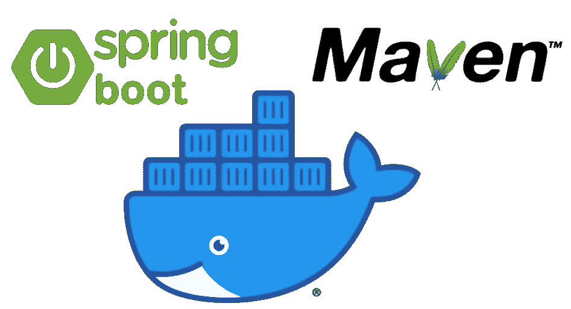

Docker 是一个开源的容器化平台。It **使开发人员能够将应用程序打包到容器**——标准化的可执行组件，将应用程序源代码与操作系统(OS)库以及在任何环境中运行该代码所需的依赖项相结合。Docker 让我们作为开发人员的生活变得非常轻松。

我们将把我们的应用程序转换成 docker 图像，然后发布到 docker hub 上，这类似于所有图像的市场。

**步骤 1)将你的应用打包成一个 Jar 文件**

在 Eclipse 中右键单击您的项目并选择 RunAs → Maven Build，这将创建您的项目所需的 jar，它可以进一步用于任何平台上的部署。如果 Maven 要求一个目标，提供如下图所示的清洁和包装

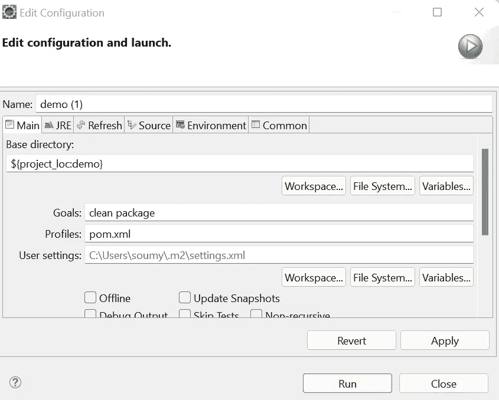

完成上述步骤后，您的 **demo-latest.jar** 应该可以在项目目录下的目标文件夹中找到。

**步骤 2)创建应用程序的 docker 映像**，按照以下步骤操作

a)在 windows 上安装 docker 桌面

b)登录 docker hub，如果您没有帐户，请创建一个。这是在 Docker hub 上发布您的图像所必需的。

c)创建 Dockerfile 文件

在您的项目目录中创建一个 Dockerfile 并添加以下内容，Dockerfile 是一个简单的文件，名称为“Dockerfile ”,没有任何扩展名。

```
FROM openjdk:8-jdk-alpineEXPOSE 8080ADD target/demo-latest.jar demo.jarENTRYPOINT ["java","-jar","/demo.jar"]
```

*这里我们使用 OpenJDK 8，在 8080 端口上展示我们的应用，从目标文件夹中选择我们的应用，然后为运行命令提供入口点*

d)在您的项目目录中打开 CMD，使用下面的 docker 命令构建映像，这里 soumyansh 是我的 docker hub 用户名，用您的用户名更改它。

```
docker build -t soumyansh/demo.jar:latest -f Dockerfile .
```

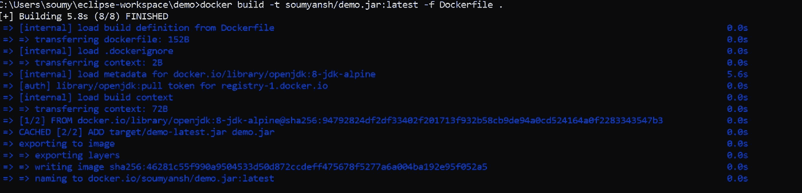

e)在 docker 桌面控制面板中验证您的图像列表

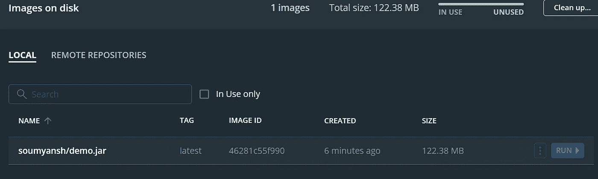

**步骤 3)将 docker 图像推送到 docker hub**

使用 CMD 上的 docker 登录命令登录到 docker hub，提供凭证，如果您已经登录到 docker 桌面，您应该会自动获得身份验证

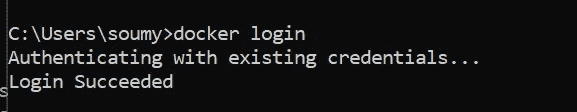

在这一步之后，启动下面的命令，将映像推送到 docker hub 上，根据您的 Docker hub 配置文件更改用户名。

```
docker push soumyansh/demo.jar
```

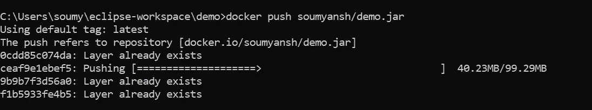

**步骤 4) *恭喜你完成了所有步骤，现在你已经将你的应用程序推送到 docker hub 了。在 Dockerhub 网站的“存储库”下验证相同的内容***

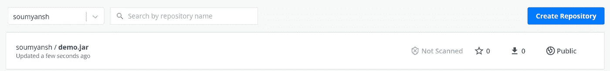

**第 5 步)**现在，您可以随时从 Dockerhub 按需获取您的映像，并在您的操作系统上运行它，请参考以下直接从 docker hub 获取和运行您的映像的命令。将我们的应用暴露于端口 8080

```
docker run -p 8080:8080 soumyansh/demo.jar
```

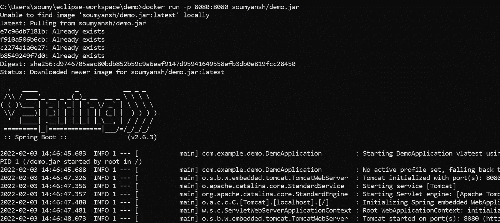

这将在端口 8080 上自动启动我们的应用程序，现在你可以在你最喜欢的浏览器中点击下面的 URL

```
https://localhost:8080/greeting
```

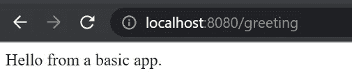

再次祝贺以上所有步骤的完成。

***感谢您读到这里。在这篇文章中，我们学习了如何使用 Spring-boot 设计一个基本的基于 Web 的 Rest-API，并在 docker 上部署了相同的 API。***

我希望这个教程对你有用。我很好奇你是怎么想的，所以给我一些建议吧。您也可以通过[邮箱](mailto:soumyansh@gmail.com)直接与我联系，或者通过 [LinkedIn](https://www.linkedin.com/in/soumyansh/) 与我联系。