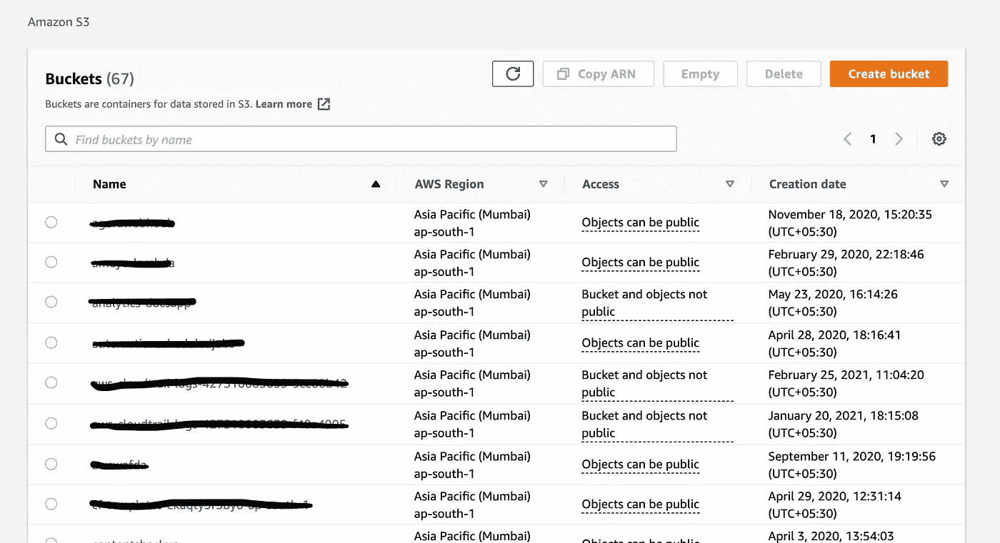
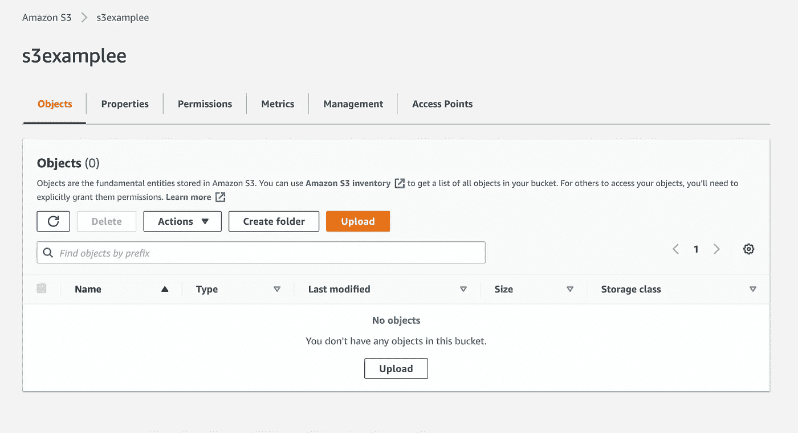
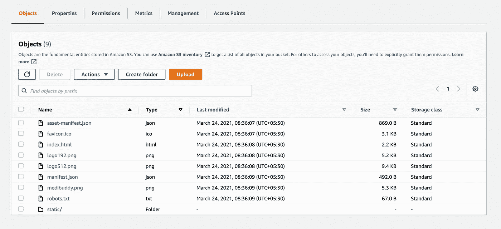

# 在 AWS S3 桶上部署静态网站

> 原文：<https://medium.com/geekculture/deploying-a-static-website-on-aws-s3-bucket-db40efdf4b48?source=collection_archive---------14----------------------->

## 一步一步的指导…

Photo by [Glenn Carstens-Peters](https://unsplash.com/@glenncarstenspeters?utm_source=medium&utm_medium=referral) on [Unsplash](https://unsplash.com?utm_source=medium&utm_medium=referral)

# 什么是 AWS S3 铲斗？

AWS S3 存储桶是亚马逊提供的一种存储服务，用于存储不同类型的数据。它速度快、可伸缩且高度可靠。与不同类型的数据被称为不同的文件格式不同，在 AWS S3 存储桶中，它被简单地称为 AWS S3 对象。AWS S3 桶主要用于数据存储、数据备份、媒体托管、网站托管等。

## 让我们看一个可以使用 S3 铲斗的例子。

# 如何在 S3 桶上部署和托管一个静态网站？

一个不需要任何服务器逻辑来维护，只包含 HTML、CSS 和 JavaScript 的网站最适合这个例子。

1.  点击 AWS 上的 S3 服务选项卡。
2.  现在，您将看到所有已经托管的现有存储桶。要创建新的存储桶，请单击“创建存储桶”

3.然后为您的存储桶命名，并选择您希望它托管的区域。

4.然后点击屏幕底部的“创建存储桶”。

5.创建 s3 存储桶后，您将被重定向到 s3 主页。

6.现在，在顶部的搜索栏中搜索您的 s3 存储桶，并单击它。

7.现在你可以通过点击上传按钮来上传你的文件。

8.上传完所有文件后，转到属性选项卡，滚动到底部，启用静态网站托管。这个选项的作用是，如果一个用户有你的 s3 存储桶 URL，那么他们将被托管 index.html 文件。

9.现在，如果您转到页面底部的 properties 选项卡，您将看到您的存储桶的 s3 URL。现在你可以简单地与你的朋友和家人分享你的网址，这样人们就可以访问你的网站。

10.但是在此之前，您必须将 s3 对象公开，以便 s3 和您的帐户之外的其他人可以访问它们。

11.为此，请转到“权限”选项卡，关闭“阻止公共访问”。

12.现在只需选择对象选项卡上的所有对象，单击“操作”下拉菜单，滚动到底部，然后单击“公开”。

13.公开后，您可以通过访问 S3 共享桶网址访问您的网站，也可以与您的朋友和家人分享。