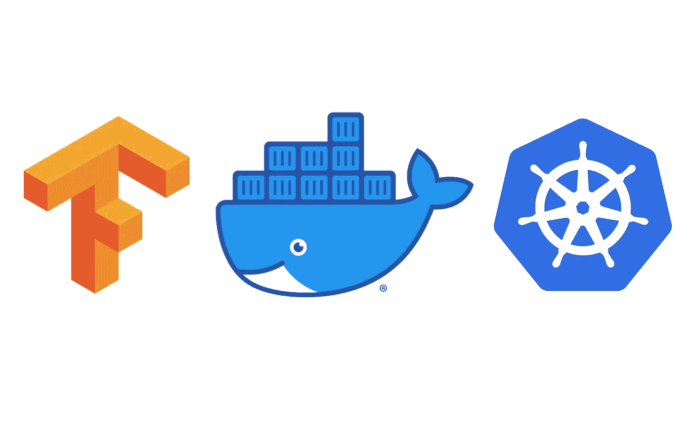

# 将张量流模型部署到 Kubernetes

> 原文：<https://medium.com/geekculture/deploying-a-tensorflow-model-to-kubernetes-444b36672207?source=collection_archive---------6----------------------->

## 在微服务架构中使用人工智能的通用方法



假设您刚刚完成新 TensorFlow 模型的训练，并希望开始在您的应用程序中使用它。一个显而易见的方法是将它导入到使用它的每个应用程序的源代码中。然而，将您的模型保持在一个独立的地方，并简单地让应用程序通过 HTTP 调用与它交换数据，这可能更通用。本文将介绍构建这样一个系统的步骤，并将结果部署到 Kubernetes 以获得最大的可用性。

# 张量流模型


首先，我们需要一个工作模型。这里，我们将使用 [TensorFlow 入门指南](https://www.tensorflow.org/tutorials/quickstart/beginner)中的 MNIST 分类器:

```
# Importing TensorFlow
import tensorflow as tf# Loading the data
mnist = tf.keras.datasets.mnist
(x_train, y_train), (x_test, y_test) = mnist.load_data()# Data preprocessing (here, normalization)
x_train, x_test = x_train / 255.0, x_test / 255.0# Building the model
model = tf.keras.models.Sequential([
  tf.keras.layers.Flatten(input_shape=(28, 28)),
  tf.keras.layers.Dense(128, activation='relu'),
  tf.keras.layers.Dropout(0.2),
  tf.keras.layers.Dense(10)
])# Loss function declaration
loss_fn = tf.keras.losses.SparseCategoricalCrossentropy(from_logits=True)# Model compilation
model.compile(optimizer='adam',
              loss=loss_fn,
              metrics=['accuracy'])# Training
model.fit(x_train, y_train, epochs=5)
```

一旦经过训练，该模型可用于进行预测。以下是将前两个测试图像输入模型的示例:

```
model(x_test[:2])
```

在某些情况下，人们可能希望将 AI 模型的开发与使用它的应用程序的开发完全分开。一个典型的例子是微服务架构。

对于这种情况，可以使用 REST API 来公开模型，这可以使用像 [Flask](https://flask.palletsprojects.com/en/1.1.x/) 这样的模块来完成。然而，TensorFlow 为此提供了一个预制选项: [TensorFlow Serving](https://www.tensorflow.org/tfx/guide/serving) 。TensorFlow 服务由一个 Docker 容器组成，该容器包含向 HTTP 请求公开导出的 TensorFlow 模型所需的所有逻辑。

作为使用 TensorFlow 服务的第一步，我们将从使用 Keras 的 *save* 函数导出模型开始:

```
model.save('./mymodel/1/')
```

导出的模型现在位于文件夹*中。/mymodel/1/* 。请注意，此处的 *mymodel* 是型号的名称，而 *1* 成为其版本。

# TensorFlow 服务码头集装箱


模型现在已经导出，可以在 TensorFlow 服务容器中复制。为此，我们首先从 Docker Hub 中拉出一个空容器，并在本地运行它:

```
docker run -d --name serving_base tensorflow/serving
```

随着容器的运行，可以复制导出的模型:

```
docker cp ./mymodel serving_base:/models/mymodel
```

容器现在包含了我们的模型，并且可以保存为新的图像。这可以通过使用 docker commit 命令来完成:

```
docker commit --change "ENV MODEL_NAME mymodel" serving_base my-registry/mymodel-serving
```

该命令还将 *MODEL_NAME* 环境变量设置为我们的模型名称。请注意，my-registry 是将图像推送到的 docker 注册表的 URL。

一旦完成，我们可以摆脱原来的 TensorFlow 服务形象

```
docker kill serving_base
docker rm serving_base
```

在这里，通过运行它来检查容器是否真的在工作可能是个好主意:

```
docker run -d -p 8501:8501 my-registry/mymodel-serving
```

请注意，8501 是 TensorFlow 服务用于其 REST API 的端口。

对`http://<docker host IP>:8501/v1/models/mymodel`的 Get 请求应该返回以下 JSON:

```
{
 "model_version_status": [
  {
   "version": "1",
   "state": "AVAILABLE",
   "status": {
    "error_code": "OK",
    "error_message": ""
   }
  }
 ]
}
```

如果到目前为止一切顺利，那么可以将容器推送到注册中心，这将使它可供 Kubernetes 拉取:

```
docker push my-registry/mymodel-serving
```

# 将容器部署到 Kubernetes


现在容器已经被推送到注册中心，可以部署到我们的 Kubernetes 集群了。这是通过在集群中创建两个资源来实现的:一个部署和一个服务。部署基本上是应用程序本身，而服务则允许用户从集群外部访问部署。这里，我们将使用一个节点端口服务，这样我们的 TensorFlow 服务容器就可以通过使用一个专用端口从集群外部进行访问。这件事我们会选 30111。

创建这些资源只需用 kubectl 命令应用 YAML 清单文件的内容。在我们的例子中，这里是我们的 *kubernetes_manifest.yml* 文件的内容:

```
apiVersion: apps/v1
kind: Deployment
metadata:
  name: mymodel-serving
spec:
  replicas: 1
  selector:
    matchLabels:
      app: mymodel-serving
  template:
    metadata:
      labels:
        app: mymodel-serving
    spec:
      containers:
      - name: mymodel-serving
        image: my-registry/mymodel-serving
        ports:
        - containerPort: 8501
---
apiVersion: v1
kind: Service
metadata:
  name: mymodel-serving
spec:
  ports:
  - port: 8501
    nodePort: 30111
  selector:
    app: mymodel-serving
  type: NodePort
```

然后可以通过执行以下命令来创建资源

```
kubectl apply -f kubernetes_manifest.yml
```

容器现在应该部署在 Kubernetes 集群中了

# 使用 TensorFlow 服务 API

部署在 Kubernetes 中的人工智能模型现在可以用于预测。这可以通过向 TensorFlow 服务容器的预测 API 发送 POST 请求来完成。请求的主体由一个 JSON 组成，JSON 包含要提供给模型的输入数据。然后，模型将回复其预测，也是 JSON 格式。这里有一个例子说明如何用 Python 实现这一点，使用的是*请求*模块

```
# Import the necessary modules
import requests
import numpy as np
import json
import tensorflow as tf# Loading data
mnist = tf.keras.datasets.mnist
(x_train, y_train), (x_test, y_test) = mnist.load_data()# Data preprocessing (here, normalization)
x_train, x_test = x_train / 255.0, x_test / 255.0# Format the image data so as to be sent as JSON
payload = json.dumps( { 'instances': x_test[:2].tolist() } )# URL of the TensorFlow Serving container's API
url = 'http://<cluster IP>:30111/v1/models/mymodel:predict'# Send the request
response = requests.post(url, data=payload)# Parse the response
prediction =  response.json()["predictions"]# Print the result
print(prediction)
```

# 结论

由于 Tensorflow 服务，人工智能模型可以很容易地容器化，将它们变成自己的独立应用程序，可以通过 HTTP 调用进行交互。这增加了关注点的分离和模块化，特别是与将模型直接嵌入到依赖它的应用程序的源代码中相比。