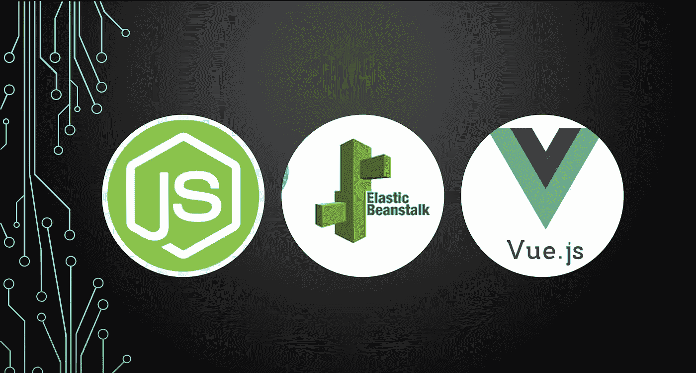
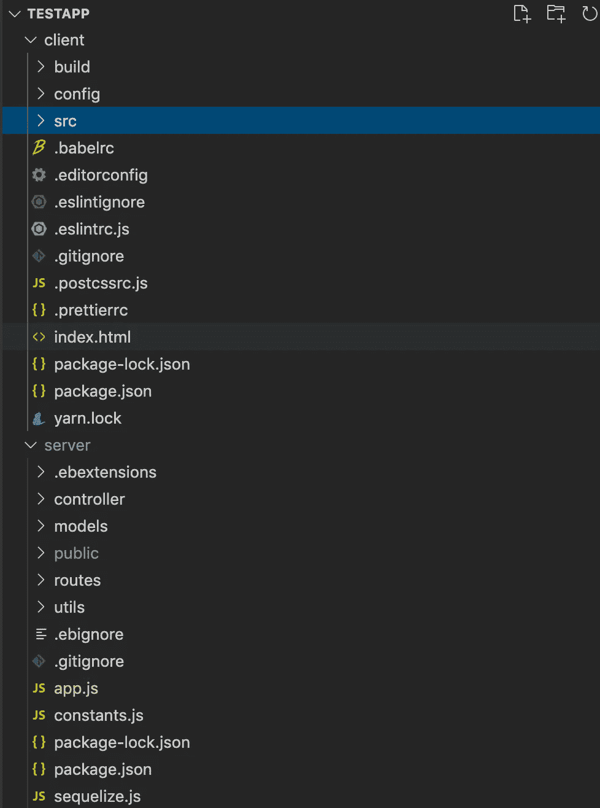
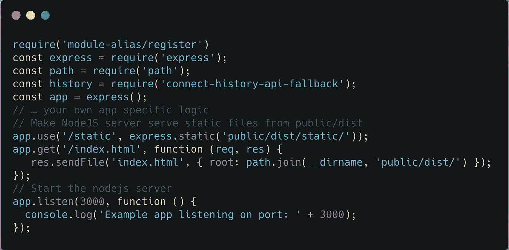

# 将 Vue 和节点应用程序部署到 AWS Elastic Beanstalk

> 原文：<https://medium.com/geekculture/deploying-a-vue-and-node-application-to-aws-elastic-beanstalk-954a11c4ab51?source=collection_archive---------6----------------------->



第一次在前端部署 Vue.js，在后端部署 Node.js 的 web 应用程序可能是一项艰巨的任务。这需要阅读和理解 AWS 的一些细节来解决我在这个过程中遇到的一些问题。我采用了一种方法，将 VueJS 和 NodeJS 捆绑在一起，并直接上传到 AWS Elastic Beanstalk，但是当我开始集成 AWS Cloudfront 时，这被证明是非常有限的。然后，我采用了另一种方法，这种方法似乎在生产中非常有效。我将在下面概述这两种方法。

假设我们有一个名为 testapp 的项目目录。testapp 目录有两个子目录

1.  客户端— Vue.js 前端代码
2.  server-Nodejs 后端代码



# 第一种方法

第一种部署方法是将 Vuejs 包和 Nodejs 一起打包，并上传到 AWS Elastic Beanstalk。这里的步骤将是:

1.  **在客户端目录下构建 Vue.js 项目**

```
npm run build. // this will generate a dist directory in the client
```

2.**将 public 目录下的 dist 目录粘贴到 server 文件夹**中。

3.**确保您的 nodejs 服务器被配置为从公共目录中提供静态文件**。在那里添加这些行应该可以做到:



4.**启动节点服务器**检查 localhost:3000。你应该可以在 localhost:3000 上运行整个网站。

```
node app.js
```

5.**在 AWS 弹性豆茎上部署网站**:

*   [如果你还没有开发者账户的话，在 AWS 上注册一个。](https://portal.aws.amazon.com/billing/signup?redirect_url=https%3A%2F%2Faws.amazon.com%2Fregistration-confirmation#/start)
*   [这是了解如何将 Node.js 应用程序部署到 Elastic Beanstalk 的绝佳资源](/@xoor/deploying-a-node-js-app-to-aws-elastic-beanstalk-681fa88bac53)。
*   一旦完成，你应该有一个像 testapp [一样的弹性豆茎链接。us-east-1.elasticbeanstalk.co)](http://enthire.us-east-2.elasticbeanstalk.com/)在那里你应该能够看到网站部署。
*   请注意，eb 命令(eb init，eb deploy)需要在 server 文件夹中执行。

6.**将 DNS 服务从您的域名提供商迁移到 Route53**

我有一个从 GoDaddy 购买的域名，希望我的网站出现在该域名上，而不是弹性的 beanstalk URL 上。为此，我决定将我的 DNS 服务从 GoDaddy 转移到 AWS Route53。我将推荐[这篇一步一步走过这个过程的博客](https://lobster1234.github.io/2017/05/10/migrating-a-domain-to-amazon-route53/)。这里有一个警告。导入导出的区域文件不只是在 Route53 中有效。要解决这个问题:

*   使用类似 https://www.ipvoid.com/find-website-ip/[的网站找到弹性豆茎网址的 IP 地址](https://www.ipvoid.com/find-website-ip/)
*   用 IP 替换区域文件中的停放
*   导入区域文件，它应该会成功导入。
*   您可以将 A 记录更改为别名类型，并将其指向您的 elastic beanstalk URL。

另一件对我不起作用的事情是当我试图在 Godaddy 中粘贴 AWS 名称服务器时。显然，如果您以句点结束名称服务器，Godaddy 会显示一个意外错误。所以 ns-1122.awsdns-11.org。没有工作，但粘贴 ns-1122.awsdns-11.org 工作。

7.**为你的应用配置 SSL**

这包括从 AWS Certificate Manager 获取域名的证书，然后在 Elastic Beanstalk 上启用安全侦听器端口 443。[这篇文章](/@j_cunanan05/how-to-redirect-http-to-https-in-amazon-web-services-aws-elastic-beanstalk-67f309734e81)很好地描述了整个过程。

上面的方法工作得很好，除了我在我的网站前面添加 AWS Cloudfront (CDN)以降低加载时间时遇到的问题。(*如果你们中有人发现了这一点，我很想知道！*)。没有加 CDN，网站加载速度相当慢。这时，我想出了第二种方法，它也更加模块化和简洁。

# 第二种方法

第二种方法包括在 AWS S3 中将客户端作为静态网站单独部署，在 Elastic Beanstalk 中将服务器单独部署。连续的步骤将是:

1.  **在客户端目录下构建 Vue.js 项目**

```
npm run build // this will generate a dist directory in the client
```

2.**按照第一种方法所述，将 DNS 服务**从您的 DNS 提供商迁移到 Route53。(仅当您希望在自己的自定义域中托管时才需要)

3.我们将**将 dist 目录作为静态网站**部署到 AWS S3 存储桶。部署到 S3，这是一个值得关注的伟大博客。你也可以添加 Cloudfront 并将 HTTP 重定向到 HTTPS，就像博客中提到的那样。我创建了一个名为 deploy.sh 的部署脚本，内容如下:

```
# deploy.sh
#!/bin/bash// Build Vue website
npm run build// Copy Files to S3
aws --region <aws_region> --profile <profile-name> s3 sync ./dist s3://<bucket_name> --delete// Invalidate Cloudfront
aws configure set preview.cloudfront true && aws cloudfront create-invalidation --distribution-id <distribution_id> --paths '/*'
```

然后，我在 package.json 中添加一个条目来运行这个部署脚本

```
// Execute deploy.sh using npm run deploy"scripts": { "deploy": "./deploy.sh",
 "dev": "webpack-dev-server --inline --progress --config build/webpack.dev.conf.js",
 "e2e": "node test/e2e/runner.js",
 "start": "npm run dev",
 "test": "npm run e2e"
},
```

一旦所有的步骤都完成了，你应该能够看到你的网站在[https://yourdomain.com](https://yourdomain.com)运行——没有一个服务器端的 API 会工作，但是静态页面应该都可以加载。

3.然后**将 nodejs 服务器代码部署到 Elastic Beanstalk** 。该方法与第一种方法中概述的步骤相似，但有以下区别:

*   我们不会将 dist 文件夹复制到服务器目录中的 public 文件夹。我们只部署服务器代码。
*   一旦您将 nodejs 代码部署到 elastic beanstalk，您将获得 Elastic Beanstalk 环境 url，使用它您可以访问 API。
*   然后，我们希望将弹性豆茎服务移动到一个自定义域名，如 api.yourdomain.com。为此，在 Route53 中添加一个 CNAME 记录，详细信息如下:

> 姓名:api.yourdomain.com
> 类型:CNAME
> 别名:否
> 值:nodeapp.us-east-2.elasticbeanstalk.com//弹性豆茎网址

*   一旦上述工作完成，客户端将托管在 https://yourdomain.com，服务器将托管在 http://api.yourdomain.com。您还可以按照第一种方法中的步骤 7 来配置服务器的 SSL。然后你就可以在 https://api.yourdomain.com 访问你的服务器了。

4.指示你的 Vue 前端应用程序与生产中的[https://api.yourdomain.com](https://api.yourdomain.com)对话。为此，我在 prod.env.js vue config 中添加了一个环境变量，并在 axios 基本配置中使用它

```
// prod.env.js'use strict'
module.exports = {
  NODE_ENV: '"production"',
  VUE_APP_API_URL: '"https://api.yourdomain.com"'
}// api.js
const BASE_SERVER_URL = process.env.VUE_APP_API_URL
```

5.在服务器目录中使用 ***eb deploy*** 部署服务器，在客户端目录中使用 ***npm run deploy*** 部署客户端。

> **添加缓存控制头**

在分析我在[Google page speed Insights](https://developers.google.com/speed/pagespeed/insights/)上的网站时，我发现其中一个问题是从 S3 返回的资源中没有缓存控制头，这导致浏览器没有缓存它们，因此一次又一次地获取资源。这给用户带来了更长的加载时间。为了解决这个问题，我在部署脚本中添加了以下代码行:

```
# deploy.sh
#!/bin/bash npm run build aws --region <aws_region> --profile <profile_name> s3 sync ./dist s3://<bucket_name> --deleteaws s3 cp s3://<bucket_name>/ s3://<bucket_name>/ --recursive --metadata-directive REPLACE  --exclude '*' --include '*.css' --cache-control max-age=86400 --content-type text/cssaws s3 cp s3://<bucket_name>/ s3://<bucket_name>/ --recursive --metadata-directive REPLACE  --exclude '*' --include '*.js' --cache-control max-age=86400aws s3 cp s3://<bucket_name>/ s3://<bucket_name>/ --recursive --metadata-directive REPLACE  --exclude '*' --include "*.jpg" --include "*.svg" --include "*.png" --cache-control max-age=86400aws configure set preview.cloudfront true && aws cloudfront create-invalidation --distribution-id <distribution_id> --paths '/*'
```

唷！这最终完成了在 AWS 上基于 Vue.js 和 Node.js 构建的 web-app 的端到端工作部署。如果你觉得这很有用，或者知道什么可以让这个过程变得更好，请在评论中告诉我。