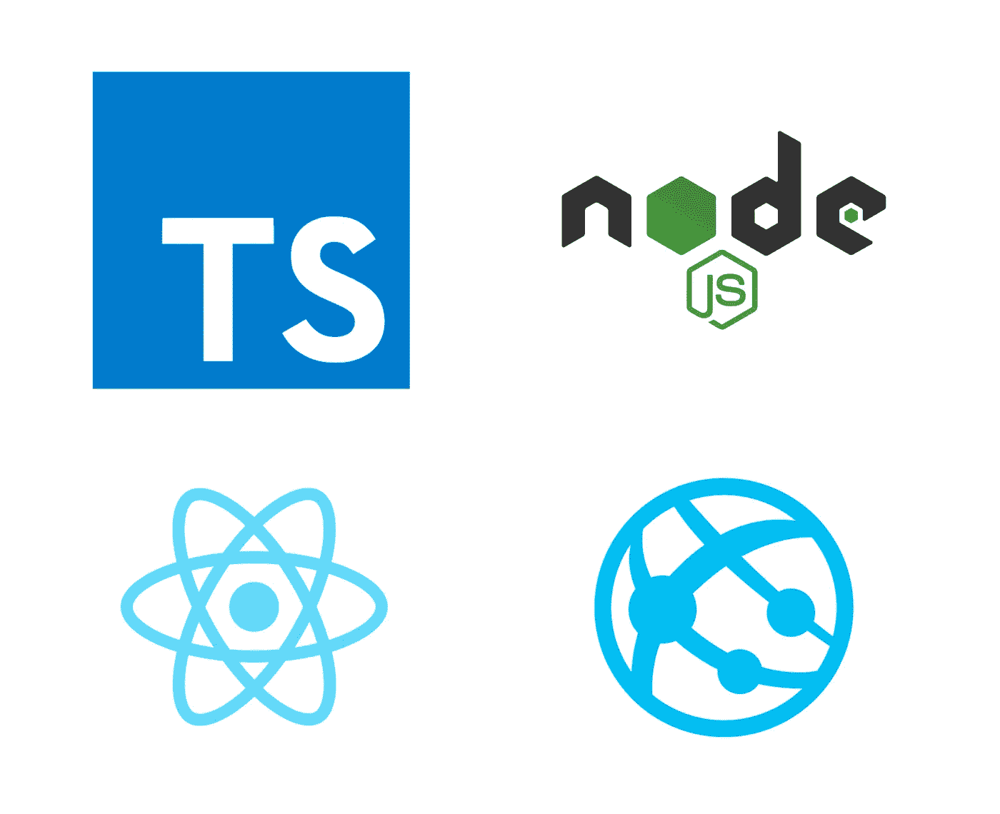
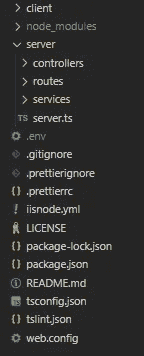
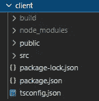
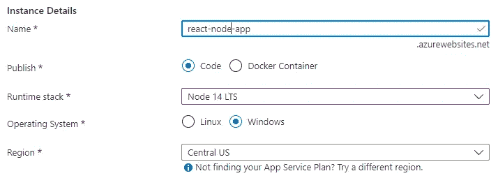

# 使用 GitHub 操作将 Express、Node.js、React 应用程序(带 TypeScript)部署到 Azure Web 应用程序

> 原文：<https://medium.com/geekculture/deploying-an-express-node-js-react-app-with-typescript-to-azure-web-apps-using-github-actions-25e4e59203e?source=collection_archive---------5----------------------->



Source: Google

## 介绍

在这篇文章中，我将讨论用 TypeScript 构建一个带有 React 前端的基本 Express-Node 应用程序，并使用 GitHub 操作将其部署到 Azure Web 应用程序。这是一个冗长乏味的过程，需要将各种博客文章和 StackOverflow 线程拼凑在一起。我在下面的参考文献中链接了它们。

这是我们将要设置的文件夹结构。



Folder Structure

## 1.初始化项目

为您的项目创建根文件夹，并在其中运行以下命令来初始化项目。这将创建一个`package.json`文件。

```
npm init -y
```

## 2.安装依赖项

在根文件夹中运行以下命令来安装所需的软件包。save-dev 标志将包安装为[开发依赖项](https://nodejs.dev/learn/npm-dependencies-and-devdependencies)。我们将在本地开发期间使用`ts-node`直接运行 TypeScript 文件，而不需要使用`tsc`进行预编译。`concurrently`将用于同时运行 React 前端和 Express 服务器。

```
npm install express
npm install typescript tslint ts-node --save-dev
npm install @types/express @types/node --save-dev
npm install concurrently nodemon --save-dev
```

## 3.TypeScript 配置设置

我们将使用`ts-lint`来检查可读性、可维护性和功能性错误。在根文件夹中运行以下命令来创建`tslint.json`文件。

```
tslint --init
```

接下来，创建一个`tsconfig.json`文件，并向其中添加以下内容。可以根据需要添加或更改选项。

```
{
  "compilerOptions": {
    "target": "es6",
    "module": "commonjs",
    "outDir": "./dist",
    "esModuleInterop": true,
    "baseUrl": ".",
    "paths": {
      "*": ["node_modules/*"]
    },
  },
  "include": ["server/**/*"]
}
```

## 4.反应客户端

在根文件夹中，运行以下命令用 TypeScript 设置 React 前端。

```
npx create-react-app client --template typescript
```

确保`package.json`在如图所示的客户端文件夹中。`build`文件夹将在运行构建脚本时创建，我们将在稍后执行。



Client folder structure

将下面一行添加到`client`文件夹中的 package.json。在本地开发过程中，需要将请求代理到我们的 Express 服务器。

```
"proxy": "http://localhost:5000/"
```

## 5.计算机网络服务器

在根文件夹中，创建一个名为 server 的文件夹，并在其中创建一个文件`server.ts`。向其中添加以下代码。

express 服务器运行在端口 5000 上。我们有一个简单的 hello API 和代码来显示 React 应用程序时被要求，这将是部署时所必需的。

## 6.package.json

将以下内容添加到`server` 文件夹中的 package.json 中。

```
"scripts": {
    "start": "node dist/server.js",
    "prebuild": "tslint -c tslint.json -p tsconfig.json --fix",
    "build": "tsc --project .",
    "build-prod": "cd client && npm install && npm run build && cd .. && npm install && npm run build",
    "server": "nodemon --verbose --watch \"server\" --ext \"ts,json\" --exec ts-node server/server.ts",
    "client": "cd client && npm start && cd ..",
    "dev": "concurrently \"npm run client\" \"npm run server\""
}
```

在部署期间将使用`build-prod`脚本。它将创建一个包含来自 TypeScript 后端的已编译 JavaScript 的`dist`文件夹，以及一个包含前端静态文件的客户端文件夹中的`build`文件夹。首先构建客户机代码，因为服务器代码稍后服务于生成的`build`文件夹。

`dev`脚本将在本地开发中使用。

## 7.从 React 向节点发出 HTTP 请求

通过在 React 组件中添加以下代码，从 React 调用 hello API，例如在`App.tsx`中。

```
useEffect(() => {
    const sayHello = async () => {
      const response = await fetch("/api/hello");
      const body = await response.json();
      console.log(body);
    };
    sayHello();
}, []);
```

在根文件夹中运行以下命令启动 localhost 服务器。

```
npm run dev
```

这将在您的浏览器中打开 [http://localhost:3000](http://localhost:3000) ，并在您的浏览器控制台中记录“Hello”。

## 8.网页配置

Azure Web 应用程序使用需要一个`web.config`文件的 IIS Web 服务器。将以下内容添加到您的根文件夹。这将使用`dist`文件夹中的`server.js`文件作为 Node.js 应用程序。

## 9.创建 Azure Web 应用资源

将您的代码推送到 GitHub repo。

从 Azure 门户创建 Azure Web 应用程序。如图所示选择运行时堆栈。



一旦应用程序被创建，按照[这些步骤](https://docs.microsoft.com/en-us/azure/app-service/deploy-github-actions?tabs=applevel#use-the-deployment-center)来设置 GitHub Actions 集成到您的 repo。这将在您的 GitHub 存储库中创建一个`.yml`工作流文件。如第 26 行所示进行更改，以使用我们在前面的`package.json`中定义的`build-prod`脚本。

提交您的更改，并等待操作完成。你的应用应该被部署到 Azure。唷！

对于任何诊断，您都可以通过添加以下内容导航到您的 web 应用程序的 Kudu 控制台。scm 到您的 web 应用程序地址。例如，如果你的地址是 https://react-node-app.azurewebsites.net，去 https://react-node-app.scm.azurewebsites.net/DebugConsole.

# 参考

*   [Matthew Barben 的 Node，TypeScript，Azure Web Apps](https://levelup.gitconnected.com/node-typescript-azure-web-apps-what-could-go-wrong-a-lessons-learnt-guide-2def97a59f1f)
*   [带有 GitHub 动作的 Azure Web App](https://docs.microsoft.com/en-us/azure/app-service/deploy-github-actions?tabs=applevel#use-the-deployment-center)在 MS Docs 上
*   [如何创建带有节点后端的 React 应用程序:完整指南(freecodecamp.org)](https://www.freecodecamp.org/news/how-to-create-a-react-app-with-a-node-backend-the-complete-guide/)
*   [Azure 上 Node.js 的 web . config(stack overflow)](https://stackoverflow.com/questions/35879626/running-node-js-on-azure-web-app/35882245#35882245)