# 使用 KubeKey 在 AWS 上部署 HA Kubernetes 集群

> 原文：<https://medium.com/geekculture/deploying-an-ha-kubernetes-cluster-on-aws-with-kubekey-aec98b7d36b0?source=collection_archive---------15----------------------->

应该认真对待生产环境中集群的高可用性(HA)。Kubernetes 和 AWS EC2 实例广泛用于各种生产环境中。然而，对于许多用户来说，在 AWS 上运行 Kubernetes 同时确保 HA 可能是复杂的。在本文中，我们将演示 KubeKey 如何帮助您在 AWS 上轻松部署 Kubernetes 并确保 HA。

为了满足 AWS 中 Kubernetes 的 HA 服务需求，我们需要保证 kube-apiserver 的 HA。您可以使用以下任一方法来达到目标:

*   使用自动气象站 ELB(推荐)。
*   使用 keepalived+haproxy 实现 kube-apiserver 的负载均衡。

本文以 AWS ELB 服务为例。

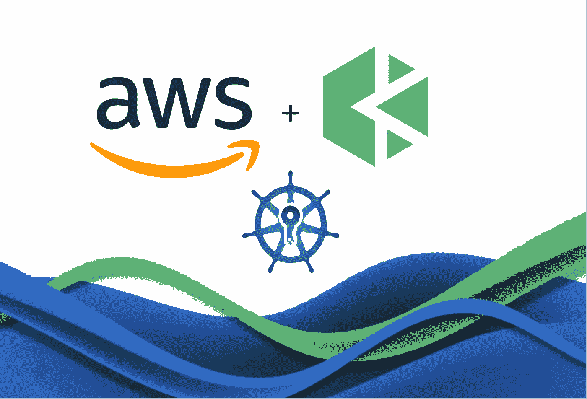

# 先决条件

*   您需要创建一个基于 NFS、GlusterFS 或 Ceph 的存储系统。考虑到数据持久性，我们不建议生产环境使用 OpenEBS。本文使用 OpenEBS 将 LocalPV 配置为仅用于测试的默认存储服务。
*   所有节点都可以通过 SSH 访问。
*   所有节点的时间必须同步。
*   Red Hat 系统默认包含 SELinux。如果您使用 Red Hat 系统，您需要禁用 SELinux 或将 SELinux 设置为许可模式。

# 主机

本文使用三个运行 Ubuntu 18.04 Server 64 位的 AWS EC2 实例。每个 EC2 实例有 2 个 CPU 内核和 4 GB 内存。

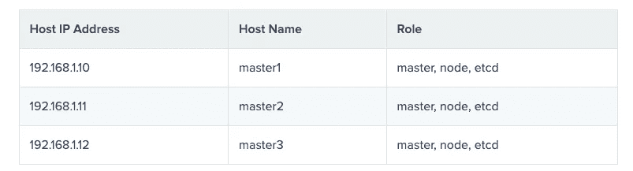

主机 IP 地址主机名称角色 192 . 168 . 1 . 10 主机 1 主机、节点等 192 . 168 . 1 . 11 主机 2 主机、节点等 192 . 168 . 1 . 12 主机 3 主机、节点等

> 注意:上述配置仅用于演示。在生产环境中，建议您为节点分配不同的角色，并分别部署 etcd 和 worker 节点以提高稳定性。

# 创造一个 VPC

登录 AWS 控制台，转到 VPC 仪表板，并使用以下设置创建 VPC。

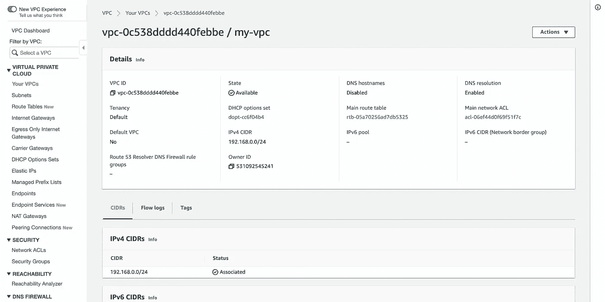

# 创建子网

使用以下设置为 VPC 创建子网。

# 创建互联网网关

创建一个互联网网关并将其连接到 VPC。

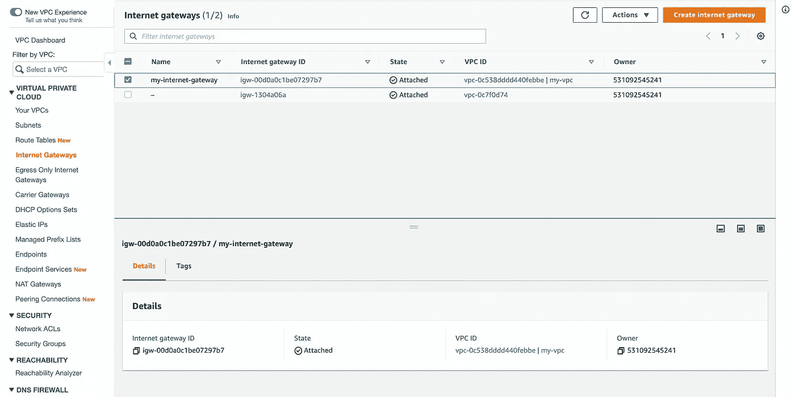

# 配置路由表

将`0.0.0.0/0`路由添加到 VPC 的默认路由表中。

# 创建安全组

将以下入站规则添加到 VPC 的默认安全组。

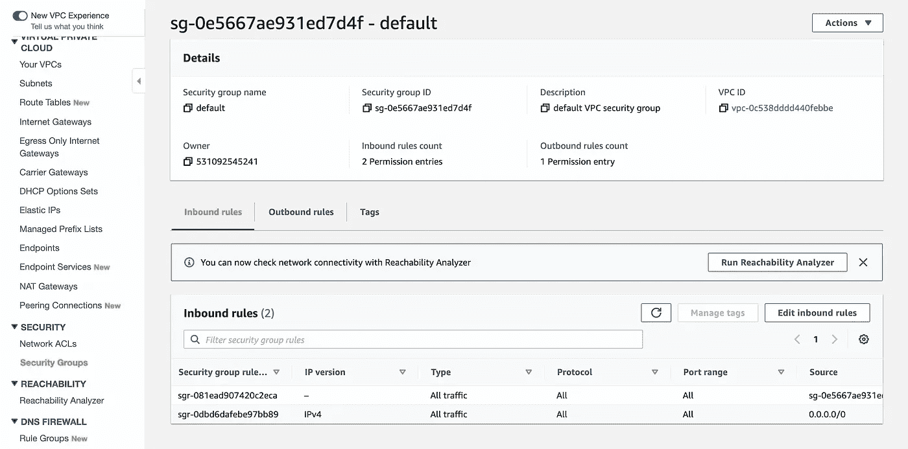

# 创建主机

转到 EC2 实例创建页面，使用以下设置创建三个 EC2 实例。

*   选择一个图像。

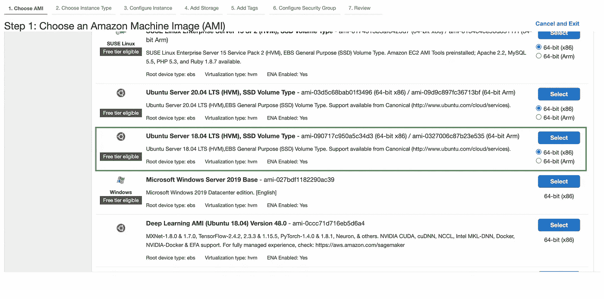

*   选择实例类型。

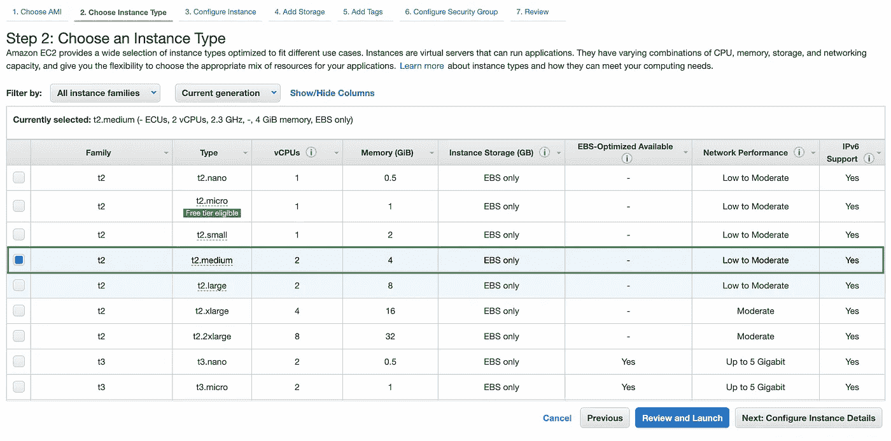

*   选择 VPC 和子网。

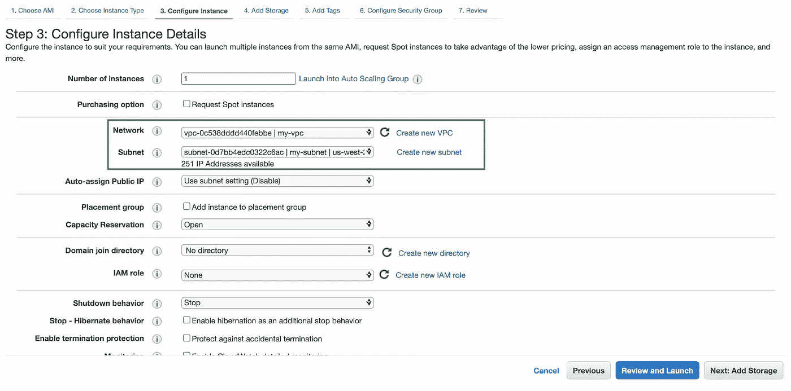

*   选择安全组。

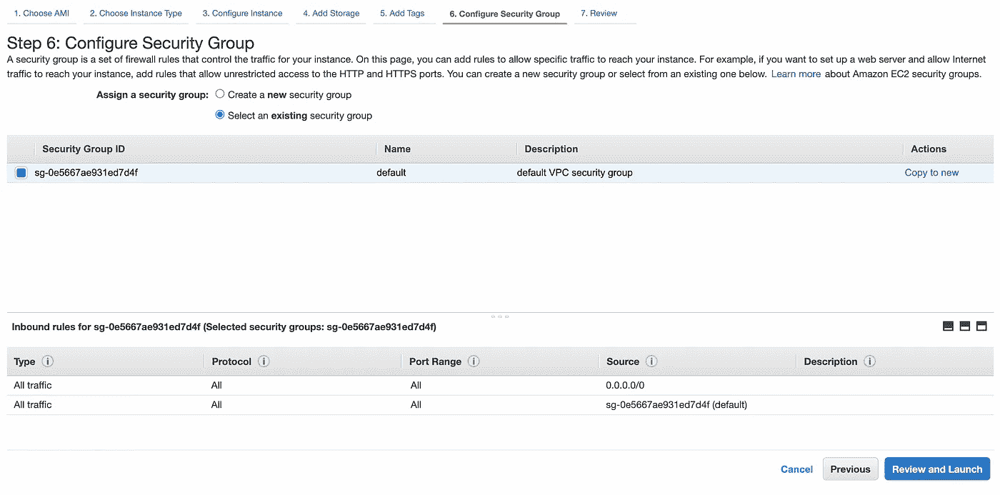

*   创建 EC2 实例后，将一个弹性 IP 地址与每个实例相关联，该地址将用于远程访问。

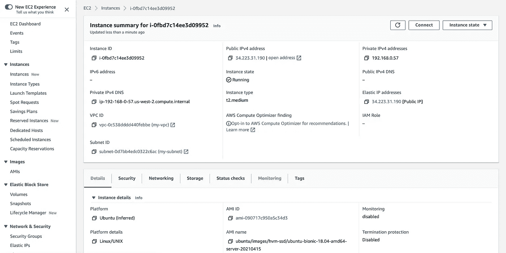

# 创建负载平衡器

*   在 EC2 仪表板上，选择**负载均衡** > **目标组**，创建一个目标组，注册 EC2 实例的端口 6443。

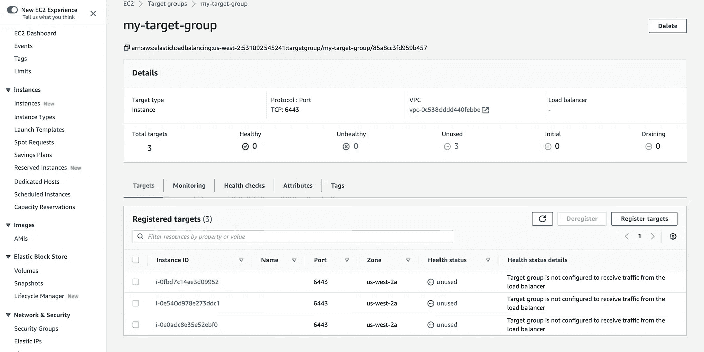

*   创建网络负载平衡器，并为负载平衡器选择 VPC 和子网。

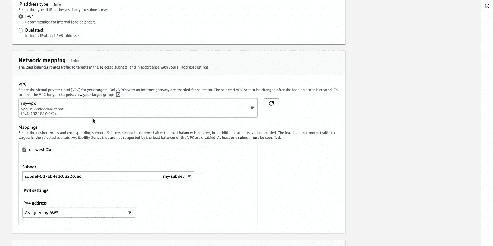

*   配置监听器监听端口 6443 并连接到目标组。

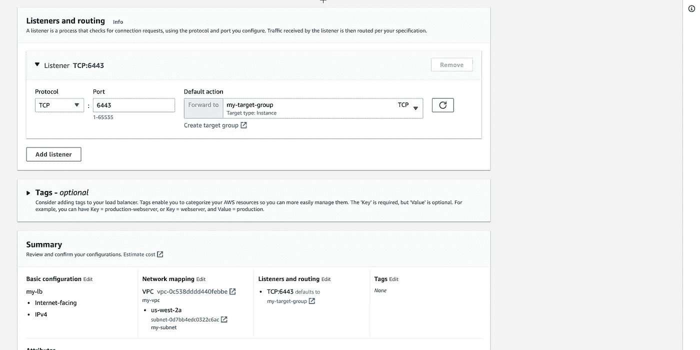

# 检查负载平衡器的 IP 地址

在左侧导航窗格中，选择**网络&安全** > **网络接口**，获取自动生成的 ELB 网络接口的公有和私有 IP 地址。

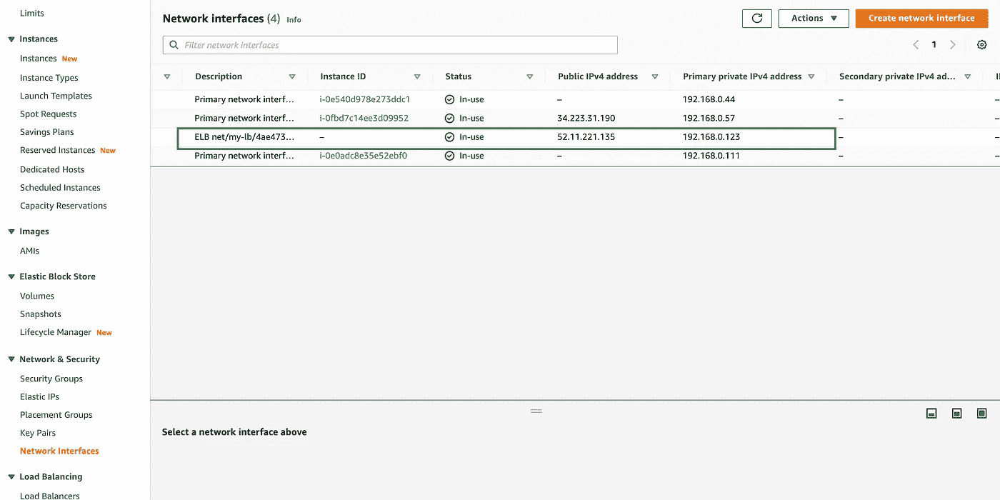

# 更改 AWS EC2 实例的 SSH 密码

登录到每个 AWS EC2 实例，并更改`ubuntu`用户的密码。

```
sudo passwd ubuntu
```

更改 SSH 设置。

```
# Locate PasswordAuthentication, and change PasswordAuthentication no to: PasswordAuthentication yes
sudo vi /etc/ssh/sshd_config
```

重新启动 SSH 服务。

```
sudo systemctl restart sshd
```

# 获取 KubeKey 部署工具

从 [Github 发布页面](https://github.com/kubesphere/kubekey/releases)下载 KubeKey 或运行以下命令:

```
curl -sfL https://get-kk.kubesphere.io | VERSION=v1.1.1 sh -
```

# 使用 KubeKey 部署 Kubernetes 集群

创建`config-HA.yaml`部署配置文件。

```
./kk create config -f config-HA.yaml
```

# 配置群集信息

在配置文件中配置集群信息。更多信息，请参见[多节点安装](https://kubesphere.io/docs/installing-on-linux/introduction/multioverview/)和 [Kubernetes 集群配置](https://kubesphere.io/docs/installing-on-linux/introduction/vars/)。

```
apiVersion: kubekey.kubesphere.io/v1alpha1
kind: Cluster
metadata:
  name: sample
spec:
  hosts:
  - {name: master1, address: 192.168.0.10, internalAddress: 192.168.0.10, user: ubuntu, password: password}
  - {name: master2, address: 192.168.0.11, internalAddress: 192.168.0.11, user: ubuntu, password: password}
  - {name: master3, address: 192.168.0.12, internalAddress: 192.168.0.12, user: ubuntu, password: password}
  roleGroups:
    etcd:
    - master1
    - master2
    - master3
    master:
    - master1
    - master2
    - master3
    worker:
    - master1
    - master2
    - master3
  controlPlaneEndpoint:
    domain: lb.kubesphere.local
    address: "192.168.0.151"
    port: 6443
  kubernetes:
    version: v1.19.8
    imageRepo: kubesphere
    clusterName: cluster.local
  network:
    plugin: calico
    kubePodsCIDR: 10.233.64.0/18
    kubeServiceCIDR: 10.233.0.0/18
  registry:
    registryMirrors: []
    insecureRegistries: []
  addons: []
```

# 创建一个 Kubernetes 集群

运行以下命令在 AWS 上安装 Kubernetes:

```
./kk create cluster -f config-HA.yaml
```

> 如果显示的信息表明 conntrack 丢失，运行`sudo apt-get install conntrack`命令安装 conntrack。

# 检查部署结果

运行以下命令检查部署结果:

*   运行`kubectl get node -o wide`命令。如果所有集群节点的**状态**栏中显示`Ready`，则集群节点运行正常。

```
ubuntu@master1:~$ kubectl get node -o wide
NAME      STATUS   ROLES             AGE          VERSION   
master1   Ready    master,worker     3m45s        v1.19.8
master2   Ready    master,worker     95s          v1.19.8
master3   Ready    master,worker     2m           v1.19.8INTERNAL-IP        EXTERNAL-IP         OS-IMAGE
192.168.0.10       <none>              Ubuntu 18.04.5 LTS
192.168.0.11       <none>              Ubuntu 18.04.5 LTS
192.168.0.12       <none>              Ubuntu 18.04.5 LTS ERNEL-VERSION      CONTAINER-RUNTIME
5.4.0-1045-aws     docker://20.10.7
5.4.0-1045-aws     docker://20.10.7
5.4.0-1045-aws     docker://20.10.7
```

*   运行`kubectl get po -A`命令。如果`Running`显示在`kube-system`名称空间中所有组件的**状态**列中，则所有 Kubernetes 组件运行正常。

```
ubuntu@master1:~$ kubectl get po -A
NAMESPACE     NAME          READY   STATUS          RESTARTS     AGE
kube-system   calico-kube
             -controllers
             -8f59968d4
             -gchrc         1/1     Running         0          104s
kube-system   calico
             -node-c65wl    1/1     Running         0          105s
kube-system   calico-node
             -kt4qd         1/1     Running         0          105s
kube-system   calico
             -node-njxsh    1/1     Running         0          105s
kube-system   coredns
             -86cfc99d74
             -ldx9b         1/1     Running         0          3m59s
kube-system   coredns
             -86cfc99d74
             -pg5lj         1/1     Running         0          3m59s
kube-system   kube-apiserver
             -master1       1/1     Running         0          4m19s
kube-system   kube-apiserver
             -master2       1/1     Running         0          115s
kube-system   kube-apiserver
             -master3       1/1     Running         0          2m33s
kube-system   kube
             -controller
             -manager
             -master1       1/1     Running         0          4m19s
kube-system   kube
             -controller
             -manager
             -master2       1/1     Running         0          115s
kube-system   kube
             -controller
             -manager
             -master3       1/1     Running         0          2m34s
kube-system   kube-proxy
             -klths         1/1     Running         0          2m12s
kube-system   kube-proxy
             -nm79t         1/1     Running         0          3m59s
kube-system   kube-proxy
             -nsvmh         1/1     Running         0          2m37s
kube-system   kube-scheduler
             -master1       1/1     Running         0          4m19s
kube-system   kube-scheduler
             -master2       1/1     Running         0          115s
kube-system   kube-scheduler
             -master3       1/1     Running         0          2m34s
kube-system   nodelocaldns
             -nblsl         1/1     Running         0          2m12s
kube-system   nodelocaldns
             -q78k4         1/1     Running         0          3m54s
kube-system   nodelocaldns
             -q9244         1/1     Running         0          2m37s
```

*   运行`kubectl get ep`命令。如果所有主节点的 IP 地址都显示在**端点**列中，那么对于 AWS 管理的 Kubernetes 集群，HA 运行正常。

```
ubuntu@master1:~$ kubectl get ep
NAME         ENDPOINTS                                               AGE
kubernetes   192.168.0.10:6443,192.168.0.11:6443,192.168.0.12:6443   5m10s
```

# 关于 KubeSphere

KubeSphere 是一个基于 Kubernetes 的开源容器平台，其核心是应用程序。它提供全栈 It 自动化操作和简化的开发运维工作流。

[KubeSphere](https://kubesphere.io/) 已被全球数千家企业采用，如 **Aqara、新浪、奔来、中国太平、华夏银行、国药控股、微众银行、Geko Cloud、VNG 公司、Radore** 。KubeSphere 为运维提供向导界面和各种企业级功能，包括 Kubernetes 资源管理、[、DevOps (CI/CD)](https://kubesphere.io/devops/) 、应用生命周期管理、服务网格、多租户管理、[监控](https://kubesphere.io/observability/)、日志记录、警报、通知、存储和网络管理以及 GPU 支持。有了 KubeSphere，企业能够快速建立一个强大且功能丰富的容器平台。

欲了解更多信息，请访问 [https://kubesphere.io](https://kubesphere.io/)