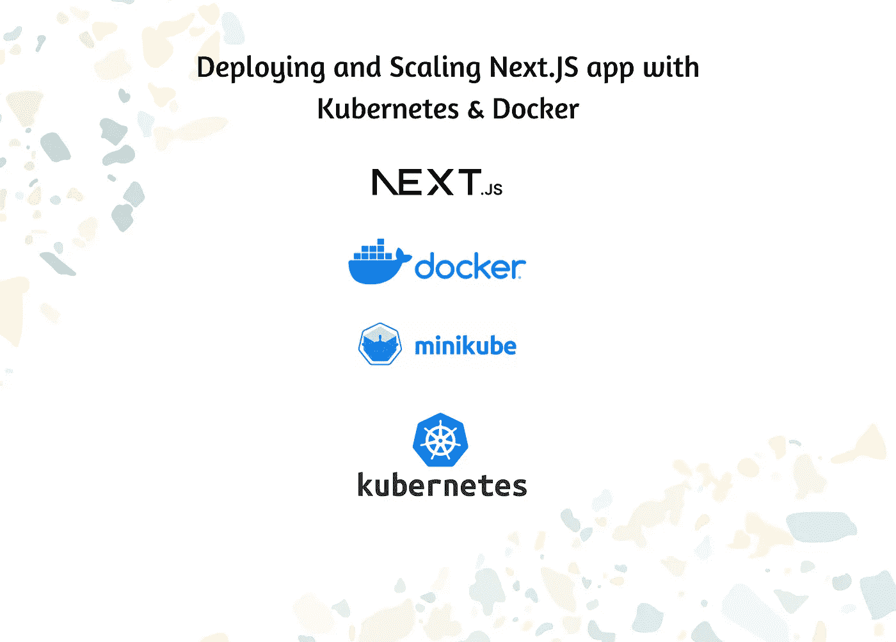

# 接下来是部署和扩展。带有 Kubernetes & Docker 的 JS 应用程序

> 原文：<https://medium.com/geekculture/deploying-and-scaling-next-js-app-with-kubernetes-docker-e824f9fd9936?source=collection_archive---------2----------------------->

Deploying and Scaling Next.JS app with Kubernetes & Docker

随着新技术的兴起，容器已经成为部署 web 应用的新标准。容器化允许可以无缝创建和销毁的隔离环境，使它们成为运行 web 应用程序的理想选择。

Kubernetes 是一个容器编排系统，帮助您管理和扩展您的容器化应用程序。它自动化了…