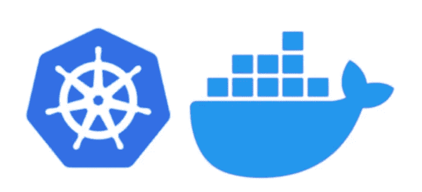

# 在 Kubernetes 上部署 Docker 注册表

> 原文：<https://medium.com/geekculture/deploying-docker-registry-on-kubernetes-3319622b8f32?source=collection_archive---------2----------------------->



在之前的一篇文章中，我们建立了一个裸机 Kubernetes 集群，随后我们又发布了另一篇文章，展示了如何在其上部署 Redis 集群。现在，我们将在我们的集群上部署一个 Docker 注册表。

为什么要在集群上部署 Docker 注册中心？有时候，我喜欢运行一个带有自定义映像的集群，这些映像只在那个特定的集群上运行。在其他情况下，我们可能希望将集群隔开，这样就有了一个 docker 注册表，每个集群节点都可以获取映像。

幸运的是，在 Kubernetes 上运行 Docker 注册中心并不太难。为了使本指南简单明了，我们将部署一个带有自签名证书的 Docker 注册表。完成此操作后，我们可以随时添加用户身份验证和/或 LetsEncrypt 证书。

# 创建密钥和证书

如 [Docker 指南](https://docs.docker.com/registry/insecure/)所述，创建一个新的自签名证书，如下所示:

```
$ mkdir -p certs
$ openssl req \
  -newkey rsa:4096 -nodes -sha256 -keyout certs/registry.key \
  -addext "subjectAltName = IP:10.211.55.250" \
  -x509 -days 3650 -out certs/registry.crt
```

这里重要的一点是，我们将`subjectAltName`设置为我们的 MetalLB 负载平衡器将分配的 IP 号。在我们的集群中，我们将把`10.211.55.250` 分配给 Docker 注册服务(见后面)。

# 将密钥和证书存储在群集中

Kubernetes 的好处在于，它允许您存储秘密，并使所有节点都可以安全地访问它们。现在，让我们将创建的密钥和证书存储在我们的群集上:

```
kubectl create secret tls registry-cert \
    --cert=certs/registry.crt \
    --key=certs/registry.key \
    -n test
```

上面的命令将把`registry.crt`和`registry.key`存储在名称空间`test`中一个名为`registry-cert`的 TLS 秘密中。我们将在这个名称空间中部署 Docker 注册中心。

# 为 Docker 注册表创建永久卷

为存储在我们的注册表中的 docker 映像使用一个永久卷是一个好主意。这样，如果我们的注册表运行的 Pod 被重新安排到另一个节点，我们将不会丢失我们存储在其中的所有图像。

使用以下内容创建一个名为`registry-pvc.yaml`的文件:

```
apiVersion: v1
kind: PersistentVolumeClaim
metadata:
  name: registry-data-pvc
  namespace: test
spec:
  accessModes:
    - ReadWriteOnce
  storageClassName: longhorn
  resources:
    requests:
      storage: 50Gi
```

上面将在 Longhorn 上创建一个持久的卷声明，在`test`名称空间中声明 50G。立即创建:

```
$ kubectl create -f registry-pvc.yaml
```

# 在集群上部署 Docker 注册表

使用以下内容创建一个名为`registry-deployment.yaml`的部署描述符:

```
apiVersion: apps/v1
kind: Deployment
metadata:
  labels:
    run: registry
  name: registry
  namespace: test
spec:
  replicas: 1
  selector:
    matchLabels:
      run: registry
  template:
    metadata:
      labels:
        run: registry
    spec:
      nodeSelector:
        node-type: worker
      containers:
      - name: registry
        image: registry:2
        ports:
        - containerPort: 5000
        env:
        - name: REGISTRY_HTTP_TLS_CERTIFICATE
          value: "/certs/tls.crt"
        - name: REGISTRY_HTTP_TLS_KEY
          value: "/certs/tls.key"
        volumeMounts:
        - name: registry-certs
          mountPath: "/certs"
          readOnly: true
        - name: registry-data
          mountPath: /var/lib/registry
          subPath: registry
      volumes:
      - name: registry-certs
        secret:
          secretName: registry-cert
      - name: registry-data
        persistentVolumeClaim:
          claimName: registry-data-pvc
```

这里我们配置一个 pod，使用我们之前创建的 TLS 密钥和证书从`registry:2`映像创建一个容器。我们告诉容器它可以在`/certs`目录下找到这些。他们如何到达那里？为此，我们使用卷安装。我们定义一个名为`registry-certs`的只读`volumeMount`，将其安装在容器中的`/certs`下。这个`registry-certs` volumeMount 引用了`volumes`段中的秘密卷`registry-cert`。

我们还在容器中的目录`/var/lib/registry`下挂载持久卷声明`registry-data-pvc`。

继续在我们的集群上部署注册中心，如下所示:

```
$ kubectl create -f registry-deployment.yaml
```

现在，您应该能够看到在名称空间`test`中的集群上运行的 registry pod。您可以按如下方式进行检查:

```
$ kubectl -n test get all
```

# 创建注册表服务

既然我们的 registry pod 已经启动并运行，我们需要为它定义一个服务，以便我们的 pod 可以访问它。还记得我们在生成密钥和证书时使用的 IP 号吗？我们现在就用它。用以下内容创建一个名为`registry-service.yaml`的服务描述符:

```
apiVersion: v1
kind: Service
metadata:
  name: registry-service
  namespace: test
spec:
  type: LoadBalancer
  selector:
    run: registry
  ports:
    - name: registry-tcp
      protocol: TCP
      port: 5000
      targetPort: 5000
  loadBalancerIP: 10.211.55.250
```

这将指示负载平衡器暴露 IP `10.211.55.250`上的端口`5000`。继续创建服务:

```
$ kubectl create -f registry-service.yaml
```

太好了！现在，您应该能够访问注册表了。让我们来测试一下:

```
$ curl --cacert certs/registry.crt \
        [https://10.211.55.250:5000/v2/_catalog](https://test.example.org:5000/v2/_catalog)
```

# 在 ca 证书中加载证书

因为我们处理的是自签名证书，所以我们需要指示主机操作系统信任这个证书。通常情况下，您可以使用证书颁发机构(CA)证书来完成这项工作，但是由于这是自签名的，因此该证书既是注册中心服务的证书，也是其自己的 CA 证书。因此，让我们将`registry.cert`作为一个新的 CA 加载到所有集群节点上。我们需要这样做，因为所有集群节点上的 k3s 服务都需要能够从这个存储库中提取，并且它必须信任这个证书。我们可以使用 Ansible 轻松做到这一点:

请注意，我们在这里使用的是我们在之前的博客文章[裸机 Kubernetes](/geekculture/bare-metal-kubernetes-with-metallb-haproxy-longhorn-and-prometheus-370ccfffeba9) 中定义的`hosts`文件。

现在，证书已经加载到每个集群节点上，我们需要重新启动 k3s 服务，以便它能够接受更改。首先按如下方式重新启动工作节点:

```
ansible -i hosts workers -b -K -m shell \
    -a "systemctl restart k3s-agent"
```

接下来，重新启动控制(也称为主)节点:

```
ansible -i hosts control -b -K -m shell \
    -a "systemctl restart k3s"
```

# 测试一下！

随着工人和控制器的重新启动，让我们测试我们的新注册表！创建一个标记有新注册表的新图像，如下所示:

```
$ docker pull alpine
$ docker tag alpine 10.211.55.250:5000/alpine:latest
$ docker push 10.211.55.250:5000/alpine:latest
```

如果一切顺利，重新标记的 alpine 映像现在应该在集群上的本地 docker 注册表中。现在，让我们尝试使用这个新映像部署一个 pod。用以下内容创建一个名为`alpine-test-pod.yaml`的文件:

```
apiVersion: v1
kind: Pod
metadata:
  name: alpine-test
  namespace: test
spec:
  containers:
  - name: alpine
    image: 192.168.137.250:5000/alpine:latest
    command: ["sleep", "60s"]
  restartPolicy: "Never"
```

部署它:

```
$ kubectl create -f alpine-test-pod.yaml
```

检查部署是否顺利:

```
$ kubectl -n test describe pod alpine-test
```

如果一切顺利，pod 应该已经创建并成功启动了！现在，您可以在群集上“本地”存储映像了！