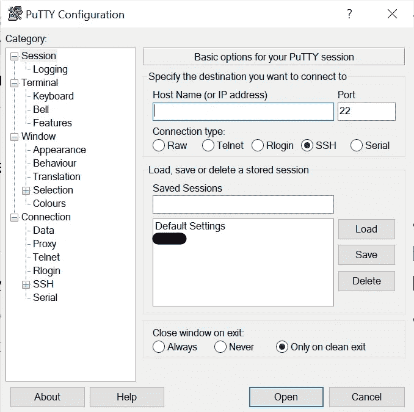
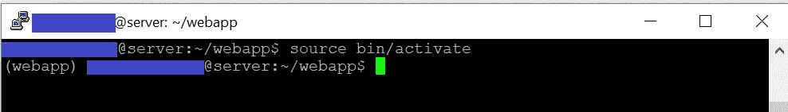

# 使用 Nginx 在 VPS Linux 服务器上部署 Flask 应用程序

> 原文：<https://medium.com/geekculture/deploying-flask-application-on-vps-linux-server-using-nginx-a1c4f8ff0010?source=collection_archive---------1----------------------->


Photo by [Nick Morrison](https://unsplash.com/@nickmorrison?utm_source=medium&utm_medium=referral) on [Unsplash](https://unsplash.com?utm_source=medium&utm_medium=referral)

## Python，Flask，VPS，Web，Nginx

## 我分享了在 VPS 上部署 flask 应用程序时遵循的步骤。如果你想找一个循序渐进的教程，那就来吧！

您可以轻松发布您的静态网站或使用后端 API 开发的网站，这些 API 由您购买的托管服务决定。然而，该程序通常不适合具有 python 后端的动态网站。所以，你会寻找另一种解决方案:VPS。您可以像在本地一样简单地运行您的 python 应用程序，并通过在 VPS 上进行一些配置来进行部署。您也可以在物理机上进行同样的操作。VPS 使我们能够以更低的成本获得服务，并且我们可以快速完成工作。因此，我分享了我在 VPS 上部署应用程序时遵循这些步骤的经验。

*如果您正在寻找另一种解决方案，而不是直接在服务器中制作东西，您可以在这里* *查看其他部署选项* [*。*](https://flask.palletsprojects.com/en/1.1.x/deploying/#deployment)

## 1-租用服务器

你可以从任何你想去的地方租到 VPS 服务。(AWS VPS，其他一些本地公司，或者 smth)。我建议你从一个初学者包开始，然后你可以根据你站点的需要扩展你的服务。我更喜欢租一个 Ubuntu 虚拟私人服务器。因此，我将解释它的其他步骤。

## 2-用油灰连接

PuTTY 是一个终端应用程序，它使我们能够连接到我们的服务器。我们将使用 PuTTY，这样我们就可以通过 SSH 访问我们的服务器。这样，保护提供了双面加密，我们可以通过终端在机器中工作。你可以点击进入应用[。](https://www.chiark.greenend.org.uk/~sgtatham/putty/latest.html)

当您运行应用程序时，您将面对如下所示的窗口。我们用我们的服务器的 IP 填充*主机名(或 IP 地址)*空白，然后按下*打开*按钮。



PuTTY opening window

我们在打开的终端窗口上以 root 用户身份登录。我们现在可以从终端访问机器了。

*   保存 IP 地址从*保存会话*部分使我们的连接更快。输入 IP 后，我们可以通过给名字来保存。
*   使用 shift+insert 将复制的文本粘贴到终端屏幕中。

## 3-创建新用户

运行以下命令创建新用户:

```
adduser user_name
```

向用户添加超级用户权限:

```
usermod -aG sudo user_name
```

在用户之间切换:

```
su user_name
```

## 4-在 Python 环境中设置和运行

如果你在使用 python 时从不同的模块中获得了帮助，那么很可能你正在与版本冲突和库遗忘在你的计算机上的某个地方作斗争。Python Virtualenv 将您从这个问题中解救出来。它准备了一个虚拟空间，您可以在其中为特定项目安装必要的库。这些库保存在这个环境中，而不是所有项目都可以访问的计算机中。

首先，设置 pip3 模块，以便我们可以将其用于其他安装:

```
sudo apt-get install python3-pip
```

安装 virtualenv:

```
sudo pip3 install virtualenv
```

测试安装:

```
virtualenv --version
```

继续为我们的开发创建虚拟环境:

```
virtualenv --python=/usr/bin/python3.6 webapp
```

python3.6 的路径是作为一个参数给出的，因此这个 python 版本的安装环境。否则，将使用默认 python 版本创建环境。您可以使用项目所需的版本来更改该参数。运行该命令后，将创建一个名为“webapp”的文件夹。我们将在这个文件夹中继续我们的工作。我们进去吧。

```
cd webapp
```

运行此命令激活工作环境:

```
source bin/activate
```

激活后，环境名称会出现在命令行的开头。



virtualenv activated

只需*停用*即可停止在该环境下运行。

```
deactivate
```

继续安装在**激活的虚拟环境**:

```
pip3 install wheel
pip3 install flask
pip3 install gunicorn
```

假设 flask 项目在 *flaskapp.py :*

```
from flask import Flask
import osapp = Flask(__name__)@app.route('/')
def index():
   return "Hello World!"if __name__ == "__main__":
   app.run(debug=True,host='0.0.0.0',port=int(os.environ.get('PORT', 5000)))
```

当您运行上面的代码时，可以在 *localhost:5000 中访问“Hello World”网页。您可以通过运行以下代码来测试它:*

```
python3 flaskapp.py
```

## 5- WSGI(网络服务器网关接口)配置

WSGI(web 服务器网关接口)是描述 Web 服务器如何与 Web 应用程序通信的 python 标准。[4]代理服务器使应用程序能够为来自客户端的请求创建响应。它在客户端和应用程序之间架起了沟通的桥梁。然而，python 框架(如 bottle、flask、Django)不能直接与代理服务器通信。换句话说，像 apache，Nginx 这样的普通服务器不知道如何与我们的 app 进行通信。所以，我们需要一个翻译器:WSGI。[3，5]一些图书馆允许我们使用这个标准。我们将继续我们的“gunicorn”图书馆之旅。

创建一个类似交叉点的 **wsgi.py** 文件，以便在配置中使用。

```
from flaskapp import appif __name__ == "__main__":
   app.run()
```

这将与 *flaskapp.py* 主模块在同一个目录下，它通过调用 *app* 对象来运行。因此，它可以长时间运行我们的应用程序。我们可以用 love 命令控制 Gunicorn，方法是给出我们想要运行 IP 和端口参数信息。

```
gunicorn --bind 0.0.0.0:5000 wsgi:app
```

现在，我们可以继续停用***(cmd:deactivate)***虚拟环境。

## 6-创建服务

让我们创建一个服务，让我们的应用程序在机器运行时继续运行，并在机器重启时自动重新运行。假设服务名为 *flaskapp* ，运行以下命令:

```
sudo vi /etc/systemd/system/flaskapp.service
```

服务文件在终端中打开。现在是写下服务信息的时候了。

***注:*** *在终端；****【I】****为插入模式，* ***插入+shift*** *为粘贴，****ESC****比 2 次****shift+z****为离开并保存更改。*

```
[Unit]
Description=A Gunicorn example to serve Flask project
After=network.target[Service]
User=user_name
Group=www-data
WorkingDirectory=/home/user_name/webapp/project_folder
Environment="PATH=/home/user_name/webapp/bin"
ExecStart=/home/user_name/webapp/bin/gunicorn --workers 3 --bind unix:/home/user_name/webapp/project_folder/flaskapp.sock -m 007 wsgi:app[Install]
WantedBy=multi-user.target
```

将*用户名*换成你的。 *webapp* 是我们之前创建的 python 虚拟环境文件夹。 *project_folder* 是包含 *flaskapp.py、*wsgi . py、和您的其他项目文件的文件夹。进行更改后；我们描述了服务的定义、何时运行(在 network.target 之后)以及使用哪些参数。在项目文件夹中创建后，它将被 *flaskapp.sock* 绑定。我们用 *007 限制了套接字的权限。*

是的，我们的服务已经准备好运行。使用以下命令控制:

```
sudo systemctl start flaskapp
sudo systemctl enable flaskapp
sudo systemctl status flaskapp
```

服务状态打印在屏幕上。如果存在错误情况，请检查您的服务文件。

**7- Nginx 配置**

安装 Nginx 服务器:

```
sudo apt-get install nginx
```

有两个不同的目录名*站点-可用*和*站点-启用。*可用下的站点被定义为非活动站点。因此，在使定义*可用*之后，我们将用一个符号链接连接到*启用的*目录。因此，我们的网站将是活跃的。

```
sudo vi /etc/nginx/sites-available/flaskapp
```

通过以上命令，在终端中编辑文件。

```
server {
    listen port_no;
    server_name external_ip domain_name;location / {
        proxy_pass [http://unix:/home/user_name/webapp/project_folder/flaskapp.sock;](http://unix:/home/kullanici_adi/webapp/proje_klasoru/flaskapp.sock;)
    }
}
```

*位置*中的路径与我们在服务配置中创建的套接字相同。给 *port_no* 听，你选。保存后，创建一个到启用站点的符号链接:

```
sudo ln -s /etc/nginx/sites-available/flaskapp /etc/nginx/sites-enabled
```

Nginx 应该重新启动:

```
sudo systemctl restart nginx
```

需要给予 Nginx 完全访问权限:

```
sudo ufw allow ‘Nginx Full’
```

如果我们没有错过任何一点，安拉，我们的应用程序现在使用我们在 VPS 服务器的 IP 地址中设置的端口号运行了！

让我们检查一下！😉

# 参考

[1][https://burcus . medium . com/nginx-ve-guni corn-ile-python-flask-uygulamas % C4 % B1n % C4 % B1-Linux-sunu cuda-yay % C4 % B1 nlama-349 d8da 3618 c](https://burcus.medium.com/nginx-ve-gunicorn-ile-python-flask-uygulamas%C4%B1n%C4%B1-linux-sunucuda-yay%C4%B1nlama-349d8da3618c)

[https://www.sinanerdinc.com/python-virtualenv-kullanimi](https://www.sinanerdinc.com/python-virtualenv-kullanimi)

[https://www.youtube.com/watch?v=KSNdH0OT6os](https://www.youtube.com/watch?v=KSNdH0OT6os)

[https://wsgi.readthedocs.io/en/latest/what.html](https://wsgi.readthedocs.io/en/latest/what.html)

【https://www.python.org/dev/peps/pep-3333/ 