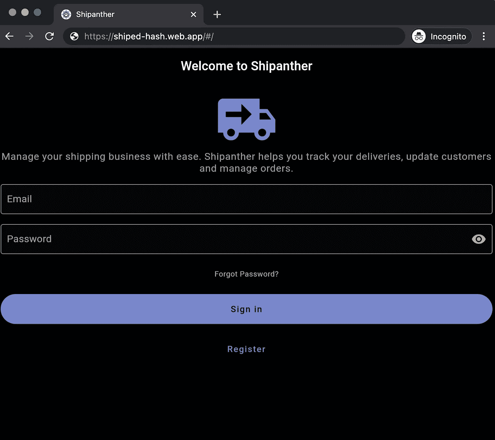
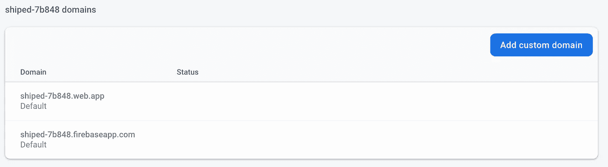
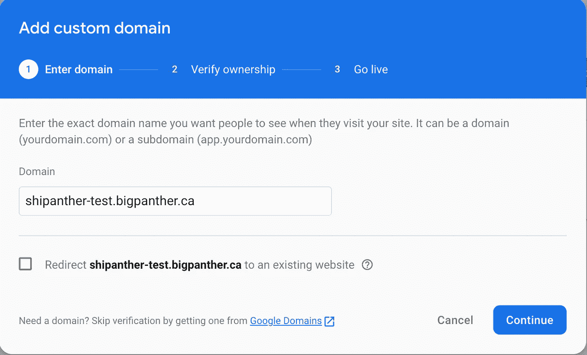
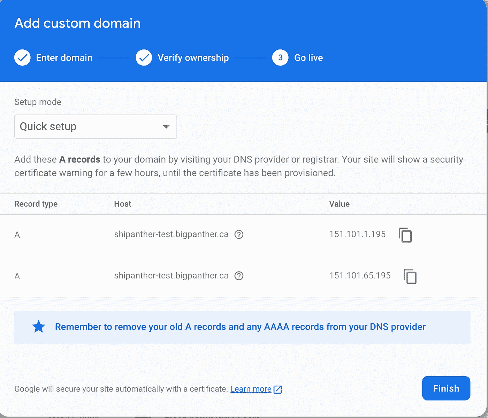

# 使用自定义域将 Flutter Web 应用程序部署到 Firebase

> 原文：<https://medium.com/geekculture/deploying-flutter-web-app-to-firebase-with-a-custom-domain-cb1da7337cf1?source=collection_archive---------4----------------------->

在 Flutter 2.0 中，稳定频道支持 Web 应用程序。在这篇文章中，我们将看看如何部署一个 web 应用程序到 Firebase 静态托管，并为它添加一个自定义域。

我们将部署一个现有的[应用程序](https://github.com/bigpanther/shipanthe)到 firebase 主机。如果您已经使用`flutter create`初始化了 web，请不要忘记在继续部署之前更新`web/icons`文件夹下的 favicon 和应用程序图标。本指南不包括如何[创建一个 flutter web 应用](https://flutter.dev/docs/get-started/web)。这些说明适用于*nix 系统。在 windows 系统上，这应该是一个非常相似的设置。

# 引导程序

第一步是创建一个 [firebase 账户](https://console.firebase.google.com/)，如果你还没有的话。只有在帐户是，你可以开始配置颤振项目。接下来，安装 firebase CLI。

```
$ npm install -g firebase-tools
```

# Firebase 设置

安装 firebase CLI 后，使用下面的命令登录。

```
$ firebase login
```

这将打开浏览器，让您登录到您的谷歌帐户。登录成功后，您应该会在终端上看到一条消息:

> ✔成功了！以 youremail@domain.com 的身份登录

接下来，通过在 flutter 项目的根目录下运行以下命令来初始化 firebase 托管。

```
$ firebase init hosting
```

如果您想要使用现有项目，系统会提示您创建新项目或选择现有项目。

接下来，将提示您选择想要部署的 web 应用程序的公共目录。flutter web 应用程序的默认版本是`build/web`。

这是交互的样子:

```
? Please select an option: Use an existing project
? Select a default Firebase project for this directory: shiped-7b848 (shipantherproject)
i  Using project shiped-7b848 (shipantherproject)? What do you want to use as your public directory? build/web
? Configure as a single-page app (rewrite all urls to /index.html)? Yes
```

> 如果您在指向 Github remote 的 git 存储库中运行此程序，firebase CLI 还会提示您配置 Github 动作以进行自动部署。如果你愿意，可以跳过这一步。

# 部署 web 应用程序

现在，您已经准备好构建和部署 web 应用程序了。

```
$ flutter build web
Compiling lib/main.dart for the Web...                             24.9s
```

构建完成后，让我们将应用程序发布到 firebase hosting。

```
$ firebase deploy --only hosting=== Deploying to 'shiped-7b848'...i  deploying hosting
i  hosting[shiped-7b848]: beginning deploy...
i  hosting[shiped-7b848]: found 30 files in build/web
✔  hosting[shiped-7b848]: file upload complete
i  hosting[shiped-7b848]: finalizing version...
✔  hosting[shiped-7b848]: version finalized
i  hosting[shiped-7b848]: releasing new version...
✔  hosting[shiped-7b848]: release complete✔  Deploy complete!Project Console: https://console.firebase.google.com/project/shiped-hash/overview
Hosting URL: https://shiped-7b848.web.app
```

您现在可以在浏览器中导航到`Hosting URL`



Flutter web app deployed to firebase hosting

# 向应用程序添加自定义域

现在我们已经将应用程序部署到 firebase，我们将继续为 web 应用程序设置一个自定义域。如果这不适用于您的情况，您可以跳过。

> 绑定自定义域包括告诉 firebase 关于域的信息，证明域的所有权，然后等待 SSL 证书的颁发。

让我们首先告诉 firebase 您希望在哪个域上托管 web 应用程序。导航到项目的 [Firebase 控制台](https://console.firebase.google.com/)上的主机侧面板。选择“添加自定义域”



Click Add custom domain on the Hosting panel in Firebase Console

添加您想要指向 web 应用程序的域名



Add the domain name

点击`Continue`并按照说明为该域设置 DNS。在此步骤中，将两条 A 记录添加到 DNS 中。通常，不同的域名注册商对域名系统的管理是不同的(例如:Go daddy、Google Domains、AWS Route 53 等。).您需要遵循特定于您的域注册商的说明。



Add the DNS records mentioned here to the DNS settings of your domain

添加记录后，您可以通过运行 dig 命令来验证它们

```
$ dig shipanther-test.bigpanther.ca A; <<>> DiG 9.10.6 <<>> shipanther-test.bigpanther.ca A
;; global options: +cmd
;; Got answer:
;; ->>HEADER<<- opcode: QUERY, status: NOERROR, id: 54464
;; flags: qr rd ra; QUERY: 1, ANSWER: 2, AUTHORITY: 0, ADDITIONAL: 1;; OPT PSEUDOSECTION:
; EDNS: version: 0, flags:; udp: 512
;; QUESTION SECTION:
;shipanther-test.bigpanther.ca. IN      A;; ANSWER SECTION:
shipanther-test.bigpanther.ca. 3600 IN  A       151.101.65.195
shipanther-test.bigpanther.ca. 3600 IN  A       151.101.1.195;; Query time: 59 msec
;; SERVER: 192.168.67.67#53(192.168.67.67)
;; WHEN: Mon Mar 15 19:23:54 PDT 2021
;; MSG SIZE  rcvd: 90
```

此时，firebase 将能够验证您的域的所有权，您可以导航到[https://ship other-test . big panther . ca](https://shipanther-test.bigpanther.ca/)(这应该是您的自定义域)来查看结果。请注意，传播 DNS 更改和 Firebase 为域颁发有效的 SSL 证书可能需要 24 小时。


Check that the domain validation has succeeded. Until it is done, SSL certificate would not be issued and the browser would show an error like NET::ERR_CERT_COMMON_NAME_INVALID. Check back in some time to allow DNS propagation to finish.

# 结论

使用 Firebase 托管和 Flutter web 是一个很好的组合。只需几个步骤，您就可以从为现有的跨平台移动应用程序添加 web 支持，到轻松部署它，在客户选择的平台上为他们提供出色的体验。请在下面的评论中让我知道你是如何使用 Flutter 以新的方式接触你的客户的。开心飘飘！

如果您感兴趣，可以在这里找到 firebase CLI 对 git 项目所做更改的源代码。也欢迎你为 Shipanther 的发展做出贡献。在 [Github](https://github.com/bigpanther/shipanther/issues) 上与团队合作，不要犹豫。