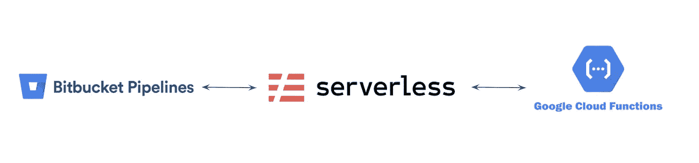

# 通过位桶管道+无服务器框架部署 GCP 云功能

> 原文：<https://medium.com/geekculture/deploying-gcp-cloud-function-via-bitbucket-pipelines-serverless-framework-346e95e27f12?source=collection_archive---------15----------------------->

在之前的[中型帖子中，](https://bklim.medium.com/deploying-serverless-gcp-cloud-function-via-bitbucket-pipelines-5480795d5564)我分享了我们如何使用本地 gcloud 命令通过 Bitbucket 管道部署 GCP 云功能。在这篇文章中，我将分享我们如何使用 [***无服务器框架***](https://www.serverless.com/) 来达到同样的效果。

# ***但为什么是无服务器框架呢？***