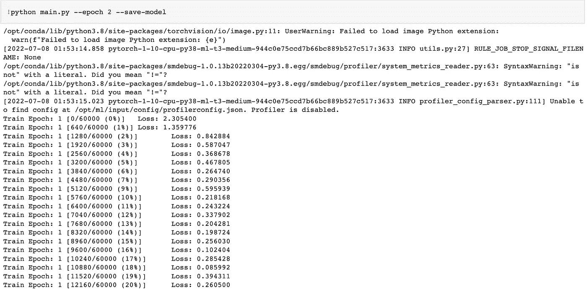
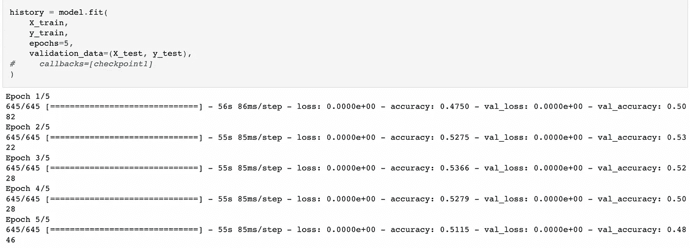
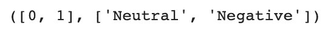
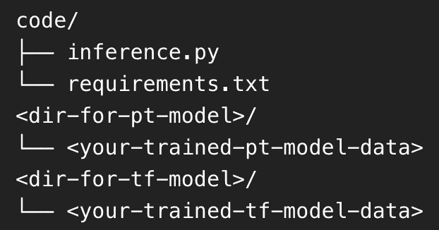
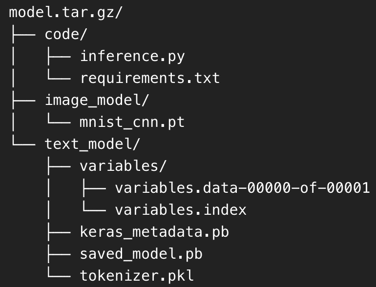

# 使用“多模型”端点在 SageMaker 上部署基于 GPU 的模型(第 1 部分)

> 原文：<https://medium.com/geekculture/deploying-gpu-based-models-on-sagemaker-using-multi-model-endpoint-part-1-da68cbbf3d04?source=collection_archive---------5----------------------->


Photo by [Julia Joppien](https://unsplash.com/@shots_of_aspartame?utm_source=medium&utm_medium=referral) on [Unsplash](https://unsplash.com?utm_source=medium&utm_medium=referral)

> 本文是 duology **“使用‘多模型’端点在 SageMaker 上部署基于 GPU 的模型”**的第一部分。你可以在本文底部找到第二部分的链接。
> 
> **2022 年 26 月 10 日更新:**我刚刚发现 [**一篇来自 NVIDIA**](https://developer.nvidia.com/blog/run-multiple-ai-models-on-same-gpu-with-sagemaker-mme-powered-by-triton/) 的文章，提到使用 NVIDIA Triton 推理服务器在亚马逊 SageMaker 的多模型端点上运行基于 GPU 的模型。我自己还没有检查这个功能，但如果这是真的，这是一个游戏改变者。
> 
> **2022 年 17 月 11 日更新:**我从[一位 AWS SageMaker 员工](https://www.linkedin.com/feed/update/urn:li:activity:6990336296409858048?commentUrn=urn%3Ali%3Acomment%3A%28activity%3A6990336296409858048%2C6998715078984302592%29&dashCommentUrn=urn%3Ali%3Afsd_comment%3A%286998715078984302592%2Curn%3Ali%3Aactivity%3A6990336296409858048%29)那里得到消息，AWS 终于在 SageMaker 上发布了多模型端点 GPU。酷！你可以在这里 阅读文章 [**。**](https://aws.amazon.com/about-aws/whats-new/2022/10/amazon-sagemaker-cost-effectively-host-1000s-gpu-multi-model-endpoint/)

# 目录:

第一部分的文章安排如下:

*   简介
    -优化实时推理的成本
    -关于多模型端点
*   你需要什么
*   准备工具和环境
*   数据准备和模型训练
    - PyTorch 模型样本
    - TensorFlow 模型样本
*   模型预测
    - PyTorch
    - TensorFlow
*   部署
    -目录结构
    -编写推理. py 脚本

# 介绍

[亚马逊 SageMaker](https://aws.amazon.com/sagemaker/) 是 AWS 的托管服务之一，提供从数据管道、ML/AI 项目、模型部署到 MLOps 的端到端解决方案。SageMaker 是数据科学家和 ML 工程师的一体化工具。

当你要将最终训练好的模型投入生产时，在 SageMaker 中，通常你可以有两种选择:[实时推理](https://docs.aws.amazon.com/sagemaker/latest/dg/realtime-endpoints.html)和[批量转换](https://docs.aws.amazon.com/sagemaker/latest/dg/batch-transform.html)。对于实时推理，您的模型将被部署在一个类似 REST-API 的端点上，您可以在任何时候实时访问该端点。对于批量转换，您的模型将以一种方式部署，在这种方式下，它不会 24/7 在线，但是，相反，当您使用批量/批量数据到达端点时，它可以被激活。

对于前者，AWS 将根据您部署模型的实例的正常运行时间向您收费。对于后者，当您的模型处理大量数据时，您只需支付正常运行时间的费用。

## 优化实时推理的成本

基于此，我们可以推断，实时推理的代价一定比批量转换高。AWS 有几种解决方案来克服昂贵的实时预测，例如:

*   [亚马逊弹性推论](https://docs.aws.amazon.com/elastic-inference/latest/developerguide/what-is-ei.html)
*   [AWS 推理](https://aws.amazon.com/machine-learning/inferentia/)
*   [无服务器推理](https://docs.aws.amazon.com/sagemaker/latest/dg/serverless-endpoints.html)
*   [多模型端点](https://docs.aws.amazon.com/sagemaker/latest/dg/multi-model-endpoints.html)
*   等等。

然而，在本文中，我们将关注多模型端点的方法。如 [AWS 网页](https://docs.aws.amazon.com/sagemaker/latest/dg/multi-model-endpoints.html)所述:

> 若要创建可以承载多个模型的终结点，请使用多模型终结点。多模型端点为部署大量模型提供了一个可扩展且经济高效的解决方案。

因此，简单地说，通过使用多模型端点方法，我们可以在单个端点中部署多个模型。这确实会优化所需的成本，因为我们只需要为我们使用的终端付费，即只有一个终端，而我们部署了许多模型。

## 关于多模型端点

关于多模型端点方法，我有两条消息:一条坏消息和一条好消息。

*   坏消息

h̶o̶w̶e̶v̶e̶r̶,̶̶s̶a̶d̶l̶y̶,̶̶w̶h̶e̶n̶̶t̶h̶i̶s̶̶a̶r̶t̶i̶c̶l̶e̶̶i̶s̶̶w̶r̶i̶t̶t̶e̶n̶,̶̶a̶w̶s̶̶o̶f̶f̶i̶c̶i̶a̶l̶l̶y̶̶s̶t̶a̶t̶e̶s̶̶t̶h̶a̶t̶̶t̶h̶e̶̶m̶u̶l̶t̶i̶-̶m̶o̶d̶e̶l̶̶e̶n̶d̶p̶o̶i̶n̶t̶̶a̶p̶p̶r̶o̶a̶c̶h̶̶i̶s̶̶n̶o̶t̶̶s̶u̶p̶p̶o̶r̶t̶e̶d̶̶o̶n̶̶g̶p̶u̶̶i̶n̶s̶t̶a̶n̶c̶e̶̶t̶y̶p̶e̶s̶̶(̶y̶e̶t̶？̶̶i̶̶d̶o̶n̶'̶t̶̶k̶n̶o̶w̶)̶.̶̶p̶e̶r̶h̶a̶p̶s̶,̶̶t̶h̶i̶s̶̶c̶o̶r̶r̶e̶l̶a̶t̶e̶s̶̶t̶o̶̶g̶p̶u̶̶i̶n̶s̶t̶a̶n̶c̶e̶̶r̶e̶s̶o̶u̶r̶c̶e̶̶m̶a̶n̶a̶g̶e̶m̶e̶n̶t̶s̶̶t̶h̶a̶t̶̶a̶r̶e̶̶m̶o̶r̶e̶̶c̶h̶a̶l̶l̶e̶n̶g̶i̶n̶g̶̶t̶h̶a̶n̶̶m̶a̶n̶a̶g̶i̶n̶g̶̶r̶e̶s̶o̶u̶r̶c̶e̶s̶̶f̶o̶r̶̶c̶p̶u̶̶i̶n̶s̶t̶a̶n̶c̶e̶s̶；̶̶b̶u̶t̶̶i̶̶d̶o̶n̶'̶t̶̶k̶n̶o̶w̶；̶̶i̶t̶'̶s̶̶j̶u̶s̶t̶̶m̶y̶̶s̶p̶e̶c̶u̶l̶a̶t̶i̶o̶n̶.̶**请阅读我上面提到的更新信息。**

*   **好消息**

然而，幸运的是，我们仍然可以拥有自己的“多模型”端点，能够托管基于 GPU 的模型。要做到这一点，我们得在实时推理中黑掉几样东西。总之，我从 [Philipp Schmid(抱脸技术负责人)](https://de.linkedin.com/in/philipp-schmid-a6a2bb196)在抱脸论坛[的回答中得到启发](https://discuss.huggingface.co/t/when-to-use-sagemaker-multi-model-endpoint/18781/2)。

> **免责声明:**我不会深入讨论如何开发一个性能良好的模型，因为本文更侧重于使用“多模型”端点的部署。因此，我们将只使用具有几个训练时期的简单模型。

# 你需要什么

在本文中，我们将使用 Keras-TensorFlow 和 PyTorch 部署两个基于 GPU 的模型。因此，除了很好地理解 Python 之外，如果你也有一些使用 [Keras](https://keras.io/getting_started/) 、 [TensorFlow](https://www.tensorflow.org/tutorials/quickstart/beginner) 和 [PyTorch](https://pytorch.org/get-started/locally/) 的知识将会很有帮助。

当我们在 SageMaker 上工作时，您还需要一个至少具有以下 [IAM 策略/角色](https://docs.aws.amazon.com/IAM/latest/UserGuide/introduction.html)的 [AWS 帐户](https://aws.amazon.com/console/):

*   使用 [SageMaker 笔记本实例](https://docs.aws.amazon.com/sagemaker/latest/dg/nbi.html)或[SageMaker Studio](https://aws.amazon.com/sagemaker/studio/)；
*   访问(上传和下载)将用于存储`model.tar.gz`文件的 [S3 桶](https://aws.amazon.com/s3/)；
*   将模型部署到 [SageMaker 推理端点](https://docs.aws.amazon.com/sagemaker/latest/dg/realtime-endpoints-deployment.html)。

下面的网页有助于定义上述 IAM 政策/角色。

 [## SageMaker 角色

### 作为一项托管服务，Amazon SageMaker 代表您在 AWS 硬件上执行操作，该硬件由…

docs.aws.amazon.com](https://docs.aws.amazon.com/sagemaker/latest/dg/sagemaker-roles.html) 

# 准备工具和环境

当你决定使用 SageMaker 笔记本时，你可以按照下面的说明来设置一个。

 [## 创建笔记本实例

### Amazon SageMaker notebook 实例是运行 Jupyter Notebook 应用程序的 ML 计算实例。SageMaker 管理…

docs.aws.amazon.com](https://docs.aws.amazon.com/sagemaker/latest/dg/howitworks-create-ws.html) [](https://docs.aws.amazon.com/sagemaker/latest/dg/gs-setup-working-env.html) [## 步骤 1:创建 Amazon SageMaker 笔记本实例

### 亚马逊 SageMaker 笔记本实例是一个完全托管的机器学习(ML)亚马逊弹性计算云(亚马逊…

docs.aws.amazon.com](https://docs.aws.amazon.com/sagemaker/latest/dg/gs-setup-working-env.html) 

否则，如果您更喜欢使用 SageMaker Studio，您可以按照下面的说明来设置一个。

 [## 创建或打开一个亚马逊 SageMaker 工作室笔记本

### 当您在 Amazon SageMaker Studio 中创建笔记本或首次在 Studio 中打开非共享笔记本时，您…

docs.aws.amazon.com](https://docs.aws.amazon.com/sagemaker/latest/dg/notebooks-create-open.html) 

> **注意:**您可以决定是否在您的笔记本环境中使用 GPU 实例。但是对于本文，我不会使用 GPU 实例，因为使用的模型非常简单，即使使用了 PyTorch 和 TensorFlow。

无论您选择哪种笔记本来源，您都必须确保 PyTorch 和 Tensorflow 都已成功安装在您的笔记本系统中。只需按照下面列出的他们网站上的说明。

[](https://pytorch.org/) [## PyTorch

### 使用 PyTorch、TorchServe 和 AWS Inferentia 降低 71%的推理成本并推动横向扩展。推动…的状态

pytorch.org](https://pytorch.org/) [](https://www.tensorflow.org/install) [## 安装 TensorFlow 2

### 了解如何在您的系统上安装 TensorFlow。下载一个 pip 包，在 Docker 容器中运行，或者从…

www.tensorflow.org](https://www.tensorflow.org/install) 

您可以将这两个库安装在它们各自的 conda 虚拟环境中，但是我建议您只在一个 conda 环境中安装这两个库，以便在创建`model.tar.gz`文件之前进行调试。

# 数据准备和模型训练

在本文中，出于示例的目的，我们将为每个库使用两个简单的模型。

*   PyTorch 模型样本

对于 PyTorch，我们将使用一个使用 MNIST 数据集的图像分类模型。我们可以用来自 [PyTorch 的 GitHub 官方回购](https://github.com/pytorch/examples/tree/main/mnist)的例子。您可以使用您需要的任何参数运行`main.py` Python 文件(不要忘记设置`save-model`参数，因为我们需要部署模型)。之后，您将得到与下面类似的输出。



Training a model using PyTorch

在培训过程完成之后，请记住您保存的模型的路径，因为您稍后将需要它来进行部署。

*   张量流模型示例

对于 TensorFlow，我们将使用一个使用 IMBD 数据集的文本分类模型。我们可以用来自 [TensorFlow 网站](https://www.tensorflow.org/tutorials/keras/text_classification_with_hub)的例子。只需按照这里列出的说明进行操作，并保存您训练好的模型和标记器。稍后部署时会用到它们。



Training a model using TensorFlow

# 模型预测法

训练过程完成后，我们应该尝试测试两个模型的预测，以检查两个模型是否都有效。

*   PyTorch

对于 PyTorch 模型，我们首先必须定义模型架构来加载训练好的权重。对于测试集，我们简单地使用 PyTorch 库提供的 MNIST 数据集。结果将是指示由输入图像显示的数字的预测数字。

下面是结果:


Result from PyTorch model prediction

*   张量流

对于张量流模型，我们应该定义几个有用的变量，例如`label_mapping`和`max_len`，这对我们的预处理步骤有帮助。我们必须加载训练好的模型和标记器。输出将是输入文本的情感。

下面是结果:



Results from TensorFlow model prediction

# 部署

## 目录结构

为了部署到 SageMaker 端点推断，我们必须遵循 AWS 定义的目录结构，如这里的[或下面的](https://sagemaker.readthedocs.io/en/stable/frameworks/pytorch/using_pytorch.html#model-directory-structure)所示。


The basic directory structure for deploying to SageMaker Endpoint Inference

简单地说，您必须创建一个目录(任何名称),其中包含使用您的模型进行加载和预测所需的子目录和文件。然后，您必须将这样一个目录压缩成一个名为`model.tar.gz`的`.tar.gz`文件扩展名。

在我们创建自己的“多模型”端点的例子中，在主目录中(这将是`model.tar.gz`文件)，我们将遵循如下内容:



Proposed directory structure

因此，我们将创建两个子目录，即一个用于已训练 PyTorch 模型，另一个用于已训练 TensorFlow 模型。在每个文件中，我们将放置与每个文件相关的所有文件(和文件夹，如果有的话)。

通过这样做，我的`model.tar.gz`看起来如下:



My directory structure

## 写作`inference.py script`

在我们的例子中，我们将使用所谓的[【自带模型】](https://sagemaker-examples.readthedocs.io/en/latest/frameworks/pytorch/get_started_mnist_deploy.html#Entry-Point-for-the-Inference-Image) (BYOM)。因此，我们必须编写一个脚本，即`inference.py`，以告诉 SageMaker 如何处理我们自己的模型(在 SageMaker 培训工作之外培训的)，用于模型的输入(通过 REST API)，加载模型，模型预测，以及模型的输出(通过 REST API)。

`inference.py`文件脚本读取文档[中所述的 4 个主要函数，此处为](https://sagemaker-examples.readthedocs.io/en/latest/frameworks/pytorch/get_started_mnist_deploy.html):

*   `model_fn()`

该函数用于告诉推理映像如何加载模型检查点。该函数有一个参数，即`model_dir`(推理图像中静态模型检查点的目录)。该函数返回加载模型的变量`model`。

*   `input_fn()`

该函数在推理入口点被调用。它处理来自请求输入的数据解码。它有两个参数:`request_body`(传入请求的有效负载)和`request_content_type`(传入请求的内容类型)。该函数返回一个对象(即加载模型的输入)，该对象可以传递给`predict_fn()`函数。

*   `predict_fn()`

该函数使用加载的模型消耗`input_fn()`函数的即时输出，该模型是`model_fn()`函数的返回值。该函数有两个参数:`input_object`(来自`input_fn()`函数的返回值)和`model`(来自`model_fn()`函数的返回值)。该函数返回要传递给`output_fn()`函数的第一个参数。

*   `output_fn()`

该函数用于对由`predict_fn()`函数产生的预测进行数据后处理。该函数有两个参数，即`prediction`(`predict_fn()`函数的返回值)和`content_type`(响应的内容类型)。函数的返回应该是序列化到`content_type`的数据的字节数组，用于将预测编码到响应的内容类型中。

对于一个简单的 BYOM 情况，通常，我们可以只使用上述四个函数中的一个，即`model_fn()`函数。对于这种情况，我们只改变推理服务器加载模型的方式；我们让其余的函数作为默认函数。

然而，在我们想要拥有自己的“多模式”终端的情况下，我们需要定制所有四个功能。

*   `model_fn()`

该函数接受一个参数`model_dir`，它是`model.tar.gz`文件中的位置。由于我们已经将两个模型目录放入其中，即前面定义的目录结构中提到的`image_model/`和`text_model/`，我们将在这个`model_fn()`函数中加载这两个目录。

如下面的代码片段所示，首先，我们加载图像模型，即经过训练的 PyTorch 模型，然后我们还加载文本模型，即经过训练的 TensorFlow 模型，以及经过训练的 tokenizer。最后，我们将函数设置为返回两个模型(使用标记器),其输出将是一个元组。

*   `input_fn()`

在这个函数中，我们将真正创建一个定制函数。由于 SageMaker 端点推断作为 REST API 工作，我们必须设置该函数在 REST API 中工作。我们可以使用多种类型的`[content_type](https://docs.aws.amazon.com/sagemaker/latest/dg/cdf-inference.html)`，但是我们将在这里使用`application/json`，因为我们也将使用 JSON 数据访问服务器。

我们将让我们的推理服务器从客户端接收以下 JSON 请求:

```
{
  "model_type": "text OR image",
  "inputs": "(a text IF 'model_type' == 'text') OR
             (a list of numbers with shape (any, 1, 28, 28) IF
             'model_type' == 'image')"
}
```

为此，我们可以定义`input_fn()`函数，如下面的代码片段所示。我实现了下面的异常处理`TypeError`,因为有时我发现只使用一次`json.loads()`是不够的，会导致代码试图访问字典的元素时出错。随后，当来自客户端请求的`"model_type”`字段被设置为`“image”`时，我们期望得到一个形状为(any，1，28，28)的数字列表，然后将其转换为`torch.Tensor`数据类型。最后，我们返回处理过的数据。

*   `predict_fn()`

由于该函数接收两个参数，我们将输入来自`input_fn()`的输出和来自`model_fn()`的输出。由于后者是一个元组(因为我们已经这样做了),它由图像模型、文本模型和标记器组成，我们必须根据它们的需要来分割它。

然后，我们可以根据每个模型类型应用预测部分。有关更多详细信息，请参见下面的代码片段。

*   `output_fn()`

正如在`input_fn()`函数中定义的，我们使用`application/json`作为内容类型，我们将在这个`output_fn()`函数中使用相同的内容类型。如下面的代码片段所示，我们根据模型类型来处理推理服务器的最终输出(将作为响应返回给客户机)。如果预测数据属于`torch.Tensor`数据类型(或者换句话说，它是来自图像模型的数据)，我们将把它转换成一个原始数字。否则，最终输出只是文本模型生成文本时的预测数据。最后，我们以 JSON 的形式返回带有字段`“pred”`的最终输出。

对于支持上面四个主要函数所需的其他变量和对象，你可以在这里找到我的`inference.py` [的例子。](https://github.com/utomoreza/MultimodelEndpoint_hacked/blob/main/model/code/inference.py)

**加法**

对于驻留在`code/`目录中的`requirements.txt`文件，我们可以编写下面的库列表。

```
numpy
tensorflow
```

尽管我们使用 PyTorch 模型，但我没有在上面列出`torch`库的原因是因为我们将使用 PyTorch 推理映像来进行部署(我们稍后将对此进行讨论)。因此，`torch`库已经包含在这样的映像中。

> 我们将在第二部分讨论接下来的部分，即调试、上传到 S3 桶、使用`sagemaker`库部署、调用部署的端点和约束。您可以在下面找到第 2 部分的链接。

[](https://utomorezadwi.medium.com/deploying-gpu-based-models-on-sagemaker-using-multi-model-endpoint-part-2-final-6e05cf10142f) [## 使用“多模型”端点在 SageMaker 上部署基于 GPU 的模型(第 2 部分-最终版)

### 本文是最后一部分。如果您可以在 SageMaker 上部署一个基于 GPU 的多模型端点会怎么样？

utomorezadwi.medium.com](https://utomorezadwi.medium.com/deploying-gpu-based-models-on-sagemaker-using-multi-model-endpoint-part-2-final-6e05cf10142f) 

# 关于作者

雷扎是一名专门从事数据驱动分析的工程师。他目前在 Tokopedia 担任高级数据科学家。业余时间喜欢在[媒体](/@utomorezadwi)上写文章，学点新东西，或者[创作副业](https://github.com/utomoreza)。