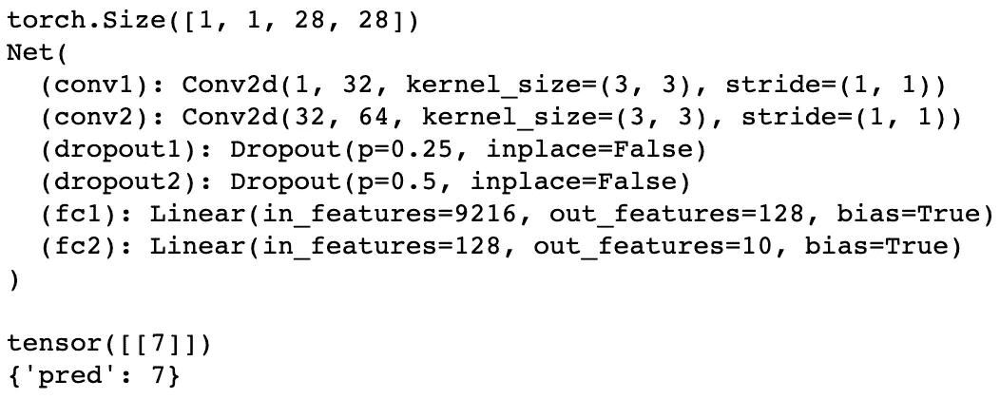
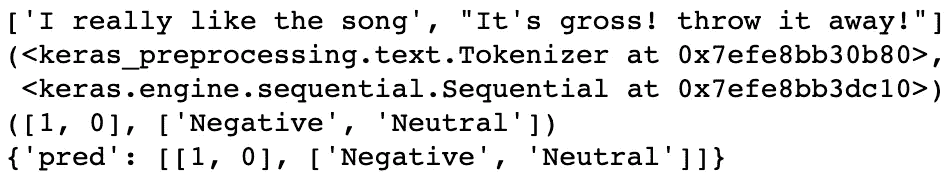
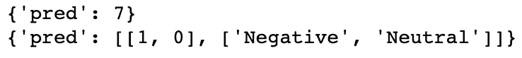

# 使用“多模型”端点在 SageMaker 上部署基于 GPU 的模型(第 2 部分-最终版)

> 原文：<https://medium.com/geekculture/deploying-gpu-based-models-on-sagemaker-using-multi-model-endpoint-part-2-final-6e05cf10142f?source=collection_archive---------9----------------------->


Photo by [Philippe Oursel](https://unsplash.com/@ourselp?utm_source=medium&utm_medium=referral) on [Unsplash](https://unsplash.com?utm_source=medium&utm_medium=referral)

> 本文是上一篇文章(第 1 部分)的延续。如果您碰巧看到这篇文章，强烈建议您先阅读下面的第 1 部分文章。
> 
> **2022 年 17 月 11 日更新:**我从[一位 AWS SageMaker 员工](https://www.linkedin.com/feed/update/urn:li:activity:6990336296409858048?commentUrn=urn%3Ali%3Acomment%3A%28activity%3A6990336296409858048%2C6998715078984302592%29&dashCommentUrn=urn%3Ali%3Afsd_comment%3A%286998715078984302592%2Curn%3Ali%3Aactivity%3A6990336296409858048%29)那里得到消息，终于 AWS 在 SageMaker 上发布了多模型端点 GPU。酷！你可以在这里 阅读文章[。](https://aws.amazon.com/about-aws/whats-new/2022/10/amazon-sagemaker-cost-effectively-host-1000s-gpu-multi-model-endpoint/)

[](https://utomorezadwi.medium.com/deploying-gpu-based-models-on-sagemaker-using-multi-model-endpoint-part-1-da68cbbf3d04) [## 使用“多模型”端点在 SageMaker 上部署基于 GPU 的模型(第 1 部分)

### 本文是第一部分。如果您可以在 SageMaker 上部署基于 GPU 的多模型端点会怎么样？

utomorezadwi.medium.com](https://utomorezadwi.medium.com/deploying-gpu-based-models-on-sagemaker-using-multi-model-endpoint-part-1-da68cbbf3d04) 

> **2022 年 26 月 10 日更新:**我刚刚发现 [**一篇来自 NVIDIA**](https://developer.nvidia.com/blog/run-multiple-ai-models-on-same-gpu-with-sagemaker-mme-powered-by-triton/) 的文章，提到了使用 NVIDIA Triton 推理服务器在 Amazon SageMaker 的多模型端点上运行基于 GPU 的模型。我自己还没有检查这个功能，但如果这是真的，这是一个游戏改变者。

## 前一篇文章的一些总结

*   我们已经讨论了优化 SageMaker 推理成本的可用选项。
*   我们已经为拥有这种“多模式”端点的所有需求做好了准备。
*   我们训练了两个样本模型(一个 PyTorch 模型和一个 TensorFlow 模型)并测试了它们的预测。
*   我们已经讨论了 SageMaker 推理端点所需的目录结构，以及为我们的案例建议的目录结构。
*   我们已经讨论了`inference.py`文件中的四个主要函数。

# 目录

第 2 部分文章的安排如下:

*   部署
    -调试推理. py 脚本
    -上传 model.tar.gz 文件到 S3 桶
    -使用 SageMaker 部署
*   调用端点
    -使用预测器类
    -使用。invoke_endpoint()方法
    -删除端点
*   限制
*   结论

# 部署

## 调试`inference.py`脚本

现在，我们已经编写了`inference.py`文件和`requirements.txt`文件，并将两个模型所需的文件和文件夹放入主目录中。在将主目录压缩到一个`model.tar.gz`文件之前，建议提前调试`inference.py`文件，以便在模型部署后将任何不必要的错误和副作用降到最低。

为了简化这个过程，我们将把`inference.py`复制到两个文件中:`debug_pt.py`和`debug_tf.py`。对于每一个，我们将保留其模型类型所需的所有代码行，并删除其模型类型不必要的(或只是注释)代码行。例如，如果我们想调试 PyTorch 模型，在`debug_pt.py`文件中，我们只保留处理 PyTorch 模型所需的所有代码，反之亦然。关于这两个文件的更多细节，你可以分别在这里[和](https://github.com/utomoreza/MultimodelEndpoint_hacked/blob/main/debug_pt.py)[这里](https://github.com/utomoreza/MultimodelEndpoint_hacked/blob/main/debug_tf.py)看到我的文件。

*   调试 PyTorch 模型

我们要做的基本上类似于**模型预测**部分(在第 1 部分中)。因此，我们将测试前面(第 1 部分)定义的所有四个函数。正如我前面解释的，我们使用一个名为`debug_pt.py`的`inference.py`文件的副本，我们只是简单地导入所有四个函数。

之后，我们准备用于调试测试的数据。然后，数据被包装在 JSON 结构中，以模拟推理服务器收到的请求结构。

随后，JSON 输入可以用作`input_fn()`函数的第一个参数。在这种情况下，我将`“model”`输入到`model_fn()`函数中，因为我将主目录(这将是`model.tar.gz`压缩文件)命名为`model/`。对于`predict_fn()`功能，我们可以输入(1)来自`input_fn()`的输出和(2)来自`model_fn()`的输出。最后，`predict_fn()`的输出被输入到`output_fn()`功能。

对于每个函数，我们可以打印它的值来检查它是否按预期工作。下面是打印结果。我们可以看到，所有四个功能都按照我们的预期工作。



Results from debugging PyTorch model

*   调试张量流模型

为了调试 TensorFlow 模型，我们使用了`debug_tf.py`文件。基本上，这个过程类似于 PyTorch 模型，只是对于 JSON 输入，我们必须将其设置为文本。随后，我们在每个函数中应用与 PyTorch 模型相同的方法。

之后，打印结果如下所示。所有四个功能都如我们预期的那样工作。



Results from debugging TensorFlow model

## 把 model.tar.gz 的文件上传到 S3 桶

*   压缩主目录

调试清楚后，下一步就是将主目录压缩成`model.tar.gz`文件。我们可以使用`[tar](https://linuxhint.com/linux-tar-command/)`的 [Linux 命令](https://linuxhint.com/linux-tar-command/)如下

```
# if using tar commandartifact="model.tar.gz"
main_dir_path="to/your/main/dir/"
cd $main_dir_path
tar -zcvf $artifact .
```

或者使用 [Python tar 代码](https://stackoverflow.com/a/17081026)如下

```
# if using Python codeimport tarfile
import osdef make_tarfile(output_filename, source_dir):
    with tarfile.open(output_filename, "w:gz") as tar:
        tar.add(source_dir, arcname=os.path.basename(source_dir))main_dir_path = "/your/main/dir/path"
os.chdir(main_dir_path)artifact = "model.tar.gz"
make_tarfile(artifact, ".")
```

压缩过程完成后，最好重新检查一下你的压缩文件是否包含了所有需要的文件和文件夹。您可以使用下面的命令来检查压缩文件内部的结构。

```
tar -tvf $artifact
```

*   上传到 S3 桶

> **注意:**假设您已经创建了自己的 S3 存储桶来存储`*model.tar.gz*`文件，并设置了所有必要的 IAM 策略。

要将压缩文件上传到您的 S3 bucket，只需使用如下的`[cp](https://docs.aws.amazon.com/cli/latest/reference/s3/cp.html#examples)` [AWS CLI](https://docs.aws.amazon.com/cli/latest/reference/s3/cp.html#examples) 。请提前在您的系统中安装 AWS CLI。

```
bucket_name="your-bucket-name"
key="model.tar.gz"
s3_uri="s3://$bucket_name/$key"
aws s3 cp $artifact $s3_uri
```

或者您可以使用来自`[boto3](https://stackoverflow.com/a/37017853)`[库](https://stackoverflow.com/a/37017853)的代码，如下所示。请提前在您的环境中安装[库](https://boto3.amazonaws.com/v1/documentation/api/latest/guide/quickstart.html#installation)`[boto3](https://boto3.amazonaws.com/v1/documentation/api/latest/guide/quickstart.html#installation)`。

```
import boto3
s3 = boto3.resource('s3')
s3.meta.client.upload_file('/path/to/model.tar.gz/in/local', 'your-bucket-name', 'model.tar.gz')
```

## 使用 SageMaker 部署

到目前为止我们做得很好。只剩下最后一步了。现在，我们将使用 SageMaker Python SDK。不要忘记在您的环境中安装它。请使用最新版本的 SageMaker Python SDK。写这篇文章的时候，我用的是`2.108.0`这个版本。

默认情况下，SageMaker 还不支持 GPU 多模型端点。因此，为了智胜 SageMaker SDK，以便我们可以拥有自己的 GPU“多模型”端点，我们必须做到以下几点。当我们准备使用 SageMaker SDK 部署训练好的模型时，我们必须选择将使用什么预构建的容器映像，因为这里列出了许多映像。在本例中，我选择了 PyTorch 容器映像，其中 PyTorch 版本为`1.10.2`，Python 版本为`3.8`。我选择它的原因是，我已经测试了图像，它与我的模型版本。这个映像已经包含了安装`torch`库的需求，所以你不需要自己安装。然而，镜像将安装我们在前面的`requirements.txt`文件中列出的`tensorflow`库。

> **注意:**您可以将 PyTorch 切换到 TensorFlow，其中您的预构建容器映像是 TensorFlow(具有特定版本)，然后您在您的`*requirements.txt*`文件中列出`*torch*`库以便 SageMaker SDK 安装它。但是，一定要确保您要做的事情能按预期工作，没有任何版本/环境冲突。

接下来，我们只是实例化必要的变量，例如`model_s3_uri`(上传的`model.tar.gz`文件的 S3·URI)、`role`(执行部署所需的 IAM 角色)和`sagemaker_session`(执行部署所需的 SageMaker 会话)。因为我们使用 PyTorch 容器图像作为基础，所以我们必须使用`PyTorchModel`类并设置必要的参数。最后，我们可以使用`.deploy()`方法和必要的参数来部署`PyTorchModel`对象。有关更多详细信息，请参见下面的代码片段。

当我们运行上面的代码时，如果没有出现错误，我们将看到几个连字符连续打印，直到部署过程完成。

# 调用端点

在我们从 AWS 网络环境外部调用端点之前，直接从 SageMaker 笔记本(与您刚才部署模型的笔记本相同)访问端点总是一个好主意。因此，我们仍将使用在部署过程中定义的`predictor`变量。

下面是结果。我们可以看到部署的模型如预期的那样工作。



Results from PyTorchModel.deploy().predict()

至少，我们可以使用两种方法从 AWS 网络环境外部调用推理端点:使用`Predictor`类和使用`.invoke_endpoint()`方法。

## 使用`Predictor`类

`Predictor`类是来自 SageMaker SDK 的[类。它用于向 Amazon SageMaker 端点发出预测请求。](https://sagemaker.readthedocs.io/en/stable/api/inference/predictors.html)

首先，我们必须在发出任何请求之前定义凭证。我们可以使用许多技术来定义凭证。您可以按照 AWS 网站上的说明进行操作。

 [## 凭证— Boto 3 文档 1.9.42 文档

### Boto 可以通过多种方式进行配置。无论您选择哪个或哪些源，您都必须拥有 AWS…

boto3.amazonaws.com](https://boto3.amazonaws.com/v1/documentation/api/1.9.42/guide/configuration.html) 

下面的代码片段展示了如何使用`Predictor`类来调用我们之前部署的端点。在代码片段中，我将凭证定义为`boto3.Session()`的输入。这种方式是您可以用来定义凭证的技术之一。

> **重要提示:**不建议**将您的凭证硬编码为脚本中的字符串。相反，您可以创建一个单独的隐藏文件，其中包含您需要的凭证，然后让您的 Python 脚本从这样的文件中加载凭证。**

**我们还需要端点名称。如果我们在使用`PyTorchModel`对象的`.deploy()`方法时定义了名称(就像我们之前做的那样)，我们可以使用这样的名称。否则，SageMaker SDK 将设置一个默认名称，即`<framework-name>-<timestamp>`。**

**随后，我们使用之前定义的凭证实例化`boto_session`。通过使用`boto_session`，我们然后实例化`sagemaker.Session()`。接下来，我们实例化一个`Predictor`对象，然后向其中输入所有必要的参数。**

**最后一部分只是准备要测试的数据(与我们之前在调试或模型预测(第 1 部分)中所做的一样)。我们准备了`payload`，即 JSON 输入，它将通过使用`.predict()`方法到达端点。**

**下面是结果。我们希望结果应该与我们使用`PyTorchModel.deploy().predict()`时的结果相同。**

****

**Results from Predictor.predict()**

## **使用`.invoke_endpoint()`方法**

**`.invoke_endpoint()`方法[来源于](https://boto3.amazonaws.com/v1/documentation/api/latest/reference/services/sagemaker-runtime.html#SageMakerRuntime.Client.invoke_endpoint) `[boto3.client('sagemaker-runtime')](https://boto3.amazonaws.com/v1/documentation/api/latest/reference/services/sagemaker-runtime.html#SageMakerRuntime.Client.invoke_endpoint)`。您的客户端应用程序使用这个 API(方法)从托管在指定端点的模型中获取推论。**

**使用这种调用端点的方式，我们还必须像前面在`Predictor`类中一样定义凭证，并且我们还需要端点名称。在这里，我们不需要使用`sagemaker`库。我们只需要实例化`boto3.client()`并输入所有需要的参数。**

**我们向端点请求预测的方式是使用来自`boto3.client()`的`.invoke_endpoint()`方法。给定的响应是一个复杂的 JSON，但是我们只需要包含预测结果的`"Body"`字段；然后我们`.read()`和`.decode()`结果得到干净的预测。有关更多详细信息，请参见下面的代码片段。**

**下面是结果。我们希望结果应该与我们使用`PyTorchModel.deploy().predict()`和`Predictor.predict()`时的结果相同。**

****

**Results from boto3.client(‘sagemaker-runtime’).invoke_endpoint()**

## **删除端点**

**这一部分只是一个附加部分，但在使用 SageMaker 时，让你满足预算约束真的很重要。**

> **如果您不再需要它，不要忘记删除您的 SageMaker 端点。你不想在月底时在你的信用卡上收取任何不必要的费用，是吗？**

**简单地说，您可以按照下面的说明删除所有未使用的 SageMaker 端点、配置或模型。**

 **[## 删除端点和资源

### 删除端点以停止产生费用。使用 AWS SDK for Python (Boto3)以编程方式删除端点…

docs.aws.amazon.com](https://docs.aws.amazon.com/sagemaker/latest/dg/realtime-endpoints-delete-resources.html)** 

# **限制**

**如果你达到这一点，没有任何持续的错误，为你的不可思议而自豪吧！破解 SageMaker 来创建自己的 GPU 多模型’端点并不是那么容易。**

**尽管如此，不幸的是，我不得不告诉你一些事情:**

**我使用 PyTorch 模型和 TensorFlow 模型完成了部署这种“多模型”端点所需的所有工作。此时，端点成功工作，可以从 AWS 网络环境外部调用。我应该感到感激，不是吗？**

**基于这个工作流程，我试图模仿我所做的来创建 GPU 的“多伯特模型”端点。BERT 模型的规模显然比我们在这两篇文章中讨论的 PyTorch/TensorFlow 模型大得多。如果你有不止一个 BERT 模型会怎样？当然，这将是一个巨大的规模和许多资源的需要。**

**所有步骤都做得很清楚，没有任何重大问题。多个 BERT 模型被安全地部署在 SageMaker 端点上。但是，当我试图使用`HuggingFaceModel.deploy().predict()`时，出现了一个错误。上面说什么 GPU 内存不足。随即，我也尝试在部署时增加 GPU 实例的数量。但是，这样的错误一直存在。该错误很可能与专用于 GPU 硬件的内存有关，而不是常规内存。如果是这样，那么这意味着我需要一个更强大的 GPU，从而导致更多的成本。**因此，这意味着这种黑客攻击 SageMaker 以获得 GPU“多模型”端点的技术不适用于繁重的深度学习模型。****

# **结论**

**太棒了，你已经完成了所有两篇文章。让我们回顾一下到目前为止我们所学的内容。**

*   **SageMaker 上有许多部署类型，我们可以用来优化成本。其中之一是使用多模型端点。**
*   **为了实现这种“多模型”端点，我们必须准备一些东西，例如 AWS 帐户、IAM 策略、S3 桶、Python 环境等。**
*   **我们用来实现这种“多模型”端点的模型样本是在 MNIST 数据集上训练的 PyTorch 模型和在 IMDB 数据集上训练的 TensorFlow 模型。在这两个模型被训练之后，我们使用它们来预测简单的测试数据。**
*   **为了黑掉 SageMaker，我们必须准备很多东西，以便能够实现这种“多模型”端点:
    -定义正确的目录结构
    -编写`inference.py`脚本
    -调试脚本
    -压缩主目录并将其上传到 S3 桶，以及
    -使用 SageMaker SDK 进行部署。**
*   **我们还尝试使用两种方式从 AWS 网络环境外部调用部署的端点，即使用`Predictor`类和使用`invoke_endpoint()`方法。**
*   **最后，我们讨论了这种“多模型”端点的限制，其中它不适合于繁重的深度学习模型。**

> **最后，一如既往，你可以在我的 GitHub 账户[这里](https://github.com/utomoreza/MultimodelEndpoint_hacked)找到我的回购中需要的所有文件和文件夹。**

# **关于作者**

**[Reza](https://www.linkedin.com/in/utomorezadwi/) 是一名专门从事数据驱动分析的工程师。他目前在 Tokopedia 担任高级数据科学家。在业余时间，他喜欢在[媒体](/@utomorezadwi)上写文章，学习新东西，或者[创建副业](https://github.com/utomoreza)。**