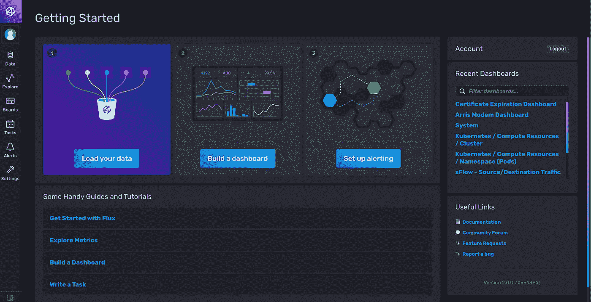

# 使用 Docker 部署 InfluxDB 2.0

> 原文：<https://medium.com/geekculture/deploying-influxdb-2-0-using-docker-6334ced65b6c?source=collection_archive---------0----------------------->



InfluxDB 2.0, the image belongs to InfluxData.

InfluxDB 2.0 一般都有。这个版本的 InfluxDB 提供了时间序列数据库和一组工具，可以使用查询构建器或手动编写 Flux 查询来创建漂亮的仪表板。您还可以计划任务，并在测量值超过特定阈值时配置警报。

几个月前，我总是将 InfluxDB 与 Grafana 或 Chronograf 一起部署以实现可视化。现在，我只需要在我开发的应用程序旁边部署 InfluxDB 2.0 映像。

我们开始吧！

首先，InfluxData 提供了使用 docker 部署 InfluxDB 2.0 的全面指南。所以，我不打算详细描述一切。相反，我将描述如何使用 bash 脚本来自动化配置或设置过程。

您需要使用以下命令从 docker hub 中提取映像:

```
docker pull influxdb:2.0.7
```

如果您想要定制配置，您将需要创建 config.yml 文件，并将其作为一个卷挂载到 docker 容器

```
docker run --rm influxdb:2.0.7 influxd print-config > config.yml
```

将在您的工作目录中创建一个 config.yml 文件。

现在，如果希望在主机上持久化数据库，可以创建一个目录，并将其挂载到容器上的/var/lib/influxd 2。

因此，让我们创建容器

```
docker run --name influxdb -d \
-p 8086:8086 \
--volume `pwd`/influxdb2:/var/lib/influxdb2 \
--volume `pwd`/config.yml:/etc/influxdb2/config.yml \
influxdb:2.0.7
```

上面的命令将创建一个名为`influxdb`的容器，并在工作目录中挂载 config.yml 文件和 influxdb2 目录。它还将您的主机的 8086 端口绑定到容器的 8086 端口，假设您的主机上没有运行和使用该端口的任何软件。

请记住，我们的目标是创建一个能够自动化配置过程的 bash 脚本。但是我们将手动完成每个过程。

接下来，我们将设置一个帐户，我们可以使用它来访问仪表板、写入和查询数据库中的数据。为此，我们需要使用`influx`命令行界面工具的`setup`命令。

您可以在这里看到该命令[的完整标志。但是我们将使用一些标志，如以下命令所示:](https://docs.influxdata.com/influxdb/v2.0/reference/cli/influx/setup/#flags)

```
docker exec influxdb influx setup \
  --bucket BUCKET_NAME \
  --org ORG_NAME \
  --password PASSWORD \
  --username USERNAME \
  --force
```

一个桶是一组测量值。您可以将 bucket 看作关系数据库中的数据库，将 measurements 看作表。您需要提供铲斗的名称并替换`BUCKET_NAME`。

接下来，你必须输入你的组织的名称，并替换掉`ORG_NAME`。

然后，您需要提供组织所有者的用户名和密码。此用户名和密码将用作您登录仪表板的密码。

如果您打算探索 InfluxDB 2.0 的特性，而不编写任何软件来写入或查询数据库中的数据，那么您就完成了。您可以访问 http://localhost:8086，登录，然后探索这些功能。

但是，如果您已经有了一个可以写和/或查询数据的应用程序，并且您需要以编程方式获得访问令牌，那么您可以继续读取。

我提到的令牌用于对将要写入和/或查询数据的客户端进行身份验证和授权。它在控制面板上可用，但我们不会为此目的而打开控制面板。

您可以使用以下命令使用`influx` CLI 检索令牌:

```
docker exec influxdb influx auth list
```

该命令将产生以下输出:

```
ID   Description Token            User Name User ID   Permissions07ec335d5c118000 admin's Token TOKEN_REDACTED admin  07ec335d32118000 [read:authorizations write:authorizations read:buckets write:buckets read:dashboards write:dashboards read:orgs write:orgs read:sources write:sources read:tasks write:tasks read:telegrafs write:telegrafs read:users write:users read:variables write:variables read:scrapers write:scrapers read:secrets write:secrets read:labels write:labels read:views write:views read:documents write:documents read:notificationRules write:notificationRules read:notificationEndpoints write:notificationEndpoints read:checks write:checks read:dbrp write:dbrp]
```

如您所见，输出中包含大量信息。例如，我们有一个用户名为`admin`的账户。该帐户被指定为组织的所有者，这就是为什么有许多权限被分配给该帐户的原因。

但是，我们是来拿令牌的，对吧？是的，您可以从输出中看到令牌。但是你可能需要缩小你的视野来寻找令牌。

您可能已经注意到输出的格式类似于表格。如果我们通过使用`awk`将输出中的每一行用空格分割成一个类似数组的类型，那么这个令牌被存储为第 4 个条目。但这并不总是对的。

令牌的索引取决于描述的内容。默认情况下，令牌的描述遵循以下格式:

```
USERNAME's Token
```

这种情况下是`admin’s Token`。如果我们尝试将阵列可视化，它看起来会是这样:

```
["07ec335d5c118000", "admin's", "Token", "REDACTED_TOKEN", "admin", ...]
```

你可以用`awk`来确认这一点

```
docker exec influxdb influx auth list | awk '/admin/ {print $4 " "}'
```

上面的命令将在一行包含`admin`的文本中打印令牌。我们现在有令牌了。

完事了吗？不，还没有。

至此，我们已经完成了所有需要做的事情(不包括将所有命令放入一个 bash 脚本文件中)。但是我想通过问这个问题来强调最后一点:如果用户名不是`admin`呢？

当然，你可以用别的东西来改变命令行中的`admin`。但是一旦一切都在 bash 脚本文件中，您将需要为不同的用户更改文件。你不会想这么做的，相信我。

不必惊慌，有一个简单的方法。

您可以使用一个环境变量来提供用户名，并将其分配给`awk`变量，并将其用作匹配`influx auth list`输出中的行的模式。

例如，我们将使用`INFLUXDB_USERNAME`环境变量来存储用户名，并将值传递给`awk`中的`username`变量。

```
export INFLUXDB_USERNAME=otheruser
docker exec influxdb influx auth list | awk -v username=$INFLUXDB_USERNAME '$5 ~ username {print $4 " "}'
```

请注意，我们针对数组中的第 5 个元素测试了`username`变量，该数组包含 influx CLI 输出中列出的用户名，如下所示:

```
$5 ~ username
```

所以，现在你不需要每次使用不同的用户名时都改变命令行。你只需要改变环境变量`INFLUXDB_USERNAME`的值。

让我们把所有东西都放到一个 bash 脚本文件中。

```
#!/bin/bash# create config filedocker run --rm influxdb:2.0.7 influxd print-config > config.yml# create the containerdocker run --name influxdb -d \
  -p 8086:8086 \
  --volume `pwd`/influxdb2:/var/lib/influxdb2 \
  --volume `pwd`/config.yml:/etc/influxdb2/config.yml \
  influxdb:2.0.7# configure influxdbdocker exec influxdb influx setup \
  --bucket $INFLUXDB_BUCKET \
  --org $INFLUXDB_ORG \
  --password $INFLUXDB_PASSWORD \
  --username $INFLUXDB_USERNAME \
  --force# get the tokendocker exec influxdb influx auth list | \
awk -v username=$INFLUXDB_USERNAME '$5 ~ username {print $4 " "}'
```

注意，我们使用环境变量为`influx setup`命令提供信息。

我们完了！但是我想我们可能漏掉了一些东西。
如果我们运行 setup 命令时数据库服务器没有准备好怎么办？

我们如何处理这种情况？

放松，我们可以使用`influx ping`命令来检查服务器状态。

```
until docker exec influxdb influx ping
do
  echo "Retrying..."
  sleep 5
done
```

如果服务器尚未准备好或遇到致命错误，`docker exec influxdb influx ping`命令将失败，而`until`块中的命令将被执行。这样，我们可以尝试等待五秒钟再重试。

让我们把所有的东西放在一起

```
#!/bin/bash# create config filedocker run --rm influxdb:2.0.7 influxd print-config > config.yml# create the containerdocker run --name influxdb -d \
  -p 8086:8086 \
  --volume `pwd`/influxdb2:/var/lib/influxdb2 \
  --volume `pwd`/config.yml:/etc/influxdb2/config.yml \
  influxdb:2.0.7# wait until the database server is readyuntil docker exec influxdb influx ping
do
  echo "Retrying..."
  sleep 5
done# configure influxdbdocker exec influxdb influx setup \
  --bucket $INFLUXDB_BUCKET \
  --org $INFLUXDB_ORG \
  --password $INFLUXDB_PASSWORD \
  --username $INFLUXDB_USERNAME \
  --force# get the tokendocker exec influxdb influx auth list | \
awk -v username=$INFLUXDB_USERNAME '$5 ~ username {print $4 " "}'
```

我们终于完成了！

感谢您的阅读！保持安全和健康！

## 2022 年 1 月 24 日更新

根据 [Ruslan Valiyev](https://medium.com/u/a87942f89d4c?source=post_page-----6334ced65b6c--------------------------------) 指出的问题，为`docker run`命令添加了缺失的`-d`标志。