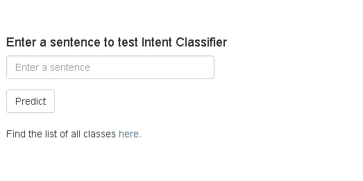
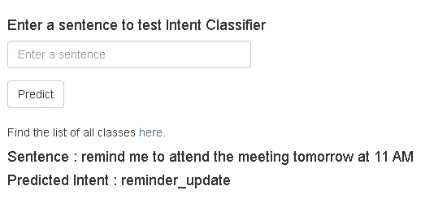

# 在 Heroku 上部署意图分类器

> 原文：<https://medium.com/geekculture/deploying-intent-classifier-on-heroku-a784c22a29fe?source=collection_archive---------1----------------------->


Image by Author

欢迎来到我博客的续篇，在这里我谈到了[训练意图分类器](/analytics-vidhya/creating-your-own-intent-classifier-b86e000a4926)。现在我们已经有了训练好的意图分类器..下一步什么？我们如何使用它。它必须部署在某个地方才能使用，对吗？我们将选择 Heroku 作为我们的平台来实时查看意图分类器。

在我们开始之前，如果你愿意和我一起走，你可以在我的 [github repo](https://github.com/thehetpandya/heroku-intent-classifier-deployment) 上找到所有代码。

# 文件夹结构

为方便起见，我们将保留以下文件夹结构:

```
/your-folder
├───models
│   └───intents.h5
├───templates
│   └───index.html
├───utils
│   ├───classes.txt
│   ├───label_encoder.pkl
│   └───tokenizer.pkl
├───index.html
├───app.py
├───requirements.txt
└───Procfile
```

# 第一步

正如之前[所说，Heroku 需要 *"requirements.txt"* 来安装所有需要的依赖项。在同一中添加以下库:](/analytics-vidhya/deploying-bert-on-heroku-7df1d23f9c43)

```
tensorflow==1.5
h5py
scikit-learn
numpy
flask
```

# 第二步

现在我们已经安装了库，是时候编写一个神奇的文件了😉

创建一个名为 *"app.py"* 的文件，放入下面的代码 code:

```
import os
from flask import Flask, render_template
from flask import request

import pickle
from tensorflow.python.keras.models import load_model
from tensorflow.python.keras.preprocessing.sequence import pad_sequences
import numpy as np
import tensorflow as tf

global graph

model = load_model('models/intents.h5')
graph = tf.get_default_graph()

with open('utils/tokenizer.pkl','rb') as file:
    tokenizer = pickle.load(file)

with open('utils/label_encoder.pkl','rb') as file:
    label_encoder = pickle.load(file)

class IntentClassifier:
    def __init__(self,model,tokenizer,label_encoder):
        self.classifier = model
        self.tokenizer = tokenizer
        self.label_encoder = label_encoder

    def get_intent(self,text):
        self.text = [text]
        self.test_keras = self.tokenizer.texts_to_sequences(self.text)
        self.test_keras_sequence = pad_sequences(self.test_keras, maxlen=16, padding='post')
        with graph.as_default():
            self.pred = self.classifier.predict(self.test_keras_sequence)
        return self.label_encoder.inverse_transform(np.argmax(self.pred,1))[0]

app = Flask(__name__)

nlu = IntentClassifier(model,tokenizer,label_encoder) 

@app.route('/', methods=['GET', 'POST'])
def index():

    if request.method == 'POST':
      form = request.form 

      result = []
      sentence = form['sentence']
      prediction = nlu.get_intent(sentence)

      result.append(form['sentence'])
      result.append(prediction)

      return render_template("index.html",result = result)

    return render_template("index.html")

if __name__ == '__main__':
    port = int(os.environ.get("PORT", 5000))
    app.run(host='0.0.0.0', port=port)
```

这将创建一个解析器类，以便根据它所接受的训练对给定的意图进行分类。接下来，我们创建了一个 flask 服务器来接收输入并将它们传递给解析器类。

接下来，创建一个名为 *"index.html"* 的文件，并将其放在 *"templates"* 文件夹下。在文件中添加以下代码:

```
<!DOCTYPE html>
<html>
  <head>
    <title>Intent Classifier</title>
    <meta name="viewport" content="width=device-width, initial-scale=1.0">
    <link href="//netdna.bootstrapcdn.com/bootstrap/3.3.6/css/bootstrap.min.css" rel="stylesheet" media="screen">
    <style>
      .container {
        max-width: 1000px;
      }
    </style>
  </head>
  <body>
    <div class="container">
      <div class="row-sm-5 row-sm-offset-1">
          <h4>Enter a sentence to test Intent Classifier</h4>
            <form role="form" method='POST' action='/'>
              <div class="form-group">
                <input type="text" name="sentence" class="form-control" id="url-box" placeholder="Enter a sentence" style="max-width: 300px;" autofocus required>
              </div>
              <button type="submit" class="btn btn-default">Predict</button>
            </form>
          <br>
      </div>

      <div class="row-sm-5 row-sm-offset-1">
          <p>Find the list of all classes <a href='https://github.com/horizons-ml/heroku-intent-classifier-deployment/blob/main/utils/classes.txt' target="_blank">here</a>.</p>
          
          <h4>Sentence : {{ result[0] }}</h4>
          <h4>Predicted Intent : {{ result[1] }}</h4>
          
      </div>

    </div>

  </body>
</html>
```

# 第三步

创建 *"Procfile"* 并添加以下代码:

```
web: python app.py
```

# 第四步

确保你已经安装了 Heroku CLI 和 git。完成后，在您的终端中运行以下命令，将您的机器与 Heroku 连接起来。：

```
heroku login
```

接下来，转到[这个页面](https://dashboard.heroku.com/new-app?org=personal-apps)，用你想要的名字创建一个 heroku 应用程序。成功创建应用程序后，键入以下命令将应用程序部署到 Heroku:

```
git init
git add .
git commit -m 'initial commit'
git push heroku master
```

我们的 app 已经部署好了！是时候看看它的运行了。

在浏览器窗口中输入以下地址:

```
https://your_app_name.herokuapp.com
```

您应该会看到类似这样的内容:



Deployed Intent Classifier

让我们给它一个测试句子。你可以在这里找到[的职业列表，作为测试模型的参考。](https://github.com/thehetpandya/heroku-intent-classifier-deployment/blob/main/utils/classes.txt)



Intent Classifier Prediction

Yaaayy！我们的分类器工作了！如果你想试试，我已经在这里部署了我的分类器。

暂时就这样了。感谢您的阅读😄