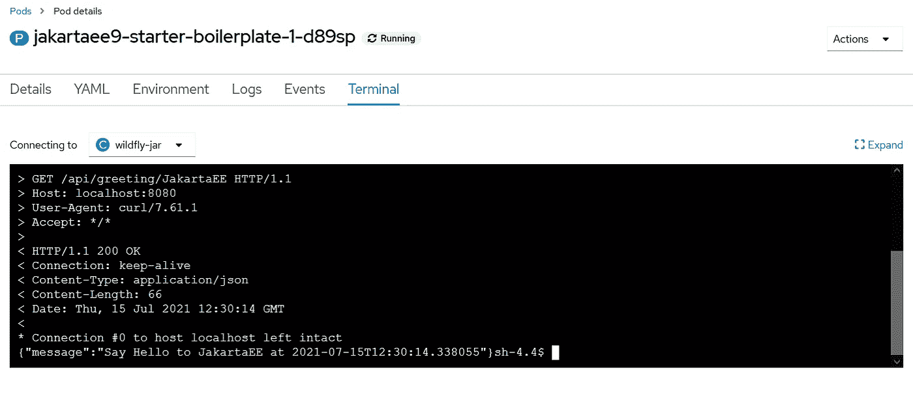

# 使用 WildFly Bootable JAR 部署 Jakarta EE 9 应用程序

> 原文：<https://medium.com/geekculture/deploying-jakarta-ee-9-applications-with-wildfly-bootable-jar-a6cd436da7ea?source=collection_archive---------7----------------------->

自从 WildFly 21 发布以来，可以通过新的`wildfly-jar-maven-plugin`将您的应用程序和 wildly 运行时构建到单个 fat JAR 文件中。对于开发者来说，通过这个 maven 插件，它将众所周知的 Spring Boot 建筑进度带到了 Jakarta EE/WildFly world。


Photo by [Robynne Hu](https://unsplash.com/@robynnexy?utm_source=unsplash&utm_medium=referral&utm_content=creditCopyText) on [Unsplash](https://unsplash.com/s/photos/china-landscape?utm_source=unsplash&utm_medium=referral&utm_content=creditCopyText)

# 先决条件

确保您已经安装了以下软件。

*   Java 11，OpenJDK 或者 [AdoptOpenJDK](https://adoptopenjdk.net/)
*   Apache Maven 3.6 以上
*   [WildFly 24.0.0.Final](https://www.wildfly.org) ，请下载*雅加达 EE 9 预告*分发
*   [OpenShift CLI](https://docs.openshift.com/container-platform/4.2/cli_reference/openshift_cli/getting-started-cli.html)

# 构建可引导 JAR

首先添加`wildfly-jar-maven-plugin`配置。

```
<plugin>
    <groupId>org.wildfly.plugins</groupId>
    <artifactId>wildfly-jar-maven-plugin</artifactId>
    <version>${wildfly-jar-maven-plugin.version}</version>
    <configuration>
        <feature-pack-location>
            wildfly-preview@maven(org.jboss.universe:community-universe)#${wildfly.version}
        </feature-pack-location>
        <layers>
            <layer>jaxrs</layer>
        </layers>
        <plugin-options>
            <jboss-fork-embedded>true</jboss-fork-embedded>
        </plugin-options>
    </configuration>
    <executions>
        <execution>
            <goals>
                <goal>package</goal>
            </goals>
        </execution>
    </executions>
</plugin>
```

*feature-pack-location* 定义了将用于构建应用程序的基础设施特性，而 *layers* 指定了哪些层将被激活

> *关于图层的更多细节，请参考可启动 jar 文档并阅读* [*Galleon 图层*](https://docs.wildfly.org/bootablejar/#wildfly_jar_composing_custom_server_galleon) *章节。*
> 
> *在 feature pack 中，我们使用* `*wildfly-preview*` *来使用 Jakarta EE 9 预览版。*

运行以下命令来构建应用程序。

```
mvn clean package -Pwildfly-bootable
```

除了 maven war 插件构建的通用 *war* 包，还有另外一个带*的 jar 文件——bootable . jar*后缀由`wildfly-jar-maven-plugin`构建。

运行以下命令启动应用程序。

```
java -jar target\jakartaee9-starter-boilerplate-bootable.jar
```

使用`curl`命令测试样品终点。

```
curl -v [http://localhost:8080/api/greeting/JakartaEE](http://localhost:8080/api/greeting/JakartaEE)
```

> *注意，在可引导 jar 中，默认情况下，它将应用程序上下文路径设置为 root("/")。*

# 部署到 OpenShift

`wildfly-jar-maven-plugin`提供开箱即用的云支持。您可以将它与`openshift-maven-plugin`一起使用，将应用程序从源代码构建到 docker 映像中，并部署到 OpenShift 集群。

使用 OpenShift 有几种选择，详情查看[官网](https://www.openshift.com)。

最简单的方法是注册 RedHat 托管的 OpenShift cloud，它提供了一个免费的*开发者沙箱*计划。一旦你注册，它将为你提供一个开发人员和管理员视图的交互式 Web 用户界面。

要使用`openshift-maven-plugin`，你必须先登录。在 OpenShift 首页，点击*问题(？)*图标按钮，并点击*命令行工具*菜单项。在打开的页面中复制 *oc 登录命令行*。更多详情，请参考[本指南](https://developers.redhat.com/blog/2021/04/21/access-your-developer-sandbox-for-red-hat-openshift-from-the-command-line#)。

假设你已经安装了 [OpenShift CLI](https://docs.openshift.com/container-platform/4.2/cli_reference/openshift_cli/getting-started-cli.html) ，打开一个终端，粘贴命令登录到 OpenShift cloud。

```
oc login ...
```

接下来让我们配置`wildfly-jar-maven-plugin`和`openshift-maven-plugin`。

```
<properties>
    <jkube.generator.from>registry.redhat.io/ubi8/openjdk-11:latest</jkube.generator.from>
</properties>
<build>
    <plugins>
        <plugin>
            <groupId>org.wildfly.plugins</groupId>
            <artifactId>wildfly-jar-maven-plugin</artifactId>
            <version>${wildfly-jar-maven-plugin.version}</version>
            <configuration>
                <feature-pack-location>
                    wildfly-preview@maven(org.jboss.universe:community-universe)#${wildfly.version}
                </feature-pack-location>
                <layers>
                    <layer>cloud-server</layer>
                </layers>
                <excluded-layers>
                    <layer>deployment-scanner</layer>
                </excluded-layers>
                <cloud/>
                <plugin-options>
                    <jboss-fork-embedded>true</jboss-fork-embedded>
                </plugin-options>
            </configuration>
            <executions>
                <execution>
                    <goals>
                        <goal>package</goal>
                    </goals>
                </execution>
            </executions>
        </plugin>
        <plugin>
            <groupId>org.eclipse.jkube</groupId>
            <artifactId>openshift-maven-plugin</artifactId>
            <version>${openshift-maven-plugin.version}</version>
            <executions>
                <execution>
                    <goals>
                        <goal>resource</goal>
                        <goal>build</goal>
                    </goals>
                </execution>
            </executions>
            <configuration>
                <enricher>
                    <config>
                        <jkube-service>
                            <type>NodePort</type>
                        </jkube-service>
                    </config>
                </enricher>
            </configuration>
        </plugin>
    </plugins>
</build>
```

这里我们使用一个*云服务器*层来代替之前的 *jaxrs* ，并添加了另一个`openshift-maven-plugin`配置。

> *更多关于 OpenShift maven 插件的细节，请参见* [*Eclipse JKube 文档*](https://www.eclipse.org/jkube/docs/openshift-maven-plugin) *。*

运行以下命令将应用程序部署到 OpenShift cloud。

```
mvn clean oc:deploy -Pwildfly-openshift
```

完成后，您可以通过下面的命令观察 pod 节点。

```
oc get pods -w
```

进入 OpenShift Web UI，点击左侧窗格中的*项目*，就可以看到所有相关的资源，包括 Pod 节点、服务、路由等。

点击*窗格*，选择*jakartaee 9-starter-boilerplate-1-xxxxx*，然后切换到*终端*选项卡，尝试使用`curl`来检查我们的应用程序是否工作正常。

```
curl -v [http://localhost:8080/api/greeting/JakartaEE](http://localhost:8080/api/greeting/JakartaEE)
```

结果类似于下面的屏幕。



回到*项目*视图，点击*路线*，选择*jakartaee 9-starter-样板*。在详细页面中，您可以找到这个已部署应用程序的外部 URL(或者您可以通过下面的命令获得它)。

尝试通过外部 URL 访问示例 API 端点。

```
$ oc get route jakartaee9-starter-boilerplate -o jsonpath="{.spec.host}"
jakartaee9-starter-boilerplate-hantsy-dev.apps.sandbox-m2.ll9k.p1.openshiftapps.com$ curl -v [http://jakartaee9-starter-boilerplate-hantsy-dev.apps.sandbox-m2.ll9k.p1.openshiftapps.com/api/greeting/JakartaEE](http://jakartaee9-starter-boilerplate-hantsy-dev.apps.sandbox-m2.ll9k.p1.openshiftapps.com/api/greeting/JakartaEE)> GET /api/greeting/JakartaEE HTTP/1.1
> Host: jakartaee9-starter-boilerplate-hantsy-dev.apps.sandbox-m2.ll9k.p1.openshiftapps.com
> User-Agent: curl/7.55.1
> Accept: */*
>
< HTTP/1.1 200 OK
< content-type: application/json
< content-length: 66
< date: Thu, 15 Jul 2021 14:02:46 GMT
< set-cookie: 8f1aeb5fdab055810cd99f63982ad17b=1540c81cbcc1728a7c020191c74f5fa7; path=/; HttpOnly
< cache-control: private
<
{"message":"Say Hello to JakartaEE at 2021-07-15T14:02:46.571707"}
```

# 对可引导 JAR 运行 Arquillian 测试

正如在[上一篇文章](https://itnext.io/testing-jakarta-ee-9-applications-with-arquillian-and-wildfly-cd108eec57e2)中提到的，WildFly Arqullian 项目包括一个*可引导*容器适配器，用于测试可引导 jar。

在项目 *pom.xml* 文件中添加以下依赖项。

```
<dependency>
    <groupId>org.wildfly.arquillian</groupId>
    <artifactId>wildfly-arquillian-container-bootable</artifactId>
    <version>${wildfly-arquillian.version}</version>
    <scope>test</scope>
</dependency>
// jerseys are omitted.
```

添加`wildfly-jar-maven-plugin`构建一个*可引导的* fat JAR 用于测试目的。

```
<plugin>
    <groupId>org.wildfly.plugins</groupId>
    <artifactId>wildfly-jar-maven-plugin</artifactId>
    <version>${wildfly-jar-maven-plugin.version}</version>
    <configuration>
        <feature-pack-location>
            wildfly-preview@maven(org.jboss.universe:community-universe)#${wildfly.version}
        </feature-pack-location>
        <layers>
            <layer>jaxrs</layer>
            <layer>management</layer>
        </layers>
        <excluded-layers>
            <layer>deployment-scanner</layer>
        </excluded-layers>
        <plugin-options>
            <jboss-fork-embedded>true</jboss-fork-embedded>
        </plugin-options>
    </configuration>
    <executions>
        <execution>
            <goals>
                <goal>package</goal>
            </goals>
        </execution>
    </executions>
</plugin>
```

在 *arquillian.xml* 中为这个适配器创建一个新的*容器*。

```
<container qualifier="wildfly-bootable-jar" default="true">
    <configuration>
        <property name="jarFile">${bootable.jar}</property>
        <property name="allowConnectingToRunningServer">false</property>
        <property name="managementAddress">127.0.0.1</property>
        <property name="managementPort">9990</property>
        <property name="waitForPorts">9990</property>
        <property name="waitForPortsTimeoutInSeconds">8</property>
    </configuration>
</container>
```

在 maven failsafe 插件的配置中定义一个系统范围的属性 *bootable.jar* 。

```
<plugin>
     <artifactId>maven-failsafe-plugin</artifactId>
     <version>${maven-failsafe-plugin.version}</version>
     <configuration>
         <systemPropertyVariables>
             <bootable.jar>${project.build.directory}/${project.artifactId}-bootable.jar
             </bootable.jar>
             <arquillian.launch>wildfly-bootable-jar</arquillian.launch>
             <java.util.logging.manager>org.jboss.logmanager.LogManager</java.util.logging.manager>
         </systemPropertyVariables>
     </configuration>
</plugin>
```

现在使用下面的命令运行测试。

```
mvn clean verify -Parq-wildfly-bootable-jar
```

从我的 Github 中获取[示例代码。](https://github.com/hantsy/jakartaee9-starter-boilerplate)