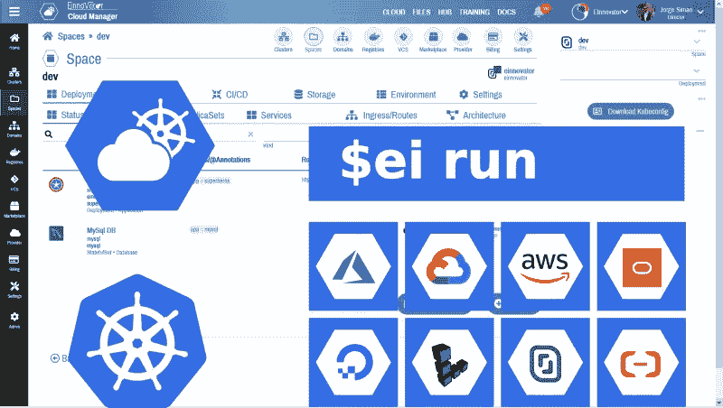
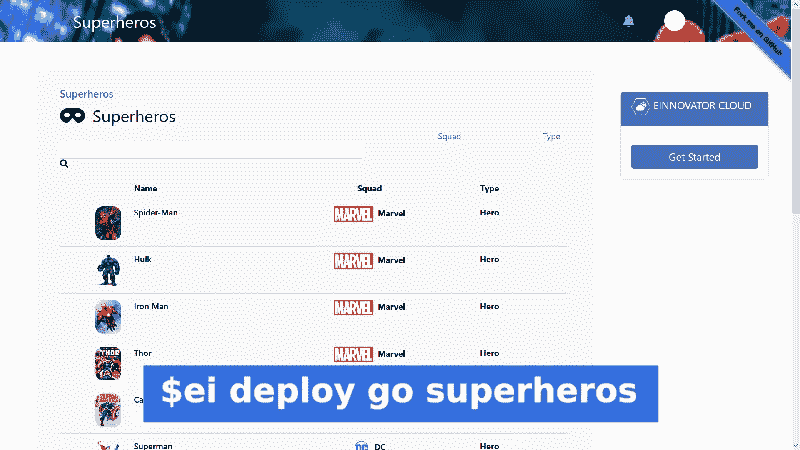

# 使用 Kubernetes 云管理器将 Java/Spring 应用部署到多个云中

> 原文：<https://medium.com/geekculture/deploying-java-spring-apps-to-multiple-clouds-with-kubernetes-cloud-manager-87cc61275cb0?source=collection_archive---------21----------------------->

能够轻松地将应用程序和工作负载部署到多个云中，这为您提供了灵活性和选择自由。您可以避免被云供应商锁定，持续购买低成本基础架构，随意迁移工作负载和数据，并在面对不断变化的提供商政策和临时决策时保持完全控制。在工程层面，对开发和运营实施多集群和多云方法也有好处。它增加了系统的可靠性和可伸缩性，促进了良好的架构设计实践，并强化了可移植性思维。

一般来说，要真正做好多云准备，您需要两件事情:使用工具和运行时，为您提供跨不同云部署和管理工作负载的统一方法；并最小化或隔离对提供商特定服务的依赖性(例如，通过使用可部署在任何云中的便携式中间件服务，和/或通过使用隐藏提供商特定 API 的中间层)。在本文中，我将重点关注第一个需求。具体来说，我将展示如何使用**Kubernetes Cloud Manager***PaaS*在多个云中以完全统一的方式轻松部署和配置 **Java** / **SpringBoot** 应用程序。



**Deploying to Mutiple Clouds with Cloud Manager**

# 贸易工具

## 该应用程序

多云努力的第一步是从一个应用程序开始。如果您已经有了一个带有 Java 后端的 web 应用程序，那么您可以按照我下面给出的提示和步骤来使用它。
如果你没有，那么你有两个选择:使用其他人构建的示例项目，例如 **EInnovator** 的*Startup Factory*[MVP/Samples 目录](https://einnovator.github.io/mvp-samples-catalog/)中的一个示例或 MVP 项目，或者用快速向导创建一个新项目，例如 [Spring Boot 初始化器](https://start.spring.io/)。

在下面的例子中，我使用了示例应用程序*超级英雄*，其源代码可以在一个公共 [GitHub 存储库](https://github.com/einnovator/einnovator-sample-movies)中获得，带有 [Apache 许可证](https://www.apache.org/licenses/LICENSE-2.0)，并预先构建在一个 **DockerHub** [映像存储库](https://hub.docker.com/repository/docker/einnovator/einnovator-sample-superheros)中。对于您自己的应用程序，我假设您有一个 **Docker** 图像。如果你没有，看看我之前发布的这篇文章，看看你如何用 CI/CD 管道为你的 Java/Spring 应用程序构建 Docker 镜像。

## 旋转库贝内特斯星团

由于我们的目标是将一个应用部署到多个云提供商的多个集群中，显然下一步是供应集群。如今有很多云提供商允许你只需按一下按钮就可以运行一个 **Kubernetes** 集群。对于低成本的实验和操作，我建议使用 **DigitalOcean** 、 **Linode** 和/或 **Scaleway** ，或者受益于一些其他提供商提供的免费试用期，您可以考虑: **GCP** 、 **AWS** 、 **Azure** 、 **IBM** 和 **Oracle** 。

UX/用户界面详细说明了如何根据提供商供应集群。不过，最终结果应该是一样的——您将拥有一个 **Kubernetes** 集群，其中有一个或多个虚拟机/节点可用于部署应用程序。对于每个集群，下载 *kubeconfig* 配置文件，并用不同的文件名保存在您的本地文件系统中。这是一个 YAML 文件，描述了主服务器 URL 和对群集的访问凭据。各种工具都可以使用这个文件，包括:`kubectl`(**Kubernetes**native CLI)和`ei`(**Kubernetes Cloud Manager**CLI)，也可以上传到 **Cloud Manager** UI。

或者，您可以从**云管理器**的 UI 提供集群。
这有利于使用相同的 UX/用户界面和统一的方法来跨提供商配置集群。您只需输入您正在使用的每个提供商的凭证(例如， **DigitalOcean** 、 **Linode** 、 **Scaleway** 、用于 **AWS** 的密钥-秘密对、用于 **GCP** 的服务帐户 JSON 等)。).您也可以从**云管理器**菜单选项`Cluster > Connect > Kubeconfig`下载 *kubeconfig* 配置文件。

如果您已经在这些提供商或内部部署中拥有一个现有集群，您也可以使用它。此外，如果您的笔记本电脑上安装了 **Docker Desktop** ，您可以将它用作一个 **Kubernetes** 伪集群，其中包含一个用于开发目的的节点。最后一个选项的主要限制是您的笔记本电脑通常没有公共 IP，因此 DNS 循环负载平衡不适用于该集群(将在下面讨论)。

## 正在启动云管理器后端

在本文中，我们将使用`ei` CLI 工具，但在此之前，您需要运行一个**云管理器**服务的实例。如果您想在多用户模式下使用**云管理器**，您还需要启动 **SSO 网关**服务。我已经在[其他文章](/swlh/cloud-manager-kubernetes-better-dashboard-d29cf91ac69e)中介绍了这方面的细节，所以我会引导您阅读其中一篇。您还可以在底部的参考资料中找到文档的链接。

**云管理器**打包成 *Docker 镜像*，有几种安装选项，包括:带`kubectl`、`docker`、`helm`，多用户模式的助手脚本(基于 YTT)。为了快速参考，我在下面显示了使用 Docker 在单用户模式下运行**云管理器**的命令。

```
docker run -p5005:2500 einnovator/einnovator-devops cm -d
```

在`http://localhost:5005`的网络浏览器中打开**云管理器** UI，注册为管理员。

或者，您可以使用[cloud.einnovator.org](https://cloud.einnovator.org)的**云管理器** (SaaS)的**创新器**安装。你只需要注册，并记住你的用户名/密码。

## 安装云管理器 CLI

设置的下一步是安装`ei` CLI 工具。在[另一篇文章](/faun/a-cli-tool-for-multi-cluster-kubernetes-cloud-manager-rocks-af17124af2a6)、
中，我对 CLI 工具进行了深入的介绍。简而言之，要安装你需要下载一个如下的`.tgz`:

```
wget [https://cdn.einnovator.org/cli/ei-latest.tgz](https://cdn.einnovator.org/cli/ei-latest.tgz)
tar -xf ei-latest.tgz
cd einnovator-cli
chmod +x ei #linux/mac only
./ei
```

最后，您需要使用您的用户名和密码通过 CLI 登录到服务器。使用适当的 API 端点:如果在 **Docker** 上运行，则使用 **EInnovator** 的 SaaS 安装，则使用`cloud.einnovator.org`。

```
# login to local cloud manager API with username/password
ei login -u username -p password [http://localhost:5050](http://localhost:5050)# login to remote SaaS installation of cloud manager
ei login -u username -p password [https://cloud.einnovator.org](https://cloud.einnovator.org)
```

# 设置集群

## 导入 Kubeconfig

您可以通过几种方式将集群访问细节导入到**云管理器**中，包括 UI 和 CLI。使用 CLI 最简单的方法是使用带有选项`-f`的命令`cluster import`来指定每个集群的 *kubeconfig* 文件的位置。您可以从任意数量的提供者导入任意数量的集群。 *kubeconfig* 的格式始终相同。集群名称(和提供者细节)是从 *kubeconfig* 文件中自动推断出来的。唯一的限制是使用 *kubeconfig* 文件对单个集群进行配置。(如果在一个文件中定义了多个集群，您需要指定所选集群的名称作为`cluster import`的参数，否则将导入找到的第一个集群)。

下面，我从不同的云提供商导入几个集群作为例子。你应该适应你选择的实际的提供者和文件名。

```
# import clusters using kubeconfig files
ei cluster import -f kubeconfig-digitalocean.yaml 
ei cluster import -f kubeconfig-linode.yaml 
ei cluster import -f kubeconfig-scaleway.yaml 
ei cluster import -f kubeconfig-gcp.yaml 
ei cluster import -f kubeconfig-aws.yaml 
ei cluster import -f kubeconfig-azure.yaml 
ei cluster import -f kubeconfig-ibm.yaml 
ei cluster import -f kubeconfig-oracle.yaml 
ei cluster import -f kubeconfig-alibaba.yaml 
```

要确认导入的集群，您可以使用命令`ls -c`。

```
# list configured clusters
ei ls -c
```

## 附加集群设置

当设置一个 **Kubernetes** 集群并在实践中使用它时，有一些附加/扩展和工具通常是有用的或需要的。
这包括一个*入口控制器*来管理`Ingresses`并支持 DNS 路由，比如 **Nginx** 。CI/CD 启用运行时，如 **Tekton** 。以及从集群内部将市场解决方案安装到集群中的工具，例如`helm`和`kubectl`。云管理器支持轻松安装这些运行时扩展。这可以在`cluster import`期间使用选项`--ingress`、`--cicd`和`--tools`一步完成。如果您的一些集群已经安装了这些运行时，您可以省略其中的一些选项(例如， **Scaleway** UI 和 API 具有在集群创建时安装入口控制器的选项)。

下面，我再次展示了为安装 **Nginx** 入口控制器(默认)而修改的导入命令，这是以后需要的。还安装了**舵**工具。

```
# import clusters and install add-ons
ei cluster import -f kubeconfig-digitalocean.yaml --ingress=true --tools=true
ei cluster import -f kubeconfig-linode.yaml --ingress=true --tools=true
...
```

## 创建空间

接下来，您需要在每个集群中创建一个 ***空间*** (名称空间)来部署您的应用程序和支持资源。这是通过命令`space create`完成的。**云管理器**提供了一个平面空间列表，允许在不同集群和云的空间之间进行选择和切换，就像在相同集群或云中的空间一样容易。命名空间时，群集名称用作前缀。

下面，我在我们导入的每个集群中创建了一个名为`dev`的空间。我们可以在不同的集群中使用不同的空间名称，但是使用一个共同的名称简化了脚本，也更容易管理。

```
# import clusters using kubeconfig files
ei create space do/dev
ei create space linode/dev
ei create space scaleway/dev
ei create space gcp/dev
ei create space aws/dev
ei create space azure/dev
ei create space ibm/dev
ei create space oracle/dev
ei create space alibaba/dev
```

如果您有许多集群，您可能更喜欢使用带有`for`循环指令的 **Bash** shell 脚本，如下所示:

```
export SPACES="do/dev linode/dev scaleway/dev gcp/dev aws/dev azure/dev ibm/dev oracle/dev alibaba/dev"
for space in $SPACES ; do ei create space $space; done
```

**提示:**您应该使`SPACES`变量的值适应您所提供的实际集群。

使用命令`ls`确认在所有集群中创建了空间。

```
# list created spaces
ei ls
```

# 跨集群运行应用程序

使用命令`run`只需一步即可完成应用部署。
每个集群/空间都应该这样做。命令`cd`用于在集群/空间之间切换。

```
# run app as a deployment with a specified image in multiple cluster/spaces
ei cd do/dev
ei run superheros einnovator/einnovator-sample-superheros --port=80 --stack=boot -o
ei cd linode/dev
ei run superheros einnovator/einnovator-sample-superheros --port=80 --stack=boot -o
...
```

命令`run`中的选项`--port`用于指定应用程序容器应该监听连接的端口。选项`--stack=boot`提示**云管理器**为 **Spring Boot** app 自动配置应用的一些环境变量——即设置环境变量`SERVER_PORT`来配置 embedeed HTTP/Servlet 容器的端口。最终结果是在各自的`ReplicaSet`和`Pod(s)`中一起创建了 **Kubernetes** 和`Service`。一些部署元数据也保存在**云管理器** DB 中，这允许在不丢失配置的情况下停止集群中的应用程序。

如果您有许多集群，那么使用一个 **Bash** shell 脚本也很方便:

```
for space in $SPACES ; do \
  ei cd $space;\
  ei run superheros einnovator/einnovator-sample-superheros --port=80 --stack=boot;\
done
```

每次需要在不同的集群/空间中部署或配置应用程序时，您可以使用选项`-n`来选择集群/空间，而不是使用命令`cd`显式地更改当前空间。如下所示:

```
for space in $SPACES ; do \
  ei run -n=${space} superheros einnovator/einnovator-sample-superheros --port=80 --stack=boot;\
done
```

使用命令`ps`确认应用程序正在运行。

```
# list deployments in current space
ei cd do/dev
ei ps
...
```

如果您想要列出其他集群/空间中的部署，而不是当前的部署，请使用选项`-n`。您也可以指定多个空格和逗号分隔的集群。

```
# list deployments in selected space
ei ps -n=do/dev
ID  NAME       DISPLAYNAME KIND       STATUS AVAIL DESIRED READY AGE
587 superheros superheros  Deployment Running  1     1     1/1   1d# list deployments in several spaces
ei ps -n=do/dev,linode/dev,scaleway/dev,aws/dev
```

或者，使用下面两个 **Bash** 命令行之一来列出所有集群/空间:

```
# list deployments in all spaces (1)
ei ps -n=${SPACES//[ ]/,}# list deployments in all spaces (2)
for space in $SPACES ; do ei ps -n=${space}; done
```

**提示:**语法`${string//[substring]/replacement`是 **Bash** 习语进行字符串替换。这里用逗号替换变量`SPACES`中的空白分隔符。

如果想快速导航到**云管理器** UI，可以使用命令`deploy view`。这将在默认的 web 浏览器中打开一个带有应用程序仪表板的窗口/选项卡(您需要首次登录)。这便于以简洁直观的方式对应用程序部署进行故障诊断(例如，通过查看日志、事件、生成的清单、配置和其他资源)。同样，您可以使用命令`space view`打开当前空间的仪表板。

```
#open app in browser
ei cd do/dev
ei deploy view superheros
...
```

要使用所有集群/空间的应用程序仪表板打开浏览器选项卡，您可以使用脚本行:

```
for space in $SPACES ; do ei deploy view superheros -n=$space; done
```

# 应用程序管理和配置

## 扩展应用程序

如果你想在每个集群中有多个应用实例，你可以使用命令`run`中的选项`-k`。或者，你可以在程序运行后使用命令`deploy scale`。

```
# scale deployment to 10 replicas (horizontal scaling)
ei cd do/dev
ei deploy scale superheros 3
ei cd linode/dev
ei deploy scale superheros 5
...
```

要扩展分配给每个实例的资源(内存、临时磁盘存储和 CPU 共享)，请使用命令`deploy resources`。

```
# update resources (vertical scaling)
ei cd do/dev
ei deploy resources superheros — mem=2Gi — disk=3Gi
ei cd linode/dev
ei deploy resources superheros — mem=2Gi — disk=3Gi
```

## 更新应用程序

如果在某些时候你需要更新一个应用程序*镜像:版本*，你可以使用命令`deploy update`和选项`--image`，如下所示:

```
ei deploy update superheros --image=einnovator/einnovator-sample-superheros:1.1 -n=do/dev
ei deploy update superheros --image=einnovator/einnovator-sample-superheros:1.1 -n=do/linode
...
```

要跨所有集群/空间轻松更新，请使用命令行:

```
for space in $SPACES ; do ei deploy update superheros \
--image=einnovator/einnovator-sample-superheros:1.1 -n=$space; done
```

## 环境变量

您可能需要设置应用程序的环境变量来配置不同的设置。这可以通过命令`env add`、`env update`和`env rm`来完成。使用命令`env ls`检查应用程序的当前环境。使用命令`deploy restart`更新环境变量后，您需要重启应用程序。

```
ei cd aws/dev
ei env add superheros SPRING_PROFILES_INCLUDE=mongodb
ei env update superheros THEME=fantasy
ei env rm superheros BROKER_URL
ei env ls
ei deploy restart superheros
...
```

像往常一样，您可以依靠 **Bash** 脚本来更容易地跨所有集群/空间配置应用程序:

```
for space in $SPACES ; do\
  ei cd ${space};\
  env add superheros SPRING_PROFILES_INCLUDE=mongodb;\
  env update superheros THEME=fantasy;\
  env rm superheros BROKER_URL;\
  deploy restart superheros;\
done
```

## 坚持

到目前为止，我一直假设应用程序运行在嵌入式数据库中。对于本文中用作示例的示例应用程序`einnovator/einnovator-sample-superheros`,默认情况下是这样的。在后面的小节中，我将讨论一些部署独立数据库和将应用程序绑定到数据库的方法。

对于一个嵌入式数据库，您可能希望考虑一个 **Kubernetes** pod 的磁盘空间在默认情况下是短暂的(即，如果 pod 被终止，比如当应用程序关闭或更新时，它就会被丢弃)。为了拥有真正的持久性存储，您可以使用命令`mount add`为应用程序配置一个挂载点。**云管理器**自动创建一个 **Kubernetes** **持久卷声明**，并生成清单文件挂载到指定路径。您需要重新启动应用程序以使装载生效。您需要在每个集群/空间中执行此操作。

```
# mount volume in specified path
ei cd do/dev
ei mount add superheros data — mountPath=/data — size=3Gi
ei deploy restart superheros
...
```

如果使用 **Bash** 脚本为所有集群/云进行配置:

```
for space in $SPACES ; do\
  ei cd $space;\
  ei mount add superheros data --mountPath=/data --size=3Gi\
  ei deploy restart superheros\
done
```

# 通过 DNS 路由访问应用程序

## 定义域

要使应用程序在每个集群中都可以访问，您有几种选择。对最终用户来说，最方便的是为应用程序提供一个 DNS 主机名。这假设集群中的节点有一个可到达的公共 IP。要在**云管理器**中做到这一点，首先用命令`domain create`定义你的域名(例如`acme.com`)。对于安全的 HTTPS 访问，您需要一个包含证书的文件，以及相应的私钥和证书授权链，并使用选项`--crt`、`--key`、`--ca`来指定这些。

```
# create an (unsecure) domain
ei domain create acme.com# create a secure domain
ei domain create acme.com --crt=crt.pem --key=key.pem --ca=ca.pem
```

要使其成为以后的默认域，请使用命令`domain set`。
您只需要这样做一次，因为域是由 cloud **CloudManager** 管理的，可以用于所有集群。您可以使用命令`ls -d`列出所有域(如果您有多个域)。

```
# set current/default domain and list domains
ei domain set acme.com
ei ls -d
```

## 添加 DNS 路由

接下来，您应该使用命令`route add`向每个集群中的应用程序添加一个或多个 DNS 路由。当增加一条路由时，**云管理器**自动创建一个**Kubernetes**并用域证书配置一个`secret`。

我们将添加两条路由，一条用于唯一识别和到达特定集群(即云提供商安装)，另一条是可以全局负载平衡的共享路由(见下一节)。下面，我使用`heros`作为通用主机名，
和`heros-{cluster}`作为集群特定的路由。

```
# add routes to app
ei cd do/dev
ei route add superheros heros-do
ei route add superheros heros
ei cd linode/dev
ei route add superheros heros-linode
ei route add superheros heros
```

如果使用一个 **Bash** shell 脚本:

```
for space in $SPACES ; do \
  ei cd $space;\
  ei route add superheros heros-${space%/dev};\
  ei route add superheros heros;\
done
```

**提示:**表达式`${space%/dev}`是 **Bash** 习语从字符串中删除后缀`/dev`。此处用于从限定的空间名中获取集群名。

您还需要配置您的 DNS 服务器来路由到应用程序 DNS 主机名。为此，为`heros-{cluster}.domain`(例如`heros-do.acme.com`、`heros-linode.acme.com`等)创建`A`记录。)带有值的集群中某个节点的公共 IP 地址。要获得这个 IP 地址，您可以运行命令`node ls -b`并注意字段`addr`的值。识别公有 IP 地址(私有 IP 地址一般以`10.x.x.x`开头，所以是另一个)。您也可以使用`kubectl get nodes -o=yaml`来获取这些信息。

```
ei cd do/dev
ei nodes ls -b
```

添加路线后，您可以使用命令`deploy go`快速导航到应用程序。这将在应用程序主页中打开一个浏览器窗口(或选项卡)。

```
#open app in browser
ei deploy go superheros
```



**Superheros Sample App**

## 跨集群/云的负载平衡

通常，最终用户使用单个 DNS `hostname.domain`地址访问应用程序很方便，即使应用程序有多个实例/副本。对于在同一个集群和空间中运行的实例， **Kubernetes** 通过在不同的实例之间进行流量负载平衡来自动处理这个问题。如果应用跨多个集群和云复制，就像我们在这里做的那样，我们需要一个额外的机制来跨集群执行负载平衡。最简单的方法(不一定总是最理想的)是使用 DNS 循环法，用相同的主机名和多个 IP 地址值配置多个`A`记录。下面，我展示了一个`heros.acme.com`的配置示例:

```
A heros.acme.com 51.15.220.42 #do
A heros.acme.com 71.12.120.22 #linode
A heros.acme.com 91.14.142.14 #scaleway
...
```

## 完整脚本

作为参考，我在下面展示了在多个集群/云中部署应用程序的完整的 **Bash** 脚本，包括:空间创建、运行和扩展部署、创建域和路由。

```
export SPACES="do/dev linode/dev scaleway/dev gcp/dev aws/dev azure/dev ibm/dev oracle/dev alibaba/dev"
for space in $SPACES ; do ei create space $space; done
ei domain create acme.com --crt=crt.pem --key=key.pem --ca=ca.pem
ei domain set acme.com
for space in $SPACES ; do\
  ei cd ${space};\
  ei run superheros einnovator/einnovator-sample-superheros --port=80 --stack=boot;\
  ei deploy resources superheros --mem=2Gi --disk=3Gi;\
  ei deploy scale superheros 3;\
  ei route add superheros heros-${space%/dev};\
  ei route add superheros heros;\
done
```

如果您想要清理所有集群/空间中的所有资源，可以运行以下脚本:

```
export SPACES="do/dev linode/dev scaleway/dev gcp/dev azure/dev ibm/dev oracle/dev alibaba/dev"
for space in $SPACES ; do \
  ei cd ${space};\
  ei kill superheros -f;\
  ei space rm ${space};\
done
```

# 使用后端数据库运行应用程序

对于大多数应用程序，最好连接到独立的数据库，而不是使用嵌入式数据库。这需要两个步骤:部署数据库，并配置连接到它的应用程序。通常，您需要评估几种可能的体系结构，以便在集群间分发数据。我将一些关键问题和可能性总结如下:

*   使用哪个数据库？RDBMS 或 NoSQL 是我的用例的首选吗？
*   应该复制数据库还是单个实例就足够了？
*   *如果只有一个实例:*
*   它将在 Kubernetes 内部运行还是在某个外部环境中运行(例如专用虚拟机)？
*   如果在 **Kubernetes** 内部，它应该位于哪个集群中？
*   *如果复制:*
*   有单个写入副本(主副本)还是多个？
*   如何在不同的副本之间同步数据并保持一致性？
*   数据库是否自动完成数据同步？
*   如果是，如何设置适当的配置？
*   所选数据库是否有 **Kubernetes** 运算符？如果是，它是否为多集群部署提供任何支持？(目前，对此的支持有限)
*   是否需要定制的应用程序级逻辑来执行数据同步(例如，通过使用消息代理转发数据更新)？
*   多集群数据备份是如何协调的？

为了简单起见，下面我假设了一个最简单的场景，其中示例应用程序连接到运行在同一个集群中的 MySQL 数据库，每个集群和应用程序部署都有自己的数据库。对于跨数据库的数据同步和一致性这一重要问题，我没有做出定论。

此外，连接到独立集群或外部环境中的数据库原则上类似于连接到同一集群中的数据库，但可能需要一些配置调整。我将在以后的文章中讨论这些更高级的场景。

## 工具作业

您有几个工具选项可以在 **Kubernetes** 集群中安装数据库，包括: *Helm charts* 、`kubectl`带清单文件(普通或`kustomize`合成)、特定于 DB 的操作符和 CRD，以及几个基于 UI 的工具，包括**云管理器**。这里我将继续使用`ei` CLI 工具。

命令`market`用于从配置的目录中列出和搜索市场解决方案。**云管理器**默认安装会自动设置几个现成的目录。这些目录定义了各种各样的解决方案，包括几个数据库。下面，我将展示如何搜索名称或关键字包含文本`sql`的所有解决方案。

```
#list all solutions in any catalog matching a query
ei market sql
```

## 安装数据库

为了安装 **MySQL** DB，我使用命令`install`并选择目录`einnovator`中可用的`mysql`解决方案。

```
ei install einnovator/mysql
ei ps

ID  NAME       DISPLAYNAME KIND       STATUS AVAIL DESIRED READY AGE
587 superheros superheros  Deployment  Running 1    1     1/1     1d
589 mysql      MySql DB    StatefulSet Running 1    1     1/1     2h
```

在启动数据库部署(实际上是一个`StatefulSet`)之后，您应该为应用程序数据创建数据库。为此，您可以在 DB 的 pod 中运行命令`mysql`并执行命令`create database`。这可以通过`ei`命令`deploy exec`轻松完成，默认情况下，它在部署的第一个 pod 中运行该命令。

为了让`create database`命令工作，您需要查找并提供数据库密码和认证。对于我们安装的解决方案，这是在名为`mysql-credentials`的`secret`和数据字段`password`中设置的。下面，我使用带有选项`-d`和`--decode`的命令`secret get`来提取和解码密码，并将其分配给一个变量。

```
export PWD=`ei secret get mysql-credentials -d=password --decode`
ei deploy exec mysql -- mysql -uroot -p$PWD -e "create database superheros"
```

或者，您可以使用`kubectl`加上 util `jq`来提取解码的秘密值并创建数据库。

```
export PWD=`kubectl get secret mysql-credentials -o json | jq '.data|map_values(@base64d)'`
ei exec mysql-0 — mysql -uroot -p$PWD -e "create database superheros"
```

## 定义数据库连接器

为了简化连接应用到后台服务的工作，例如 DBs 和消息代理以及其他微服务，**云管理器**提供了 ***连接器*** 和 ***绑定*** 的抽象。一个部署/服务可以公开一个或多个连接器，每个连接器定义一组用于将连接信息导出到应用程序的键-值对。它们是用 JSON 规范定义的，通常包括如下信息:用户名/密码凭证、服务主机/IP 和访问 URL。

下面，我使用命令`connector add`为服务`mysql`创建一个名为`superheros/root`的新连接器。选项`--spec` 为连接器提供了一个 JSON 规范。这里导出几个变量，包括:从 secret `mysql-credentials`中查找的`password`(语法前缀`^^`解析一个 secret 数据项，前缀`^`解析一个 configmap 数据项)，定义为`root`的`username`，引用变量`${host}`(自动设置为服务端点的 IP)和数据库`superheros`。
选项`--type`是一个可选提示，允许自动生成绑定规范(见下文)。

```
ei connector add mysql superheros/root --type=mysql \
--spec='{\"password\":\"^^mysql-credentials.password\",\"username\":\"root\",\"uri\":\"mysql:${host}/superheros\"}'
```

因为从命令行用 JSON 设置连接器规范有点麻烦(因为需要对双引号进行转义)，所以通常最好使用逗号分隔的设置列表，如下所示:

```
ei connector add mysql superheros/root --type=mysql \
--spec=password:^^mysql-credentials.password,\
username:root,uri:mysql://\${host}/superheros
```

## 绑定到数据库

一个 ***绑定*** 是环境变量的设置集合，这些变量的值是从一个连接器中解析出来的。要设置的适当环境变量取决于用于实现应用程序的堆栈。我们的示例应用程序是用 **Spring Boot** 实现的，我们连接到一个 MySQL 数据库，所以我们需要设置环境变量`SPRING_DATASOURCE_*`。

下面，我使用命令`binding add`为应用程序`superheros`创建一个新的绑定。选择器`mysql/superheros/root`指定我们绑定到服务`mysql`的名为`superheros/root` 的连接器。选项`--spec`将需要设置的环境变量集合定义为 JSON，包括 JDBC URL、用户名和密码。这些值是从连接器变量中解析的。

```
ei binding add superheros mysql/superheros/root \
--spec='{\"spring\":{\”datasource\”:{\"url\":\"jdbc:${uri}\",\"username\":\"${username}\",\"password\":\"${password}\"}}}'
```

一种简化的方法是要求由**云管理器**基于应用的堆栈和服务类型自动生成绑定规范。这是通过在创建绑定时指定选项`--auto`来完成的。因为我们在部署时使用选项`--stack=BOOT`设置了应用程序的堆栈，并且在创建时为连接器指定了连接器类型`mysql`，所以**云管理器**知道要生成什么样的适当规范。

```
ei binding add superheros mysql/superheros/root --auto
ei restart superheros
```

一旦应用程序重新启动，它将运行和获取/存储数据在 MySQL 数据库，而不是嵌入式数据库。

## 完整脚本

作为参考，我在下面展示了完整的 **Bash** 脚本，用于跨所有集群安装、配置和连接 aMySQL DB。

```
export SPACES="do/dev linode/dev scaleway/dev gcp/dev aws/dev azure/dev ibm/dev oracle/dev alibaba/dev"
for space in $SPACES ; do\
  ei cd ${space};\
  ei install einnovator/mysql; \
  ei connector add mysql superheros/root --type=mysql \
--spec=password:^^mysql-credentials.password,\
username:root,uri:mysql://\${host}/superheros ;
  ei binding add superheros mysql/superheros/root --auto
  ei deploy restart superheros
done
```

# 摘要

我概述了如何使用 **Cloud Manager** CLI 工具跨多个集群部署应用程序，这些集群可能来自不同的云提供商。该方法的主要优势包括:跨云提供商的一致性，使用简单的脚本和与单个集群相同的抽象对多个集群进行部署和更新的能力，使用**云管理器**的简化配置模型——这可以说比 **Kubernetes** 的普通配置(需要使用大量 YAML 清单文件)简单得多，并且可以增量完成。

显然，复制应用程序的无状态部分是比较容易的部分。分发和复制有状态服务，比如 DBs，这本身就是一个问题，通常需要特定于服务和用例的方法。通常很难找到可扩展的通用解决方案。在本文中，出于说明的目的，我将重点放在最简单的方法上，并让读者去研究适合您的应用程序和用例的更高级的多集群/多云数据架构。在我们这边，我们将继续探索一些选项，并在未来的帖子中回到这个主题。

# 了解更多信息

*   [在本地安装**云管理器**](https://cms.einnovator.org/publication/cloud-manager-reference-manual/_/install.md)
*   [**云管理器**参考手册](https://cms.einnovator.org/publication/cloud-manager-reference-manual)
*   [**云管理器**第一教程](https://cms.einnovator.or/document/cloud-manager-tutorial)