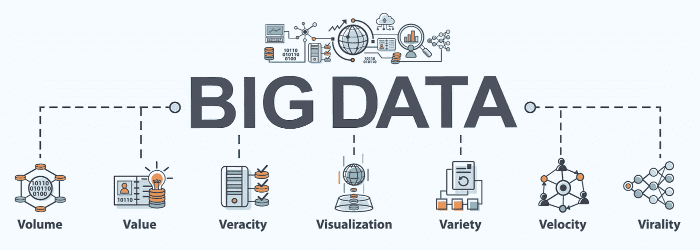
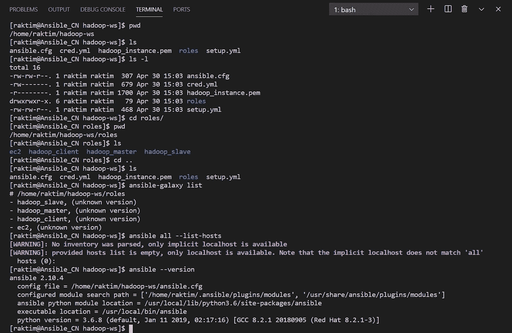
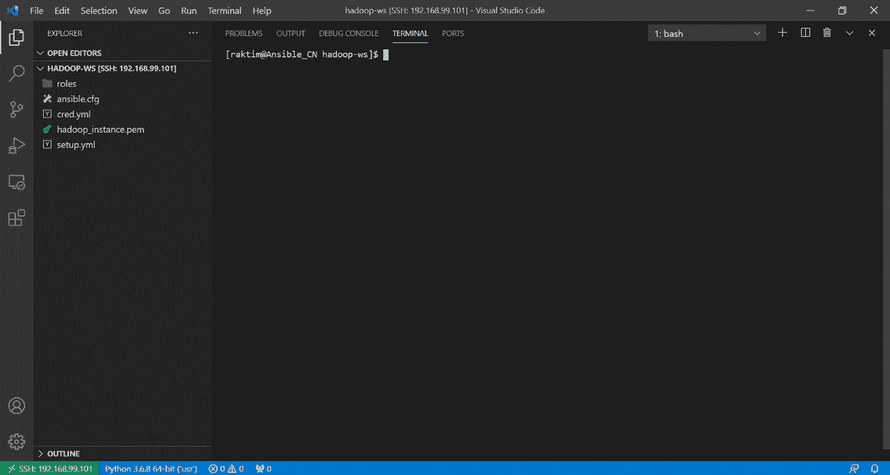
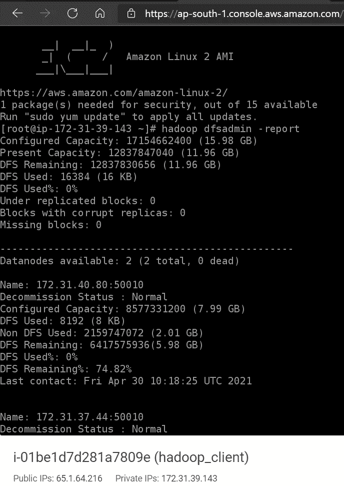

# 使用 Ansible Automation 在 AWS 上部署多节点 Hadoop 集群

> 原文：<https://medium.com/geekculture/deploying-multi-node-hadoop-cluster-on-aws-using-ansible-automation-f16edb5d183a?source=collection_archive---------15----------------------->


Created by Raktim

## 在当今世界，所有大公司都有数百万用户&他们数十亿的数据。但是，请想一想，这些公司每天是如何存储这些海量数据的。让我们看看他们在使用什么工具&我们如何也能自己设置这些工具…

# 大数据:



Source : Google

我们都知道每天有数百万人在使用互联网，其中大多数人使用社交媒体平台，如 T2 脸书、Instagram、YouTube T3 等。如果我们再想一想**我们没有向这些社交媒体平台支付任何费用**，那么这些公司是如何开展业务的。**答案很简单……**

> “如果你不为产品付费，那么你就是产品”

**这些公司拥有数十亿的用户数据&利用这些数据，他们可以开展业务。**现在最大的挑战是— **他们如何能够存储如此大量的数据**。此外，他们还需要有效地存储这些数据，以便将来可以快速读取它们。**分布式存储集群的好戏来了。**

> **几天前，我写了一篇博客，讨论了分布式存储集群如何解决大数据的挑战。**为了便于参考，我附上了下面的链接…

[](https://raktimmidya.medium.com/data-is-business-but-big-data-is-problem-ecda244ec620) [## 数据是业务:)但大数据是问题:(

### 你有没有想象过流行的社交媒体平台有数十亿用户，他们是如何存储这些庞大的数据的…

raktimmidya.medium.com](https://raktimmidya.medium.com/data-is-business-but-big-data-is-problem-ecda244ec620) 

# Hadoop:


Hadoop Logo

*   在我上面提到的博客中，我提到过**要实现分布式存储集群，有很多技术工具可用**。其中最流行的工具是 **Hadoop** 在这种背景下。

Hadoop 是一个允许我们在分布式环境中存储大数据的程序，因此，我们可以并行处理它。Hadoop 中基本上有两个组件——**HDFS&纱**。

**HDFS (Hadoop 分布式文件系统)帮助我们在集群中存储各种格式的数据。YARN 用于 Hadoop 中的资源管理。它允许对存储在 HDFS 各地的数据进行并行处理。**

> 在这篇博客中，我不想深入 Hadoop，但是我想展示如何创建可行的角色来在 AWS EC2 实例上设置 Hadoop 分布式存储集群。但是如果你想了解更多关于 Hadoop 的知识，你可以参考这个链接——[https://www.tutorialspoint.com/hadoop/index.htm](https://www.tutorialspoint.com/hadoop/index.htm)

# 让我们看看问题陈述:

1.  创建可启动 4 个 AWS EC2 实例的角色。
2.  动态获取 IP 并创建清单，以便在这些实例上运行进一步的角色。
3.  创建角色以配置 Hadoop 名称节点(主节点)、数据节点(工作节点)和客户端节点。
4.  最后，将第一个和第二个实例配置为名称节点和客户端节点，并将其他两个系统配置为数据节点。

# 先决条件:

显然，通过查看问题陈述，**它可能看起来非常小&简单，但是我们需要注意许多组件来实现这个设置。**但是不要担心，因为我会一如既往地讨论每个&小问题，这样在博客的结尾，你会觉得很舒服。

## 理解这一点有几个先决条件:

*   **虽然我将展示如何编写代码来完成这一实用，但你绝对需要 AWS EC2 实例& Ansible 角色的基本知识。如果你没有这些知识，那么你可以参考下面提到的博客…**

[](/swlh/getting-started-with-ansible-ee31be8c6a75) [## Ansible 入门

### 让我们学习 Ansible 的基础知识以及一个实用工具——使用 Ansible 进行 docker 环境供应。

medium.com](/swlh/getting-started-with-ansible-ee31be8c6a75) [](https://raktimmidya.medium.com/getting-started-with-aws-terraform-293e9125dff) [## AWS & Terraform 入门。

### 如何入门使用 Terraform 在 AWS 中构建基础设施？

raktimmidya.medium.com](https://raktimmidya.medium.com/getting-started-with-aws-terraform-293e9125dff) 

*   我使用我的本地 Windows 机器&在那里我使用 Oracle VM box 来运行 Linux 操作系统。在我的虚拟机中，我安装了 Ansible 版本 2.10.4。同样为了使事情更容易，我通过 SSH 将我的 RHEL8 虚拟机与我的 Windows 系统的 VS 代码连接起来。
*   最后**我们需要一个 AWS 帐户&在那里使用 IAM 我们需要创建 AWS 访问密钥&秘密密钥**，以便 Ansible 可以登录到我们的 AWS 帐户来启动实例。

## 让我们开始运行命令和编写代码…

# 创建四个角色:

我将在 GitHub 上上传我的职责&代码——链接在本博客的末尾。在这篇博客中，我将讨论这些代码的每一点，所以要学习它们，请继续阅读。

*   **创建一个工作空间，比如说“hadoop-ws”。进入这个工作区&创建一个名为“角色”的文件夹。现在进入这个文件夹&运行下面提到的三个命令…**

```
ansible-galaxy init ec2
ansible-galaxy init hadoop_master
ansible-galaxy init hadoop_slave
ansible-galaxy init hadoop_client
```

*   记住一件事，它将在 **"hadoop-ws/roles/"** 文件夹&中创建四个角色，你可以给你的角色取任何你想要的名字，但是**我建议取一些逻辑名字。**

# 设置可行的配置文件:

**现在，在“hadoop-ws”工作区中，我们将创建一个本地配置文件。**将来无论我们要使用什么 ansible 命令，它都将在这个工作空间内运行——“Hadoop-ws”，这样 ansible 就可以读取这个本地配置文件&并相应地工作。

## 因此，在“hadoop-ws”文件夹中创建一个名为“ansible.cfg”的文件，并将下面提到的内容放入其中…

*   这里我们可以看到一些常见的关键字，如**、【主机密钥检查】、【命令警告】**等。因为我已经问过，要理解这个实用的东西需要基本的 Ansible 知识，所以我相信你知道这些关键词。
*   让我告诉一些新的关键字，如**“私有密钥文件”**，它表示 aws 密钥对。**当 Ansible 通过 SSH 登录 AWS 实例来设置 K8s 时，它需要私有密钥文件**。另外**EC2 实例的默认远程用户是“ec2-user”。**

# 创建 AWS 密钥对并将其放入工作区:

**转到 AWS = > EC2 = > Key-pair &在那里创建一个密钥对，比如说“hadoop_instance.pem”。**然后在你的 VM 工作区下载密匙——“Hadoop-ws”。最后运行…

```
chmod 400 hadoop_instance.pem
```

## 创建一个用于存储 AWS 凭据的安全存储库:

**最后，在您的工作区运行…**

```
ansible-vault create cred.yml
```

*   它将要求提供一个保险库密码&然后它将打开 Linux 上的 VI 编辑器，在这个文件中创建两个变量&将您的 AWS 访问密钥和秘密密钥作为值。比如说…

```
access_key: ABCDEFGHIJK
secret_key: abcdefghijk12345
```

*   保存文件。现在你终于准备好编写可完成的角色了。

## 仅供参考，运行下面提到的命令，观察下面截图中的输出…



Screenshot of terminal

# 为 ec2 角色编写代码:


Self made on Canva

## 任务 YML 文件:

**进入“hadoop-ws/roles/ec2/tasks/”文件夹&开始编辑“main.yml”文件。在这个文件中写下下面提到的代码…**

*   **该文件帮助 Ansible 转到 AWS &以在那里启动 4 个实例& 1 个安全组。**让我们试着一个一个地理解，这个文件中发生了什么。

> 记住一件事**我将在我的本地主机上运行这个文件& Ansible 将联系 AWS API** 发送提示。现在 **Ansible 是在 Python 语言&之上编写的，Ansible 需要 Boto & Boto3 Python 库来联系 AWS API。**这就是为什么使用 pip 模块，我们首先在本地主机上安装这两个库。这里我使用了**“python _ pkgs”**变量&值存储在变量文件中，我将在后面展示。

*   接下来，我们将使用**“ec2 _ group”**模块来创建 AWS 安全组。**这里为了使事情简单，我只允许所有的港口都有入站&出站的规则。但是在现实情况中，我们总是配置最好的证券。这里我使用了两个变量叫做**“SG _ name”，“region_name”。**这些变量的值我们将放在变量文件中。**
*   接下来，我们将使用**“ec2”**模块来启动 ec2 实例。这里我用 loop 用不同的标签多次调用这个模块。我们可以再次看到我使用了一些变量，&那些变量&它们的值在变量文件中被提及。
*   **这里需要注意的非常重要的一点是，我使用“register”将元数据存储在一个名为“ec2”**的变量中，以便将来我可以从该元数据中检索重要信息。有一点我想提一下，如果你了解 AWS 的基础知识，那么你肯定知道我们为什么在 ec2 模块下使用这些选项。最后，我们将**“wait”**设为 true，因为我希望 ansible 在实例成功启动后转到下一步。
*   **接下来，我将使用能够创建动态主机组的“添加主机”模块。**请记住，我还没有在系统中创建任何**“inventory”**文件，因为我希望这个“add_host”模块创建该信息。我们看不到“add_host”在做什么，但您可以认为它在创建变量，这些变量包含我们将用作清单的 IP 地址。如果您想查看“添加主机”正在创建什么，那么您可以使用“调试”模块&打印“主机组”。
*   最后，我们对元数据进行 JSON 解析，以找到每个实例的公共 ip &然后我们将这些 IP 添加到我们的动态主机组中。最后，我们将在这里创建 3 个主机组，称为“namenode”、“datanode”和“clientnode”。Namenode 包含一个实例 IP，datanode 包含两个实例 IP，最后 clientnode 包含一个实例 IP。
*   最后，我使用**“wait _ for”**模块来确保 SSH 服务已经启动&可用于连接。

## 变量 YML 文件:

**打开“Hadoop-ws/roles/ec2/vars/main . yml”文件&存储我们在“task/main.yml”文件中提到的所有变量及其各自的值。**作为参考，我附上了文件…

# 为 hadoop_master 角色编写代码:


Self made using Canva

## 任务 YML 文件:

**类似地，像上次一样打开“Hadoop-ws/roles/Hadoop _ master/tasks/main . yml”文件&** 将下面提到的代码放在那里…

*   **整个文件能够设置 Hadoop Namenode(主节点)。**让我们一个一个的去理解这个文件里写的模块…
*   首先，我使用**“get _ URL”**模块下载 hadoop & java 软件&，然后使用**“command”**模块安装这些下载的软件。变量**“pkgs _ name”**存储在**“vars/main . yml”**文件中，后面我会展示。

> **接下来，我们需要配置 Hadoop Namenode &，因为我们需要在“/etc/hadoop/core-site.xml”文件&”/etc/Hadoop/HDFS-site . XML”文件中写入一些数据。**

*   **现在，在“core-site.xml”文件中，我们需要提到一些关键字&需要说明当前系统是我们的 Namenode。**我使用复制模块将文件“Hadoop-ws/roles/Hadoop _ master/files/core-site . XML”复制到文件“/etc/hadoop/core-site.xml”中的 Namenode。因为 hadoop 是从文件夹“/etc/hadoop/”中读取配置的。作为参考，我提到了下面的文件…

*   **接下来，我使用模板模块复制 Namenode 中的“hdfs-site.xml.j2”文件。**现在，模板模块一步完成三件事——首先，它从“Hadoop-ws/roles/Hadoop _ master/templates”文件夹中选择“hdfs-site.xml.j2”文件&在这个文件中，我提到了一个变量。其次，模板模块用值更新变量。最后，它将文件复制到 namenode &中，将其重命名为“hdfs-site.xml”。作为参考，我提到了下面的文件…

*   接下来，我们的代码将在 namenode 中创建一个目录，该目录将存储集群的元数据。为此我使用了**【文件】**模块。
*   最后，在最后 3 个步骤中，我们只是格式化 namenode &，然后启动 namenode 服务。为了使服务永久化，我们将服务启动命令放在“/etc/rc.d/rc.local”文件中。

## 变量 YML 文件:

**打开“Hadoop-ws/roles/Hadoop _ master/vars/main . yml”文件&存储变量。为了便于参考，我附上了文件…**

# 为 hadoop_slave 角色编写代码:


## 任务 YML 文件:

**同样像上次一样打开“Hadoop-ws/roles/Hadoop _ slave/tasks/main . yml”文件&** 把下面提到的代码放在那里…

*   这里的前三个步骤与前面的 namenode 任务文件完全相同。之后再来理解吧…

> **我们使用“模板”模块两次将“core-site . XML . J2”&“HDFS-site . XML . J2”文件复制到 datanode。我已经在前面的代码中讨论了模板模块的作用。但是在这里，这两个模板文件有细微的变化。让我们来了解他们…**

*   在这个 **"core-site.xml"** 文件中，我们需要告诉我们的 namenode 在哪里，以便 datanode 可以连接到它。这就是为什么我们需要告诉 datanode IP 地址和端口号 namenode 服务在哪个端口上工作。这里我使用了**“host vars”**关键字，它能够进入主机组&获取通过收集事实收集的所有元数据。
*   现在有多个主机组&主机，但是这里我们需要从**“NameNode”**主机组获取信息。这就是为什么我们使用**【群体】**关键字的原因。接下来，我们将使用**“[组[' NameNode '][0]]”**关键字从主机组**“NameNode”**中过滤第一台主机。现在**“hostvars”**知道从哪个主机，它需要获取元数据。
*   接下来是过滤元数据和搜索 IP 的时候了。为此，我们使用**“ansi ble _ all _ IP v4 _ addresses”**事实。所以这个可能的事实包含了主机名节点的所有私有 IP。接下来，我使用**“[0]”**从列表中选择第一个私有 IP。**这是使用可转换事实的动态配置方法。**

*   下一个**“hdfs-site.xml . J2”**文件使用了与之前来自“hadoop_master”角色的“HDFS-site . XML”文件相同的概念，唯一的区别是这里我告诉我当前的节点是 datanode。
*   **然后在主代码中，我使用“文件”模块来创建文件夹，我们将使用该文件夹来存储 datanode 中的数据。在 datanode 中，我们不需要格式化它。我们只需要启动 datanode 服务。然后我就像上次一样让服务永久化。**

## 变量 YML 文件:

**打开“Hadoop-ws/roles/Hadoop _ slave/vars/main . yml”文件&存储变量。**作为参考，我附上了文件…

# 为 hadoop_client 角色编写代码:


## 任务 YML 文件:

**类似地，像上次一样打开“Hadoop-ws/roles/Hadoop _ client/tasks/main . yml”文件&** 将下面提到的代码放在那里…

*   在客户端系统中，我们再次下载并安装 hadoop 和 java 软件，就像之前我们在主从系统中所做的那样。
*   **接下来，在客户端系统中，我们只需设置“core-site.xml”文件，以便客户端知道 namenode 的位置。我再次使用模板模块&应用我在奴隶角色中使用的相同概念。作为参考，我在下面附上了文件…**

## 变量 YML 文件:

**打开“Hadoop-ws/roles/Hadoop _ client/vars/main . yml”文件&存储变量。为了便于参考，我附上了文件…**

# 最后，创建安装文件:

*   现在终于到了创建 **"setup.yml"** 文件的时候了，我们将运行该文件在 AWS 上创建整个基础设施。**记住一件事，我们需要在文件夹“hadoop-ws”中创建这个文件。为了便于参考，我附上了下面的文件…**

*   如您所见，我们正在本地主机上运行第一个**“ec2”**角色，因为**将从本地主机联系 AWS API。**同样使用**“vars _ files”**我在这个任务中包含了**“cred . yml”**文件，以便“ec2”角色可以访问它。
*   **在接下来的三个步骤中，我们分别在“namenode”、“datanode”&“clientnode”动态主机组上运行“hadoop_master”、“Hadoop _ slave”&“Hadoop _ client”角色。**

## GitHub 参考库:

[](https://github.com/raktim00/Hadoop-AWS-Ansible) [## raktim00/Hadoop-AWS-Ansible

### 使用 Ansible 在 AWS EC2 实例上设置 Hadoop 多节点集群…

github.com](https://github.com/raktim00/Hadoop-AWS-Ansible) 

> ***编码部分到此为止。现在是运行剧本的时候了。为此，在“hadoop-ws”文件夹中运行下面提到的命令。***

```
ansible-playbook setup.yml --ask-vault-pass
```

*   接下来，它将提示您传递您的 Ansible Vault (cred.yml 文件)的密码，提供密码&然后**您将看到自动化的力量……**



Ansible Playbook Workflow

# 检查您的集群:

只需登录到客户端节点，运行下面提到的 hadoop 命令，检查您的集群是否工作正常。作为参考，我在下面分享了该命令的输出…

```
hadoop dfsadmin -report
```



Client node terminal screenshot

# 最后的话:

*   **学习 Ansible，AWS & Hadoop 有无限的未来可能。这只是一个简单的 Ansible 角色演示，但是如果你愿意，你可以通过添加更多的模块来创建更多更大的基础设施。我们可以使用 Ansible 实现的每一种配置。**

> **注意:这是本练习的第一部分。在下一篇博客中，我们将扩展这一实践，并添加 Hadoop Map Reduce 集群(Compute Cluster)设置，使用 Ansible 角色。虽然我已经发布了整个视频，所以如果你想你可以看看下面提到的视频。**

[](https://www.linkedin.com/posts/raktimmidya_hadoop-ansible-ansibleautomates-activity-6790914935430885376-Qcx3) [## LinkedIn 上的 rak Tim Midya:# Hadoop # ansi ble # AWS | 15 条评论

### 嘿，大家好...😊了解如何创建一个可行的角色来在 AWS 上设置 Hadoop HDFS 和 MR 集群…

www.linkedin.com](https://www.linkedin.com/posts/raktimmidya_hadoop-ansible-ansibleautomates-activity-6790914935430885376-Qcx3) 

*   我试图让它尽可能简单。希望你从这里学到了一些东西。我一直在写关于机器学习、DevOps 自动化、云计算、大数据分析等方面的博客。所以，如果你想看我以后的博客，请在 Medium 上关注我。您也可以在 LinkedIn 上 ping 我，在下面查看我的 LinkedIn 个人资料…

[](https://www.linkedin.com/in/raktimmidya/) [## Raktim Midya -微软学生学习大使(测试版)-微软| LinkedIn

### ★我是一名技术爱好者，致力于更好地理解不同热门技术领域背后的核心概念…

www.linkedin.com](https://www.linkedin.com/in/raktimmidya/) 

**感谢大家阅读。就这样…结束…😊**

