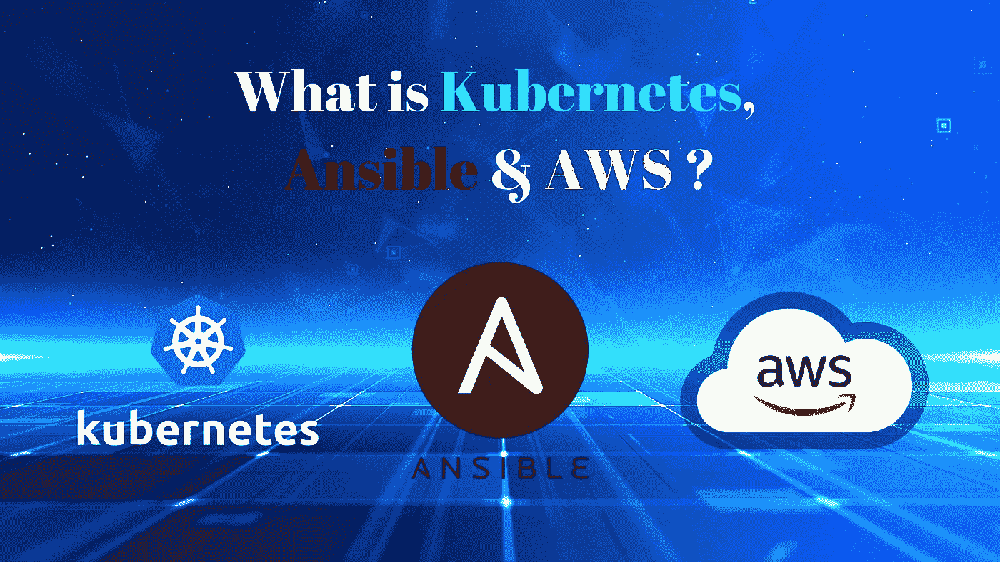
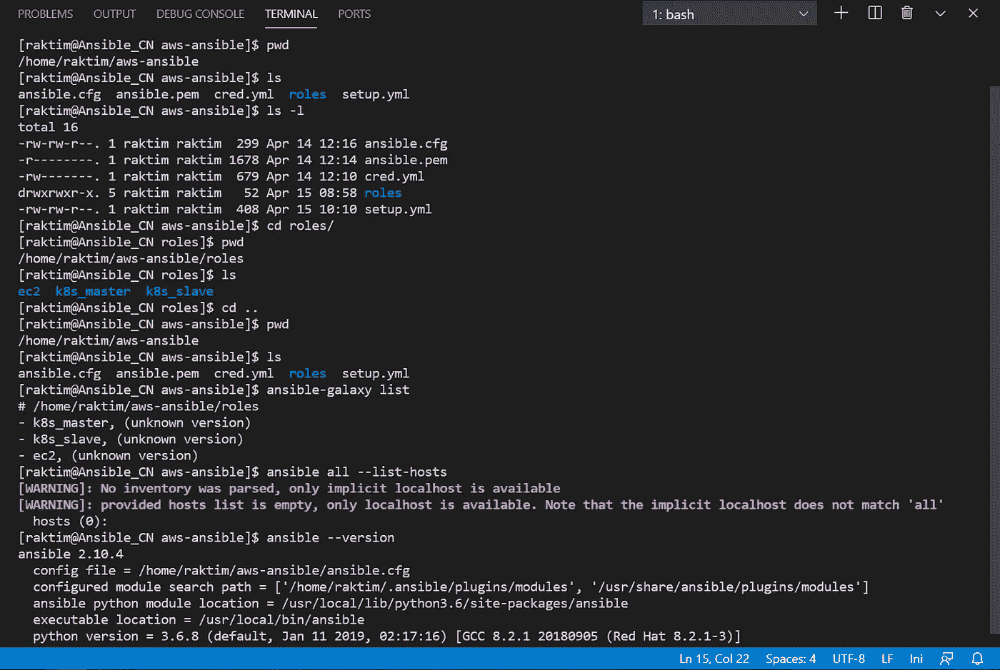
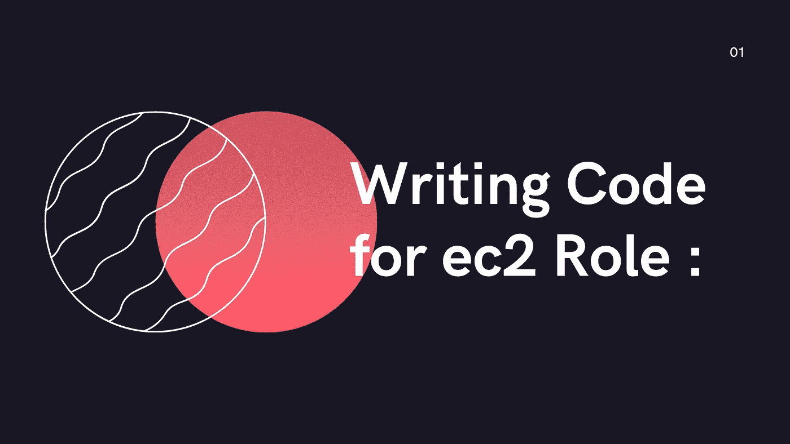
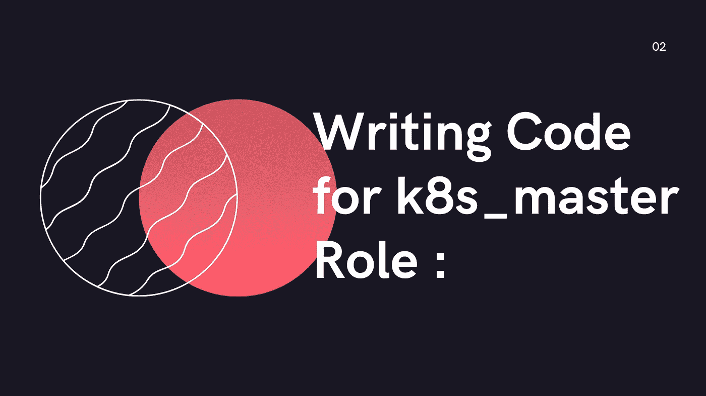
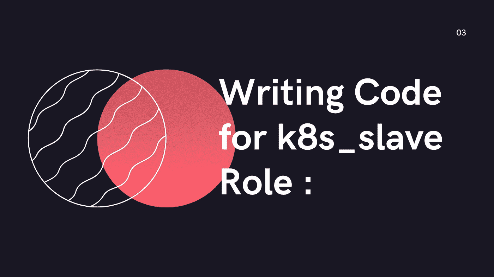
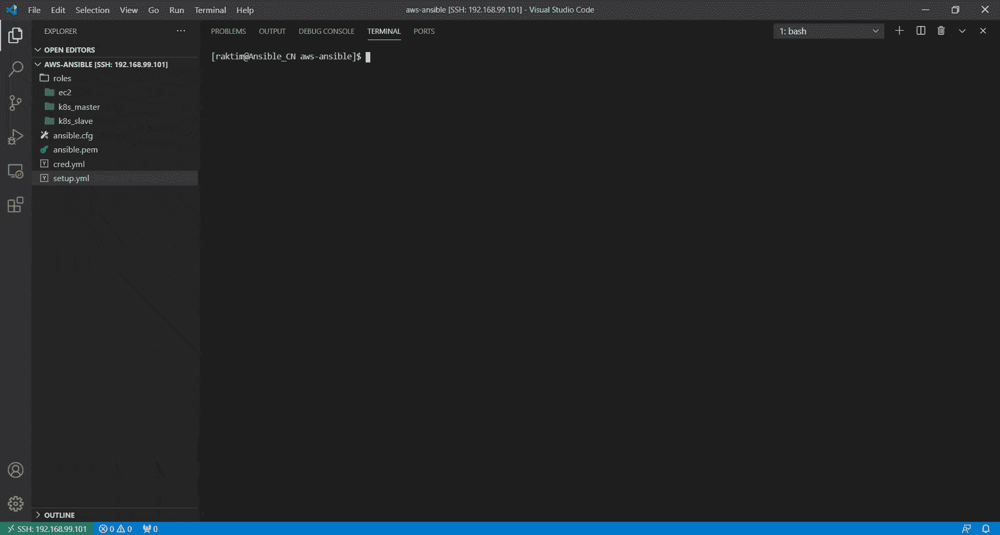

# 使用 Ansible Automation 在 AWS 上部署多节点 Kubernetes 集群

> 原文：<https://medium.com/geekculture/deploying-multi-node-kubernetes-cluster-on-aws-using-ansible-automation-7d8a5eb25c53?source=collection_archive---------3----------------------->


Created by Raktim

## 有没有想过——为什么在当今的技术世界中“学习多种技术并集成它们对工程师来说很重要”？或者，当你有了在 AWS、Ansible & Kubernetes 上工作的知识和技能，你能做什么？让我们试着找出这些答案…

# 为什么是多种技术？


Source: Google

> 让我向您介绍一下我学习多种技术的旅程&我得到了什么结果。

*   1 年前开始学习 **Linux & Docker** 。花了将近 **1 到 2 个月**才掌握这些技术的大部分概念。然后我开始学习 **Kubernetes** &又花了 **2 个月**去练习&探索 Kubernetes 所有可能的方面。

> **注:**你可能在想**为什么要花 4 个月的时间来学习 Docker、K8s、Linux 这些简单的技术。但是有趣的是，我同时学习很多东西，所以我不会对一件事感到厌倦。目前我从事 ML、DevOps、MLOps、CC、大数据、Web &移动开发、全栈开发&等等。**

*   然后我开始学习 **Ansible** ，**当今业界要求最苛刻的自动化工具之一。我开始自动化配置任务的时刻终于到来了。**最有趣的任务之一是使用 Ansible 建立多节点 kubernetes 集群。**在本地虚拟机上完成这项任务非常有趣。**
*   然后我开始学习 AWS，花了 4 个多月的时间学习那里的许多服务。使用 Terraform & Ansible 自动化 AWS 供应任务的时刻终于到来了。我实际上很喜欢做这些任务&完成后，与全世界分享我的作品感觉棒极了:)

> ***长话短说*** *—我们总觉得要拘泥于一个领域或一项技术。获得体面的工作很好，但在当今的行业中，无论我们实施什么，我们都在从云计算中获取资源，我们希望消除所有的手动任务。* *所以，* ***学习 CC & DevOps 自动化很重要&同样将它们整合起来也重要得多。***

# 什么是 Kubernetes，Ansible & AWS？



Created by Raktim

*   我百分之百肯定，如果你正在阅读这篇博客，意味着你要么知道这些技术，要么想了解它们。但是这个博客更关注如何整合这些技术，而不是这些技术是什么。所以，如果你是来学习这些技术的，那么我强烈建议你使用下面提到的我的博客…

[](https://raktimmidya.medium.com/getting-started-with-aws-terraform-293e9125dff) [## AWS & Terraform 入门。

### 如何入门使用 Terraform 在 AWS 中构建基础设施？

raktimmidya.medium.com](https://raktimmidya.medium.com/getting-started-with-aws-terraform-293e9125dff) [](/swlh/getting-started-with-ansible-ee31be8c6a75) [## Ansible 入门

### 让我们学习 Ansible 的基础知识以及一个实用工具——使用 Ansible 进行 docker 环境供应。

medium.com](/swlh/getting-started-with-ansible-ee31be8c6a75) [](/swlh/ci-cd-pipeline-using-git-jenkins-kubernetes-ee06da43c5b0) [## 使用 Git、Jenkins & Kubernetes 的 CI/CD 管道

### 在本文中，我将使用 Jenkins、Git 和 Kubernetes 演示持续集成和持续部署…

medium.com](/swlh/ci-cd-pipeline-using-git-jenkins-kubernetes-ee06da43c5b0) 

# 让我们看看问题陈述:

1.  创建可启动 3 个 AWS EC2 实例的角色。
2.  创建一个可行的角色来配置这些实例上的 Docker。
3.  使用 kubeadm 在上面创建的 EC2 实例上创建角色来配置 K8S 主节点和 K8S 工作节点。

## 视频演示:

[](https://www.linkedin.com/posts/raktimmidya_blogging-arth2020-aws-activity-6788451728208482304-G9ed) [## LinkedIn 上的 Raktim Midya 博客#aws #kubernetes #ansible

### 使用 Ansible Automation 在 AWS 上设置 Kubernetes 多节点集群的视频演示…🔥

www.linkedin.com](https://www.linkedin.com/posts/raktimmidya_blogging-arth2020-aws-activity-6788451728208482304-G9ed) 

# 先决条件:

我知道我知道，问题陈述看起来非常简单，但是这个任务并不小。不要担心，因为我会在 15 分钟后讨论我的代码& **的每一点&，你一定会觉得——“哇…这是一个了不起的自动化:)”**

## 但是在进入编码部分之前，这里有一些理解这项任务的基本先决条件…

*   **你肯定需要 AWS EC2 实例的基础知识，可转换角色& Kubernetes 多节点集群。**
*   我使用我的本地 Windows 机器&在那里我使用 Oracle VM box 来运行 Linux 操作系统。在我的虚拟机中，我安装了 Ansible 版本 2.10.4。同样为了使事情更容易，我通过 SSH 将我的 RHEL8 虚拟机与我的 Windows 系统的 VS 代码连接起来。
*   最后，我们需要一个 AWS 帐户&使用 IAM，我们需要创建 AWS 访问密钥和秘密密钥，以便 Ansible 可以登录到我们的 AWS 帐户来启动实例。

## 让我们开始运行命令和编写代码…

# 创建三个角色:

我会把我的职责代码上传到 GitHub 上，你会在博客末尾看到链接。但是如果你想理解代码，那就继续读下去，因为**我会解释代码的每一位……**

*   **创建一个工作空间，比如说“aws-ansible”。**进入这个工作区&创建一个名为“角色”的文件夹。现在进入这个文件夹&运行下面提到的三个命令。

```
ansible-galaxy init ec2
ansible-galaxy init k8s_master
ansible-galaxy init k8s_slave
```

*   记住一件事，它将在 **"aws-ansible/roles/"** 文件夹中创建三个 Ansible 角色&你可以给你的角色取任何你想要的名字，但是**我建议给一些逻辑名字。**

# 设置可行的配置文件:

在 Ansible 中，我们有两种配置文件——全局和本地。**我们将在“aws-ansible”文件夹中创建一个本地配置文件&无论我们将来想要运行什么 ansible 命令，我们都将在这个文件夹中运行。**因为只有 Ansible 能够读取这个本地配置文件&才能相应地工作。

## 因此，在“aws-ansible”文件夹中创建一个名为“ansible.cfg”的文件，并将下面提到的内容放入其中…

*   这里我们可以看到一些常见的关键字，如**、【主机密钥检查】、【命令警告】**等。**我不讨论这些关键词，因为如果你满足我提到的先决条件，那么你肯定知道这些术语。**
*   让我告诉一些新的关键字，如**“private _ key _ file”**，它表示 aws 密钥对。**当 Ansible 通过 SSH 登录 AWS 实例来设置 K8s 时，它需要私有密钥文件**。另外**EC2 实例的默认远程用户是“ec2-user”。**

# 创建 AWS 密钥对并将其放入工作区:

**转到 AWS = > EC2 = > Key-pair &在那里创建一个密钥对——假设是“ansible.pem”。**然后在您的虚拟机工作区中下载密钥。最后运行…

```
chmod 400 ansible.pem
```

# 创建一个用于存储 AWS 凭据的安全存储库:

**最后，在您的工作区运行…**

```
ansible-vault create cred.yml
```

*   它将要求提供一个保险库密码&然后它将打开 Linux 上的 VI 编辑器，在这个文件中创建两个变量&将您的 AWS 访问密钥和秘密密钥作为值。比如说…

```
access_key: ABCDEFGHIJK
secret_key: abcdefghijk12345
```

*   保存文件。现在你终于准备好编写可完成的角色了。

## 仅供参考，运行下面提到的命令，观察下面截图中的输出…



Screenshot of Terminal

# 为 ec2 角色编写代码:



Created by Raktim

## 任务 YML 文件:

**进入文件夹“AWS-ansi ble/roles/ec2/tasks/”&开始编辑“main.yml”文件。在这个文件中写下下面提到的代码…**

*   我知道，我知道这段代码看起来有点大，但是它为我们做了很多事情。让我解释……
*   首先，我们使用**“pip”**模块来安装两个包— **boto & boto3** ，因为这些包能够联系 AWS 来启动 EC2 实例。我使用了一个名为 **"python_pkgs"** &的变量，它的值存储在**" AWS-ansi ble/roles/ec2/vars/main . yml "**文件中。解释完这段代码后，我还会分享那个文件。
*   接下来，我使用**“ec2 _ Group”**模块在 AWS 上创建安全组。虽然我们可以为我们的实例创建一个强大的安全组，但是为了简单起见，我允许所有端口的入口&出口。但是在真实场景中，我们从不这样做。
*   接下来，我使用**“ec2”**模块在 AWS 上启动实例，&这里所有的参数我们都知道。我只想谈谈两个参数——第一个是**“寄存器”**,它将所有元数据存储在一个名为**“ec2”**的变量中，以便将来我们可以从中解析所需的信息。第二个是**“循环”**，它再次使用一个包含一个列表的变量。接下来使用 **"item"** 关键字，我们一个接一个地调用列表值。**这将使用不同的实例标签运行 ec2 模块 3 次，最终将启动 3 个实例。**
*   接下来，我使用了**“add _ host”**模块，该模块能够在运行行动手册时创建一个动态清单。在这个模块中，我使用了**“hostname”**关键字来告诉要存储在动态主机组中的值。在这里，我使用那个**“ec2”**变量&进行 JSON 解析，以找到第一个实例的公共 ip。

> **如果你注意到了，这里我创建了两个主机组——ec2 _ master&ec2_slave&第一个实例属于“ec2 _ master”&第二个，第三个实例属于“ec2 _ slave”主机组。**

*   最后，我运行**“等待”**模块来等待剧本几秒钟，直到所有节点的 SSH 服务都启动。

## 变量 YML 文件:

**打开“AWS-ansi ble/roles/ec2/vars/main . yml”文件&存储我们在“task/main.yml”文件中提到的所有变量及其各自的值。为了便于参考，我附上了文件…**

# 为 k8s_master 角色编写代码:



Created by Raktim

## 任务 YML 文件:

**类似地像上次一样打开“AWS-ansi ble/roles/k8s _ master/tasks/main . yml”文件&** 把下面提到的代码放在那里…

*   这里我们需要在我们的主节点上安装 kubeadm 程序来设置 K8s 集群。因此，我添加了 K8s 社区提供的 yum 存储库。**在这里，因为我对所有实例使用 AWS Linux 2，所以我们不需要为 docker cli 配置存储库。**
*   接下来使用 **"package"** 模块，我们将在主实例上安装 **"Docker "、" Kubeadm" & "iproute-tc"** 包。
*   接下来我使用**“服务”**模块来启动 **docker & kubelet 服务**。这里我再次使用了名为“service_names”的列表上的循环来运行同一个模块两次。
*   接下来，我使用**“command”**模块运行一个 kubeadm 命令，该命令将提取运行 Kubernetes 集群所需的所有 Docker 映像。在 Ansible 中，我们没有任何运行“kubeadm”命令的模块，这就是为什么我使用“command”模块。
*   **接下来我们需要将我们的 Docker 默认 cgroup 改为“systemd”，否则 kubeadm 将无法设置 K8s 集群。**首先使用**“复制”**模块创建一个文件**"/etc/docker/daemon . JSON "**&将一些内容放入其中。接下来再次使用 **"service"** 模块，我们重新启动 docker 来更改 cgroup。
*   接下来，我们使用**“command”**模块初始化集群&，然后使用**模块在主节点上设置“kubectl”命令。**
*   **接下来，我使用“命令”模块在 Kubernetes 集群上部署了法兰绒，以便它创建覆盖网络设置。**
*   第二个“命令”模块也用于获取从属节点加入集群的令牌。**使用“寄存器”,我将第二个“命令”模块的输出存储在一个名为“令牌”的变量中。**现在这个令牌变量包含了我们需要在从节点上运行的命令，以便它加入主节点。
*   最后，我使用“shell”模块来清理主节点上的缓冲区缓存，因为在进行设置时，它会在 RAM 上创建大量临时数据。

## 变量 YML 文件:

**打开“AWS-ansi ble/roles/k8s _ master/vars/main . yml”文件&将变量“service_name”的值存储在列表中……**

# 为 k8s_slave 角色编写代码:



Created by Raktim

## 任务 YML 文件:

**类似于之前打开的“AWS-ansi ble/roles/k8s _ slave/tasks/main . yml”文件&** 将下面提到的代码放在那里…

*   **直到 docker 服务重启任务，这个文件和之前“k8s_master”角色的文件一模一样。在从节点上，我们不需要初始化集群&，也不需要设置 kubectl。**其余的事情我们需要做，因为在从节点中我们也需要“kubeadm”命令& Docker 作为容器引擎。
*   接下来，我使用 **"copy"** 模块创建一个名为**"/etc/sysctl . d/k8s . conf "**的配置文件，这将允许从机启用某些网络规则。接下来要启用规则，我们需要重新加载**“sysctl”**&，因为我使用了**“command”**模块。

## 现在最有趣的部分来了…

*   如果您还记得，我们在之前的**角色中使用了**“token”**变量来存储从机加入集群**的令牌命令。现在，每个角色都有自己单独的名称空间来存储变量。因此，我们需要转到我们动态创建的上一个主机组的命名空间。
*   为此，我们在其中使用了**“hostvars”**关键字&，我们称之为“ec2_master”主机组。接下来，在这个主机组中，我们可以有多个主机(节点)。要选择第一台主机，我们使用“[0]”选项。**这意味着最后“hostvars[groups[' ec2 _ master '][0]]”选项正在调用主节点的命名空间。**
*   **接下来使用“['token']['stdout']”我们刚刚解析了可以在 slave 中使用的加入主节点的命令。**

> **注意:这里我们需要创建与我们在“k8s_master”角色上创建的相同的“vars/main.yml”文件。**

# 最后，创建安装文件:

*   现在终于到了创建 **"setup.yml"** 文件的时候了，我们将运行该文件在 AWS 上创建整个基础设施。**记住一件事，我们需要在文件夹“aws-ansible”中创建这个文件。**作为参考，我在下面附上了文件…

*   如您所见，我们正在本地主机上运行第一个**“ec2”**角色，因为**它将从本地主机联系 AWS API。**同样使用**“vars _ files”**我将**“cred . yml”**文件包含在该任务中，以便“ec2”角色可以访问它。
*   **在接下来的两个步骤中，我们分别在“ec2 _ master”&“ec2 _ slave”动态主机组上运行“k8s _ master”&“k8s _ slave”角色。**

## GitHub 参考库:

[](https://github.com/raktim00/Kubernetes-Multi-Node-AWS-Ansible) [## rak Tim 00/Kubernetes-多节点-AWS-Ansible

### 使用 Ansible 脚本自动化在 AWS EC2 实例上设置 Kubernetes 多节点集群…

github.com](https://github.com/raktim00/Kubernetes-Multi-Node-AWS-Ansible) 

> **编码部分到此为止。现在是运行剧本的时候了。为此，在“aws-ansible”文件夹中运行下面提到的命令。**

```
ansible-playbook setup.yml --ask-vault-pass
```

*   接下来，它将提示您传递您的 Ansible Vault (cred.yml 文件)的密码，提供密码&然后**您将看到自动化的力量……**



# 最后的话:

*   **学习 Ansible、Kubernetes、AWS 有无限的未来可能。这只是一个简单的 Ansible 角色演示，但是如果你愿意，你可以通过添加更多的模块来创建更多更大的基础设施。我们可以使用 Ansible 实现的每一种配置。**
*   **下面是本练习第二部分的链接，我通过添加 NFS 服务器角色&在 Kubernetes 上部署 Wordpress 角色……**来扩展整个架构

[](https://raktimmidya.medium.com/provisioning-kubernetes-mna-nfs-server-wordpress-on-aws-using-ansible-automation-3da82155c296) [## 使用 Ansible Automation 在 AWS 上提供 Kubernetes MNA、NFS 服务器和 Wordpress

### 今天的世界是关于 DevOps 工具和技术的。但是为什么呢？了解如何整合 AWS 的所有知识…

raktimmidya.medium.com](https://raktimmidya.medium.com/provisioning-kubernetes-mna-nfs-server-wordpress-on-aws-using-ansible-automation-3da82155c296) 

> **需要 3 天时间&启动 50 多个实例&终止测试&编写这些脚本。过去一年的持续学习。所以，如果你喜欢这个博客，请留下评论，为更多即将到来的博客鼓掌。**

*   **我试图让它尽可能简单。**希望你从这里学到了一些东西。请随意查看下面提到的我的 LinkedIn 个人资料…

[](https://www.linkedin.com/in/raktimmidya/) [## Raktim Midya -微软学生学习大使(测试版)-微软| LinkedIn

### ★我是一名技术爱好者，致力于更好地理解不同热门技术领域背后的核心概念…

www.linkedin.com](https://www.linkedin.com/in/raktimmidya/) 

**感谢大家的阅读。就这样…结束…😊**

