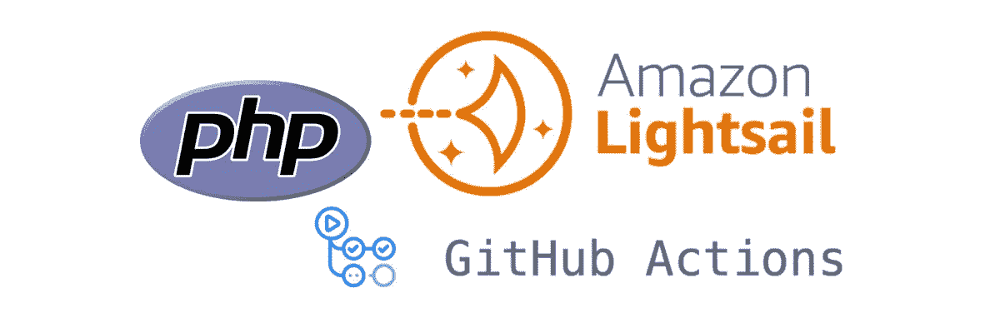
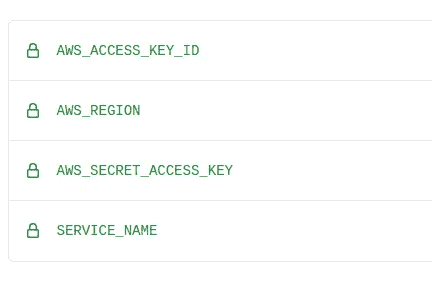

# 使用 Github 操作在 Amazon Lightsail 中部署 PHP-App-as-a-Container 服务

> 原文：<https://medium.com/geekculture/deploying-php-app-as-a-container-services-in-amazon-lightsail-with-github-actions-edbe68fcb45d?source=collection_archive---------28----------------------->

作者:[奈迪姆·哈德济马穆托维奇](https://github.com/neidiom)



AWS Lightsail containers 服务是一种新的、简单的部署容器的方式。有了 Lightsail，你不需要担心注册表、服务、健康检查、主机名等。—因为一切都是内置的。

# 我们的应用

在本例中，我们将部署一个虚拟 PHP 应用程序并运行两个容器:

*   NginX 容器
*   PHP 容器

我甚至提供了一个虚拟的 composer 文件，以便我们可以安装依赖项。

# NginX 容器

这个 docker 文件复制预先配置的 NginX 配置文件，并设置常用的内容，例如:

*   webroot，
*   启用 gzip，
*   增加大小限制，这样我们就不会得到通常的超时，
*   当然，最重要的事情是:将 php 文件传递给 PHP 容器(它监听端口 9001)。

有关更多详细信息，请参见下面的链接文件。

[Dockerfile](https://github.com/ClearView/aws_lightsail/blob/master/infra/Dockerfile.nginx)

# PHP 容器

该 does 文件执行以下操作:

*   使用最新的 Composer Docker 映像将 Composer 二进制文件复制到 PHP 映像，
*   安装 PHP 版本 8 和所需的扩展，
*   设置 php.ini 中的常用参数，
*   显示了构建过程中安装的 php 模块(非常适合调试)，
*   将 PHP-FPM 端口从标准的 9000 更改为 9001，
*   运行 composer 安装命令，
*   使用自定义入口点脚本，这对于错误调试非常有用，因为您可以稍后添加自定义命令(将在容器启动时运行)。

[Dockerfile](https://github.com/ClearView/aws_lightsail/blob/master/infra/Dockerfile.php)

# Lightsail 设置

通过 *awscli* 创建服务。我们必须选择:

*   服务的名称，
*   服务的能力(内存和 vCPU)，
*   服务的规模(运行容器的计算节点的数量)。

在本例中，我们将添加一个名为 my-lightsail-container-service 的服务，它具有 nano 的功能，我们将把它扩展到一个计算节点实例。

*注意:有时部署会因为缺乏资源而失败；在这种情况下，提高服务的能力。*

```
aws lightsail create-container-service \
— service-name my-lightsail-container-service \
— power nano \
— scale 1 \
— output yaml
```

*注意:您需要添加服务名作为 Github 秘密，以便通过 Github 动作进行部署。*

让我们检查一下:

1.  如果已经创建了服务
2.  它的状态
3.  公共端点。

```
aws lightsail \
get-container-services \
— output yaml
```

*注意:您需要在本地 comp 上安装 awscli 并设置凭证，以上命令才能工作。*

# Github 操作设置

# 秘密设置

第一步是为 AWS 身份验证设置 Github 秘密，并设置将在 AWS Lightsail 上创建的容器服务名称。

为此，创建以下秘密，如下图所示:

*   AWS_ACCESS_KEY_ID
*   AWS_SECRET_ACCESS_KEY
*   AWS_REGION
*   服务名称



# 工作流程

GitHub 操作由两个文件组成:

*   运行操作的 CI/CD 工作流文件，
*   容器部署模板。

## CI/CD 工作流文件

工作流程中的步骤如下:

*   升级转轮上的 *awscli* 并安装 *lightsailctl* ，
*   配置 AWS 凭证，以便我们能够部署，
*   构建 Docker PHP 映像，
*   构建 Docker NginX 映像，
*   列出了滑道上的 Docker 图像，
*   推送 Docker PHP 图片，
*   推送 Docker NginX 图像，
*   从 Lightsail 获取 Docker 图像，
*   从 Lightsail 获取最新的 NginX Docker 图片，
*   从 Lightsail 获取最新的 PHP Docker 图片，
*   从 Lightsail 获取最新的 PHP Docker 图片，保存到 LATEST _ PHP _ light sail _ Docker _ Image 变量中，
*   从 Lightsail 获取最新的 NGINX Docker 图片，保存到 LATEST _ NGINX _ light sail _ Docker _ Image，
*   创建 container_with_image.yml 并用 LATEST _ PHP _ light sail _ DOCKER _ IMAGE 和 LATEST _ NGINX _ light sail _ DOCKER _ IMAGE 中的值填充它，
*   展开光帆，
*   调试 PHP 容器日志，
*   调试 NginX 容器日志。

[CI/CD_Workflow](https://github.com/ClearView/aws_lightsail/blob/master/.github/workflows/build_and_deploy.yml)

## 容器部署文件

这个文件定义了 AWS Lightsail 解析的最终结果。它采取了上述所有步骤才到达这里；我们有部署文件的最终版本。

该文件定义了以下内容:

*   服务名称，
*   具有最新映像版本的容器，
*   每个容器的环境变量，
*   哪个容器将被用作公共端点，
*   健康检查。

[Container_Deployment](https://github.com/ClearView/aws_lightsail/blob/master/.github/workflows/container.yml.tpl)

# 关闭

在本教程中，我们详细演示了如何使用 Github 操作将流行的 Github 平台上托管的 PHP 应用程序部署到 AWS Lightsail 容器服务，以及如何调试已部署的容器。我们希望您在使用 AWS 的这项新技术时会感到愉快，这项技术让容器离更广泛的受众更近了一步。

在这篇文章的最后，我们将分享到 Clearview 的 AWS Lightsail Github 库的链接。