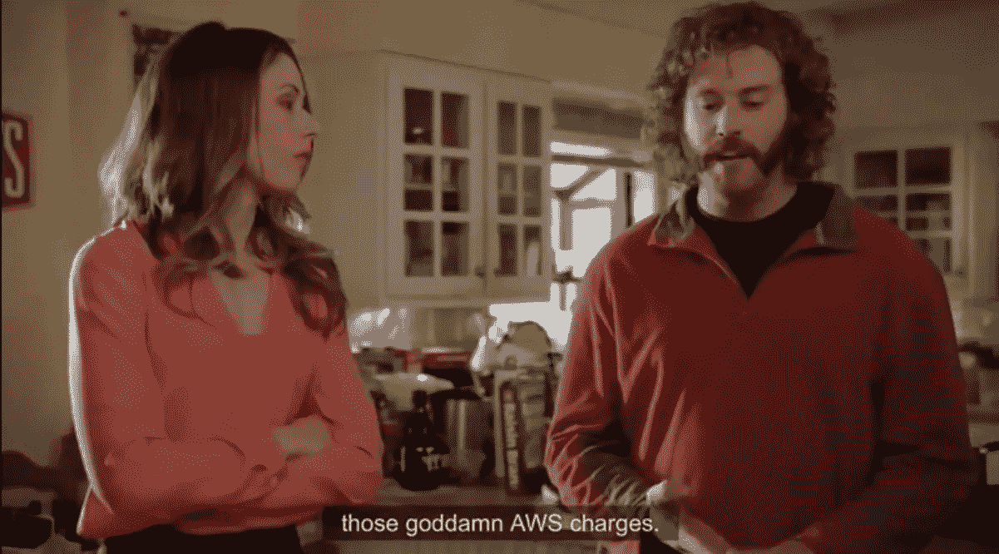
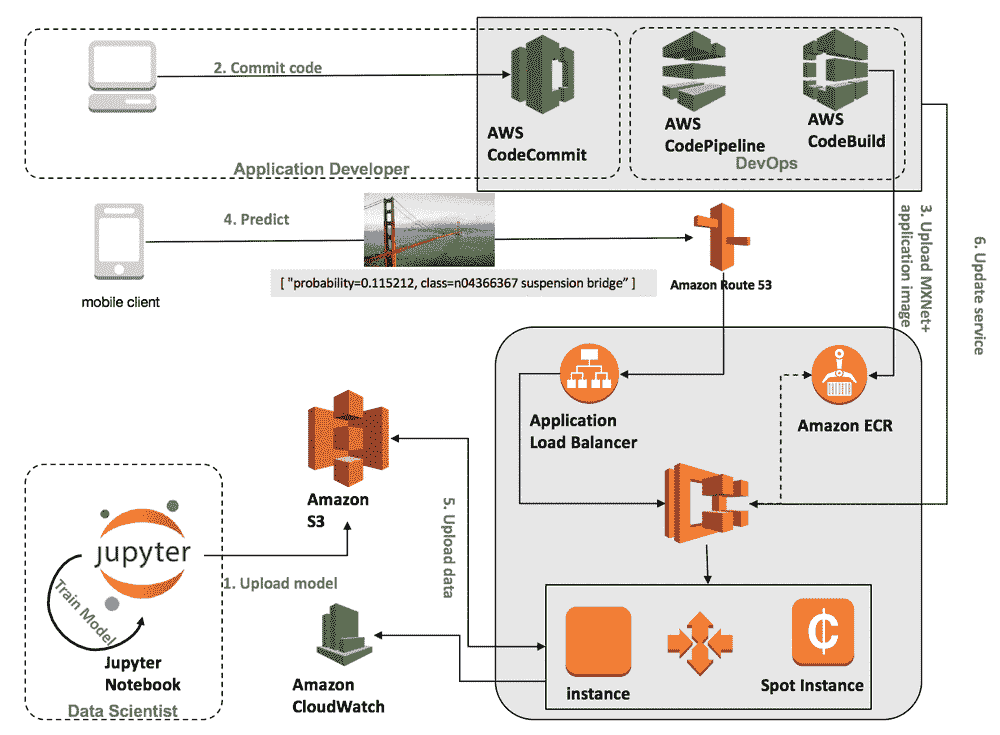
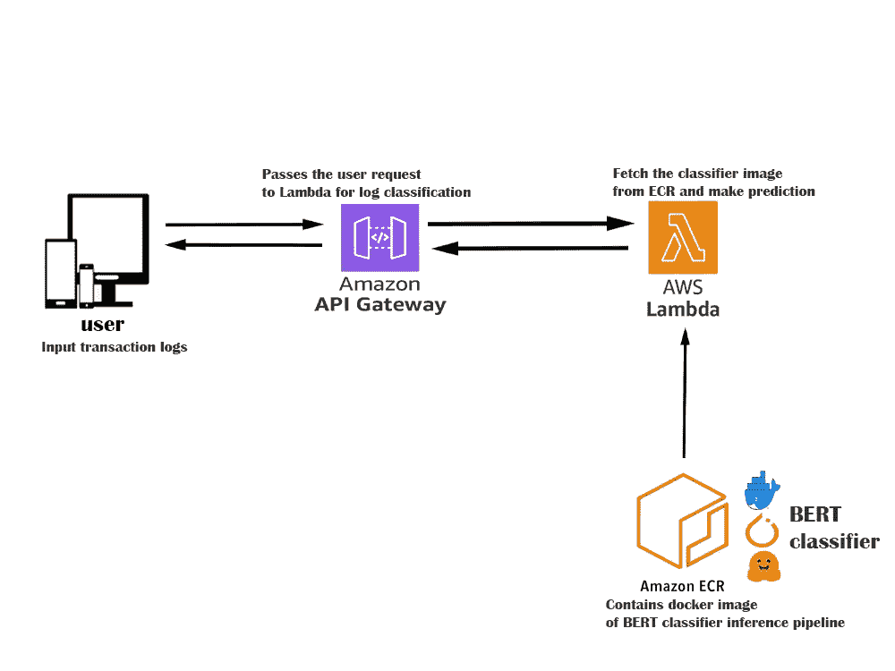
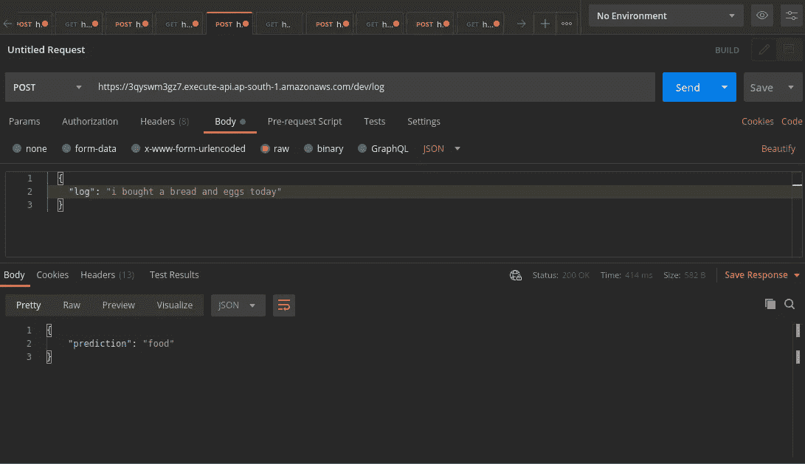
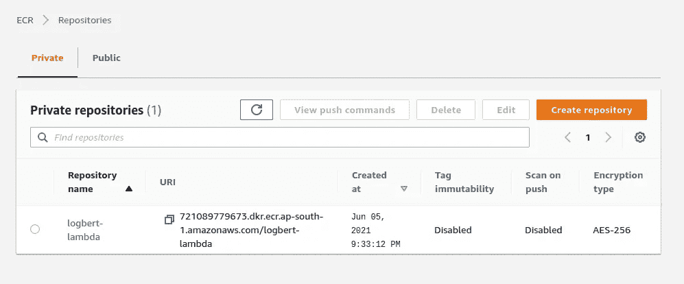
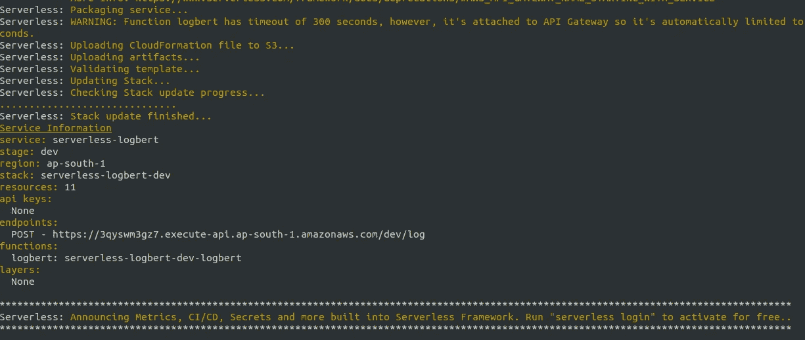
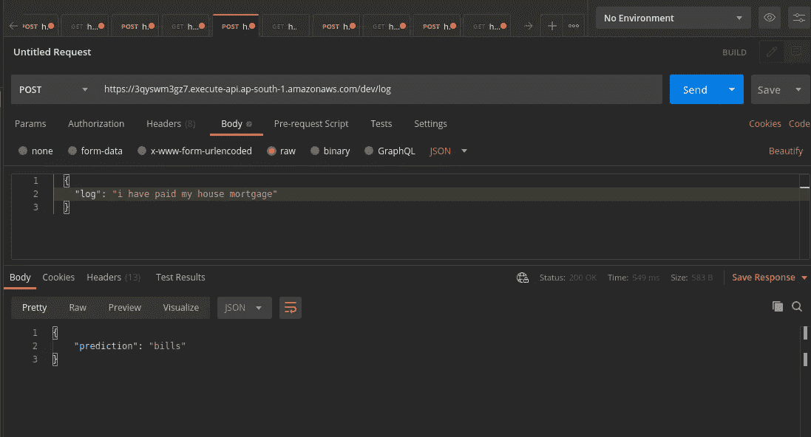

# 将 PyTorch 模型部署为无服务器服务

> 原文：<https://medium.com/geekculture/deploying-pytorch-model-as-a-serverless-service-339b4b93e517?source=collection_archive---------5----------------------->


[https://unsplash.com/photos/JT1AI1nKWhg](https://unsplash.com/photos/JT1AI1nKWhg)

由于深度学习生态系统中的最新进展，如改进的框架、生产就绪型架构、预训练模型...等等。现在，构建一个像样的模型很容易(并不真的😅)，但之后出现的最大问题是 ***“我已经建立了一个模型，下一个是什么？”***

一个模型的好坏取决于它能为客户提供什么样的用途，所以为了使一个模型有用，它应该以一种非常经济有效的方式服务于数百万用户。现在，我们如何向用户提供或部署模型呢？
很简单，我们可以利用任何常见的云平台，如 AWS、GCP、Azure 等，按需获取数据存储和计算能力。对于本教程，我们将使用 AWS 云平台。



silicon valley series S4E4

**生活中最好的东西是免费的，但 AWS 资源却不是。云定价即使非常有竞争力，也可能成为工程师构建可扩展和资源密集型产品的障碍。**在构建具有人工智能功能的 MVP 时，建立一个专用的实例基础设施是一项自杀任务**，因为我们不知道用户保留率、产品在市场中的接受度以及产品带来的收入..等等。由于几个原因，使用专用云基础架构从头构建这些堆栈是一项昂贵的任务，我们将很快讨论这些原因**。** 所以一个典型的深度学习 API 栈会是这样的:**



credit: AWS

正如我们所看到的，这是一个非常复杂的堆栈，这种基础设施的缺点是:
1。我们必须管理集群—其规模、类型和扩展逻辑
2。客户端必须为未使用的服务器电源付费
3。我们必须管理容器逻辑——日志记录、多个请求的处理等。需要大量云架构方面的专业知识

为了解决专用云基础设施的缺点，云提供商提出了无服务器服务(例如:AWS Lambda)，其主要吸引力在于，**我们不必管理任何服务器，并且我们按功能执行的数量而不是按小时计费**(每月 100 万个免费请求)。
由于无服务器(AWS Lambda)生态系统的最新进展，如容器支持、内存改进...等等，为所有深度学习实践者利用 Lambda stack 将模型部署为推理 API 开辟了许多机会。
**所以今天我们将部署一个 PyTorch 模型，作为利用 Lambda、ECR 和无服务器框架的无服务器 API。**

***这是我的第一个故事，我非常兴奋地谈论所有的利基细节*** 😅 ***。所以如果你们想直接进入代码，请查看我的***[***GitHub repo***](https://github.com/anandsm7/BERT_as_serverless_service)

[](https://github.com/anandsm7/BERT_as_serverless_service) [## Anand sm 7/BERT _ as _ server less _ service

### BAAS - BERT 即服务，我们将使用无服务器基础架构部署经过培训的 BERT 模型。以上…

github.com](https://github.com/anandsm7/BERT_as_serverless_service) 

在本教程中，**我们将使用 BERT 部署一个简单的文本分类模型🤗它将日常用户交易日志分类为“食物”、“交通”、“账单”等类别..并将其作为一个 API** 。我将详细介绍以下主题:
1 .关于所有正在使用的资源的简要说明
2。构建我们的模型推理管道。使用无服务器框架创建 Lambda 函数
4。将我们的推理管道与 lambda 函数
5 结合起来。构建一个 docker 映像并在本地测试我们的 API
6。标记图像并将其部署到 AWS ECR
7。使用 AWS ECR
8 中部署的映像部署 lambda 函数。最后，使用无服务器 API 进行模型推理


That’s too much work 😖 — giphy

*   **AWS Lambda 服务** —“能力越大，责任越小”
    [AWS Lambda](https://docs.aws.amazon.com/lambda/latest/dg/welcome.html) 基本上是一种让你在云服务器上运行功能而无需实际管理任何服务器的服务。如前所述，管理服务器从来都不是一件容易的事情。有了无服务器，我们就不必考虑基础设施的可伸缩性和健壮性，因为 AWS 会替我们处理。
    与 ECR 等 AWS 资源沟通..etc 编程时我们需要安装 AWS CLI，请按照[说明](https://docs.aws.amazon.com/cli/latest/userguide/install-cliv2.html)进行操作
*   **无服务器框架** [无服务器](https://www.serverless.com/)框架让你使用 [AWS Lambda、](https://aws.amazon.com/lambda/) [S3](https://aws.amazon.com/s3/) 、[亚马逊 API 网关](https://aws.amazon.com/api-gateway/)…等服务快速构建和部署无服务器应用。这个框架利用 [AWS cloudformation](https://aws.amazon.com/cloudformation/) 来使用 YAML 配置文件启动构建我们的推理 API 所需的所有资源。
    要安装无服务器框架，请遵循此[说明](https://www.serverless.com/framework/docs/providers/aws/guide/installation/)，并确保遵循[指南](https://www.serverless.com/framework/docs/providers/aws/cli-reference/config-credentials/)使用您的 AWS 秘密访问密钥配置无服务器。
*   **AWS ECR —** Docker🐳这就是你所需要的一切[Amazon Elastic Container Registry](https://aws.amazon.com/ecr/)(ECR)是一个完全托管的容器注册中心，可以方便地在任何地方存储、管理、共享和部署你的容器映像和工件。因此，我们基本上构建了分类器管道的 docker 映像，并将其存储在 AWS ECR 中。



API stack infrastructure

我们完整的 API 架构如上所示，这里用户用他的一个日常事务日志发出一个 API 请求，这个日志通过 AWS API 网关传递，这个请求将启动 Lambda 函数。对于我们的初始请求，lambda 启动一个 10GB 的 pod，并从 ECR 获取 docker 映像来启动我们的分类器容器。docker 映像由模型+推理脚本组成，**将模型保存在对象存储中是一种更好的方法，但为了简单起见，现在我们可以采用这种方法**。因此，基于用户查询，lambda 函数执行模型推断并返回最终的事务类，如下所示:



既然我已经解释了整个过程，现在我们可以用代码弄脏我们的手了。我不会解释整个 BERT 分类器模型训练管道，因为这不是这篇博客的目的。可以查看我的 [**colab 笔记本**](https://colab.research.google.com/drive/1IAJrx15szXsGDjKx1qihrvzAWqp2exz5?usp=sharing) 来训练用户日志分类模型。训练过程完成后，您将获得一个 **pytorch_model.bin** 文件，我们将使用它作为构建无服务器 API 的模型。

现在我们将使用无服务器 CLI 命令创建一个 python lambda 函数

```
serverless create — template aws-python3 — path serverless-logbert
```

上面的命令将使用一个基本的 python 处理程序脚本创建一个简单的样板文件，serverless.yml，requirements.txt..等等。因为我们正在使用 pytorch 框架构建深度学习文本分类模型，所以我们需要一些需要安装的包，所以让我们将它们添加到 requirements.txt 中。因为我们没有利用 GPU 进行推理，所以我们可以使用最小化的 pytorch cpu 版本来节省存储。

现在让我们直接跳到我们的处理函数，Lambda 函数*处理函数*是您的函数代码中处理事件的方法。当您的函数被调用时，Lambda 运行处理程序方法。当处理程序退出或返回响应时，它就可以处理另一个事件了。我们的处理程序代码如下:

在上面的代码中，sentence_prediction()方法接受用户输入，进行预处理、标记化并传递给经过训练的 BERT 模型，该模型又返回最终的预测。当前，该函数返回具有最高置信度得分的预测类。你可以在这里检查推理代码

现在我们已经准备好使用 docker 在本地测试我们的推理 API。确保 docker 安装在您的本地机器上以测试 API，请查看 [docker 安装指南](https://docs.docker.com/engine/install/)。Dockerfile 如下:

现在让我们构建 docker 映像并运行容器进行测试

```
docker build -t logbert-lambda .
docker run -p 8080:8080 logbert-lambda
```

我们现在准备在本地测试我们的 API。
URL 端点应该采用以下格式。{主机名}/{ lambda-API-version }/函数/函数/调用


local API testing

如果它在 docker 中工作，那么它应该在其他任何地方工作，所以我们的大部分工作已经完成。为了让 Lambda 函数获取这个图像，它应该被部署到 AWS ECR(弹性容器注册中心)。作为第一步，我们需要创建一个 repo 来保存我们的 docker 映像，这可以使用 AWS CLI 以编程方式完成，如下所示:

```
aws ecr create-repository — repository-name logbert-lambda
```

为了推送我们的图像，我们应该首先需要从我们的机器登录到 ECR，这需要一些标识符，如 AWS 区域和 AWS 帐户 id，我们可以从 AWS IAM 获得。

我们现在可以使用以下命令登录 ECR:

```
aws_region=ap-south-1
aws_account_id=<12 digit id>aws ecr get_login-password \
 — region $aws_region \
| docker login \
 — username AWS \
 — password-stdin $aws_account_id.dkr.ecr.$aws_region.amazonaws.com
```

在将我们的图像推送到 ECR 之前，我们需要记住，默认情况下，所有 docker 图像都被推送到 Docker Hub，但这里我们需要将其推送到 AWS ECR，以便 lambda 函数获取我们的图像。为此，我们需要将其标记或重命名为一种格式，以便将其推送到相应的 ECR repo。其格式如下:
`{AccountID}.dkr.ecr.{region}.amazonaws.com/{repository-name}`

```
docker tag logbert-lambda $aws_account_id.dkr.ecr.$aws_region.amazonaws.com/logbert-lambda
```

让我们使用" *docker image ls"* 命令来检查我们的 docker image 列表，我们将能够看到具有上述格式标签的 docker image。现在，我们已经准备好将我们的形象推向 ECR。

```
docker push $aws_account_id.dkr.ecr.$aws_region.amazonaws.com/logbert-lambda
```

我们已经到了教程的最后阶段，那就是**使用我们的自定义映像**部署 AWS Lambda。现在我们必须编辑我们的 serverless.yml 文件，它是在我们创建 lambda 函数时作为样板文件创建的。下面的 yml 文件让您配置在部署 lambda 函数时需要启动的 AWS 资源。

ECR 让我们的生活变得超级简单，因为我们只需要传递 url 路径和摘要路径，这样 lambda 就可以在启动服务时提取我们本地测试的图像。**我们可以使用 AWS CLI 获取 URL 路径，也可以直接从 ECR 控制台**中复制，在新创建的 repo 中可以找到**摘要。确保用我们各自的 URL 路径和摘要替换图像路径。**



ECR repo url

现在，我们已经准备好使用以下命令部署 lambda 函数:

```
serverless deploy
```

上面的命令将启动所有资源，如 AWS API 网关、lambda 函数、s3 bucket..使用 API 运行所需的 AWS cloudformation。一旦部署过程完成，我们将得到如下所示的一些日志



serverless deployment process

我们差不多完成了[😁](https://apps.timwhitlock.info/emoji/tables/unicode#emoji-modal)现在让我们做有趣的部分，是的，测试我们新构建的 API。让我们再次回到 postman，使用我们从上面的无服务器部署日志中获得的 URL，并对其进行测试。



Its working [😅](https://apps.timwhitlock.info/emoji/tables/unicode#emoji-modal)

是啊。，它像预期的那样工作，只花了半秒钟就得到响应，这也是 CPU 的推断。


It ‘s working [😄](https://apps.timwhitlock.info/emoji/tables/unicode#emoji-modal)— GIFY

这种无服务器的 API 基础设施有利有弊，最大的好处是它可以自动扩展到数千个并行请求，而不会出现任何问题。因此，我们不必担心自己构建一个可扩展且健壮的架构(这意味着没有人会在半夜打电话给你来解决服务器过载问题😴 🤯).
同时，由于冷启动问题，它**不太适合构建生产就绪的任务关键型 API，但这可以在一定程度上通过使用 AWS CloudWatch 来保持我们的 lambda 服务温暖来纠正。**GPU 目前无法用于 AWS lambda** ，这令人非常失望😞对于所有深度学习的人来说，我们可以希望在未来的迭代中看到这样的功能。当谈到以一种非常经济有效的方式构建基于人工智能的 MVP(最小可行产品)时，无服务器基础设施的未来看起来很光明。**

希望你们觉得这个故事有用。随时欢迎建议和批评。感谢[😁](https://apps.timwhitlock.info/emoji/tables/unicode#emoji-modal)

**参考文献
*****[*https://www . philschmid . de/multilingual-server less-xlm-Roberta-with-hugging face*](https://www.philschmid.de/multilingual-serverless-xlm-roberta-with-huggingface)
***[*https://AWS . Amazon . com/blogs/machine-learning/deploying-machine-learning-models-as-server less-APIs/*](https://aws.amazon.com/blogs/machine-learning/deploying-machine-learning-models-as-serverless-apis/)