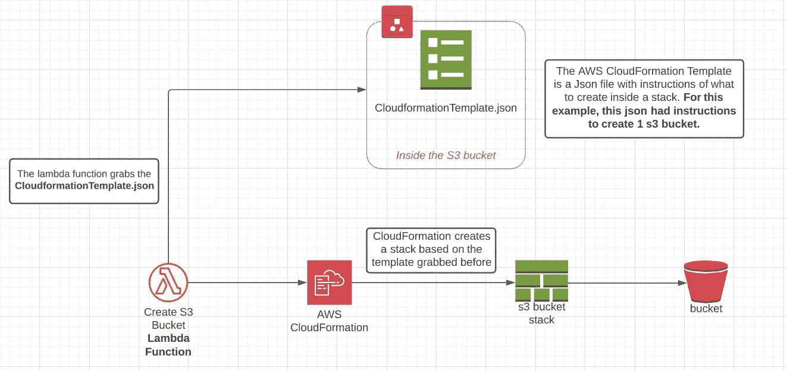
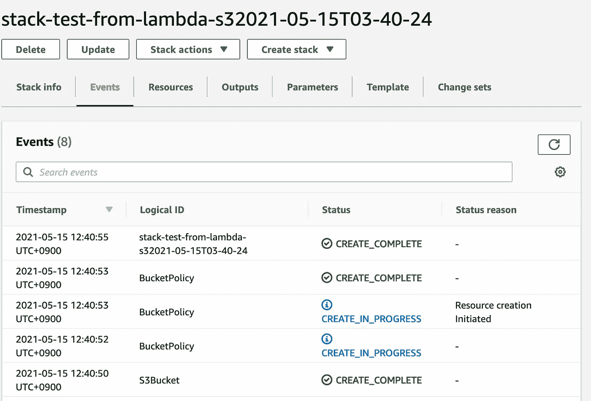
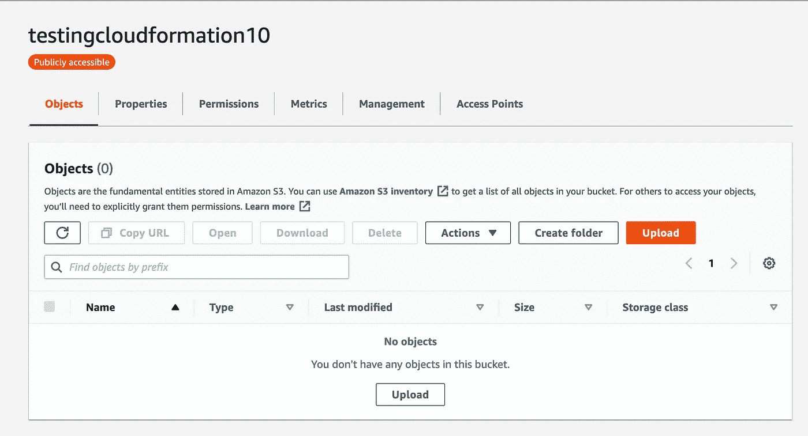

# 使用 Lambdas 通过 IaaC 部署资源

> 原文：<https://medium.com/geekculture/deploying-resources-with-iaac-using-lambdas-d987d39b6251?source=collection_archive---------23----------------------->

你有没有想过是否有可能通过 lambdas 使用 AWS CloudFormation 以代码的形式创建、管理和部署*基础设施？*

在研究这条路线时，我想到的一些好处是:

1.  对您的基础架构上正在创建、修改或删除的内容进行精细控制。
2.  更容易迁移到另一个供应商。
3.  更快地同时部署多种资源。
4.  都包装在 AWS 堆栈中。

# 最初的方法

用 Lambda 在 AWS 帐户上创建资源带来了一些想法。我测试的是这条路:

*   存储在桶中的 json 模板文件。
*   一个 lambda 将运行并读取桶中的 json 文件
*   lambda 将与 AWS CloudFormation“对话”,并发送一些参数来创建一个堆栈。其中一个参数是 **json 模板**。
*   AWS CloudFormation 将创建 json 模板上指定的资源。

# 测试时间！

首先，您需要将 json 模板放入一个桶中。请随意复制我在这里使用的那个:

[https://github . com/wifi wolfg/lambda-iaac/blob/main/S3 template . JSON](https://github.com/wifiwolfg/lambda-iaac/blob/main/s3template.json)

这将创建一个带有公共 s3 存储桶的堆栈，准备托管一个网站。这个文件被保存为 s3 bucket 中的 **s3template.json** 。您需要的参数是对象 URL。

# 拉姆达

为了这个测试，我在 python 上创建了一个 Lambda。您可以从这里下载:

[https://github . com/wifi wolfg/lambda-iaac/blob/main/lambda-params . py](https://github.com/wifiwolfg/lambda-iaac/blob/main/lambda-params.py)

或者如果您喜欢从这里复制它，它看起来是这样的:

> ***重要:*** *为了实现这一点，当我创建 lambda 时，附属于它的角色需要权限来读取 S3 资源和对* CloudFormation *资源进行写操作。*

您可以注意到 *Template_URL* 指向包含 json 的 s3 对象 URL。

# 结果

我们可以进入 CloudFormation，看到堆栈已成功创建。

然后，如果你去 s3，你将能够找到新的桶。

# 结论

我们能够有一个 lambda，它可以以多种方式触发，然后它将使用 CloudFormation 创建资源，并拥有 IaaC。

在很多用例中，这非常有用。你认为你能如何使用这个？

*原载于 2021 年 5 月 9 日 https://mirairo.net**的* [*。*](https://mirairo.net/deploy-s3-iaac-lambdas-aws/)