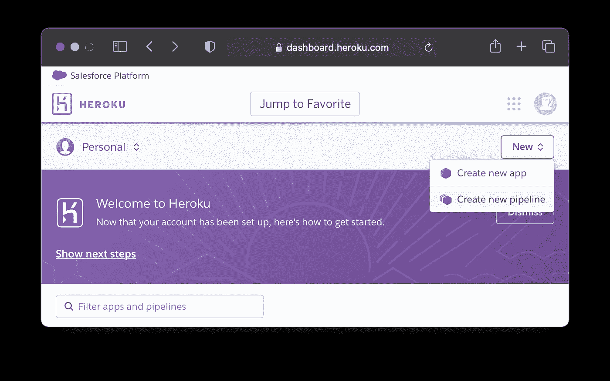
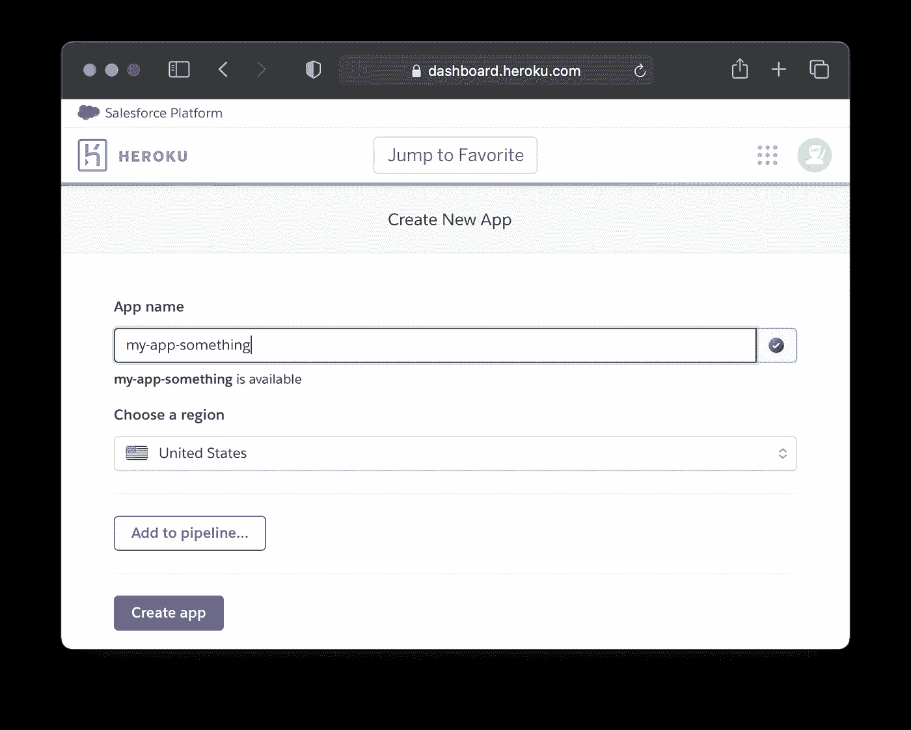
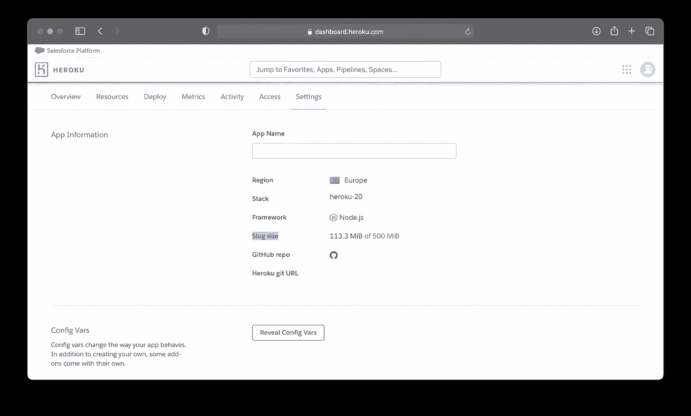
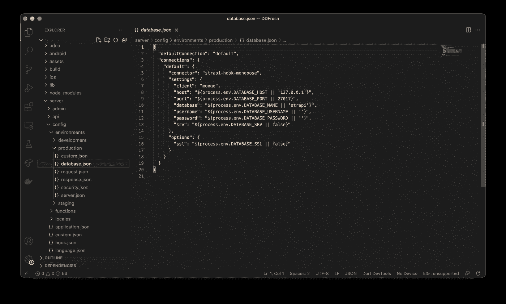
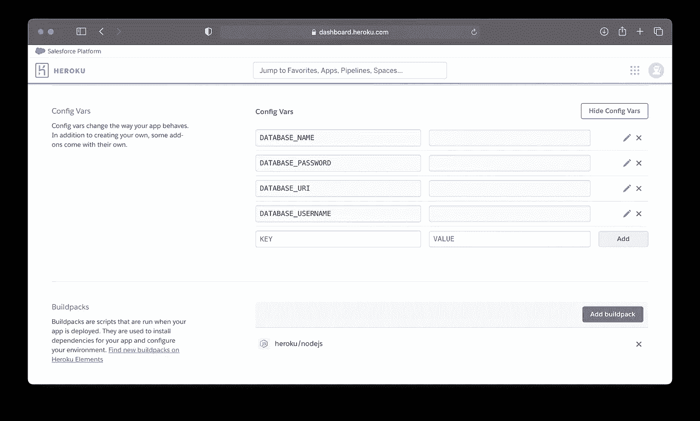
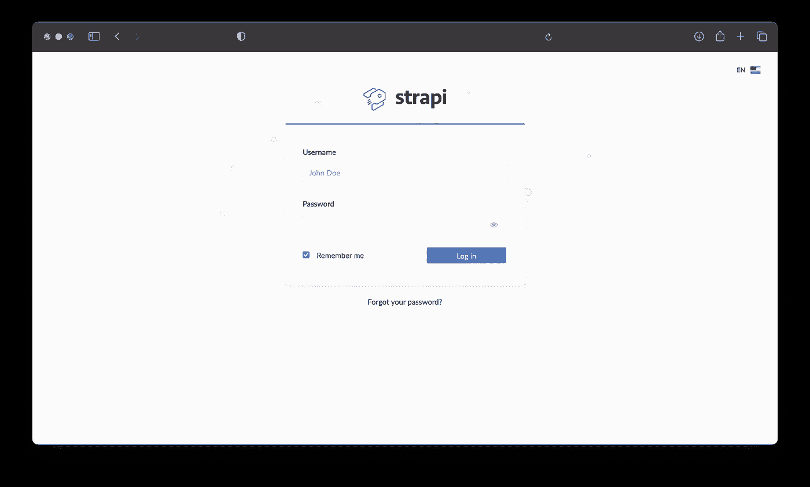
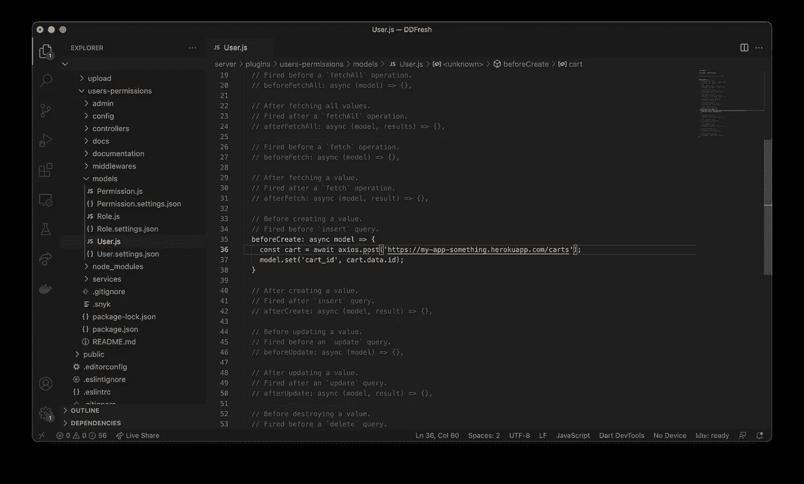

# 为 Heroku 上的颤振部署 Strapi MongoDB🚀

> 原文：<https://medium.com/geekculture/deploying-strapi-mongobd-for-flutter-on-heroku-f399bb3396a7?source=collection_archive---------17----------------------->


又一个介绍:Strapi，MongoDB，Heroku 和 Flutter

Strapi 是一个无头的 CMS，它非常适合创建 api，您可以轻松地管理连接到应用程序的数据库🔮

在托管服务器的时候，我看到了很多不错的文章😪但是对于提供设置 Strapi 服务器的步骤来说并不全面。对于从未主持过 Strapi 的人来说，让我们在这篇文章中简化整个过程。

我将假设您已经在您的开发环境中本地设置了 Strapi，并且一切都运行良好，在我的例子中，我已经将 Strapi 与 Mongo DB 一起使用，所以我们将在 Heroku 上托管我们的 Strapi 服务器。

**第一步:在 git 上上传回购:**

我们的第一步是将我们的服务器文件上传到 Github 上。你可能还记得你在 Flutter 应用程序目录中创建的 Strapi 文件夹的名称，在我的例子中，这个名称是 server，看起来应该像这样🤷‍♂️


让我们在服务器文件夹中使用下面的初始化命令来初始化 GIT。我们需要在我们的机器上安装并初始化 GIT，然后我们可以在机器上打开终端或 Power Shell。

现在，我们可以在 Github 上创建一个目录，初始化 git，并通过在终端上键入以下命令将原点设置为新创建的目录。我们将在创建一个 repo 后得到这些命令，但我们还是要提到它们。

```
git init
git remote add origin *here_will_be_link_to_your_repo*
```

现在让我们添加服务器目录中的所有文件夹

```
git add.
```

让我们确保我们提交了更改

```
git commit -m "Strapi server initial commit"
```

我们准备在 Github 上推送我们现有的文件

```
git push --set-upstream origin master
```

从这里开始，最好有两种方法来托管 heroku 上的服务器，在这两种方法中，你都必须在 heroku 上创建一个帐户，然后你可以在 heroku 上创建一个新项目。

**方法一:从 Heroku 连接 Github**



对于这个例子，让我们使用我的应用程序的名称，选择你最接近的地区，然后点击创建应用程序😬



最简单的方法是将您的 Heroku 项目与您刚刚创建的 Github repo 连接起来🤩，只要找到你的回购点击搜索，然后点击连接按钮。


我们会遇到一个错误，因为环境是生产环境，我们还没有设置环境变量。让我们讨论一下通过 CLI 完成后，您可以跳过 CLI 方法，直接跳到环境变量一节

**方法二:Heroku CLI**

第二种方法是使用终端或命令提示符完成同样的操作

按照以下命令将 github repo 与 Heroku 链接起来，我们需要安装 Heroku CLI

```
heroku git:remote -a my-app-something
git push heroku master
heroku open
heroku logs --tail
```

在完成该过程后使用命令“heroku open”时，我们会遇到一个与空字符串传递相关的错误，该错误可以通过“heroku logs-tail”找到。这是因为在 strapi 的生产环境中，您必须在 heroku 中指定环境变量，这将有助于建立到 Mongo DB 的连接

**第三步:环境变量**



让我们在 Heroku 上添加环境变量，方法是继续设置，然后显示配置变量。



以下是您需要添加到 Heroku 中的环境变量，请确保您删除了对 Strapisince 中开发环境的访问，因为这会向公众泄露您的 Mongo DB 服务器凭据，如果我们要将它用于生产，我们不想出现这种情况🤗。



快速破解你已经在你的开发服务器中有了环境值，路径如下，只需从开发文件中复制值😜

```
/server/config/environments/development/database.json
```



**第四步:更换链接**

我们可以从 Heroku 打开我们的 Strapi 仪表板，现在我们已经准备好在我们的 flutter 应用程序中使用我们的 api，你只需要用你上传到 Heroku 上的服务器链接替换你的 API 链接，这里有一个例子



确保替换对服务器的所有 api 请求。

**我们完成了🎉**

恭喜🥳，我们已经在 Heroku 上上传了 Strapi flutter 服务器，你可以用 Google cloud AWS 或 Azure 做同样的事情。

这里有一个额外的奖励，因为 Heroku 的托管服务器的正常运行时间有限，所以让我们给我们的应用程序一些咖啡☕️

[](https://kaffeine.herokuapp.com) [## 卡夫因

### 项目名称只能包含字母、数字和破折号。时间必须有小时、分钟和 AM/PM！琴弦需要…

kaffeine.herokuapp.com](https://kaffeine.herokuapp.com) 

感谢和分享，如果这是有用的，快乐的编码👋