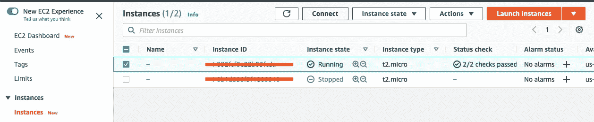
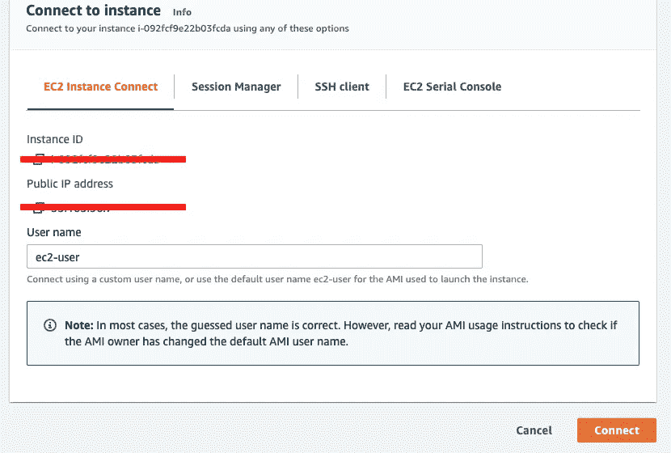
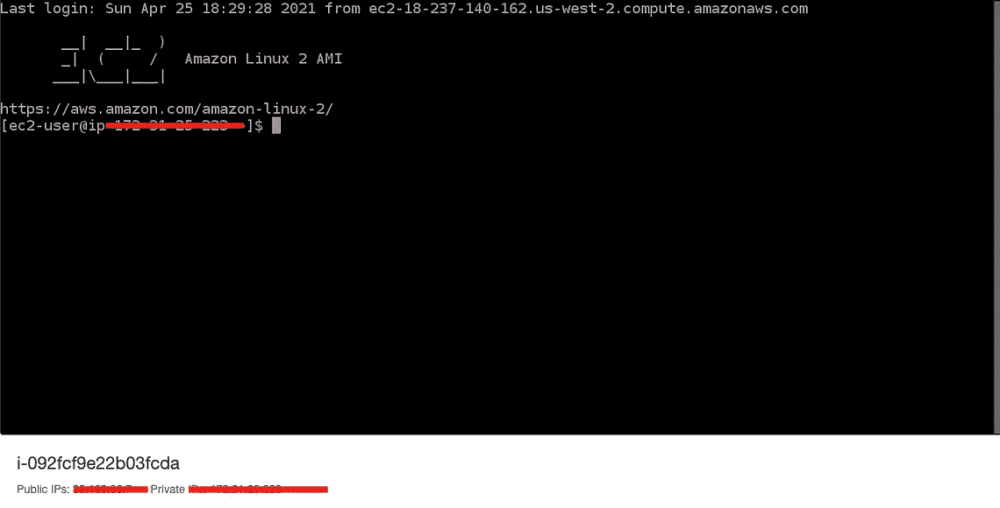
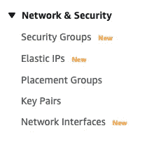
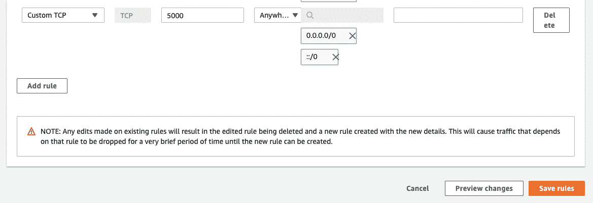

# 使用 Serve 和 PM2 在亚马逊 EC2 上快速部署 Web 应用

> 原文：<https://medium.com/geekculture/deploying-web-apps-quickly-on-amazon-ec2-with-serve-and-pm2-a44d3240f932?source=collection_archive---------10----------------------->


我一直希望能够快速部署 web 应用程序，无论它们是概念验证还是简单的宠物项目，我都希望能够快速部署它们并快速更新它们。感谢[亚马逊 EC2](https://aws.amazon.com/free/?all-free-tier.sort-by=item.additionalFields.SortRank&all-free-tier.sort-order=asc&awsf.Free%20Tier%20Categories=categories%23compute&trk=ps_a134p000006gXtKAAU&trkCampaign=acq_paid_search_brand&sc_channel=PS&sc_campaign=acquisition_LATAMO&sc_publisher=Google&sc_category=Cloud%20Computing&sc_country=LATAMO&sc_geo=LATAM&sc_outcome=acq&sc_detail=amazon%20ec2&sc_content=EC2_e&sc_matchtype=e&sc_segment=490407873258&sc_medium=ACQ-P|PS-GO|Brand|Desktop|SU|Cloud%20Computing|EC2|LATAMO|EN|Text&s_kwcid=AL!4422!3!490407873258!e!!g!!amazon%20ec2&ef_id=CjwKCAjwm7mEBhBsEiwA_of-TKIWrX0HZ2w7jbzrgRQVMOZduDbWShibG-VxFXYVEkYTF0CvuMNJdhoCwPwQAvD_BwE:G:s&s_kwcid=AL!4422!3!490407873258!e!!g!!amazon%20ec2&awsf.Free%20Tier%20Types=*all) 和 [NodeJS](https://nodejs.org/en/) ，这不仅是可能的，而且实际上非常容易做到。在接下来的教程中，我将用一些简单的技巧和几个非常有用的工具向你展示如何快速部署你自己的前端应用程序，你肯定会在日常生活中继续使用这些工具。

首先，要做到这一点，你至少需要一个包含 EC2 服务的 Amazon Web Services 帐户，但即使你没有，本教程也适用于任何其他 Linux 服务器。

# 1.将您的代码放入存储库

首先，为了能够将您的代码放在您的 Amazon EC2 实例上，我们强烈建议您将它放在某个地方， [GitHub](https://github.com/) 是一种选择，但是如果您有 [GitLab](https://about.gitlab.com/) 或 [Bitbucket](https://bitbucket.org/product) 您仍然可以做完全相同的事情，这里的想法是有一个地方，您可以从您的 Amazon EC2 实例下载您的代码。要将您的代码推入一个存储库，我们将按照 GitHub 在创建新存储库时给出的相同步骤进行:

```
$ git init -b main
$ git add .
$ git commit -m "First commit"
$ git remote add origin [your repo url goes here]
$ git push -u origin main
```

这样，我们将把我们的存储库推入`main`分支，等待在其他地方使用。

# 2.连接到 Amazon EC2 实例

有几种方法可以连接到您的 Amazon EC2 实例，但是在本文中，我们将实际一点，我们将转到“实例”，选择我们的 EC2 实例，然后单击“连接”按钮，一旦您进入下一个屏幕，选择下一个橙色的“连接”按钮，这将带您进入另一个带有 [SSH](https://en.wikipedia.org/wiki/Secure_Shell_Protocol) 控制台的屏幕。如果你还没有创建你的 amazon EC2 实例，你可以遵循这个指南。



The Amazon EC2 Instance instance section with the “connect” button next to the “refresh” one.



On the left we have the connect dialog and on the right we have the SSH console after log in.

一旦您登录到这个 SSH 控制台，就该下载代码了。

# **3。在 EC2 实例中克隆你的 GitHub 库**

在 Amazon EC2 SSH 控制台中，我们可以添加代码，为此我们可以使用以下命令:

```
$ git clone [your repo url goes here]
```

一旦你收集了所有的回购信息，你就可以进去编译它，这取决于你用的是什么(ReactJS，VueJS，AngularJS 等。)您应该有一个命令来编译所有的资产，在我的例子中，这样做的命令是`yarn build`但是我们这里有一个问题，NodeJS 不是默认安装在 EC2 服务器上的，要安装它，我们将使用 NVM(节点版本管理器)。

# 4.安装 NVM

要安装 NVM，我们可以使用以下命令:

```
$ curl -o- https://raw.githubusercontent.com/nvm-sh/nvm/v0.38.0/install.sh | bash
```

安装之后，确保`nvm`命令可以和`nvm --version`一起使用，如果没有弹出任何东西或者控制台说命令不可识别，尝试关闭会话并再次连接到 SSH 服务器。

一旦安装了 NVM，你要做的第一件事就是安装你的代码运行的 NodeJS 版本，在我的例子中是`12.9.1`，所以要得到这个版本，我们唯一要做的就是使用下面的命令:

```
$ nvm install 14.15.1
$ nvm use 14.15.1
```

之后，我们可以像往常一样使用我们的`node`和`npm`命令，如果你觉得使用`yarn`比`npm`更舒服，你可以用下面的命令安装它:

```
$ npm i -g yarn
```

# 5.全局安装“服务”包

[serve](https://www.npmjs.com/package/serve) 包将帮助我们“部署”我们代码的编译版本，就像它被部署在静态服务器上一样，这在您的本地环境和您的服务器中有许多优势。要安装这个库，您唯一需要做的就是使用以下命令安装它:

```
$ npm i -g serve
```

Serve 允许您在`5000`端口下部署应用程序，但是如果需要，您可以使用以下命令指定另一个端口:

```
$ serve -l 1234
```

如果您不想提供您当前所在的目录，也可以选择您想要提供的文件夹:

```
$ serve aFolder
```

# 6.全局安装“PM2”软件包

[PM2](https://pm2.keymetrics.io/docs/usage/pm2-doc-single-page/) 包是一个工具，它将允许我们创建在服务器后台运行的进程，这是因为如果我们用`serve`命令运行我们的应用程序，然后我们关闭 SSH 控制台，应用程序将停止运行，因为它只在我们所在的会话中是活动的，为了避免这个问题并使实例无限期地运行，需要创建一个在后台运行的进程。

要安装 PM2，我们唯一需要做的就是运行以下命令:

```
$ npm i -g pm2
```

一旦安装完毕，我们就拥有了在 Amazon EC2 实例上部署应用程序所需的所有工具。

# 7.编译您的 web 应用程序

为了能够服务于我们的应用程序，正如我们在第 3 点上看到的，我们需要编译它，正如我在我的例子中所说的，编译命令如下:

```
$ yarn build
```

一旦我运行这个命令，我的应用程序的结果代码将被创建在`dist`文件夹下，所以如果我需要服务它，我可以运行下面的`serve`命令:

```
$ serve dist
```

将出现在控制台上的消息应该类似于以下内容:

```
 ┌───────────────────────────────────────────────────┐
   │                                                   │
   │   Serving!                                        │
   │                                                   │
   │   - Local:            [http://localhost:5000](http://localhost:5000)       │
   │   - On Your Network:  [http://192.168.20.27:5000](http://192.168.20.27:5000)   │
   │                                                   │
   │   Copied local address to clipboard!              │
   │                                                   │
   └───────────────────────────────────────────────────┘
```

这意味着您的服务器目前运行在`5000`端口下，但是如果我们转到亚马逊给我们的 URL(在实例详细信息的公共 IPv4 DNS 部分下),我们将看不到任何内容，这是因为亚马逊的安全限制，我们所有的端口都是关闭的，所以我们现在唯一需要做的就是打开`5000`端口。

# 8.打开亚马逊 EC2 端口

要打开 Amazon EC2 上的`5000`端口，我们进入 EC2 主页面并向下滚动，直到看到“网络和安全”部分，在上面我们选择“安全组”链接。



在那里，我们选择我们的实例正在使用的安全组(我们可以在实例信息的“安全”选项卡上检查它的名称)，在那里，我们选择“添加规则”按钮，在“类型”上，我们选择“自定义 TCP”，在“端口范围”上，我们键入 5000，然后在“源”上，我们选择“Anywere”，完成后，我们选择“保存规则”。



Security group configuration

现在，在这样做之后，如果我们再次运行`serve dist`命令，并转到实例 url，我们将能够看到我们的网站正在运行，但是我们需要该网站永久运行，这就是为什么我们将基于我们的`serve`命令与 PM2 创建一个流程。

# 9.根据您的服务命令创建一个 PM2 流程

要基于我们的`serve`命令创建 PM2 流程，我们需要使用以下命令:

```
$ pm2 start serve dist --name running_app
```

命令的第一部分指定我们正在启动一个 PM2 进程，`serve dist`部分是我们用来运行服务器的命令，`--name running_app`是我们正在创建的进程的名称。一旦我们这样做，一个新的进程将被创建运行我们的应用程序，如果你去你的应用程序的网址，它应该保持运行，即使你关闭你的 SSH 终端。

您可以分别使用以下命令列出、停止或启动您的进程:

```
$ pm2 list
$ pm2 stop running_app
$ pm2 start running_app
```

使用 PM2 的一个优点是，您可以运行多个进程，您可以创建另一个进程来同时运行几个应用程序，如果您想使您的部署过程更加自动化，您可以添加一个 [cron](https://en.wikipedia.org/wiki/Cron) 作业来自动安排您的更新和代码编译。

# 结论

现在有许多服务可以帮助你安装和部署静态网站，但是有时由于公司的限制，缺乏信任或控制，我们不能使用它们，我们唯一剩下的是一个纯粹简单的 Linux/Unix 服务器，本教程旨在向你展示仍然有一种方法可以使用最新的技术启动和运行你的应用程序，使用 Amazon EC2 只是一个小细节，如果你需要在另一个 Linux 服务器上部署你的应用程序，你可以按照这些相同的步骤来做。

我真的希望这篇教程能帮助你学习一些你以前不知道的东西，并为你提供一些你将来会使用和推荐的工具。

下次见。