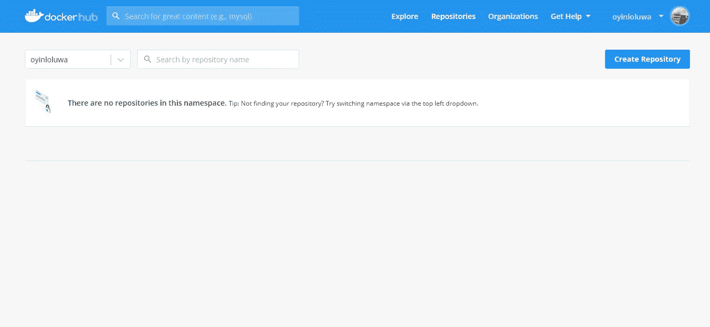
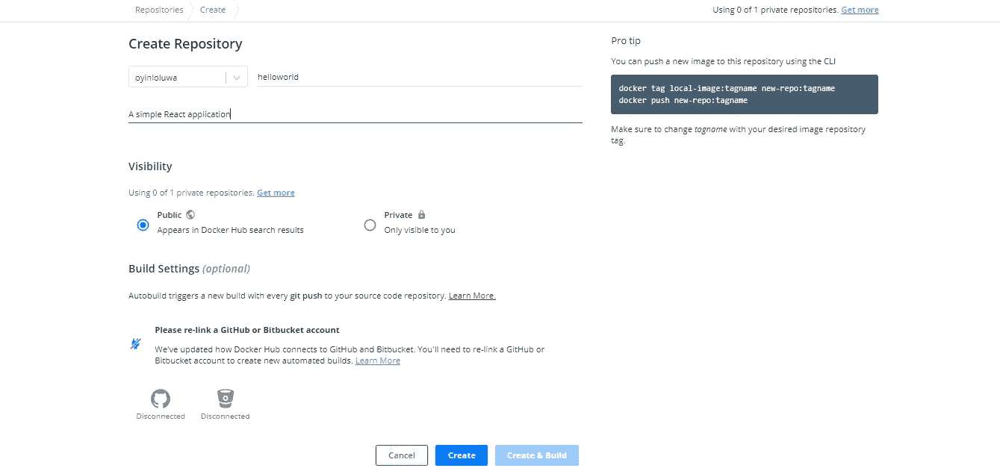
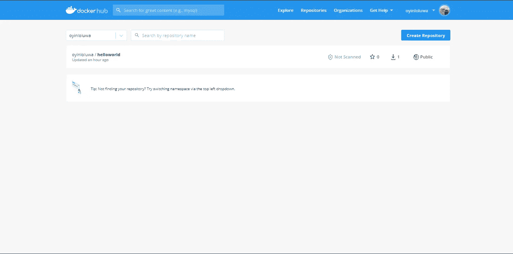
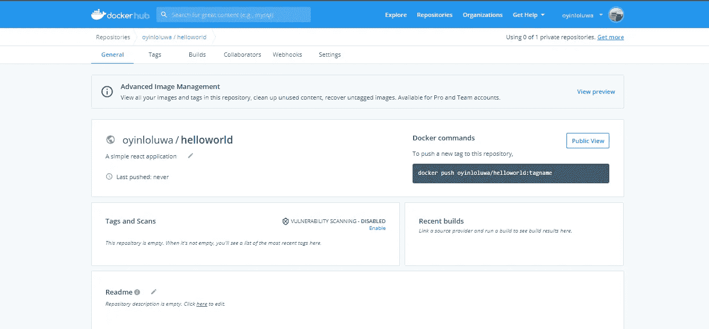
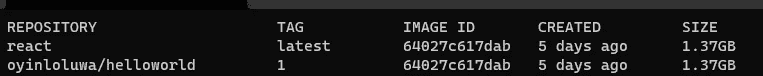
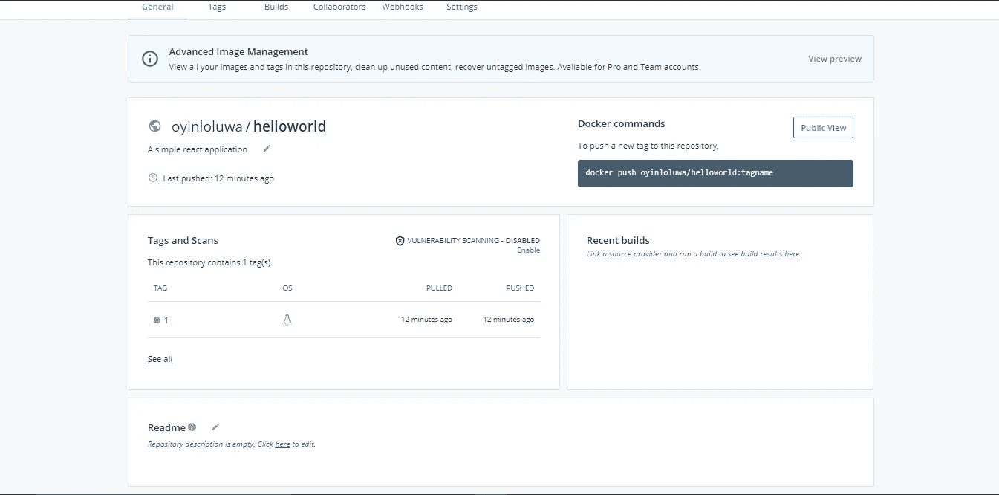

# 将您的映像部署到 Docker Hub

> 原文：<https://medium.com/geekculture/deploying-your-image-to-docker-hub-f501756837d8?source=collection_archive---------18----------------------->


在我的上一篇文章中，我们成功地为简单的“Hello Word”React web 应用程序创建了一个 docker 图像。如果你错过了，不要惊慌，我在下面贴了一个文章链接:

[](https://link.medium.com/dMw6O7eYcgb) [## React 中的 Docker 入门。Js 应用程序-基础

### React 中的 Docker 入门。Js 应用程序——在这篇文章中的基础，我们将讨论…

link.medium.com](https://link.medium.com/dMw6O7eYcgb) 

您可以先浏览一遍并创建您的映像，然后返回这里将您的映像部署到 Docker hub。如果您已经有了一个等待部署的映像，那么请不要离开。

在本文中，为了确保完全理解我们将要做的事情，我们将把它分成以下几个小标题:

*   码头登记处
*   码头枢纽
*   在 docker hub 中创建我们的存储库
*   将我们的形象推向码头中心

我们开始吧。

## 码头登记处

现在我们有了 docker 图像，我们该如何处理它呢？


这就是 docker 注册发挥作用的地方。docker 注册表是一个服务器端应用程序，允许您存储和分发 docker 图像。所以 docker 注册表基本上是 docker 图像的 Github。您可以将您的图像推送到注册表，也可以从注册表中拉出您的图像以及其他图像。

*   **docker pull:** 该命令在运行时，将从 docker 注册表中获取指定的图像。

```
docker pull image
```

*   **docker push:** 您一定已经猜到，这个命令在运行时将获取指定的图像并将其放入 docker 注册表中。

```
docker push image
```

docker 注册中心就像 Github 存储库一样，有两种类型:

1.  **公开:**任何人都可以看到和访问您的图片。
2.  **Private:** 任何人都不能看到和访问您的图片。

## 码头枢纽

Docker hub 是 Docker 基于云的注册表，允许您存储图像，并方便您对图像执行不同的操作。docker hub 必须提供几个特性，但是对于本文，我们将把重点放在将图像推送到这个注册表中。

## 在 Docker Hub 中创建我们的存储库

首先，我们必须访问 docker hub 网站[，如果你还没有，创建一个账户。如果您有现有帐户，只需登录即可。](https://hub.docker.com/)

您应该会看到类似以下屏幕的内容:



我们目前没有任何存储库，因此我们将通过单击**创建存储库**按钮来创建一个存储库。

所以我们要命名并描述我们的存储库，我们也可以选择我们的存储库是保持私有还是公开。我已经在表格中填入了我喜欢的数据，你可以随意命名你的存储库，也可以随意描述它。



一旦我们完成了存储库信息的填充，我们就可以点击 **Create** 按钮。它将我们带到这个页面，在这里我们有了刚刚创建的存储库。



## 将我们的形象推向码头中心

到目前为止，我们已经很好地理解了什么是 docker 注册中心，并且已经在 docker hub 注册中心创建了一个存储库。现在，我们将获取我们的映像，并将其推送到我们的存储库中。

如果您运行此命令；

```
docker images
```

您将看到您的图像列表:

```
REPOSITORY    TAG      IMAGE ID       CREATED         SIZE
react        latest   64027c617dab   4 days ago      1.37GB
```

这是我们在上一个教程中从 React 应用程序创建的图像。我们将与此一起工作，如果你已经有了你的图像，那么你也可以与它一起工作。

在推送之前，我们首先必须将本地图像标记为我们的存储库名称。这是命令:

```
docker tag local-image:tagname new-repo:tagname
```

在我们的情况下，这将是:

```
docker tag react:latest oyinloluwa/helloworld:1
```

你的*标签名*可以是你想要的任何东西。我已经决定用 *1* 了。

完成此操作后，当您运行命令时:

```
docker images
```

您应该会看到我们刚刚指定的新名称和标签，以及我们原来的图像名称和标签:



最后一步是使用 push 命令，在您的终端中，编写以下内容并单击 enter:

```
docker push oyinloluwa/helloworld:1
```

这将负责把我们的形象推向 docker hub。一旦它成功运行，我们就可以返回到 docker hub 存储库页面并重新加载它，以查看我们新添加的映像。



在这里，我们将 docker 映像部署在 Docker hub 上。然而，Docker hub 可用于 Docker 图像的基本推送和拉取之外的功能，要更广泛地了解这些功能以及它们对您有何益处，您可以继续深入阅读。