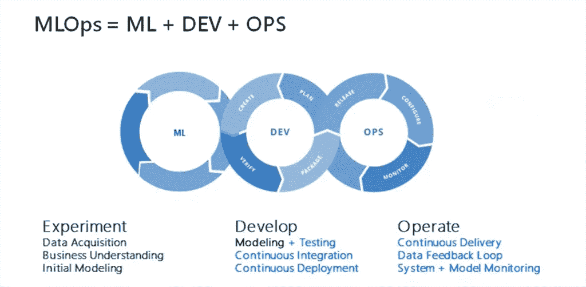

# 在 Azure 机器学习上部署你的 ML 模型作为服务

> 原文：<https://medium.com/geekculture/deploying-your-ml-model-as-a-service-on-azure-machine-learning-47520e6b84c3?source=collection_archive---------5----------------------->

## 如何使用 Azure 机器学习部署你本地构建的机器学习模型？

Credits: [Using MLOps to Bring ML to Production (Microsoft)](https://www.slideshare.net/weaveworks/using-mlops-to-bring-ml-to-productionthe-promise-of-mlops)

机器学习是目前最热门的话题之一。

说到机器学习，我觉得重点还是放在了太多的**模型**上。模型很重要，可以让你…