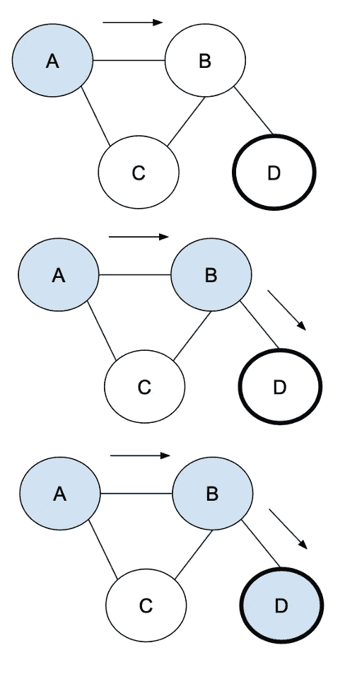

# 深度优先搜索

> 原文：<https://medium.com/geekculture/depth-first-search-dfs-77f760a5f6a7?source=collection_archive---------4----------------------->

## 顾名思义，我们首先进行深度搜索，递归地检查子节点的子节点，直到没有未被访问的子节点，然后返回访问第一个未被访问的兄弟节点，然后再次深入。

使用堆栈存储节点将有助于我们访问所有节点，子节点的子节点