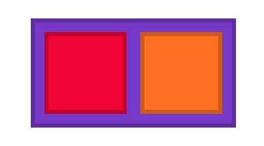
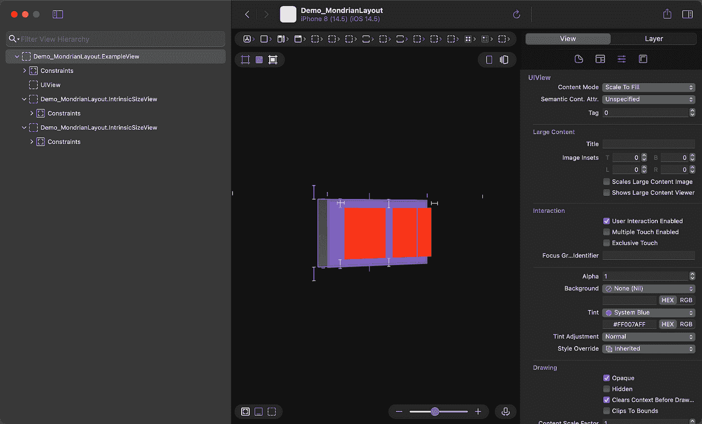
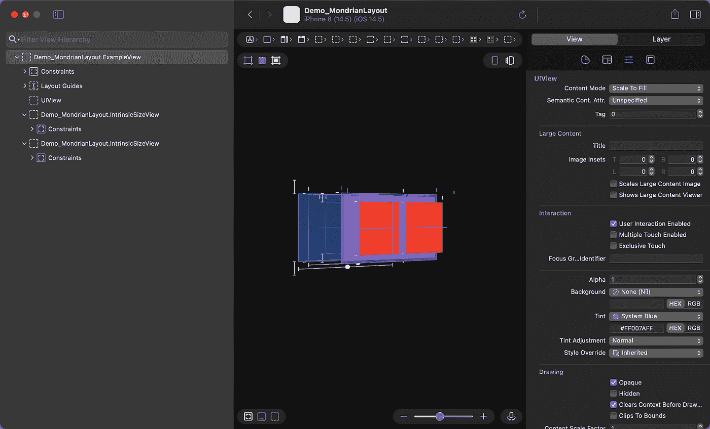

# 用可以想象的编程方式描述 AutoLayout

> 原文：<https://medium.com/geekculture/describing-autolayout-with-imaginable-how-it-lays-out-programmatically-mondrianlayout-71efe82f3149?source=collection_archive---------23----------------------->

Let’s describe the layout like Mondrian.

# 题外话:SwiftUI 从未移除 UIKit

苹果正在致力于创建 SwiftUI 专用。但这并不意味着他们将 UIKit 从我们的开发中移除。

SwiftUI 只是一个描述 UI 的抽象层，要看是谁渲染的。在 macOS 中，AppKit 可以。在 iOS 中，UIKit 在主屏幕的小部件中，根据 SwiftUI 接口描述的 UI 的表示，创建表面的特殊渲染器。

从技术上来说，SwiftUI 没有渲染的功能。只是一个表象。UIKit 则相反，但实际上，UIKit 也是渲染的抽象层。高度优化的 CoreAnimation 和 CoreGraphics 使用 CPU 和 GPU 来实现这一点。

当然，苹果会每年更新 SwiftUI，我们也许可以只用 SwiftUI 创建更复杂的应用程序。即便如此，他们仍然会在内部使用 UIKit。

这就像在 javascript 中创建高度定制的组件，即使使用 React，我们也会使用 UIKit 来完成，并与 SwiftUI 进行桥接。

这就是我的意思，UIKit 仍然很重要，我们将继续使用它，至少是部分使用。

# 用代码描述自动布局让我们难以理解

使用 InterfaceBuilder 有很多好处，不使用 InterfaceBuilder 也有很多好处，尤其是使用 Swift 的情况。

如果我们只从代码中创建 UI，我们可能会编写代码来设置布局，就像这样。

你看到这段代码创造了什么样的外观了吗？

Result of the above program.

Inspecting with Reveal

如您所见，在代码中描述 AutoLayout 约束使开发人员难以理解。此外，修改布局也很困难。想象一下，如果你需要交换这两个盒子，你将再次写多行。你知道吗，在商业中更新布局经常会导致。

UIKit 得到了`UIStackView`来解决这个问题，虽然你需要添加另一层。

# MondrianLayout 可以描述布局，可以想象它在运行时如何布局，而无需使用 InterfaceBuilder

介绍一下 MondrianLayout。这是一个库，是在 SwiftUI 这样的 AutoLayout 中更快地构建布局的一种方式——由结果构建器提供支持

让我们来看看 MondrianLayout 是如何改变这一点的。

 [## muukii/MondrianLayout

### ⚠️单元测试不能在 GitHub 动作中运行，那是在等待 Big Sur 虚拟环境。描述布局…

github.com](https://github.com/muukii/MondrianLayout) 

正如您所看到的，我们可以通过以下方式描述相同的布局。

`buildSubviews`执行以下操作:

*   创造了`NSLayoutConstraint`
*   创建`UILayoutGuide`将它排成一行堆叠。
*   将表示中使用的视图添加到父视图-层次结构也考虑。`backgroundView`会加在箱子后面。
*   关闭`translatesAutoresizingMaskIntoConstraints`

我们可以像这样交换那些盒子。更改描述框的顺序。

Swapping box1 and box2 to change the order.

Inspecting with Reveal

# 但是我们仍然需要使用古典风格的 API

正如上一节所解释的，它使用*结构化布局 API* 来描述布局。然而，我们可能仍然需要使用类似使用普通 API 的风格来保持 AutoLayout 的灵活性。

为了支持这种情况，MondrianLayout 为我们提供了可以描述每个条件的自动布局约束的 API。这就像使用普通的 API，但是更加流畅。

# 包扎

MondrianLayout 提供了两种在代码中描述布局的方法。

1.  结构化布局 API——描述符合人体工程学的布局。
2.  经典风格布局 API——描述完全可控的布局约束。

那些 API 可以互相集成，我们可以选择最好的方式来描述每种情况。

我希望您喜欢使用 MondrianLayout 以编程方式描述布局。

 [## muukii/MondrianLayout

### ⚠️单元测试不能在 GitHub 动作中运行，那是在等待 Big Sur 虚拟环境。描述布局…

github.com](https://github.com/muukii/MondrianLayout)