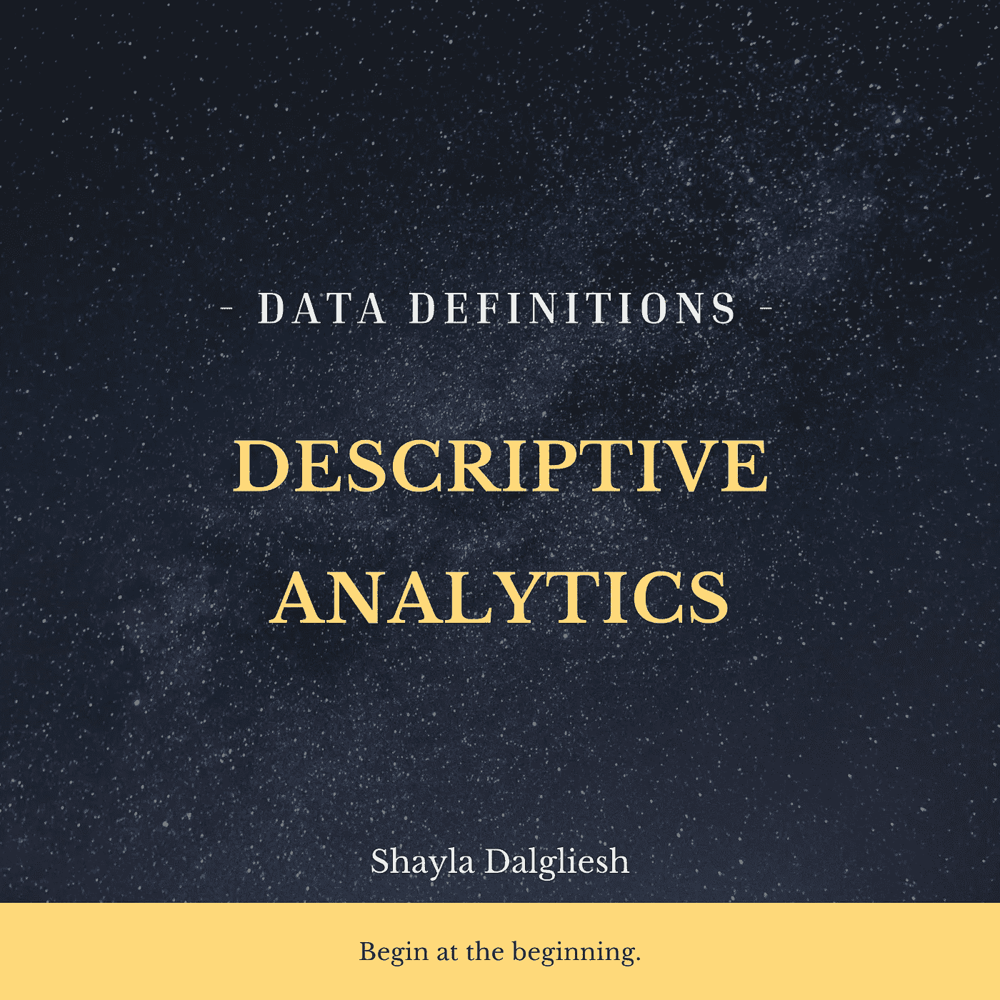

# 描述性分析

> 原文：<https://medium.com/geekculture/descriptive-analytics-e4c60c0102a8?source=collection_archive---------39----------------------->

从头开始。

Image by the author.

分析过程分为三个阶段。

阶段 1:通过描述性分析了解事实。

阶段 2:了解预测分析的预期。

第 3 阶段:通过说明性分析了解你的战略。

这些阶段中的每一个都建立在最后一个基础上，以级联和渐强的方式进行。描述性分析是预测性分析和规定性分析的基础。了解组织的工作流程也有其固有的好处。这不仅对运营至关重要，还能提高员工的参与度和认同度。回答如下问题:Alex 去年在工作队列中处理了多少个项目？与 Q1 2021 财年相比，Q1 2019 财年的总收入是多少？我们是否通过处理这些工作队列项目增加了收入？多雇 30 个人值得吗？

为了衡量结果，知道你从哪里开始是很重要的。参与描述性分析阶段是基线模型的创建，也是战略路线图的起点。规定性分析(人工智能和机器学习属于这一类)可以带你走向未来，但你怎么知道这是值得的呢？你怎么知道这有什么不同呢？从描述性分析开始构建这幅图。

创建描述性分析有六个工作阶段:1)收集信息；2)描述性统计；3)视觉感染力；4)语境研究；5)反馈；6)总结。每个阶段都分为 3-4 个步骤。在一个简单的场景中，这些步骤可以在一天内完成，或者当有很多层、涉及几个团队或者任何其他(无限)复杂的场景时，它们可能需要一两个月才能完成。描述性统计摘要是这一阶段分析的重点。描述性统计是对给定数据集进行概括的简要描述性系数，该数据集可以代表总体，也可以代表样本(海斯，2021 年)

分析的竞争优势不可否认。“企业不能低估其分析计划的重要性。虽然企业仍然需要具有直觉的领导者和决策者，但他们依赖数据来验证他们的直觉。从这个意义上来说，数据成为了一个战略指南，帮助高管们看到他们原本可能不会注意到的模式。”(谢尔曼，2015 年，第 7 页)

> 参与描述性分析阶段是基线模型的创建，也是战略路线图的起点。

在任何有价值的计划中，从头开始是拼图中最重要的一块。在构建分析程序的开始阶段，理解数据环境是至关重要的第一步。最值得注意的是，确定哪些数据点对组织是可用的，这一点很重要。通常，高管们想要衡量的东西在日常运营中是无法捕捉到的。如果摄像机没有打开，以后就不能看录像带了。

“数据科学”的概念已经颠覆了整个行业。数据科学是建立在描述性分析之上的高级分析。统计模型是从描述性模型中建立起来的。人工智能和机器学习是使用这些数据推导出来的(在必要和适用的时候)。虽然有些人喜欢搭乘“数据科学”的营销浪潮，但一切仍建立在描述性分析的基础上。在*的数据决定性博客*中，描述性分析以一种*昨日新闻*的语气进行讨论，这种语气已经变得流行起来。“那么什么是描述性分析呢？嗯，我们知道这不是数据科学…”(皮克，未注明日期)

在这个越新越好的时代，这是一种流行的态度。然而，沿着这条路走下去会给那些希望跳到好的部分的善意的领导者带来困惑。数据科学是分析的第三步，规定性分析。“实时分析数据有助于组织回顾过去和预见未来。这就是流分析的美妙之处，它来自于知道发生了什么(描述性的)，理解为什么会发生(诊断性的)，展望可能发生的事情(预测性的)，以及最终确定如何影响未来的发生(规定性的)。”(Ajah & Nweke，2019 年)对任何最小化(或跳过)分析初始阶段的重要性的专业人士都要谨慎。

> 在任何有价值的计划中，从头开始是拼图中最重要的一块。

使用描述性分析创建基线数据集是数据科学流程的基础。它提供了清晰、公正的数据画面，增强了直观的领导力，为组织创造了竞争优势和进步。人们很容易(试图)忽略描述性分析，而倾向于流行的、市场化的人工智能和机器学习模型，然而这些模型只有在描述性分析完成后才能建立。了解如何从头开始将为您的分析项目带来多年的成功。

[点击这里联系我。](https://linktr.ee/shayladalgliesh)

参考

Ajah，I. A .，& Nweke，H. F. (2019 年 6 月 10 日)。*大数据和商业分析:趋势、平台、成功因素和应用*。从 https://www.mdpi.com/2504-2289/3/2/32/htm[MPDI 取回](https://www.mdpi.com/2504-2289/3/2/32/htm)

海耶斯，A. (2021 年 2 月 24 日)。*描述性统计*。检索自 Investopedia:[https://www . Investopedia . com/terms/d/descriptive _ statistics . ASP](https://www.investopedia.com/terms/d/descriptive_statistics.asp)

皮克湾(未标明)。*什么是描述性分析？—数据科学周三*。检索自决定性数据博客:[https://Blog . Decisive Data . net/Blog/what-is-descriptive-analytics-Data-science-周三](https://blog.decisivedata.net/blog/what-is-descriptive-analytics-data-science-Wednesday)

谢尔曼河(2015 年)。*商业智能指南。*沃尔瑟姆:爱思唯尔。