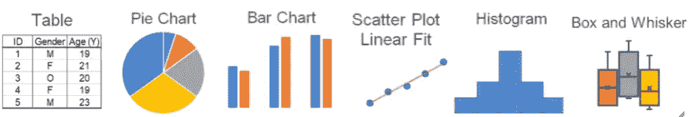
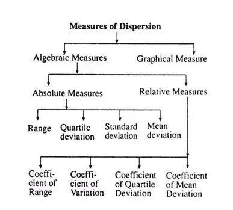
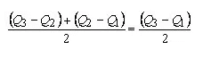
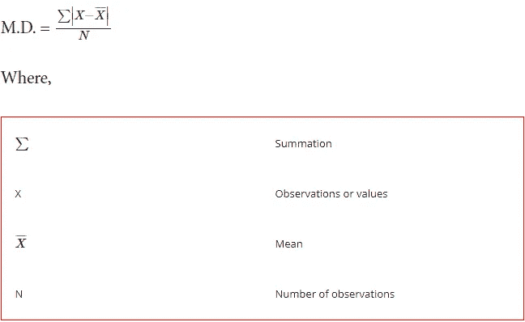
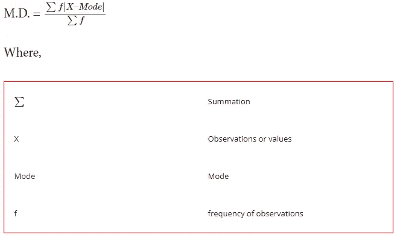
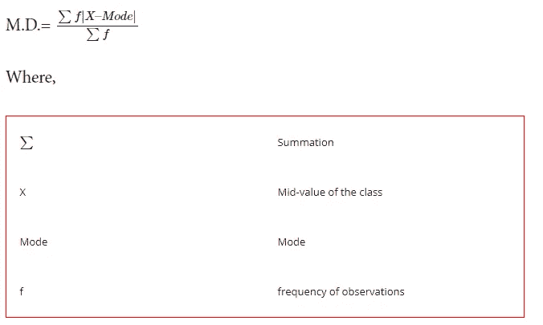

# 统计学中的描述性度量？那是什么？

> 原文：<https://medium.com/geekculture/descriptive-measures-in-statistics-what-is-that-c2caae7ab590?source=collection_archive---------10----------------------->

“哦，这么说，中位数和众数被称为集中趋势的量度？我不知道它有一个专门的术语”一个朋友告诉我的。

所以，在进入假设检验的细节之前，我想写一篇关于描述性测量的文章。

统计学中的描述性度量？那是什么？

术语描述性统计是指描述和总结数据的行为。这可以通过使用表格、图表、图形和关键描述性值(如数据集大小、百分比、平均值和方差度量)来完成。根据手头的任务，您可能只需要描述性统计数据。

有四种不同的色散测量方法。

1.  集中趋势的测量——按照下面的链接，在前一篇文章中有详细描述

 [## 数据科学统计学

### 统计？那是什么？我为什么要学？

medium.com](/geekculture/statistics-for-data-science-76988541b2e1) 

2.偏斜度的度量
3。峰度的度量
4。离差的度量
在这个博客中，我们将讨论离差的度量，

虽然集中趋势的测量通常用于估计数据集的“正常”值，但是**分散的测量对于描述信息的传播或其围绕中心值的变化是重要的**。

两个不同的样本可能具有相同的平均值或中值，但可变性水平完全不同，或者相反。一组信息的正确描述应该包括这两个特征。

有多种方法可用于测量数据集的离差，每种方法都有自己的优缺点。

**让我们看看离差的绝对度量**

# **1】范围**

离差的最简单度量是范围。范围是一组观察值的最小值和最大值之间的差值，例如，假设一个品种在五个地块中的产量(每块地的公斤数)分别是 8、9、8、10 和 11。范围是(11–8)= 3 公斤。实际上，范围显示为 8-11 公斤。

范围仅考虑最大值和最小值，而不是所有值。因此，这是一个非常不稳定或不可靠的偏离量指标。它受极端值的影响。在上面的例子中，如果我们有 15 而不是图 11，范围将是(8–15)= 7 公斤。为了避免这些困难，另一种称为四分位数离差的离差度量是优选的。

# 2]四分位偏差

四分位数偏差基于频率分布中第一个四分位数和第三个四分位数之间的差异，该差异也称为四分位数间距，将该差异除以二称为四分位数偏差或半四分位数间距。

当一个简单分布或频率分布的第三个四分位数和第一个四分位数之间的差异或方差取一半时，就是四分位数偏差。

四分位偏差(Q.D .)公式在统计学中用于测量分布，或者换句话说，用于测量离差。这也可以称为半四分位数范围。

**关于四分位偏差的提示**

*   该公式在计算中包括 Q3 和 Q1，它们分别是最高的 25%和最低的 25%的数据，当取这两个数据之间的差并将该数减半时，它给出了扩散或分散的度量。
*   所以，要计算四分位偏差，你需要先找出 Q1，然后第二步是找到 Q3，然后对两者求差，最后一步是除以 2。
*   这是分散开放式数据的最佳方法之一。

*示例* ***Harry ltd .是一家纺织品制造商，正在研究一种奖励结构。管理层正在讨论启动一项新计划，但他们首先想知道他们的生产范围有多大。***

***管理层已经收集了每个(平均)员工过去 10 天的平均日产量数据。***

***155，169，188，150，177，145，140，190，175，156。***

***利用四分位数离差公式帮助管理层寻找离差。***

**解决方案:**

这里的观察值是 10，我们的第一步是按升序排列数据。

140, 145, 150, 155, 156, 169, 175, 177, 188, 190

Q1 的计算可以如下进行，

Q1= (n+1)届

=¼ (10+1)

=¼ (11)

**Q1** = **第 2.75 期**

Q3 的计算可以如下进行，

Q3= (n+1)次

=¾ (11)

**Q3** = **8.25 期限**

四分位偏差的计算可以如下进行:

*   第二项是 145，现在加上 0.75 *(150–145)，即 3.75，结果是 148.75
*   第八项是 177，现在加上这个 0.25 *(188–177)，就是 2.75，结果是 179.75

**Q.D. = Q3 — Q1 / 2**

使用四分位数离差公式，我们得到(179.75–148.75)/2

=31/2

**Q.D.** = **15.50。**

四分位偏差比范围更稳定，因为它取决于两个中间值。这不受极值的影响，因为极值已经被移除。但是，四分位偏差也不能取所有偏差的值。

# **3】平均偏差**

我们可以从算术平均值、中位数或者众数来计算。它告诉我们所有的观测值平均离中间有多远？每个偏差都是绝对偏差，因为它是一个绝对值，这意味着我们忽略了负号。此外，平均值两侧的偏差应相等。让我们开始详细学习均值偏差公式。

**公式
1)个别系列—**

**2)离散序列—**

**3)连续系列—**

# 计算平均偏差的步骤:

1.  计算序列的平均值、中值或众数。
2.  计算与平均值、中间值或众数的偏差，忽略负号。
3.  将偏差与频率相乘。只有在不连续和连续系列中，这一步才是必要的。
4.  总结所有的偏差。
5.  应用公式。

# 4]标准偏差

我已经创建了一个关于标准差的详细帖子，请查看下面的链接

 [## 统计学中的标准偏差

### 标准差(或σ)是数据偏离平均值的度量。

medium.com](/@macwanvaishali/standard-deviation-in-statistics-c4165e67fdf1)