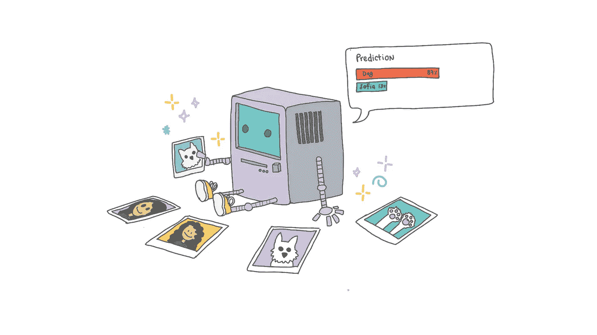
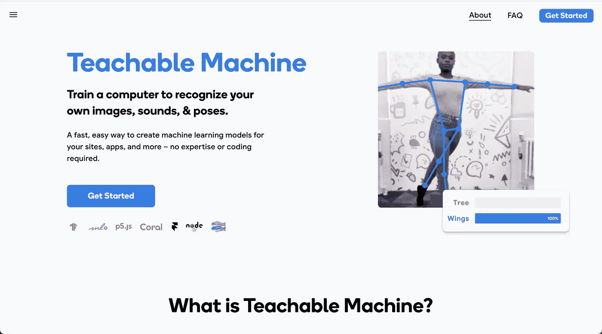
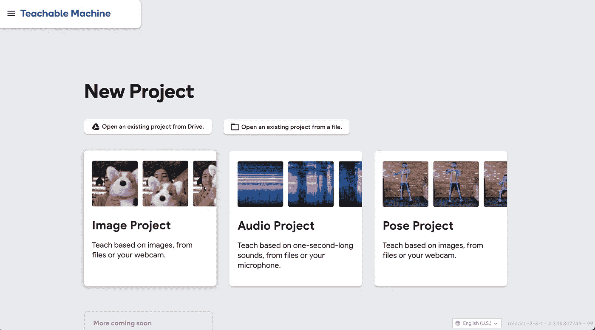
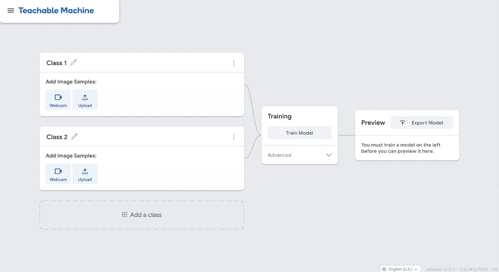
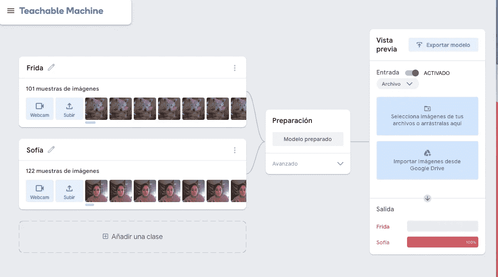
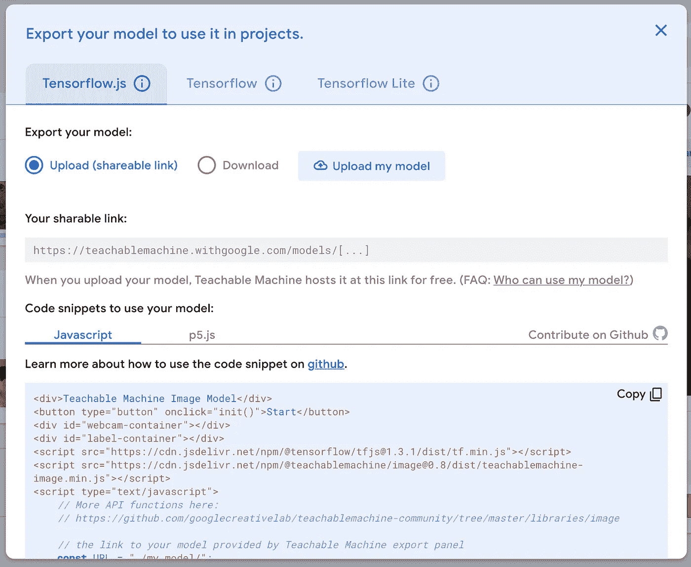
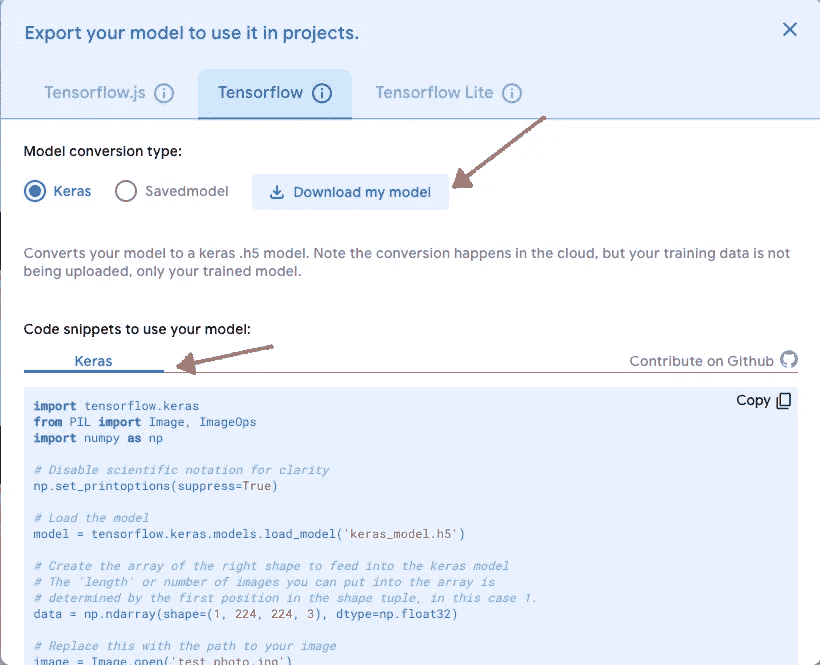

# 使用可教的机器学习教程设计和训练您的机器学习模型

> 原文：<https://medium.com/geekculture/design-and-train-your-machine-learning-model-with-teachable-machine-thunkable-tutorial-dc3b6d5582a2?source=collection_archive---------12----------------------->

## 机器学习的第 1 部分+云运行+ Thunkable

## 代码+无代码工具。

好吧，澄清一下，这个教程确实包括了一些 python、basic flask 和 google cloud services 的知识。我会尽我所能，但如果你卡住了，我的建议是看看他们的适当文件。

所以可以肯定地说，本教程是无代码和真实代码的混合体。如果你开始用无代码工具制作应用程序，这是一个不错的主意。无代码工具很酷的一点是，你不需要成为该领域的专家，一旦你学会了如何编写外部 API 并将它们连接到 Thunkable，你就可以(几乎)做任何事情。

## 本教程概述。

[第 1 部分——用可教机器](https://sogalanbat.medium.com/design-and-train-your-machine-learning-model-with-teachable-machine-thunkable-tutorial-dc3b6d5582a2)(这个！)

[第 2 部分—使用云运行为 Thunkable 定制 API](https://sogalanbat.medium.com/custom-api-for-keras-model-using-cloud-run-9d367a2ea5e8)

[第三部分 Thunkable 中的机器学习应用。](https://sogalanbat.medium.com/machine-learning-app-in-thunkable-df6b1ee8bf44)

## 最终产品:

# 第 1 部分:用可教机器设计你的机器学习模型

## 机器学习

我不是机器学习方面的专家，所以基本上无论我告诉你什么，我都是从不同的来源得到的。这里有一个来自谷歌机器学习速成班的有趣定义，强烈推荐你去看看。

> 用基本术语来说，机器学习就是训练一个叫做 [**模型**](https://developers.google.com/machine-learning/glossary#model) 的软件的过程，利用数据集做出有用的预测。然后，这个预测模型可以提供关于以前未见过的数据的预测。我们利用这些预测对产品采取行动；例如，系统预测用户将喜欢某个视频，因此系统向用户推荐该视频。

在这篇文章的其余部分，我将机器学习称为 ML。

## 可教机器 2.0

**制作您的模型**

可教机器 2.0 是一种友好的无代码方法来训练谷歌的 ML。你可以训练它识别姿势、物体，甚至声音。你记录或上传图片/视频到网站，它会自动为你做一切。

可教机器非常简单，你点击“开始”就可以开始一个新项目。它会提示你从 Google Drive 或你的电脑上打开一个现有的模型。但是如果你刚刚开始，你可以选择你想要建立的模型类型。这可以是识别图像、声音或姿势。

选择你喜欢的项目，这些项目看起来都一样，主要区别是模型的输入。当你开始这个项目时，你会看到下面的屏幕，让你为你的模型添加不同的类来检测。如果你在不同的物体之间探测，这真的很有用，例如，你家里的不同物品，比如杯子，宠物，你自己等等。你只需要上传你所有课程的数据，就差不多了。

训练和测试你的模型。

好了，现在您已经为您的项目添加完了所有的类。现在你可以训练你的模型了。为此，您只需点击“训练模型”按钮，或者您可以对模型进行一些调整。这将需要几秒钟，不要关闭标签，它会启动您的网络摄像头，这样您就可以立即开始测试。

它非常快，所以我鼓励每个人都尝试它的每一个版本，思考用它们解决问题的不同方法。

**本教程我的项目**

为了这个项目，我决定做一个能识别不同事物的模型，比如苹果或我的狗。这是我的分类:

*   我:)
*   我的狗弗里达。

当设计机器学习模型时，我们必须用多种场景准备我们的数据。我将在我的数据中包括这些不同的变量:

*   灯光→无光，阴影，清晨或深夜。暖光/白光。一切都与主题如何被照亮有关。
*   拍摄角度→我会尝试拍摄 360 度的被摄对象。
*   距离→让拍摄对象离得更近更远。

**分享和导出您的模型**

然后，您可以将该模型作为 URL 共享，以便其他人可以使用它或以他们的 Tensorflow 格式进行操作。您可以通过共享链接将您的模型发送给任何人，或者将其下载到您的任何项目中。

**我们下一步的文件:**

对于我们的代码，将使用的是他们的 Tensorflow 格式的一个稍微修改的版本:keras。我们将导出我们的. h5 文件，并在以后使用它。

**一些额外的注释。**

玩可教的机器。这是一段有趣的时光。(ps。他们的教程值得一看)他们有一个带伺服电机的谷物识别器，这是非常值得的。