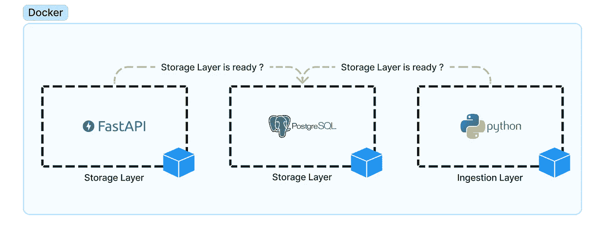

# 简单数据管道的设计、开发和部署

> 原文：<https://medium.com/geekculture/design-development-and-deployment-of-a-simple-data-pipeline-6f1d59d0fd6a?source=collection_archive---------0----------------------->

数据工程技术挑战(第一部分)

Dockerizing a simple data pipeline

本文以解决数据工程职位的一个技术难题为基础，在本文的开发过程中，我们将展示要遵循的所有步骤，以便设计一个快速解决该难题的解决方案，然后部署它，我们将遵循接下来的步骤，我将尝试直接进入要点…