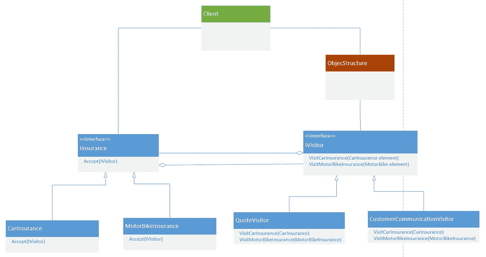
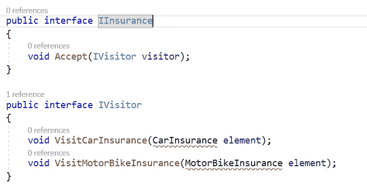
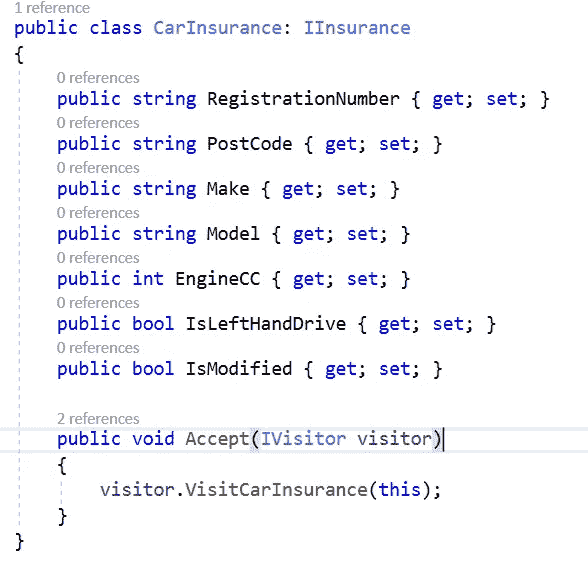
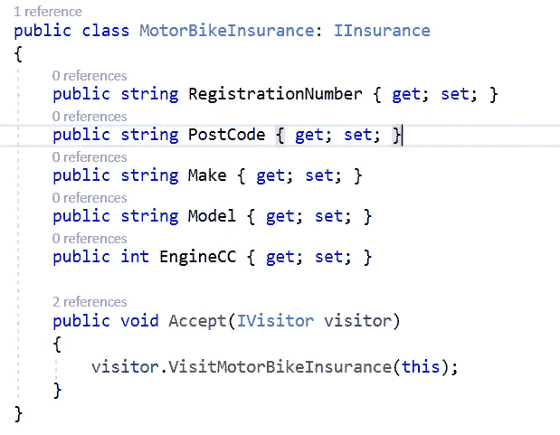
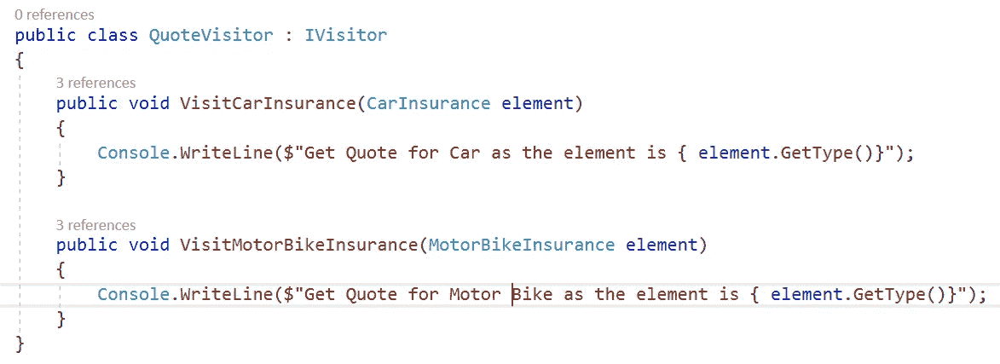
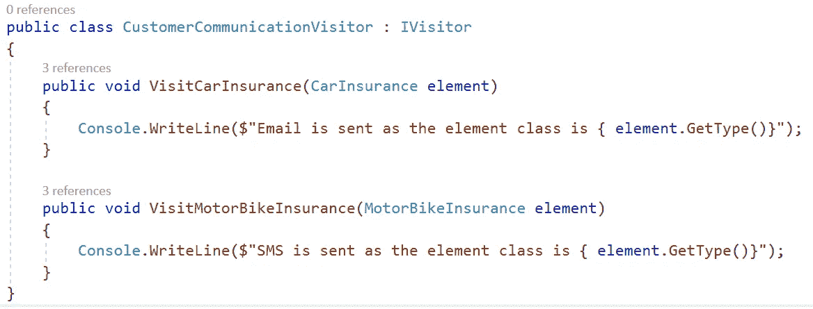
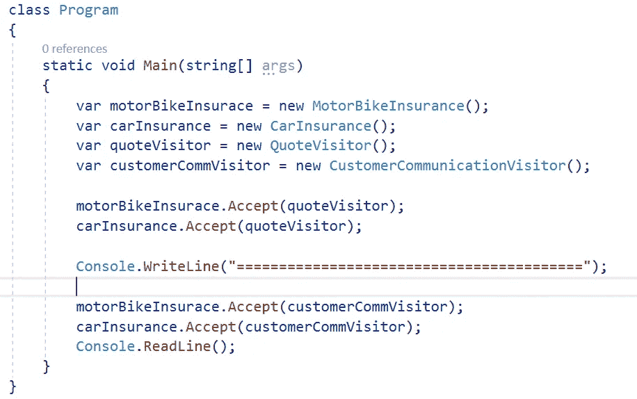

# [设计模式]访问者模式——c#代码示例中最复杂的设计模式

> 原文：<https://medium.com/geekculture/design-pattern-visitor-pattern-the-most-complicated-design-pattern-with-c-code-sample-f88b608ffb4a?source=collection_archive---------1----------------------->

Photo by [Tran Phu](https://unsplash.com/@phuhunter142?utm_source=medium&utm_medium=referral) on [Unsplash](https://unsplash.com?utm_source=medium&utm_medium=referral)

# 语境

几周前，我和我的同事在午餐时间花了一个多小时讨论并找到了以下问题的答案:

> "你用过的最复杂的设计模式是什么？"

而且，我们大多认为最复杂的是“**访客模式**”。你可以同意或不同意我们，这是你的选择。但是现在不要离开这篇文章，请带着我要给你看的样本一直读到最后。谁知道呢？你可能会改变主意:)

为了证明我们的答案是正确的，我决定把关于访问者设计模式的问题带到我作为面试官参加的 10 次面试中。所有候选人都是资深开发人员(5 年以上的经验)。结果是:

*   10 个候选人中有 4 个可以通过示例向我解释它是什么以及它是如何工作的。
*   在实际项目中，四分之一的访问者模式被使用。
*   4 个人中有 4 个人同意我的观点，认为“**游客模式**”可能是最复杂的一种。

# 什么是**访客设计模式**？

Photo by [Júnior Ferreira](https://unsplash.com/@juniorferreir_?utm_source=medium&utm_medium=referral) on [Unsplash](https://unsplash.com?utm_source=medium&utm_medium=referral)

“ **Visitor** ”是一种属于“**行为**”设计模式类型的设计模式。任何属于**行为模式**的模式都将关注于类和对象如何交互和分配责任。

*除了“* ***行为*** *”之外，你可能还体验过“* ***创造型*** *”和“* ***结构型*** *”通过非常著名和流行的类型如***(创造型)* ***门面****

> ***Visitor** 设计模式是一种将算法从它所操作的对象结构中分离出来的方式。这种分离的实际结果是能够在不修改结构的情况下向现有对象结构添加新操作。这是遵循开放/封闭原则的一种方式。— [维基](https://en.wikipedia.org/wiki/Visitor_pattern)。*

*听起来很复杂，对吧？好的，让我给你一个例子。*

*您有一个名为“Student”的对象，它有一个名为“Study”的方法。但是除了学习，学生也需要玩。现在您需要向“学生”对象添加另一个名为“Play”的方法，对吗？这里的问题是，向“学生”对象添加一个新方法会违反“开放/封闭”原则。通过使用访问者模式，您可以在不修改学生对象的情况下添加游戏行为。换句话说，当您必须添加新行为时，您不必修改学生对象。*

# *结构(UML 图)和剖析*

**

*figure 1: Visitor Design Pattern structure*

*   ***IElement** :这个接口只有一个名为*“Accept”的方法。**【接受】*方法采用了“*IVisitor”*接口的参数。*
*   ***IVisitor:** 这是一个接口，它为所有实现“*ie element”*接口的类提供了方法。从上图可以看出，*“I element”*接口是由*“concretelementclassa”*和*“concretelementclassb”——*实现的，这就是为什么有两个方法 *IVisitor* 接口:*visit class sa(class a)*和*visit class sb(class b)*。*
*   ***ConcreateVisitor**(ConcreateVisitor 1 和 ConcreateVisitor 2):这实现了 Visitor 声明的所有方法。每个 ConcreateVisitor 为结构中相应的类/对象实现一个行为。*
*   *ConcreateElement(ConcreateElementClassA 和 ConcreateElementClassB):这实现了“Accept”方法，该方法具有将访问者作为参数的方法。*

**还不清楚？**

*好了，让我们转到下一个需要深入研究代码的部分。*

# *访问者设计模式示例*

**

*Photo by [Arnold Francisca](https://unsplash.com/@clark_fransa?utm_source=medium&utm_medium=referral) on [Unsplash](https://unsplash.com?utm_source=medium&utm_medium=referral)*

*假设我们为一家拥有统一平台的保险公司工作，销售多种类型的保险，如摩托车保险、汽车保险…所有保险产品在获取报价时都有相同的逻辑…只是使用不同的问题集，以及我们需要与买家沟通，但汽车使用电子邮件，而摩托车使用短信。当你得到你的车的报价时，你需要提供问题的答案“这辆车是右座还是左座？”当您得到摩托车的报价时，此问题不适用。*

*现在，该示例的 UML 图将如下所示*

**

*figure 2: Visitor Design for Insurance Company*

*首先，我们需要按照设计创建**“保险”和“IVisitor”**接口*

**

*figure 3: IInsurance and IVisitor interface*

*之后，我们需要创建从" **IInsurance"** 接口继承的元素类*

**

*figure 4: Car Insurance element class*

**

*figure 5: Motor Bike Insurance element class*

*这些类有不同的属性集，你也可以给它们添加不同的方法。但两者都有“**接受**的方法。*

*接下来，我们需要实现 **Visitor** 类。基于所提供的参数，这些类将包含每个**元素**类的特定逻辑。*

**

*figure 6: Quote VIsitor class*

**

*figure 7: CustomerCommunication Visitor class*

*最后一步，让我们在客户端调用它，看看它是如何工作的*

**

*figure 8: Call Visitor classes*

*这是结果*

**

*figure 9: Everything works as expected*

> *注意:您可以在我的 Github 上找到源代码示例*

* [## thanh le 0212/访问者设计模式

### 这个存储库包含了我曾经使用过的最复杂的设计模式的代码样本。这个…

github.com](https://github.com/thanhle0212/Visitor-Design-Pattern) 

# 访问者设计模式的优点和缺点

Photo by [Ivan Bandura](https://unsplash.com/@unstable_affliction?utm_source=medium&utm_medium=referral) on [Unsplash](https://unsplash.com?utm_source=medium&utm_medium=referral)

访问者设计模式为我们的应用程序带来了以下好处:

*   新的操作很容易添加，不需要改变元素类(添加一个新的具体的访问者)。因此，不同的具体元素不必实现特定算法中它们的部分。
*   相关行为只关注单个具体的访问者。
*   被访问的类不会被强制共享一个公共基类。
*   访问者可以在访问每个元素时累积状态，从而封装算法及其所有数据。

但是它也有以下问题:

*   我们必须为每一个新元素改变所有的访问者。
*   许多访问者会使用空方法来遵守接口。

# 结论

有些人可能不喜欢访问者模式，因为它不容易实现，也有缺点。

但是，在以下情况下，您可以考虑应用访问者模式:

1.  一个对象结构必须有许多不相关的操作来执行。
2.  对象结构不能改变，但对其执行的操作可以改变。
3.  需要在对象结构的具体类上执行的操作。
4.  公开对象结构的内部状态或操作是可以接受的。
5.  操作应该能够对实现相同接口的多个对象结构进行操作。

# 参考

 [## 软件开发中应该避免的反模式

### 反模式与设计模式相反，是不可取的。我们应该了解它们是什么和…

medium.com](/@letienthanh0212/anti-patterns-in-software-development-that-you-should-avoid-780841ce4f1d)  [## [.ASP 中的依赖注入。网络核心——“老而金”

### 在本文中，我们将讨论依赖反转原则(DIP)、控制反转(IoC)和依赖…

medium.com](/@letienthanh0212/net-core-dependency-injection-in-asp-net-core-7fdf5e1cc200)  [## 【微服务架构】什么是 SAGA 模式，有多重要？

### SAGA 模式是微服务架构中的重要模式之一。让我们看看什么是传奇模式以及如何…

medium.com](/swlh/microservices-architecture-what-is-saga-pattern-and-how-important-is-it-55f56cfedd6b)  [## 【微服务架构】什么是断路器，如何用实现。网芯？

### 在应用微服务架构时，断路器是“必须具备的”设计模式之一。那是什么？以及如何…

medium.com](/swlh/microservices-architecture-what-is-circuit-breaker-design-pattern-and-how-to-implement-it-with-ne-ca68fe333d22)*