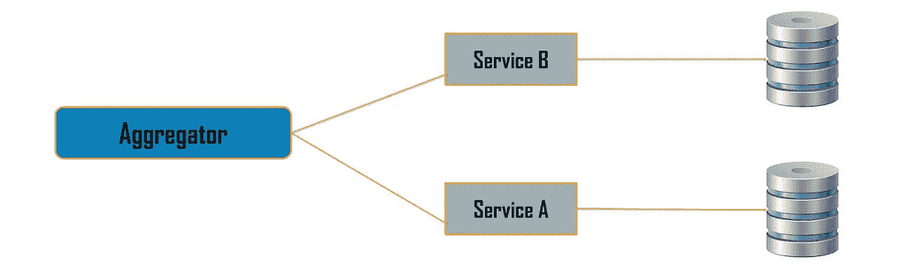
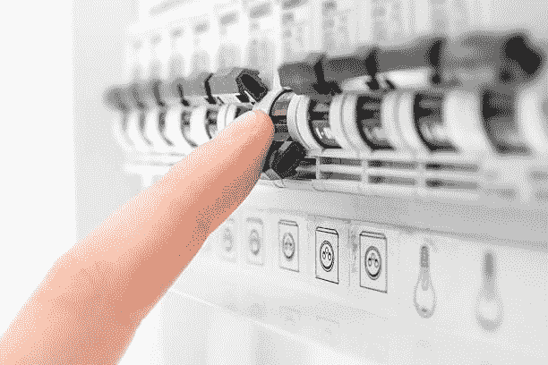
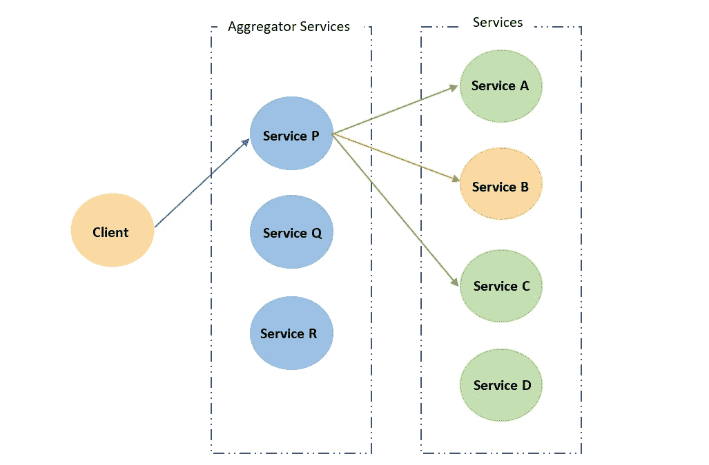
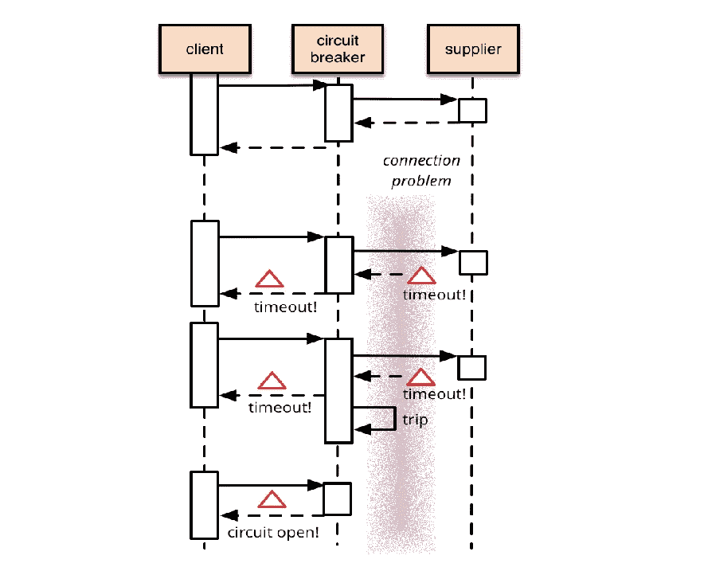
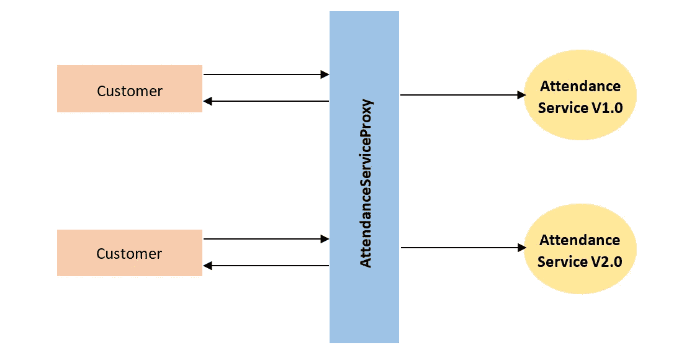
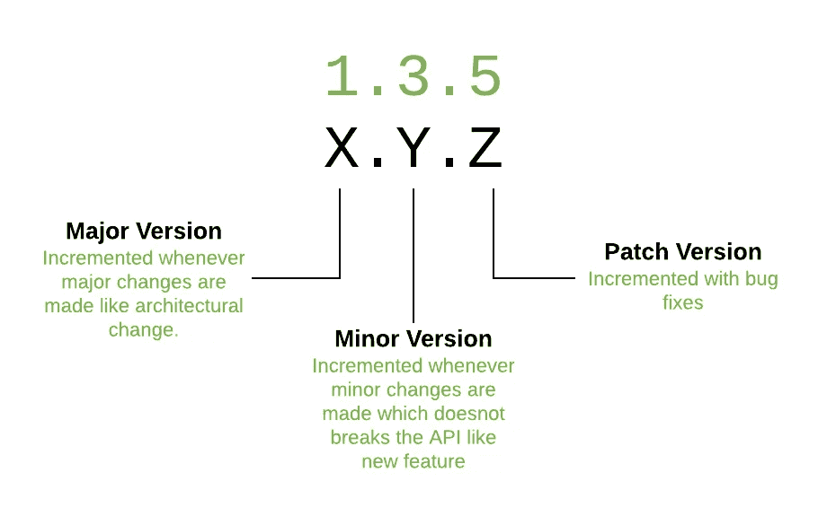

# 微服务的设计模式

> 原文：<https://medium.com/geekculture/design-patterns-for-microservices-5362689581c4?source=collection_archive---------1----------------------->

在之前的博文中，我们介绍了从单片到微服务架构的迁移。如果你还没有阅读过[上一篇文章](https://jdewapura.medium.com/monolithic-to-microservices-ce043a3be80c)，我建议你在阅读这篇文章之前先阅读一下。

在本文的最后，您将了解用于微服务的三种不同的设计模式。

*   聚合器模式
*   断路器模式
*   代理模式

# 聚合器模式

我们都知道微服务是把应用设计成独立服务的集合。这些服务可能不代表应用程序的特定功能。因此，聚合器模式调用几个微服务来实现其功能。换句话说，聚合器模式用于在服务之上开发聚合器服务。

我们举个例子来适当理解一下。假设我们要设计一个员工管理系统。因此，项目架构将以几个不同的服务结束，这里我考虑其中的四个。

*   获取员工信息
*   获取出勤信息
*   获取性能信息
*   获取项目分配信息

光靠这些服务什么都做不了。因此，这个应用程序应该有计算雇员工资的功能。它必须调用两种不同的服务，如员工信息和出勤信息。应该集成这两个服务来实现这一功能。因此，我们可以开发一个聚合服务来操作这两个服务，并将响应发送给客户端。实现聚合服务并不是一件很浪费时间的事情。假设有一天，这家公司改变了它的商业计划。所以，他们的工资计算应该与员工的表现相结合。这就是聚合模式的重要性。您可以简单地开发另一个聚合服务来获得新的功能。

Aggregator Pattern

使用聚合模式有三种不同的方式。

*   链式模式
*   平行模式(分散聚集模式)
*   分支模式

## 链式模式

假设我们有两个服务，分别叫做 A 和 b。在继续处理服务 b 的请求之前，我们需要从 A 的响应中获得一些信息。换句话说，A 需要在启动 b 之前完成。这称为链接过程，它可以通过链模式来实现。

这通常发生在单片应用程序转换为微服务时。此外，一些过程应该一个接一个地发生。例如，考虑一个银行应用程序，交易应该在验证帐户余额大于交易金额后继续进行。

## 平行模式

在应用程序中，一些服务可以同时进行以获得单一功能。让我们假设 A 和 B 服务可以独立执行。每个服务需要 10 毫秒才能完成。在收到来自两个服务的每个响应后，就会发生聚合。理论上，如果我们使用并行聚合，此功能可以在 10–15 毫秒内完成。但是连锁模式相继进行这些服务。这意味着整个功能需要超过 20 毫秒。因此，微服务鼓励尽可能使用并行聚合。

## 分支模式

一些应用程序在执行下一个服务之前需要做出决策。让我们假设 A、B 和 C 是三种不同的服务。先 A 执行，然后 B 或 C 根据 A 的响应执行，所以，有 A 执行后的决策情况。这就是所谓的分支聚集。

# 断路器模式

在进入断路器模式之前，你应该知道断路器是用于电力的。断路器位于主电网和房屋内部电路之间。它保护你家的电路免受过电流/过载或短路造成的损坏。断路器模式背后的基本思想与这个过程非常相似。

当您有多个服务时，服务有可能从几个后端调用。正如我上面提到的，这些服务被聚合起来以提供应用程序功能。当服务器收到客户端的请求时，它会分配一个线程来调用后端。例如，A、B 和 C 服务可能涉及提供 P 功能(聚合器服务)。有时，由于网络连接缓慢、超时等原因，这些服务(服务 B)不可用。因此，这些请求将在线程池中等待，直到超时或响应到达。因此，剩余的请求将被阻塞，直到服务恢复。它被称为级联队列。但是，如果服务 B 被恢复，它将尝试处理队列中的那些请求。因此，服务将再次中断。断路器模式可以克服这个问题。

在断路器模式中，所有服务都有预定义的阈值，并通过响应时间对它们进行监控。假设服务 B 的响应时间通常不到 100 毫秒，超时阈值为 200 毫秒。在某些情况下，超过 50%的请求达到了阈值上限(150–200 毫秒)。那么这个服务就被标记为慢慢下降。如果出现的次数超过 200 毫秒，消费者认为服务 B 不再响应。因此，下一个想要访问服务 B 的请求会立即失败。这意味着它中断了聚合服务和服务 b 之间的连接。因此，请求不会等到超时。

消费者经常在后台向服务 B 发送 ping 请求。如果恢复，它将再次连接到聚合器服务。由于服务停机期间所有请求的失败，服务可以用新的请求启动。

# 代理模式

当考虑一个典型的应用程序时，客户需求可能会经常改变。因此，服务需要随着新功能而改变。此外，应用程序可能有一些补丁更新。这是代理模式适合系统的地方。代理模式可用于管理特定服务的几个不同版本，直到消费者升级到新版本。

我们举个例子来了解一下。在我们的员工管理系统中，工资计算服务与 3 种不同的服务一起工作。考勤信息服务就是其中之一。随着时间的推移，公司希望以适当的方式记录出勤情况。所以，考勤服务有了新的标准。但是，喜欢工资计算服务的消费者可能不会改变他们的服务。因此，我们需要部署两个不同版本的考勤服务，直到所有消费者都迁移到新版本。

为了获得它，开发人员需要在消费者和服务的不同版本之间创建一个代理服务。如果使用者访问旧版本的服务，代理服务会将请求定向到旧版本。否则，它将指向新版本。

使用代理模式，您可以独立地部署您的服务，而不会打扰您的消费者。将来，如果您看不到旧版本的任何流量，您可以停用该版本。

**语义版本**

正如我上面提到的，当部署服务的几个版本时，它应该是一个类似语义版本化的标准。在语义版本控制中，有三个数字称为主要版本、次要版本和补丁。

**主要**——当开发人员添加可能破坏现有 API 的新特性时。

**次要**——当开发者添加新特性时，不会破坏现有的 API。

**补丁**—bug 修复时。

这里说到本文的结尾，希望你明白设计模式在微服务中的重要性。如果我漏掉了什么，请在评论区告诉我。保持联系。快乐学习！

# 参考

[微服务设计模式第 1 部分](https://www.youtube.com/watch?v=DZeXqbFvYNA&list=PLD-mYtebG3X9HaZ1T39-aF4ghEtWy9-v3&index=5)

[微服务设计模式第二部分](https://www.youtube.com/watch?v=mw8W-RpvCu0&list=PLD-mYtebG3X9HaZ1T39-aF4ghEtWy9-v3&index=6)

[微服务设计模式第三部分](https://www.youtube.com/watch?v=7mBvb7nKONg&list=PLD-mYtebG3X9HaZ1T39-aF4ghEtWy9-v3&index=7)

 [## 微服务设计模式|微服务模式| Edureka

### 在当今的市场上，微服务已经成为构建应用程序的首选解决方案。众所周知，它们可以解决…

www.edureka.co](https://www.edureka.co/blog/microservices-design-patterns)  [## 断路器

### 软件系统对运行在不同进程中的软件进行远程调用是很常见的，可能是在不同的…

martinfowler.com](https://martinfowler.com/bliki/CircuitBreaker.html)  [## 微服务指南

### 软件系统对运行在不同进程中的软件进行远程调用是很常见的，可能是在不同的…

martinfowler.com](https://martinfowler.com/microservices/)