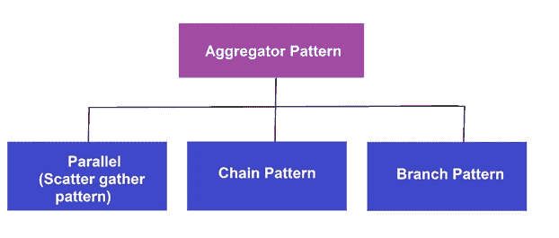
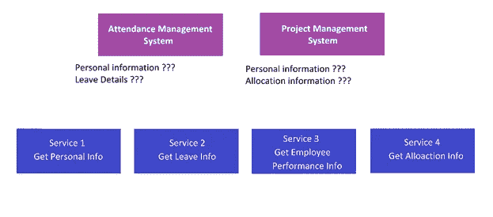
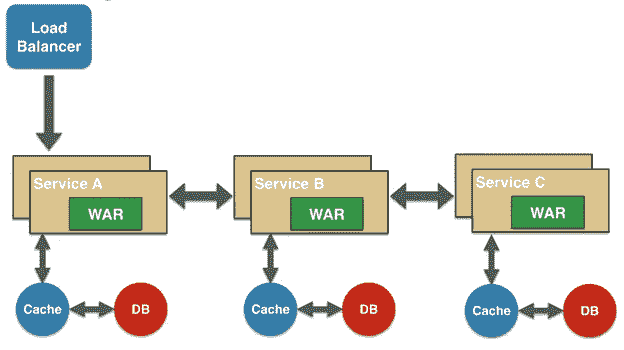
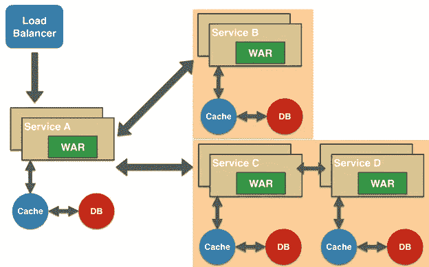
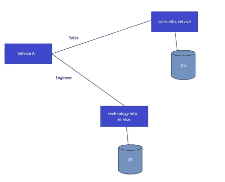

# 聚合模式(微服务的设计模式)

> 原文：<https://medium.com/geekculture/design-patterns-for-microservices-aggregation-pattern-1b8994516fa2?source=collection_archive---------1----------------------->

[Designed by katemangostar](http://www.freepik.com)

如果您是微服务的新手，我建议您阅读我之前的文章，了解一些基本的微服务原则。

*   [**Docker 和基于容器的开发简介**](https://hasithas.medium.com/introduction-to-docker-and-container-based-development-da700dd3a6b5) **。🐋**
*   [**Web 应用到微服务(我们到底用不用？).**](https://hasithas.medium.com/web-application-to-microservices-do-we-use-it-or-not-d0ca2104ce4) **💻**
*   [**微服务最佳实践**](/geekculture/best-practices-for-microservices-191d17ebdb43) **。✅**

所以，如果你擅长微服务，准备好学习微服务设计模式。在本文中，我将向您解释聚合模式。

聚合器设计模式描述了一个服务，它获得一个请求，然后向不同的服务发出几个请求，组合结果，然后响应最初的请求。

聚合模式有 03 个不同的分支(实现聚合模式的 03 种方式)

**😮使用案例:**

商业金融是一家全球性的金融服务公司。他们当前的员工管理系统使用的是整体架构。Mercantile Finance 的 IT 团队决定将他们的系统迁移到微服务架构，因为微服务是趋势，并且消除了单片应用程序的大多数困难。Mercantile Finance 决定将他们的系统外包出去，因为对于他们的 it 团队来说，这是一个庞大而复杂的系统。

你是一名 IT 公司的软件工程师，商业金融公司的系统是外包的。因此，对于 Mercantile Finance 的员工管理系统，您的技术主管希望您实现一些微服务。因此，使用 DDD(领域驱动设计)，你想出了下面列出的系统服务。

**🔩服务 1:获取个人信息。**

**🔩服务二:获取请假信息。**

**🔩服务三:获取员工绩效信息。**

**🔩服务 4:获取分配信息(哪个项目员工在工作，分配了哪些工作)。**

💠所以现在您有 04 个不同的服务要实现。还有一些其他的**现有的**服务作为消费者由商业金融 IT 团队实现。这些现有的消费者服务是**考勤管理系统**和**项目管理系统**。

💠下一步，您决定继续进行并实现这些微观级别的服务，然后为该服务创建 dockers 并部署它们。

💠现在问题来了…！🤔

*   **考勤系统**没有获取**个人信息**和**请假信息**的服务。
*   **项目管理系统**没有同时获取**个人信息**和**分配信息**的服务。

💠这是因为除了这些服务的设计目的之外，这些服务本身不会做任何事情(“做一件事，把它做好”)

💠作为一个**解决方案，**您可以创建一个聚合服务(您也可以创建一个代理)来消费 02 微服务，并将响应返回给消费者。

**例如:**创建一个新的服务来消费获取个人信息服务和获取休假信息服务，然后将响应发送到考勤管理系统。

💠因此，这个新创建的服务将接收来自消费者的请求，然后它将调用个人信息服务并获取休假信息服务。

💠然后，新创建的服务将聚合来自这两个服务的响应，并将响应发送给消费者。

💠这就是聚合器的基本工作方式。现在让我们看看如何用相关用例的**并行**和**分散**和**分支**模式实现聚合器。

# 平行聚集(分散聚集模式)

💠在并行聚合中，请求被并行发送给必要的服务。然后，聚合响应，并将响应发送回消费者。

**😮并行聚合的使用案例**

💠当考勤服务被调用时，并行调用被发送到个人信息和休假信息。获取响应，汇总它们并将其发送到考勤服务。

💠当出勤服务被调用时，您可以向个人信息发送并行呼叫。服务和休假信息。服务。然后从两个服务获取响应，并将它们聚合为对考勤管理的单个响应。系统(消费者)。

# 链模式(服务链)

💠与链中的并行聚合不同，模式请求不是并行发送给服务的。

💠假设有 3 个名为 A、B 和 C 的服务以链式模式实现(如下图所示)。根据链模式，它的工作方式是，消费者首先向服务 A 发送请求，然后服务 A 向服务 B 发送请求，最后服务 B 向服务 C 发送请求(消费者> A > B > C)。最佳实践是保持链条长度最小。

[Chained Microservice Design Pattern](http://web.archive.org/web/20190705163602/http://blog.arungupta.me/microservice-design-patterns/))

**😮用例链模式**

💠当一个服务依赖于另一个服务时，使用链模式。

💠休假系统仍然在以前的版本中，它不知道在数据库中获取带有员工 id (empId)的数据。相反，它发送雇员代码(empCode)来获取数据。

💠所以，作为一个解决方案，你可以调用个人信息。服务并从中获取员工代码(empCode)。然后将员工代码(empCode)传递给休假信息服务(连同其他信息)并获取休假信息。现在，您可以将聚合的响应发送回消费者。

💠不一定要从第一个服务中得到什么，而是一个接一个。

## **并行和链式模式的时间消耗⏰**

💠假设，个人信息。服务消耗 10 毫秒并留下信息。服务消耗 10ms。

💠如果我们使用并行聚合，您可以在 10ms 内获得两种信息(理论上是这样，实际上是不可能的),并且可以在大约 15ms 内将响应传递给消费者。

💠如果我们使用服务链方法(一个接一个),发生的情况是第一次调用需要 10 毫秒，第二次调用需要 10 毫秒，总共需要 20 毫秒，传递响应可能需要 25 毫秒左右

# 分支聚集

[Branch Microservice Design Pattern](http://web.archive.org/web/20190705163602/http://blog.arungupta.me/microservice-design-patterns/)

💠基于一个因素，决定服务下一步应该去哪里。分支聚合可用于根据需求调用不同的链或单个链。

**😮用例分支聚合**

💠有一个服务，用户发送用户 id (userId)和分支代码(branch code)。此请求将发送到个人信息服务。

💠然后，如果分支机构代码(branch code)是“sales ”,则请求下一步转到 sales info。服务，或者如果分支机构代码(branch code)为“工程师”，则请求应转至技术信息。服务。

💠使用聚合器模式的主要**优势**是需求的灵活性。

**🤔用例**

💠您为考勤系统和项目管理系统实现了上面提到的 04 和其他聚合服务。现在一切都完成了，你可以投入生产了。

💠但是后来项目管理团队决定在为关键项目分配员工之前检查员工的休假信息。系统的业务逻辑因此而改变)。

**✅方案**

💠您可以创建一个新闻聚合服务。因此，这个新创建的服务将调用所有 3 个服务(个人信息。服务，留下信息。服务、分配信息。服务)。

💠现在，项目管理系统有了两个不同的聚合服务。因此，您可以将这两种服务都部署到生产环境中。然后，您可以让消费者知道有一个新更新的服务，您可以迁移到那个服务。

> 您有没有想过，您不需要为这个需求对现有的 main 04 服务进行任何更改？酷吧…😎

💠因此，现在消费者可以(根据他们的时间表)迁移到新创建的服务。毕竟，消费者迁移了(您可以监视日志以查看旧服务是否仍在使用)您可以关闭以前的服务并保留更新的版本。

> 因为聚合服务不执行任何处理或任何转换，业务逻辑。它们不需要太多的计算能力。

# 授权和认证流程

💠当实现聚合服务时，您应该非常注意授权和身份验证是如何流动的。

💠假设您正在用 OAuth2 验证请求。因此，如果每个服务验证您的令牌，并且每个验证需要 5 毫秒，那么新创建的聚合服务将需要 15 毫秒来验证您的令牌。因此，在不同的服务上进行令牌验证是一项耗时的任务。

💠因此，最佳做法是拥有单独的身份管理服务，并通过该身份管理服务重定向流量(来自聚合服务)

> 由于在响应周期中，每一秒都很重要，所以您应该尽可能地节省往返时间。

💠最后，在向服务引入新的授权和身份验证机制时，要确保没有漏洞。

反正这篇文章就讲到这里。在未来，我们将更多地讨论设计模式。请在下面的评论区分享你的想法和建议。谢谢您们。

# 参考

 [## 微服务设计模式

### 基于微服务的应用程序的主要特征在微服务、单片和 NoOps 中定义。他们…

web.archive.org](http://web.archive.org/web/20190705163602/http://blog.arungupta.me/microservice-design-patterns/)  [## 微服务设计模式- DZone 云

### 基于微服务的应用程序的主要特征在微服务、单片和 NoOps 中定义。他们…

dzone.com](https://dzone.com/articles/microservice-design-patterns)  [## 构图模式

### 软件合成意味着构建你的软件产品的方法。基本上，它处理高级软件…

www.tutorialspoint.com](https://www.tutorialspoint.com/microservice_architecture/microservice_architecture_composition_patterns.htm)  [## 微服务聚合器模式

### 2020 年 3 月 23 日|作者:Marty Abbott 4 分钟阅读聚合器模式概述聚合器设计模式是一个…

akfpartners.com](https://akfpartners.com/growth-blog/microservice-aggregator-pattern)