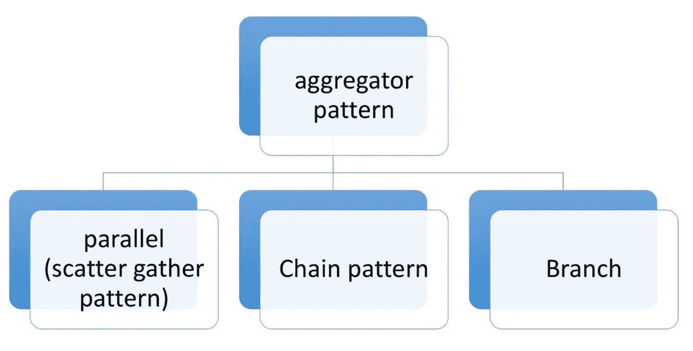
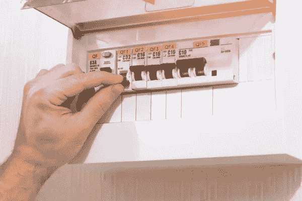
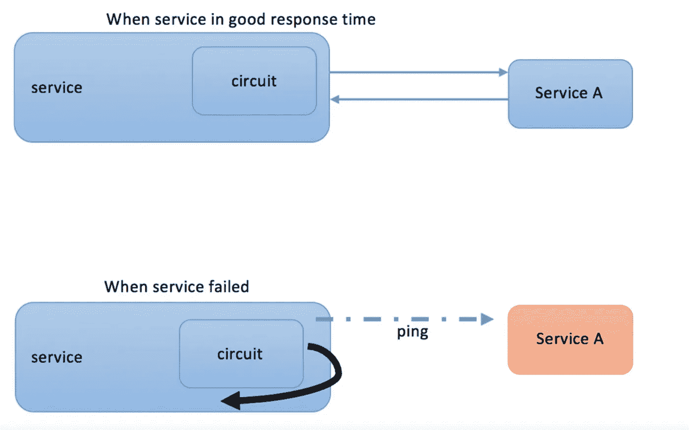
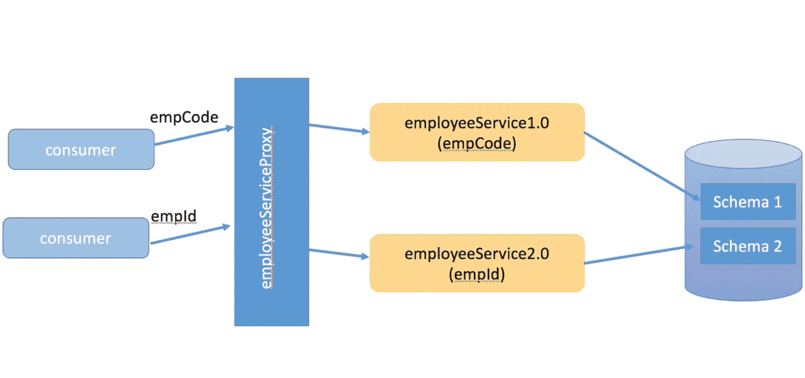

# 微服务的设计模式(聚合器、电路和代理)

> 原文：<https://medium.com/geekculture/design-patterns-for-microservices-aggregator-circuit-and-proxy-61cf2124b979?source=collection_archive---------17----------------------->

欢迎回到另一篇文章。正如我在上一篇文章中承诺的，这篇文章是关于微服务的设计模式的。在我开始之前，如果你是微服务的新手，你可以参考我以前关于微服务的文章。我发表了两篇文章，分别是微服务介绍和微服务最佳实践。如果你在这个软件工程领域至少工作了几年，你应该已经听说过设计模式。在这篇文章中，我将解释微服务的设计模式。正如您所知，本文将主要涵盖三种设计模式，它们是:

1.  聚合器设计模式
2.  电路断路器模式
3.  代理模式

所以我们一个一个来搬。

# 1.聚合器设计模式

聚合器设计模式可以通过三种不同方式实现。那些是，

1.  平行/分散收集
2.  链子
3.  树枝

我们举个例子来解释一下那三种类型。假设我们要为一个学校设计一个微服务系统。

服务 1-获取学生的个人信息

服务 2-获取学生缺勤信息

服务 3-获取学生的科目分数

服务 4-获取学生参与的课外活动信息

然后我们有两个消费者，他们是**考勤管理系统**和**学生颜色管理系统。(学校的颜色是给在某个方面表现特别的学生，可以是体育或任何其他课外活动)**

如你所知，在微服务中，我们为每个服务实施一项彼此独立的服务。但是在这里考勤管理系统需要消耗学生个人信息和学生缺勤信息。学生色彩管理系统需要学生个人信息和课外活动信息。那么现在我们如何解决这个问题呢？

我们可以做的是创建一个服务来消费我们需要的这两个微服务，并向消费者提供反馈。

## 平行/分散收集

在并行聚合中，我们可以向个人和缺勤服务发送一个并行调用，并获取这些响应，然后将这些响应聚合为一个响应并发送给消费者。

## 链子

假设缺勤信息系统与个人信息系统存在依赖关系。因此我们不能使用并行模式。因此，我们可以调用个人信息服务，获取包含其他所需信息的学生代码，然后将该代码传递给缺勤信息系统，获取学生缺勤信息，您可以将聚合器响应返回给消费者。

链式聚合模式比并行模式花费更多的时间。因为链式模式会调用一个服务，然后像 wise 一样调用另一个服务(就像一条链)

## 树枝

分支模式是关于**基于一些因素你决定走这条路还是那条路**。这就像编程中的 if 条件基于一些因素决定做这个或那个。例如，在用户界面的银行应用程序中，您必须选择存款或取款。因此，如果用户选择取款，它将与取款服务连接，否则，如果用户选择存款，它将与存款服务连接，并执行其余的任务。

聚合器设计模式的优势

1.  添加聚合服务更容易。
2.  易于实施

# 2.断路器模式

如果你的房子是用电供电的，那么肯定有断路器。断路器是自动操作的电气开关，保护电气**电路**免于过载或短路。断路器模式的行为几乎类似于断路器设计模式。

在分布式系统中，我们不知道其他服务会如何中断。所以作为开发者，你有责任保持服务的活力。现在假设我们有五个微服务，并且我们有一个 web 服务器来调用它们。现在你得到一个请求，意味着服务器分配一个线程来调用后端。现在服务延迟了，所以这个线程一直等到超时。如果此服务要求很高，如果请求越来越多，线程池中的所有这些线程都需要等待。那么对您的服务的剩余请求将被阻塞或排队。然而，web 服务器不会恢复，因为当它处理队列时，越来越多的请求会到来。有时会出现级联故障的情况。**级联故障意味着如果一个服务需要很长时间来响应，它会影响到下一个服务，然后影响到另一个服务。**

我们都知道，每一项服务都会在某个时候失败或瘫痪。这是天性。断路器允许您的系统优雅地处理这些故障。在断路器模式中，我们可以定义**超时阈值**。例如，服务 A 应该在 200 毫秒内做出响应。如果请求数量达到阈值的上限(150 到 200 毫秒)，那么我们可以说服务正在缓慢失败。如果在 200 毫秒(最大阈值超时)内没有响应，代理将理解为没有响应。然后，如果任何其他请求来访问服务，这些不会等到超时。这些请求返回给消费者，并显示错误消息，说明服务不可用。

断路器有 3 种状态。那些是，

1.  **闭合—** 当一切正常时，断路器保持闭合状态，所有呼叫都转到服务。
2.  **打开—** 断路器在未执行功能的情况下返回呼叫错误。
3.  **半开—** 超时后，电路切换到半开状态，以测试潜在问题是否仍然存在。如果在这种半开状态下单个呼叫失败，断路器将再次跳闸。如果成功，断路器复位回到正常闭合状态。

消费者经常在后台向服务发送 ping 请求。如果它回来了，它将再次连接到服务。

# 3.代理模式

有时，客户需求可能会随时间而变化。此外，服务会不时更新。这就是为什么我们必须遵循我在上一篇文章中提到的微服务最佳实践的正确版本。最好遵循语义版本化，即主要版本、次要版本和补丁。

当我们不断更新我们的服务时，这就是代理模式发挥作用的地方。**代理模式可以用来管理某个特定服务的几个不同版本，直到所有的消费者都升级到新版本。**看看下面的例子。

在 1.0 版本的上述场景中，员工的详细信息使用员工代码(empcode)通过数据库。但是在 2.0 版本中，员工的详细信息是使用员工 id(empid)通过数据库获得的。因此，在这里，代理所做的是，如果消费者发送 1.0 版中的 empcode，它将定向到模式 1。当用户发送版本为 2.0 的 empid 时，它会将其定向到模式 2。所以现在我们可以同时拥有两个版本的服务。当所有的消费者都更新到 2.0 版本时，我们可以将 1.0 版本解耦。

就这样，伙计们。你已经读到了这篇文章的结尾，我希望你了解这三种设计模式，即聚合器、电路和代理。那么让我们从另一篇文章来认识一下。保持联系。

# 参考

 [## 断路器和微服务架构|持续接触技术博客

### 到目前为止，众所周知，微服务架构有许多优势。这些包括低耦合…

techblog.constantcontact.com](https://techblog.constantcontact.com/software-development/circuit-breakers-and-microservices/)