# 断路器模式(微服务的设计模式)

> 原文：<https://medium.com/geekculture/design-patterns-for-microservices-circuit-breaker-pattern-276249ffab33?source=collection_archive---------1----------------------->

Source: [https://womenyoushouldknow.net/](https://womenyoushouldknow.net/)

在一个[分布式系统](https://en.wikipedia.org/wiki/Distributed_computing)中，我们不知道其他组件会如何失效。网络问题可能会发生，组件可能会出现故障，或者路由器或交换机可能会损坏。我们不知道会出什么问题。
因此，分布式系统中的每个组件都有责任保持活力。作为一名软件工程师，你有责任让他们活下去。

# 什么是断路器？

🌟要了解断路器设计模式，您应该首先了解断路器。

🌟如果你家是用电的，我肯定你家有断路器。当你从主电网获得电力时，它会通过一个断路器。

🌟断路器是一种自动操作的电气开关，用于保护电路免受过载(例如:雷击)或短路造成的损坏。其主要目的是在发现缺陷时停止电流，保护您家中的电器。

🌟你想知道这一点是因为，断路器的工作方式或多或少与断路器设计模式非常相似。

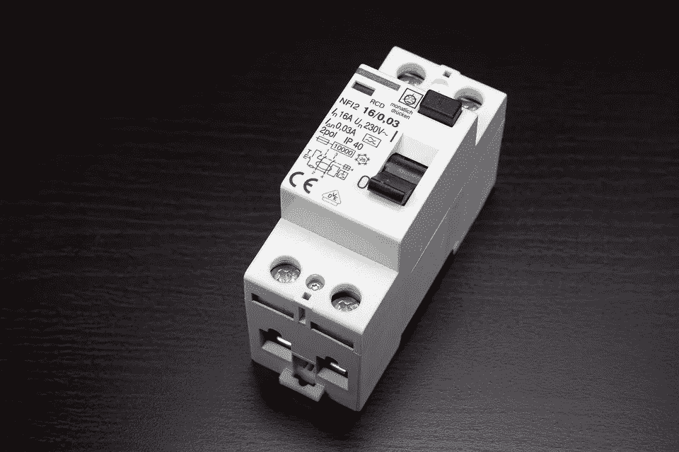

Circuit breaker (Source: [https://pixabay.com/users/diermaier-1497330/](https://pixabay.com/users/diermaier-1497330/))

# 断路器模式

🌟顾名思义，断路器设计模式用于在服务不工作时停止请求和响应过程。

Figure 1: [Circuit Breaker Pattern](https://www.edureka.co/blog/microservices-design-patterns#CircuitBreaker)

🌟例如，假设一个消费者发送一个从多个服务获取数据的请求。但是，由于技术问题，其中一项服务不可用。现在你将面临两个主要问题。

*   首先，因为消费者不会意识到某个特定的服务不可用(失败)，所以请求会被持续发送到该服务。
*   第二个问题是，网络资源将被耗尽，性能和用户体验很低。

> 我们将通过用例来讨论这些问题。继续读下去😃

🌟您可以利用断路器设计模式来避免这样的问题。消费者将使用这种模式通过代理调用远程服务。该代理将充当电路屏障。

🌟当故障数量达到某个阈值时，断路器在规定的持续时间内跳闸。

🌟在此超时期间，对脱机服务器的任何请求都将失败。当该时间段结束时，断路器将允许有限数量的测试通过，如果这些请求成功，断路器将返回正常操作。如果出现故障，超时周期将重新开始。

> 🤔仍然对断路器模式的工作原理感到困惑。我相信在这篇文章结束时你会有更好的想法。

但在我们深入了解更多细节之前，我想让你熟悉两件事，

1.  我们将在本文中使用的主要用例。
2.  如果我们的服务失败，可用性会产生怎样的影响。

# 断路器的主要使用案例

🌟这将是我用来解释断路器模式的几个用例的主要例子。

🌟如果你读过我以前的微博客，你可能对商业金融的例子很熟悉。

🌟如果你不熟悉我以前的博客，不要担心。因为你不需要知道整个场景。(但我希望您熟悉聚合模式)。

🌟您已经使用微服务架构实现了 Mercantile Finance 的员工管理。该系统具有以下服务。

*   🔩服务 1:获取个人信息。
*   🔩服务二:获取请假信息。
*   🔩服务三:获取员工绩效信息。
*   🔩服务 4:获取分配信息。

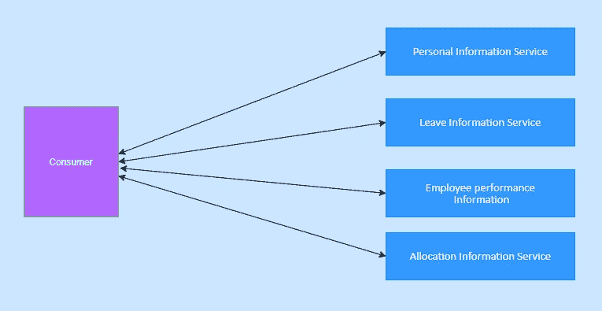

Figure 2

🌟当有多个服务时，这些服务调用(使用聚合器模式)多个后端(服务)是非常可能的。

🌟所以你想知道的主要用例场景。现在，让我们看看为什么可用性对于微服务非常重要。

# 为什么可用性在微服务架构中至关重要

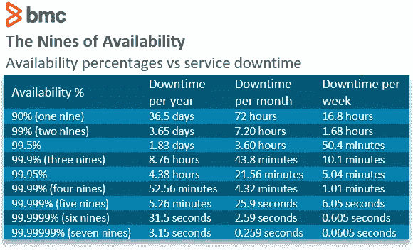

Figure 3: [Levels of availability](https://web.archive.org/web/20180728204314/https:/www.digitaldaniels.com/availability-service-level-9s-equate/)

🌟所以假设，当你的公司实现员工管理系统的这些服务时，他们承诺商业金融的正常运行时间为`99.999%`(五个九)。

💻❓`99.999%`的最大停机时间是如何计算的

每天`24` `hours`和每年`365``days`=每年 `8760` `hours`。

`8760` x `60` = `525600` `minutes`每年。

`99.999%`正常运行时间意味着可接受的故障变化= `0.001%`

`525600` X `0.001%` = `5.256 minutes`

🌟一项服务每年可能会停机。对于单芯片系统来说，每年 5.25 分钟的停机时间完全没问题。

🌟但是与整体架构不同，在微服务架构中，可能有许多服务。假设有 100 个服务。这可能导致每年 **8.78 小时**的停机时间。这是一个关键的数字😨。这就是为什么我们需要注意保护我们的服务。

那么，让我们看看中断服务的原因是什么。

# 中断服务的原因是什么？

## 用例 1

🌟假设您有 5 个不同的服务，并且您有一个 web 服务器来调用这些服务。现在，当收到请求时，服务器会分配一个线程来调用服务。

🌟现在发生的是这个服务有一点延迟(由于一个故障),这个线程正在等待。一个线程等待就可以了。

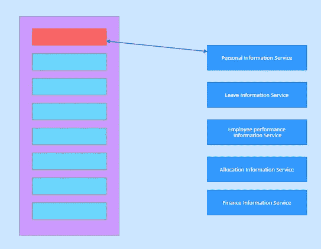

Figure 4

🌟但是如果这个服务是一个高需求服务(获得越来越多的请求)，更多的线程将被分配给这个服务，并且所有被分配来调用该服务的线程将不得不等待。

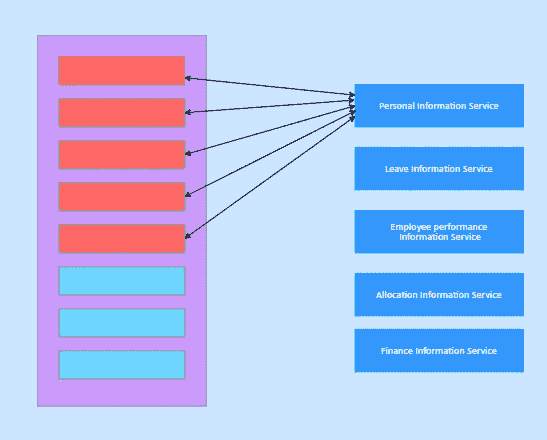

Figure 5

🌟因此，如果您现在有 100 个线程，其中 98 个可能被占用，如果另外两个线程被另外两个服务占用，所有线程现在都被阻塞。

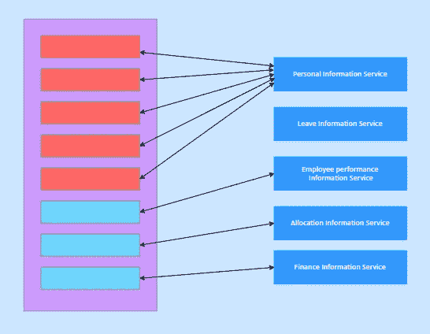

Figure 6

🌟现在发生的是到达您的服务的剩余请求将被排队(阻塞)。因此，与此同时，50 多个请求也来了，所有这些请求都在排队，因为线程被耗尽了。

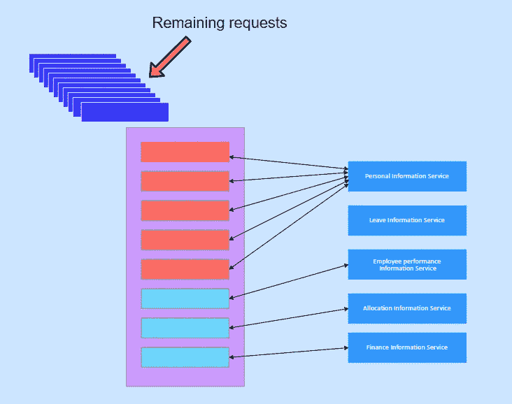

Figure 7

🌟几秒钟后，故障服务恢复正常。现在，web 服务器尝试处理队列中的所有请求。因此，web 服务器(或代理)可能永远无法恢复。原因是当 web 服务器处理队列请求时，越来越多的请求不断到达。所以，这种类型的场景会扼杀你的服务。

现在让我们进入下一个场景

## 用例 2

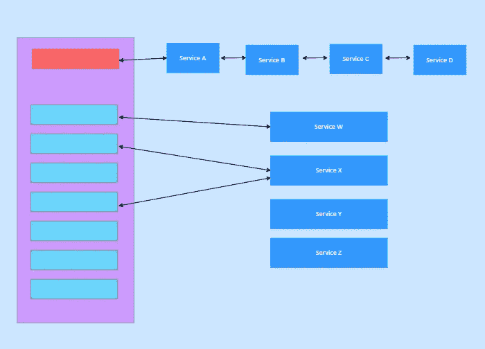

Figure 8

🌟在这个场景中，**服务 A** 调用 **B** ，**服务 B** 调用 **C** ，**服务 C** 调用 **D** 。同时还有其他服务 **W** 、 **X** 、 **Y** 和 **Z** 。但是如果服务不能及时响应会发生什么呢？💥

🌟假设服务 D 没有及时回复。

Figure 9 : Service D failed

🌟现在服务 C 必须等待。

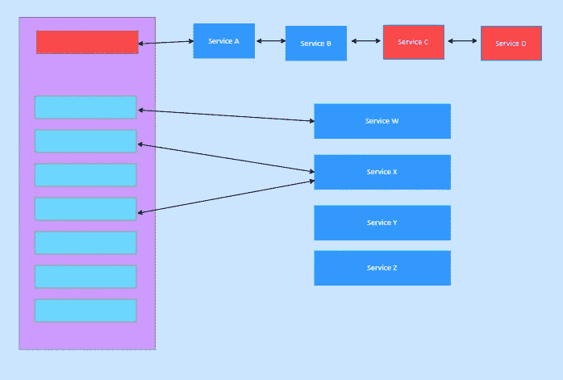

Figure 10: Service C is waiting

🌟由于服务 C 正在等待，服务 B 也必须等待。因此，相应地，服务 A 必须等待。这会导致 [**级联失效**](https://en.wikipedia.org/wiki/Cascading_failure) 。

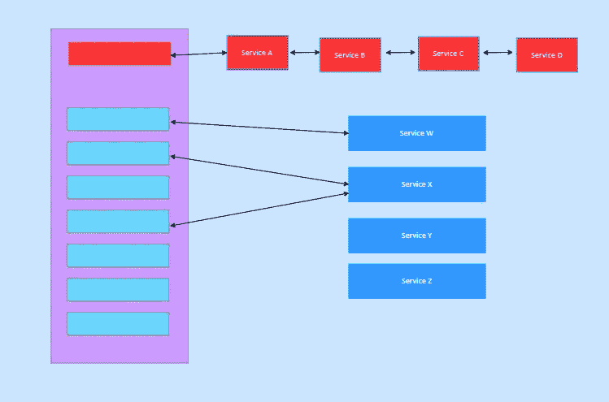

Figure 11 : Service A,B and C waiting for D

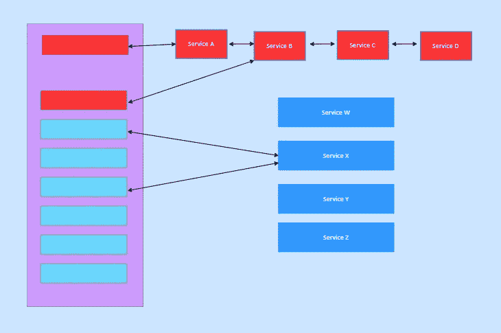

Figure 12 : Casacade faliure

🌟无论你的服务如何失败，但当服务失败时，它将离线。那么，我们能做些什么来保持这些服务的正常运行呢？🤔

# 断路器模式的解决方案

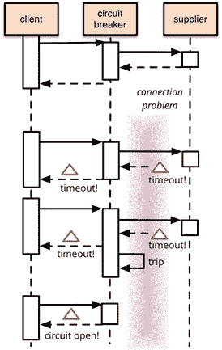

Figure 13: [Circuit breaker pattern](https://martinfowler.com/bliki/CircuitBreaker.html)

🌟因此，正如我上面提到的(在“断路器的主要用例”中)，系统中有 04 个服务和一个代理(一个调用这些服务的聚合器模式)。

🌟在经历了使用原因 1 和 2 之后，我相信您现在已经知道，当个别服务失败时，可能会发生系统故障(**供应商变得不响应** )—图 13。

🌟那么它可能会导致系统耗尽关键资源(例如:还记得用例 1 中线程是如何被占用的吗)。

🌟断路器的基本概念是将受保护的函数调用包装在断路器对象中，该对象监视故障。当失败次数达到某个阈值时，断路器跳闸，并且对断路器的所有请求返回一个错误。

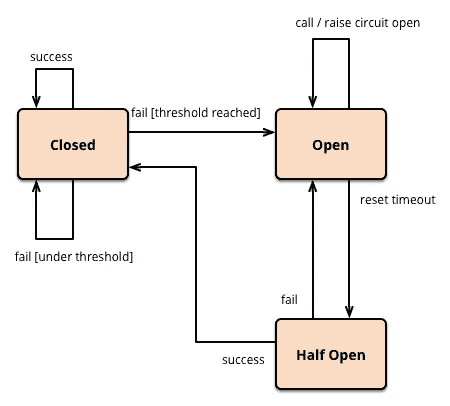

Figure 14: [States of Circuit Breaker](https://martinfowler.com/bliki/CircuitBreaker.html)

断路器模式有 3 种状态。

1.  **打开。**
2.  **关闭。**
3.  **半开。**

🌟当断路器处于“**闭合**状态时，断路器正常工作(通过服务传递请求)。但是当故障超过阈值极限时，断路器跳闸。如上图所示，此“**打开**电路(状态切换到“打开”)。

🌟当电路“**打开**”时，传入的请求将返回错误，而不会尝试执行真正的操作

🌟一段时间后，断路器进入“**半开**状态。在这种状态下，断路器将允许有限数量的测试请求通过，如果请求成功，断路器复位并返回到“**闭合**状态，通信将照常通过。如果这个请求失败，断路器返回到打开状态，直到另一个超时。

> 例如:服务 A 应该在 200 毫秒内响应。
> 
> 0ms -100ms:预期延迟间隔。
> 100ms -200ms:有风险。
> 
> 如果响应时间超过 200 毫秒，则切断服务。
> 
> 如果您创建了一个监控仪表板，您可以监控请求及其响应时间。在此基础上，你可以决定阈值水平。

🌟因此，断路器模式的工作原理是，如果请求的数量(例如，75%的请求)达到上限(150-200 毫秒)，这意味着服务正在缓慢失败。

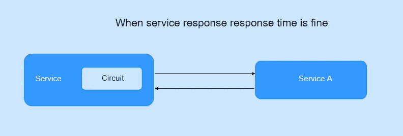

Figure 15

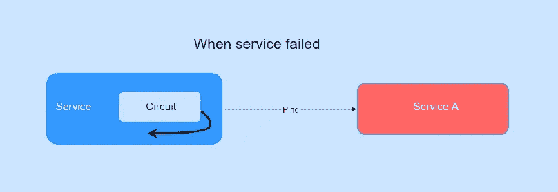

Figure 16

🌟如果发生次数超过 200 毫秒(服务的最大阈值)，代理将识别出该服务不再响应。

🌟它接下来做的是，访问服务 A 的请求将回切。它中断了代理和服务 a 之间的连接。

🌟现在你的代理不会去服务 a，这意味着它不会等待。

## **但是为什么不直接去服务看看。如果失败，请求可以返回。为什么一定要有介于两者之间的东西？🤥**

🌟假设你有 30 秒的超时时间。如果每个请求都试图到达服务 A，不考虑它失败，所有来自消费者的请求将等待 30 秒。这些请求将在 30 秒后超时。

🌟在这 30 秒内，剩余的使用 A 的请求将尝试到达服务 A，这些请求也在队列中等待。

🌟因此，断路器模式所做的是，如果服务失败次数超过给定阈值，它将不会尝试到达服务 A，而是回切到消费者，告知服务 A 不可用。

## **那么如何连接回去呢？🤔**

🌟在后台，它及时向服务 A 发送 ping 请求(图 16)或默认请求。因此，当响应时间回到正常阈值时，它将再次打开请求。

🌟因此，到达消费服务 A 的下一个请求将直接到达服务 A

> 在故障期间，所有使用服务 A 的请求都会被发送回一条错误消息。所以现在没有排队。当服务恢复时，它将为新的流量开放。

## 但是我们不是没有回应一些消费者的要求吗？🙄

🌟是的，一些请求被(没有排队)发回给消费者，并带有一条错误消息，但是他们没有得到服务 a 的响应。

🌟但是，如果这些请求试图到达服务 A(失败了),并且这些请求被排队，结果会是什么呢？

🌟由于服务后面创建的巨大队列，整个系统可能已经失败。因为即使服务恢复了，这些队列也会消耗服务 A，最终服务 A 会失败。

🌟但是使用这种方法服务，A 可能会在一段时间内失败，某些请求可能无法从服务 A 获得响应，并将返回一个错误。但是一旦服务 A 恢复在线，下一个到来的流量将被服务。所以卡萨卡德的失败不会发生。

🌟这就是断路器模式背后的原理。

> 从用户的角度来看，长时间等待响应并不是一种好的用户体验。与其让消费者等待更长的时间，不如快速做出反应。不管是成功还是失败；重要的是用户不会一直等待。

🌟好吧，我希望你现在知道断路器模式和它是如何工作的。在下一篇文章中，我们来谈谈代理设计模式。请在下面评论您的想法和反馈。😃。谢谢你。

# 参考

 [## 释放它！:设计和部署生产就绪软件

### 释放它！:在 Amazon.com 上设计和部署生产就绪软件。*免费*送货到…

www.amazon.com](https://www.amazon.com/Release-Design-Deploy-Production-Ready-Software/dp/1680502395)  [## 断路器

### 软件系统对运行在不同进程中的软件进行远程调用是很常见的，可能是在不同的…

martinfowler.com](https://martinfowler.com/bliki/CircuitBreaker.html)  [## 微服务设计模式|微服务模式| Edureka

### 在当今的市场上，微服务已经成为构建应用程序的首选解决方案。众所周知，它们可以解决…

www.edureka.co](https://www.edureka.co/blog/microservices-design-patterns#CircuitBreaker)  [## 断路器和微服务架构|持续接触技术博客

### 到目前为止，众所周知，微服务架构有许多优势。这些包括低耦合…

techblog.constantcontact.com](https://techblog.constantcontact.com/software-development/circuit-breakers-and-microservices/)