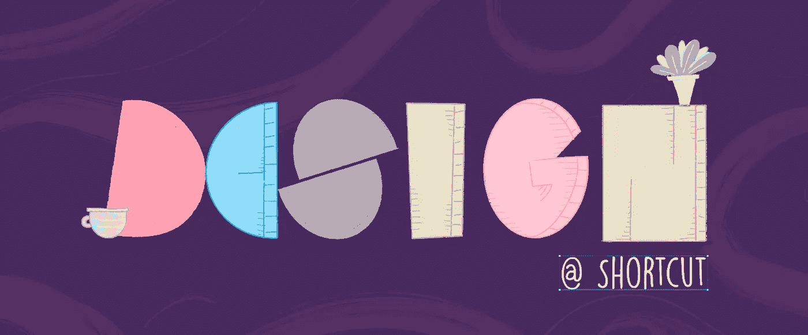
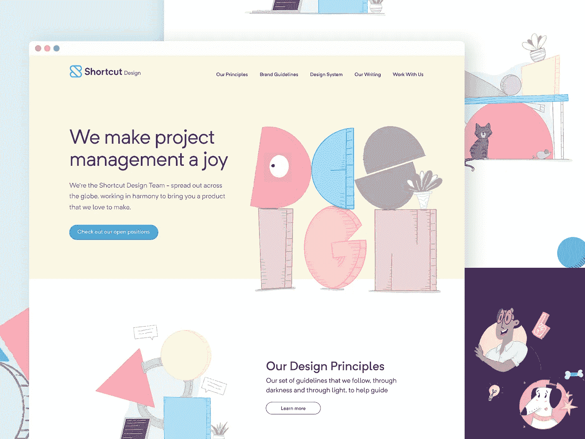
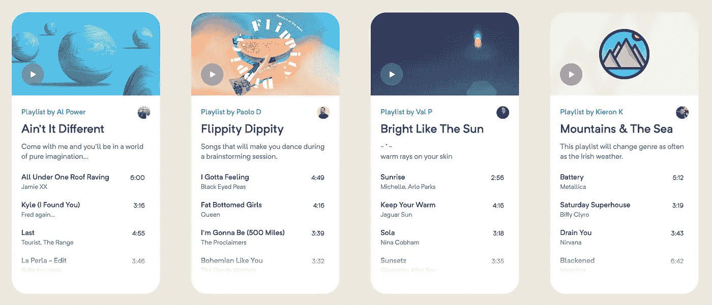
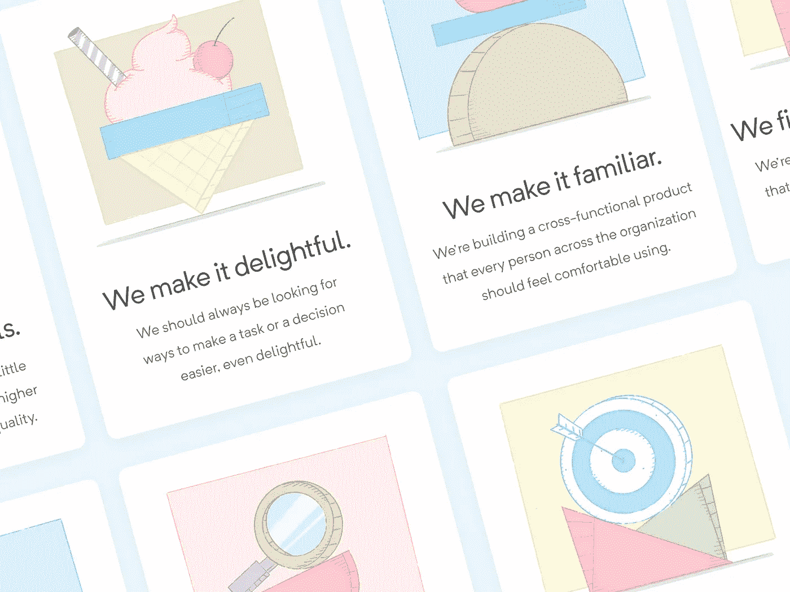
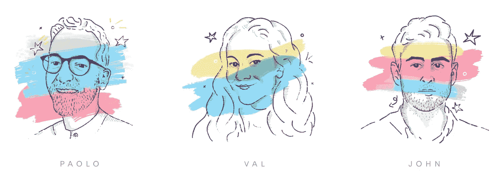
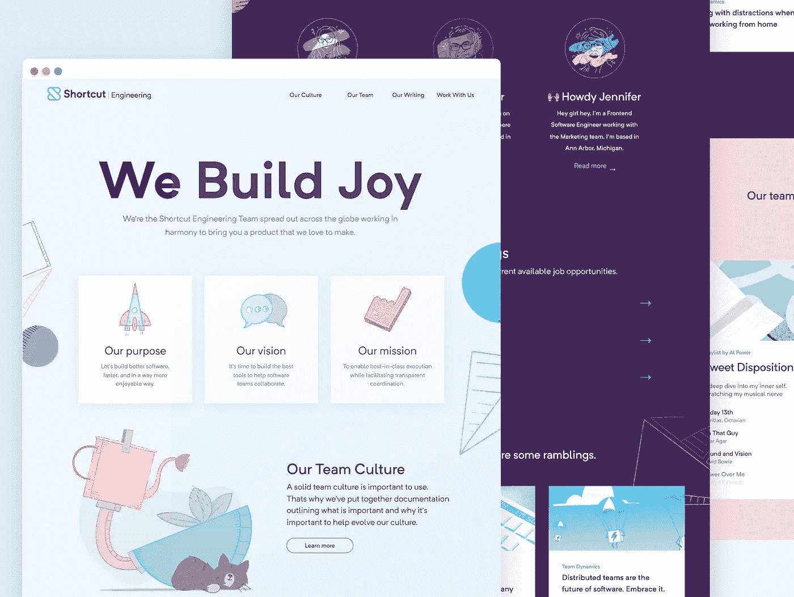

# 设计@ Shortcut.com

> 原文：<https://medium.com/geekculture/design-shortcut-com-38612d1262cb?source=collection_archive---------18----------------------->

## 一个设计团队需要一个称之为家的地方。一个他们可以分享内心想法的地方。在捷径这里，我们觉得是时候建造我们的堡垒了，这里是我们这样做的方式和原因。

目标是专门为我们的设计团队创建一个网站，分享我们的观点、意见、价值观和指导方针。一个让我们宣扬自己，告诉别人(并提醒自己)什么对我们来说重要，以及为什么重要的地方。一个让我们有机会歌唱设计原则、分享重要资产以及分享如何应用这些资产的指导方针的地方。

所以，事不宜迟，让我们向您展示这个网站…

> 🎺[https://design.shortcut.com/](https://design.shortcut.com/)🎺

[https://design.shortcut.com/](https://design.shortcut.com/)

# 为什么我们需要一个设计网站？

因此，这对于我们的团队来说非常重要，这有几个关键原因。我相信每支球队都应该有发言权，而被听到的唯一方式就是大声呐喊。

该项目的主要目标是:

*   **🏡让我们的团队在内部和外部都有知名度:**
    就像我刚才说的，目的是为团队提供空间，宣传我们自己。谁不爱谈论自己呢，对吧？哦，只有我？好吧抱歉。无论如何，我们希望我们的声音被听到，✊，我们希望人们认识到快捷方式的设计功能对我们在✊快捷方式所做的一切是如此重要
*   **📃为重要文件准备一个集中的空间&指导方针:** 有一个地方存放我们的指导方针将有助于我们建立内部和外部的一致性。例如，提供品牌资产，如标识和插图以及你实际应该如何应用它们，将减少人们从谷歌抓取错误的标识，并在他们进行的过程中进行编造。一致性是成长中的公司的关键，有一个集中的地方来共享文档和指导方针只会有助于事情向前发展。
*   **🕵️‍♀️有助于推广我们的工作机会:** 拥有这样一个网站，不仅是一个促进一致性发展的好地方，还能帮助我们推广我们的团队。这给了我们一个机会，可以大声宣传公开的工作机会([顺便说一句](https://shortcut.com/careers))，也是一个让潜在候选人了解我们的地方。这是双赢。
*   **🤹给我们一个表达个性和娱乐的地方:**
    这部分很棒 [craic](https://en.wikipedia.org/wiki/Craic) 。我们想给网站添加一些个性，所以我们添加了一些采访过的团队成员，并让每个人都创建 Spotify 播放列表。然后我向他们发出挑战，让他们为他们的专辑创作插图(毕竟他们是设计师)。这个部分做了两件事。它给网站增加了一个很好的个人风格，但也在我们团队内部引发了一些很棒的对话。你可以知道很多关于某人的音乐选择，我被一些队员听的音乐震惊了…(没有看任何人👀保罗·德托雷

A sample of some of the playlists

# 什么时候我们觉得我们需要它？

随着设计团队的成长，很明显我们需要一个集中的地方来发表意见。事情太脱节了，我们有设计原则、指南、博客文章，但一切都分散在多个接触点。没有人真正知道到哪里去寻找任何东西。此外，作为唯一的品牌设计师，我越来越感到沮丧，每天都要给每个人指出所有创意资产所在的位置。

显然，在一个理想的世界里，我们应该有一个完全成熟的整体设计系统，概述一切事物的所有方面，连接一切事物，但在现实中，以我们目前的规模(目前有 5 名设计师，并且还在增加)，拥有一些由内部团队精心制作的、品牌上的、有用的东西，似乎是合乎逻辑的第一步。

Our design principles help us help you help us (help you)

# 我们是如何着手制作的？

所以我们有个计划。我们知道自己想要什么，所以我们开始着手准备实际的内容。我们决定:

*   [设计原则](https://design.shortcut.com/design-principles) -(强化我们的价值观)
*   [品牌指导方针](https://design.shortcut.com/brand-guidelines) -(在提供资产的同时，为我们的品牌风格提供指导)
*   [博客文章](https://medium.com/shortcut-design) -(让我们向任何愿意倾听的人大声说出我们的想法)
*   [工作机会](https://shortcut.com/careers) -(推销团队中任何即将到来的工作——顺便说一句，我们正在招聘，我已经提到过了吗？)
*   [设计团队访谈](https://design.shortcut.com/#Meet-the-team) -(让我们有机会更深入地了解设计师的生活，以及我们在团队中的角色)
*   音乐播放列表-(享受一点乐趣，更多地表达我们自己🎶)

有些内容是我们有的，有些是我们必须创造的，但我们知道自己想要什么。

新页面是专门为我们的 [**设计原则**](https://design.shortcut.com/design-principles) 、我们的 [**品牌指导方针**](https://design.shortcut.com/brand-guidelines) (以及下载我们资产的地方)，以及我们的 [**设计师面试**](https://design.shortcut.com/#Meet-the-team) 而设计的，因此我们的网站增长了它的创意腿。

这个项目的另一个视觉奖励是，我们最近更名，这意味着它给了我们一个使用新的闪亮颜色、插图和标志的机会，这反过来又使我们能够加强我们最近不断敲打的新品牌风格鼓。

Some illustrations were created for the designer Interviews

下一个障碍是如何建造它。通常，在过去我也创建过类似的网站，但是它们总是被压在优先级列表的后面，以至于它们从来没有被建立过。这主要是因为它总是感觉像一个很好的项目，但从来没有真正重要到足以实际构建。这就是保罗·德托雷介入的地方。除了是设计团队中的顶级设计师之外，Paolo 还是整个项目的关键 [Webflow](https://webflow.com/) 的专家。这意味着我们可以不再依赖其他团队来实现这一目标。Paolo 戴上他的 Webflow 帽子，离开了公园。他创建了一个漂亮的、反应灵敏的、完美的网站，有各种各样的功能。你还能要求什么！🤌

# 我们认为进展如何？

总的来说，我们觉得这个项目是一个巨大的成功，虽然我很有偏见，但是的，它可能是有史以来最伟大的网站。

它给了我们一个平台，让我们的声音被听到，也给了我们一个地方来存放我们希望人们找到的所有重要的指导方针。这也让我们展示了我们可以在没有提示的情况下发挥我们的主动性并推动事情向前发展，我觉得这在一个团队的发展中非常重要。拥有鞭策自己的愿望和决心是成功的关键。

事实上，该项目进行得非常顺利，我们甚至更进一步，在最近的一次黑客马拉松中为工程团队创建了一个类似的网站，取得了类似的成功和热情。

你可以去看看这里:[https://engineering.shortcut.com/](https://engineering.shortcut.com/)

此外，我们已经为整个组织的其他团队制定了更多类似项目的计划，因此从这一点来看，它一定是成功的！

[https://engineering.shortcut.com/](https://engineering.shortcut.com/)

# 这个网站的下一步是什么？

嗯，就像生活中的一切事物一样，事物会成长，会进化，我们希望这个网站也会成长。我们可能会发现这种方法对于一个更大的团队的期望来说太轻了，我们需要重新评估事情，但是现在，我们只是要享受拥有我们的小堡垒。一个我们称之为家的地方。

请务必定期回来，与我们一起入住！

