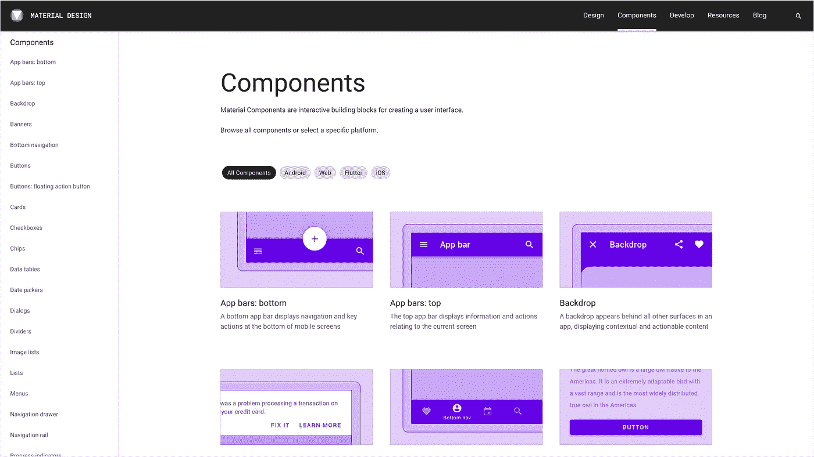
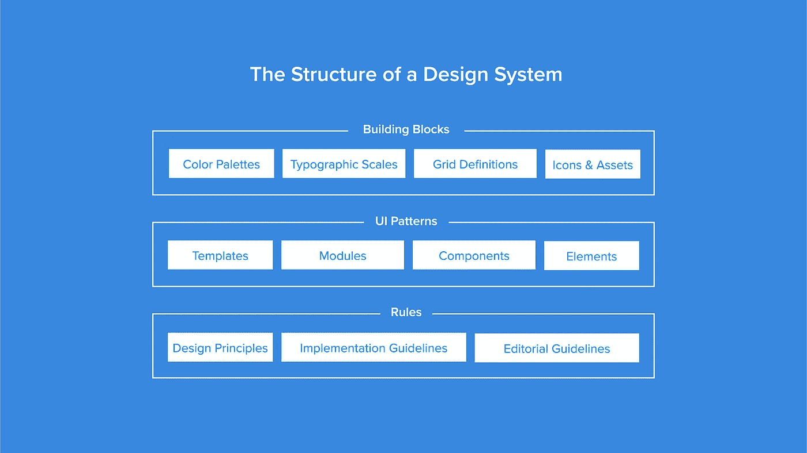
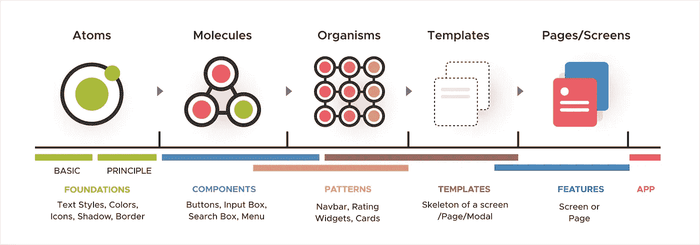
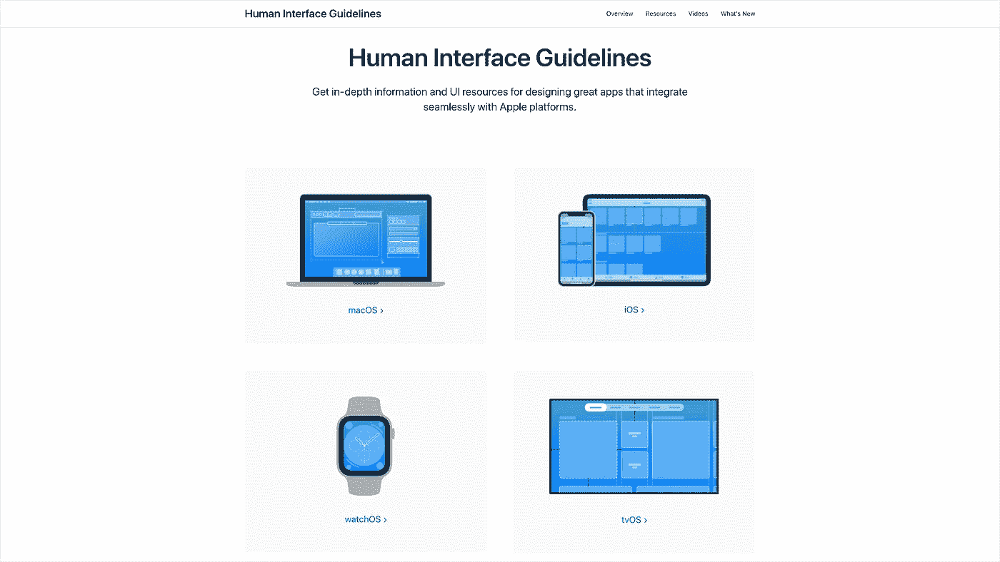
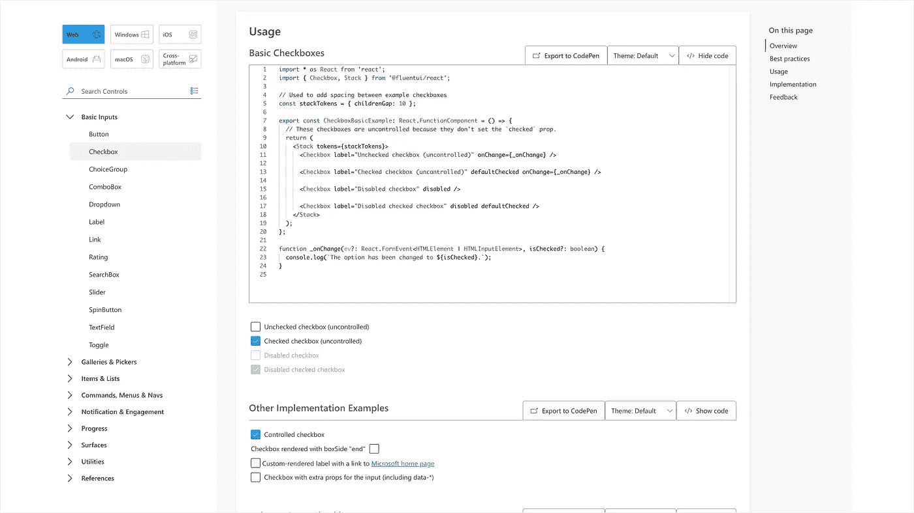
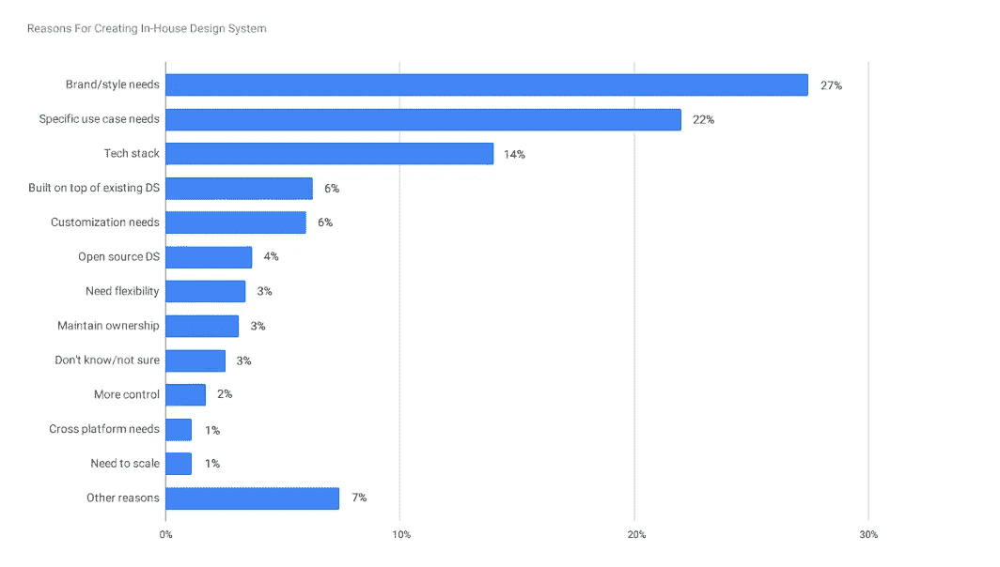
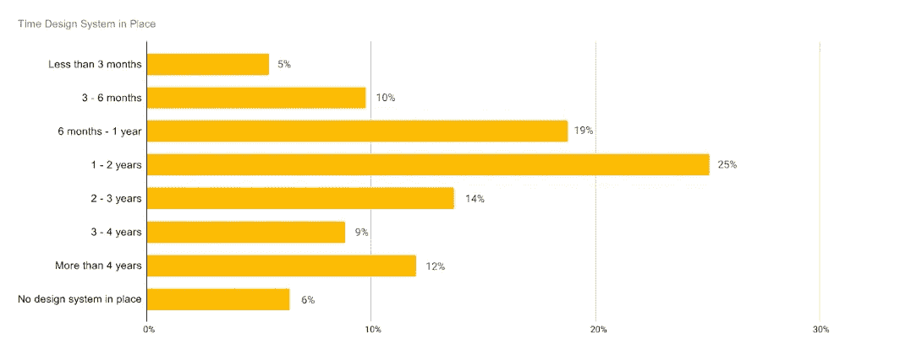
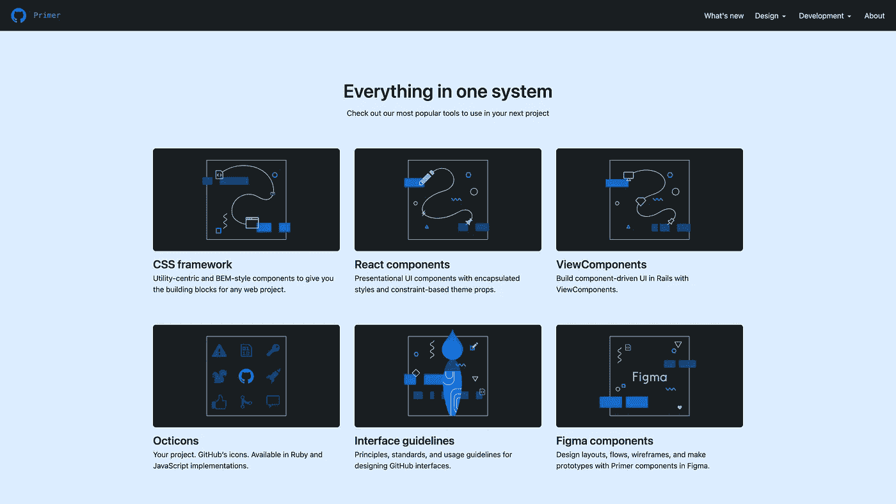
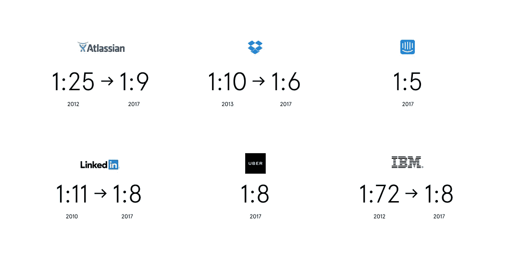

# 设计系统

> 原文：<https://medium.com/geekculture/design-system-4b1870b7fb60?source=collection_archive---------28----------------------->

## 什么是设计系统？为什么对设计系统的投资迅速增加？让我们看看这些问题，寻找答案。

Photo by [Xavi Cabrera](https://unsplash.com/@xavi_cabrera?utm_source=unsplash&utm_medium=referral&utm_content=creditCopyText) on [Unsplash](https://unsplash.com/?utm_source=unsplash&utm_medium=referral&utm_content=creditCopyText)

我们的目标是在产品开发过程的范围内为用户提供最好的体验。本着这一宗旨，作为设计师，我们正在研究、分析和解释消费者在使用产品时的感受，试图创造价值并在这一背景下提供解决方案。另一方面，价值是根据目标用户、产品将满足的需求以及使用场所来塑造的。我们努力识别和解决问题，以减少用户的认知负荷，降低交互成本，满足需求，并最终交付[可用的](https://bootcamp.uxdesign.cc/usability-and-its-importance-1e6c63e81614)产品。

作为全球数字生态系统和全球经济的一部分，今天的技术允许我们随时通过手机或电脑访问产品来立即使用它。这种情况已经发展到这样一个水平，消费者现在有意识通过询问*来控制产品选项，“我想知道我是否可以在其他平台上使用这款产品(例如，在我的游戏控制台、家里的智能助理、电视、我手腕上的智能手表或我的汽车上)。”*这种意识已经成为消费者偏爱某些产品的原因。因此，许多产品都在竞相扩展可访问性，并为不同环境的目标受众提供服务。虽然这种方法和许多类似的方法将用户推上了宝座，但它们也推动了公司在产品政策上的创新。被偏爱现在变成了我们要承担必要成本的一个要素。否则我们输给对手只是时间问题。毕竟，在这个数字世界中，我们都有另一种选择。

如果我们把重点放在生产过程中的工作人员而不是最终用户，会怎么样？在生产周期中，我们会看到什么，其中涉及许多变量，一切都是相互关联的？此时，我们需要从生产的角度来评估用户的体验，其中竞争非常激烈，而且是全天候的。出现了向不同环境中的用户提供相同的一致服务的必要性。来自不同学科的人应该在所有可能的过程中发挥作用，从构思阶段到产品开发和展示给最终用户。在提供解决方案的过程中，联合生产是一个重要且昂贵的因素。

无论你是在一个只有几个人的小公司，还是在一个有数百名员工的公司，如果你不熟悉一个**设计系统**的概念，甚至它还没有在你的日程上，请三思！

无论我们的产品或服务是什么，我们都必须牢记，我们的感知和最终用户的体验一样重要。在这种背景下，我们见证了专注于设计的公司扩大了领先优势。如今，这种差异不仅与最终用户的满意度直接相关，还与我们内部生产流程中的员工体验相关。

# 什么是设计系统？

界面设计过程包括许多需要考虑的事情。可以举例说明这个过程，如研究、设计风格、可伸缩性、整个应用程序的模块化、多个团队将如何使用它、开发成本、测试、它将如何被长期使用，以及优化过程等。

可能会有设计和开发简单的解决方案来扭转局面。那些解决方案在那个时候可能会奏效。然而，当涉及到解决可持续生产过程中的复杂问题时，在系统层面解决这些问题的必要性和重要性变得突出。为此，许多公司投资设计系统，如服务、企业、机构、产品等。在现代生产条件下，解决方案需求中的设计、开发和测试相互影响，没有系统和非标准视角的生产在时间和成本上都是不可持续的。

如果我可以分享我的两个观察，设计系统不仅仅是一个静态的用户 UI 设计工具包或 UI 开发库。设计系统包括这些，但固有地包含更广泛和更包容的制造解决方案方法作为价值主张。

IBM — [Carbon Design System](https://www.carbondesignsystem.com/)

虽然很难一下子定义一个设计系统，但是值得注意的是 [Nathan Curtis](/@nathanacurtis) ，一位参与过许多设计系统开发过程的设计系统顾问:

> "跨产品组合的决策和团队行为的可扩展框架，以汇聚成一种有凝聚力的体验."

换句话说，解决生产过程中问题的[方法](https://uxplanet.org/design-as-a-problem-solving-approach-fed160e419c4)是一种设计语言。它是一个文档，其中的规则是用部分到整体的关系来阐述的，指明了组件应该看起来和编码的方式。它是经验和软件开发之间的桥梁，具有和谐的完整性。除此之外，它还是一种原则文化。它为每个人提供了一个愿景，无论他们在生产过程中处于什么位置。它是产品的声音和它的界面原则，并且总是根据用户需求开放开发。

Google — [Material Design “Components”](https://material.io/components)

将设计系统称为“系统”的唯一价值是，它是一种工作哲学，具有包含所有资产(颜色、字体、图标、插图、声音、动画等)的可重用组件的视觉设计。)，这些设计的编码和实现，为确保一致性而设置的规则和方法。

系统本质上由规则组成，这些规则确保了一致性。在系统解决方案的框架内，这些规则是可以发展和改变的。考虑到系统的可重用结构，可以实现根据需求做出的新决策而执行的变更。随着需求的变化，可能需要新的设计解决方案。因此，由于这个和其他许多原因，设计系统是一个过程，而不是一个结果。就像其他产品开发过程一样，设计系统创建过程也将不断成长和发展。

The Structure of a Design System (Resource: [UXPin](https://www.uxpin.com/))

在提到设计系统的同时，值得一提的是布拉德·弗罗斯特的“原子设计”方法。许多设计系统，如今广泛用于具有数字视觉界面的产品开发过程，通过创建可重用的组件模式而受益于这种方法。如果我们需要描述这种方法，它是一种创建页面的方法，在这种方法中，系统的最小构建块以可重用的方式组合在一起，以满足需求。

[Atomic Design](https://atomicdesign.bradfrost.com/table-of-contents/)

与公司文化和组织结构相一致，设计系统的范围根据价值主张、需求和目标而变化，并具有持续改进的潜力。可以根据端到端的需求进行塑形；从如何使用平台上的基础资产到如何用技术开发，从品牌标识到模式实例；从正确的应用到正确和错误的使用示例。

Apple — [Human Interface Guidelines](https://developer.apple.com/design/human-interface-guidelines)

例如，谷歌提供了在不同平台上创建高质量数字体验的机会，通过开源的[材料设计](https://material.io/)，这种方法将特别满足移动需求。谷歌提供这种开源材料来开发和支持其生态系统。类似的方法在苹果针对不同平台的[人机界面指南](https://developer.apple.com/design/human-interface-guidelines/)，微软的 [Fluent 设计系统](https://www.microsoft.com/design/fluent/)和 IBM 的 [Carbon 设计系统](https://www.carbondesignsystem.com/)中显而易见。

Microsoft — Fluent Design System, Web [“Checkbox Component Code Structure”](https://developer.microsoft.com/en-us/fluentui#/controls/web/checkbox)

除了这些以及由拥有数百万用户的技术巨头创建的类似设计系统，[不同行业的许多设计系统](https://medium.muz.li/design-system-examples-ddd47f53869d)专注于满足他们自己的需求。一些例子: [Atlassian 设计系统](https://atlassian.design/)，为 Atlassian 的产品范围创建，提供软件开发和协作工具；[奥迪为其企业需求打造的设计体系](https://www.audi.com/ci/en/renewed-brand.html)；[美国为政府网站创建的美国网页设计系统](https://designsystem.digital.gov/)；[giffgaff](https://www.giffgaff.design/)GSM 公司的设计系统，以及 Spotify 的 [Encore](https://spotify.design/article/reimagining-design-systems-at-spotify) 设计系统，这是一款音乐和播客收听应用。

Reasons for companies to create their design systems (Source: Google’s “[The State of Design Systems: 2020](https://material.io/blog/research-state-of-design-systems-2020)” research).

当设计系统作为开放源码提供时，通过使品牌身份适应它们在设计系统中提供的可能性，有可能增强设计和开发。

# 设计系统是做什么的，它对生产过程的重要性是什么？

如今，许多公司正在建立设计系统团队，以交付一致的体验，这将有利于他们的最终用户。他们继续投资以满足产品范围内的需求，受益于新技术及其产品开发流程对员工体验的影响。

How long companies have invested in design systems (Source: Google’s “[The State of Design Systems: 2020](https://material.io/blog/research-state-of-design-systems-2020)” research).

在界面设计过程中，解决相关问题可能需要不同的方法。如果我们认为设计过程是一个永无止境的循环，那么即使在交互设计中创建了一个流程之后，仍然有很多方法和途径来解决这个问题。不同的设计者可以针对与 UI 设计工具包中的组件相关的问题提供几种设计解决方案。在提出设计假设之后，可以通过优化过程进一步扩展解决方案。交互流应该在所有环境中提供相似的一致性，并在不同的模块中为相似的问题提供相同的体验。在某种程度上，这是设计师在生产过程中的责任。我们结合相关数据和界面设计解决方案建议，谈了一个设计师处理问题的经验。

在设计过程中，确定如何在软件开发过程中编写界面设计应用程序也很重要。因此，许多公司在产品开发过程中利用开源设计系统来为诸如人力资源、在不同单位的异步生产过程中提供完整性的需要以及在具有设计者软件输出的现有解决方案中提供相同模式等问题提供可持续性和经验一致性。此外，许多公司正在投资创建他们的设计系统来解决他们的具体问题。

在这一点上，重要的是强调“投资”二字。即使创建一个设计系统在一开始并不容易，但从长远来看，创建一个设计系统所节省的时间和成本是值得的。

GitHub — [Primer Design System](https://primer.style/)

让我们从人的因素的角度来讨论设计和软件开发的生产过程。一个产品或项目结构可能由一个团队和/或来自不同学科的团队组成，这些团队是分散的，并根据工作量而形成。然而，同一个团队中的个人可能对独立的解决方案有不同的工作努力。此外，不要忽略工作模式、时区差异和不同地点的异步工作要求，这是很有用的，因为它们并不在同一地点。

一般来说，新同事的到来会带来更好的质量和更快的生产。如果工作环境缺乏一定的标准和实践，随着时间的推移，工作速度将不可避免地变慢，产品不一致性也会增加。此外，这些不一致性将稳步增加，除非他们得到良好的管理。产品开发会随着新功能的加入而进展，团队的每个新成员都会做出贡献。因此，生产的平衡将会恶化，并且随着每一个新的管理层或利益相关者/客户的介入，体验的不一致性将会成倍增加。最终，最终用户也将遭受越来越多的不一致。拥有一个设计系统对这些问题来说是无价的。这些只是几个例子。当复杂的生产周期场景被替换现有员工的员工适应成本加倍时，设计系统的重要性变得更加明显。

Ratio of designers to software developers by companies (Source: [TechCrunch](https://techcrunch.com/2017/05/31/here-are-some-reasons-behind-techs-design-shortage/)). Some big technology companies have increased the ratio of designers to software developers 2.5 times on average in 5 years! The number of designers involved in production processes to the number of software developers ratio is gradually equalizing. This shows that designers are needed more than ever to deliver the ideal experience to end-users.

如果我们谈论生产过程中的应用优势，设计系统将允许设计师、软件开发商和其他利益相关者汇聚到同一点上。当设计者通过在系统中使用按照界面设计原则创建的组件来开发应用程序时，软件开发者将通过使用来自他们的库中的相同组件来直接应用。这将确保应用层在这两个方面都能顺利运行，并且每个人都说同一种语言。在某种程度上，这将通过创建一个过程来增加动机和性能，该过程减少了设计者创建技术上可行的设计的负担，并优化了软件开发者的意外实现成本。由于设计系统，设计师，软件开发者和其他利益相关者将获得相同的心理模型。

# 结论

浪费时间、效率低下和不一致是常见的问题，尤其是对于在产品开发过程中有多个团队的公司。一般来说，如果你在一个以设计系统为中心的环境中工作，在解决问题和满足需求方面提供一致的经验，你可以认为自己是幸运的。然而，如果你还没有这样的机会，你可以将设计系统的重要性作为一种价值来呈现，并创造意识。设计系统为参与产品/项目开发过程的利益相关者提供有效工作所需的所有材料。尽管创建、实施和持续管理一个设计系统很困难，但这是值得的。

随着新平台和新设备的引入，交互界面也随着技术的发展而更新，即使设计系统能够满足您今天的需求，它们的持续发展也将通过其自适应的灵活结构为您的未来做好准备。

你对设计系统*有什么想法？作为一名在过去几年中一直专注于设计系统开发过程的设计师，我试图解释我对设计系统的知识、观察和经验。你也可以在评论中分享你的经历。*

*作为一个渴望不断学习和喜欢分享知识的人，你可以在这里* *查看我的其他文章* [*。还有，你可以通过*](https://bit.ly/AtiMed)[*LinkedIn*](http://tr.linkedin.com/in/atillaaliskan)*联系我。*

*资源:*

*   [*UXPin，为什么要建立一个设计系统？*](https://www.uxpin.com/studio/ebooks/design-systems-why-build-one)
*   [*布拉德·弗罗斯特*原子设计](https://atomicdesign.bradfrost.com/)
*   [*UXPin，福音化设计系统*](https://www.uxpin.com/evangelizing-design-system-roi-template)
*   [*DesignBetter，设计系统手册*](https://www.designbetter.co/design-systems-handbook)