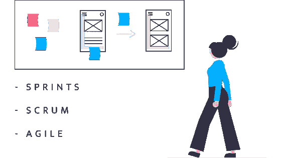
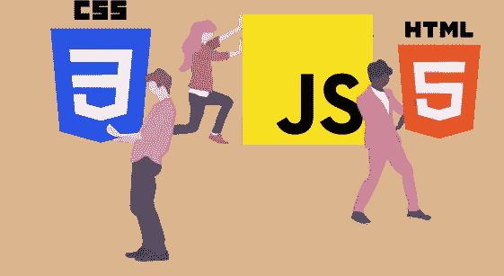
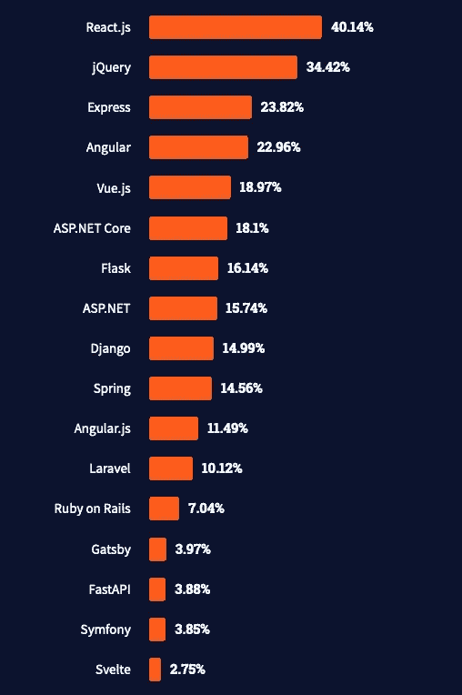

# 前端设计——危险旅程的编年史

> 原文：<https://medium.com/geekculture/design-to-front-end-chronicles-of-a-perilous-journey-b7a28528e147?source=collection_archive---------24----------------------->



Design to Front-end attribution [Undraw.co](https://undraw.co)

F 从构思到完成让设计过程更加方便开发者，**T3T5【要是有就好了】。如果早期的设计思想/过程、关键的 MVP 决策和利益相关者的意见一致。如果情绪板、探索、以用户为中心的研究、反馈和迭代是正确的就好了。但愿早期的期望不是由这种脆弱的评估驱动的:**

> 客户:我们的目标是在两周内创造出一个颠覆性的设计，因为利益相关者已经不耐烦了。
> 
> 设计师:接受订婚…啜饮最爱的香浓咖啡，送上第一个模型
> 
> *反馈:喜欢，完全不喜欢。不需要展示太多，但是展示出来的应该是世界级的吧？*

抛开预算不谈，光是听这个就能烧掉你的鼻毛和眉毛。到目前为止，设计范围帮助了膨胀的期望。只评估二流和贪婪的管理，这窃听是 [**从榆树街**](https://www.imdb.com/title/tt0087800/) 的噩梦，如果你能总结一个反应。随着设计周而复始，开发冲刺变得类似 scrum 和敏捷的老鼠迷宫。

形成强大的网格结构、清晰的排版、微妙的颜色、清晰的图标、高分辨率图像、信息图表、详细的风格指南、可访问性、交互或动画是交付真正丰富的用户体验的一些核心原则。毫无疑问，实现对设计的可感知剖析并不总是始于一杯 ***香浓的咖啡*** ！

复杂的设计和开发过程的生命周期遭受任意超越的想法，由此过程驱动的工作流最终脱轨。谈论设计与开发中的一些最佳实践、挑战、框架/库和经验。

# CSS/UI 框架



CSS/UI Frameworks attribution [Undraw.co](https://undraw.co)

框架驱动的设计更容易接近，更灵活，遵循设计系统和模式的基本原则，不言而喻，快速原型化和扩展主题组件库不会变得更难。

那么，在设计决策的早期应该考虑框架吗？这当然不是小事，因为设计和开发是齐头并进的。实际上，大多数开发人员发现与一个已知的魔鬼一起工作比与一个未知的魔鬼一起工作更舒服。然而，以其他方式映射它非正式地有风险。

# 语义响应主题和可及性


Semantic Themes attribution [Undraw.co](https://undraw.co)

语义初始化是一种鼓励开发工作流的可靠方式，这种工作流具有适应性、可定制性和可伸缩性，可以应对入站设计挑战。像[***Bootstrap***](https://getbootstrap.com/docs/5.1/customize/overview/)，[***Foundation***](https://get.foundation/sites/docs/global.html)，[***Tailwind CSS***](https://tailwindcss.com/)和[***UI Kit***](https://getuikit.com/docs/sass)这样的框架完全支持语义定制。

默认情况下，组件设计继承了变量，记住推出全新的配色方案(亮暗)、排版、间距和组件主题是一件乐事。覆盖默认变量会让您离目标更近一步:

Bootstrap 5 SCSS Semantic Initialization

建立在移动优先原则上，它不是 Br ⁵Ba⁵⁶，即使在未知的断点。要查看它的运行情况，请观察 CSS 规则集的瀑布顺序(移动优先):

Mobile First Media Queries

理论上，两个断点足以创建概括的、功能性的和可访问的(符合 WCAG 标准的)响应布局。实现 100%的可访问性合规性将会很困难，它包括字体大小(不要太小)、颜色对比、空标签、文本替换、标题、导航(标签)，列表变得详尽。这场比赛中唯一的一等候选人是[***USWDS***](https://designsystem.digital.gov/)(美国网页设计系统)，这是美国政府为建设政府网站的团队建立的设计系统。

## 断点不应该是⁵Ba⁵⁶

Bootstrap 用一堆智能混合`media-breakpoint-down(x)`、`media-breakpoint-up(x)`、`media-breakpoint-between(x)`和`media-breakpoint-only(x)`优雅地处理断点，其中`x`是目标断点。我发现`media-breakpoint-down()`和`media-breakpoint-up()`非常方便。当您向上或向下定位`sm`设备时，媒体查询看起来像:

```
/* media-breakpoint-down(sm) */
@media (max-width: 767.98px) {}/* media-breakpoint-up(sm) */
@media (min-width: 320px) {}
```

太诡异了？让我们来看一个列布局的例子，比较复杂——不太冗长的 CSS 布局:

```
#content {
 @include make-col-ready();

 @include media-breakpoint-up(sm) {
  @include make-col(12);
 }

 @include media-breakpoint-up(lg) {
  @include make-col(9);
 }
}/* OUTPUT */
#content {
  position: relative;
  width: 100%;
  padding-right: 15px;
  padding-left: 15px;
}

@media (min-width: 320px) {
  #content {flex: 0 0 100%; max-width: 100%}
}

@media (min-width: 992px) {
  #content {flex: 0 0 75%; max-width: 75%}
}
```

我设法在一个 mixin 中同时指向`sm`(移动)和`md`(平板)设备，即该列保持 100%的视口宽度，直到目标断点为> 992px(桌面)。

# 前端 Javascript 框架调查


Front-end Javascript — Mission Impossible? attribution [Undraw.co](https://undraw.co)

总结了反应式前端框架，强调基于可重用性构建丰富的本机相似接口——纯组件支持 SPA 和 PWA 网页。基于抽象的 MVC 原则，它们还可以执行服务器端操作和 SSR(服务器端渲染)。Nuxt、Gatsby、VuePress 是几个可以执行 SSR 的例子。

更传统的是 jQuery——曾经引领相关的 web 前沿，现在随着开发人员被 React.js、Vue.js、Svelte 和 Angular 等增强的前端框架吸引，jQuery 落后了，这些框架受益于虚拟 DOM(高级 DOM 操作)带来的最佳页面速度指标。最近由 [Stack Overflow](https://medium.com/u/d53dd768d047?source=post_page-----b7a28528e147--------------------------------) 进行的一项框架调查显示:



[Stackoverflow Framework and Library Survey 2021](https://insights.stackoverflow.com/survey/2021#most-popular-technologies-webframe) — [Stack Overflow](https://medium.com/u/d53dd768d047?source=post_page-----b7a28528e147--------------------------------)

避开但积极更新 Angular 的排名，Angular.js 被埋在废墟下。我避免了在它们上面旋转一些云实例来展示和讲述的诱惑，当然有很多这样的**TL；博士**。这是一场广泛的讨论，涉及到像 GCP 这样令人大开眼界的云平台历史。

> GCP 于 2008 年推出，号称有 4 种适度的云服务:应用引擎、计算引擎、云存储和 BigQuery，美好的旧时光。在 2017-18 年的某个时候，估计会有 60 种巨大的服务用于计算、大数据、数据科学、机器学习和人工智能、物联网、容器-编排(Kubernetes)、NoSQL、健康和生命科学、游戏、网络和无服务器计算。

# 下一级图表和可视化


Charting & Visualizations attribution [Undraw.co](https://undraw.co)

在这个危险的旅程中，他们排在最后，但并非最不重要，令人敬畏却又耐人寻味。云计算推动了复杂的结构化和非结构化数据的发展，开创了数据可视化的新时代。

我曾经与一些流行的、一些闻所未闻的和一些不那么流行的库有过类似的遭遇——[***D3 . js***](https://d3js.org/)， [***Vis.js***](https://visjs.org/) ，[***chart . js***](https://www.chartjs.org/)，[***mermaid . js***](https://mermaid-js.github.io/mermaid/#/)，[***cyto scape*回顾其中一些、信息体系结构和用例:****](https://cytoscape.org/)

*   [***地理地图可视化***](/geekculture/advanced-map-visualization-and-cartography-with-d3-js-geojson-topojson-2de786ece0c3)
*   ***图表可视化***
*   ***事件&时间轴可视化***
*   ***拓扑&网络图***
*   ***节点遍历***
*   ***资产可视化***
*   ***数据可视化和报告***

其中——Mermaid 是一个鲜为人知的库，所以它非常强大和简单。使用简单的语法创建流程图、顺序/类别/状态/实体关系图、用户旅程图、甘特图、饼状图等。我在这个库中最早的破解是出于一个需求——为 **SDN** (软件定义网络)云应用创建一个网络集群设计流程图。作为我研究的一部分，我进行了一些迭代:

Prototype of SDN Graph in Mermaid.js

第二个选择是*[***cyto scape***](https://cytoscape.org/)，一个可视化复杂网络、生物计量、分子结构、基因组学、蛋白质组学、社会科学和网络分析的开源平台。它是独立于领域的，有一个活跃的社区；非常适合网络图。*

*是时候在[***cyto scape . js***](https://js.cytoscape.org/)上旋转更多的原型了，是的，它有两种版本。最早的基本原型是这样的:*

*First Prototype of SDN Graph in Cytoscape.js (Grid Layout)*

*在 **Cytoscape.js** 中，我面临了迄今为止最大的挑战——定制节点到边缘的精确定位。预设的网格、圆形、同心、宽度优先和余弦布局被证明足够全面，可以可视化最复杂的网络，即带有可选的 [***自定义布局***](https://blog.js.cytoscape.org/2020/05/11/layouts/) 扩展的`nodes = edges` 。在早期的评估中，Mermaid 被排除在 Cytoscape 之外，cyto scape 是专门为企业规模的网络可视化开发的。*

*它需要更多的工作来完善位置和美学，以完全符合最后一轮，最终像这样，没有**TL；博士**关于这一点:*

*Final Prototype of SDN Graph in Cytoscape.js*

*Cytoscape 在创建互动、美观和吸引人的网络集群可视化流程图方面表现突出；为可能全面出现的许多变化奠定了基础。*

# *摘要*

*没有明确的答案来浓缩设计和开发的最佳工作流程。大多数试验和错误，错误，渐进增强可能需要几次迭代才能达到方格标志。PoC 和 MVP 是您学习和获得的最佳伙伴。如果你被调音了——这是一首交响乐，否则就是纯粹的噪音。进行结帐:*

*   *[https://enigma.com/](https://enigma.com/)*
*   *[https://www.google.com/publicdata/directory](https://www.google.com/publicdata/directory)*
*   *【https://mermaid-js.github.io/mermaid/#/】*
*   *[https://cytoscape.org/](https://cytoscape.org/)*
*   *[https://js.cytoscape.org/](https://js.cytoscape.org/)*
*   *[https://www.youtube.com/channel/UCSJbGtTlrDami-tDGPUV9-w](https://www.youtube.com/channel/UCSJbGtTlrDami-tDGPUV9-w)*
*   *[https://www.youtube.com/c/Fireship](https://www.youtube.com/c/Fireship)*