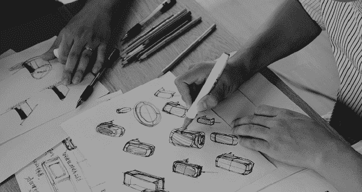
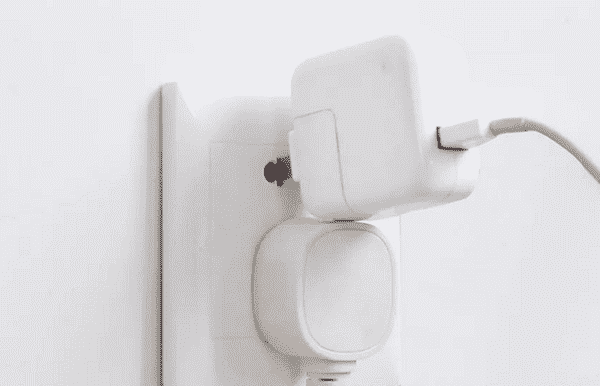
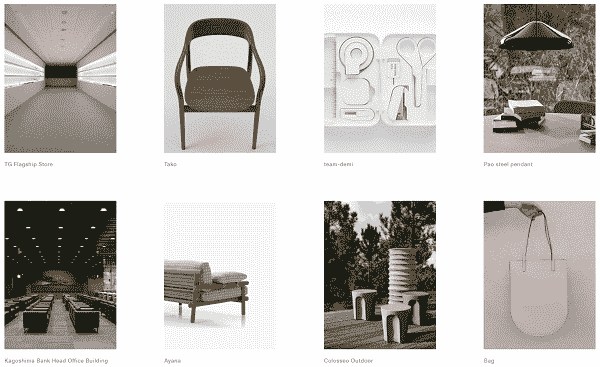
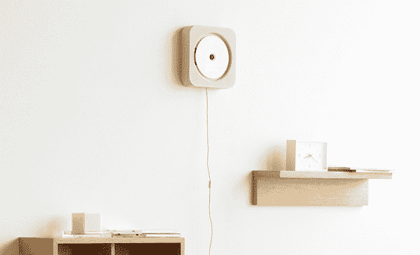
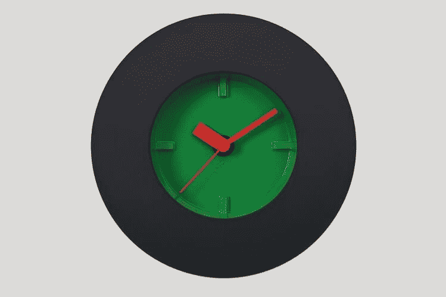
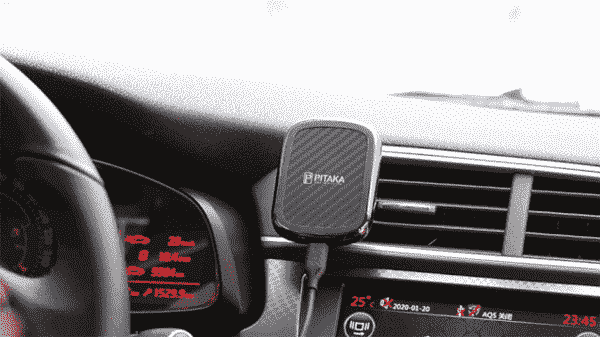
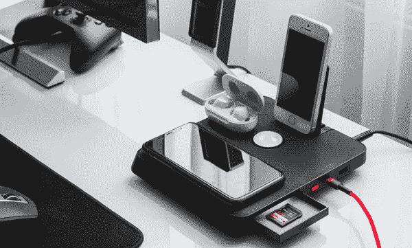

# 没有思想的设计:产品设计背后的哲学

> 原文：<https://medium.com/geekculture/design-without-thought-philosophy-behind-product-design-5b901e8c7477?source=collection_archive---------3----------------------->

你试图将两针插头插入一个空的墙上插座，但它插不进去——下面的三针插头挡住了去路。你把手机插上刚从抽屉里拿出来的电源板，发现没电了。

你有没有想过为什么会这样？

设计对我们的生活有着深远的影响。

大多数设计让我们的生活更加舒适，但有些却适得其反。

一个好看的产品很容易制造，但是一个好的设计需要的远不止这些。

# 反人类设计

对于缺乏优秀设计的产品，几乎没有实际生活经验或热情。设计师涂鸦时没有设身处地为顾客着想。像这些反人类的设计，一点都没有带来便利，还经常阻碍我们。

一些设计师制造看似创新的产品，意在改变人们的生活方式。然而，这些产品往往需要花费太多的时间和精力来使用——这是糟糕的产品设计的结果。

好的产品应该为人类服务，而不是相反。

# 不假思索的设计

没有思想的设计是世界上最著名的日本设计师之一深泽直人的哲学。在人们的自发行为中寻找想法，并在设计中实现这些想法，这就是无思想的意义所在。

*当你的手感觉到火焰的热度时，你会退缩。你反复查看手机，看看是否有新的通知。当你拿起遥控器打开电视时，你自然会选择红色按钮。*

所有这些都是自发的行为。设计师需要观察人类的行为来产生新的想法，并将它们转化为解决实际问题的实际产品，让人们“无意识地”使用它们。

无印良品壁挂式 CD 播放器是深泽直人的设计之一，代表了他的哲学。普通 CD 播放器有按钮或开关来停止或播放 CD，而深泽的壁挂式播放器通过拉绳工作，很像日本 90 年代流行的老式换气扇。即使没有指导，人们也本能地知道如何使用它。旋转的 CD 播放器模仿着风扇，让人们想起风扇吹来的风。

深泽认为，在设计过程中，最好从身体而不是头脑中寻求想法。人类的大多数行为都是无意识的或直觉的。如果一个设计师能在认识自己之前就意识到顾客的内在需求，那么他就掌握了创造一个能打动顾客的产品的关键。

“没有思想”的设计满足了人类的需求，而不是强迫他们去适应问题。

一个好的设计是你可以凭直觉使用的东西，而不需要学习如何使用它或改变习惯来适应它。

# 如何进行无思想设计？

# 1.运用你的感官

一个人通过视觉、触觉、听觉、嗅觉和味觉来判断一件产品，尽管有时感官并不需要。

例如，触摸产品可以让我们了解它的制作质量。如果它是光滑的，我们可能会认为材料精致，制作精良。而如果是粗糙的，也许是粗糙的。

*Design by Masayuki Kurokawa*

触觉常常与材料联系在一起。从镀金铜到铝合金，触感柔软的复杂材料逐渐取代了日常产品中使用的“冷”金属。

我们已经看到了许多由同种金属制成的物品:门把手、钟、钥匙链和许多其他物品。但并不意味着金属是唯一可以使用的材料；只是很多设计师忽略了人们对温暖和柔软触感的需求。

以手机壳为例。

有成吨的手机外壳由塑料、硅胶、木头和皮革制成。你很难说它们摸起来都很舒服。然而，人们仍然购买它们，因为他们要么没有任何其他选择，要么不知道其他材料的存在。

很大程度上，似乎很少有设计团队考虑案例的实际感受。

PITAKA 的设计者感觉到了这种需要，并决定解决这个问题。在尝试了一百多种材料后，他们最终选择了芳纶纤维——一种既安全又稀有的材料，通过了 RoHS(有害物质限制)和 REACH(化学品注册、评估、授权和限制)认证。通过一系列的技术工艺，芳纶纤维变得超柔软光滑。

# 2.利用人们的习惯

在顾客了解新产品之前，他们已经习惯使用类似的产品。那么，为什么不利用顾客的习惯来使产品更加用户友好呢？

在我们的笔记本电脑和移动设备上，星形图标通常意味着“关注”或“喜爱”向下的箭头代表“下载”

当司机上车时，他们会找一个地方放手机。这些事情已经成为习惯和自然。

PITAKA 的设计师发现，人们讨厌试图在无线充电器上为他们的手机找到充电“最佳点”，这就是他们开发 [MagEZ Mount Qi](https://www.ipitaka.com/collections/magez-mount-qi) 的原因。MagEZ Mount Qi 是一款磁性无线充电车载支架，可以在您驾驶时为您的手机充电。司机可以使用嵌有金属条的 MagEZ 外壳将手机连接到汽车支架上。您只需安装和充电，无需担心保护您的手机。

# 3.考虑各种情况

深泽曾说，产品与环境的关系比产品本身更重要。这也是无思想设计的核心原则之一。换句话说，设计师应该把重点放在使产品在其环境中工作。

通常人们会在床头柜或桌子上放一个充电器来给手机或其他设备充电。此外，他们需要一些东西来存放他们的物品。

PITAKA 的设计师想出了一种通过 Air Omni Lite 将充电和整理结合起来的方法。从表面上看，Air Omni Lite 是多个设备的充电站。它有你的手机，无线耳机，甚至你的平板电脑的位置。充电时，您可以将所有设备摆放整齐。此外，它还有一个侧抽屉，可以存放珠宝和 SD 卡等个人物品。

盘状充电器与您的家居装饰融为一体。它不会占用不必要的空间，也不会干扰桌子的原始设置。不使用时，它并不引人注意，但却是你真正需要的东西。

# 什么是产品设计？

好的设计应该是“无意识的”设计师应该深入挖掘客户的潜在需求，那些他们自己都不知道的需求。大多数人不会去看他们痛苦的根源，因为他们不知道如何修复它，甚至不知道问题所在。

当顾客找到一个解决他们潜在需求的产品时，他们会想，“啊哈，你怎么知道我需要这个？”

**这么好的产品巧妙地提供了便利。**当你使用它时，你会觉得它一直是你生活中自然的一部分。

皮塔卡认为，设计应该带来欢乐，为人类服务。简而言之，设计应该解决现实世界的问题和痛点，即使客户没有注意到它们。