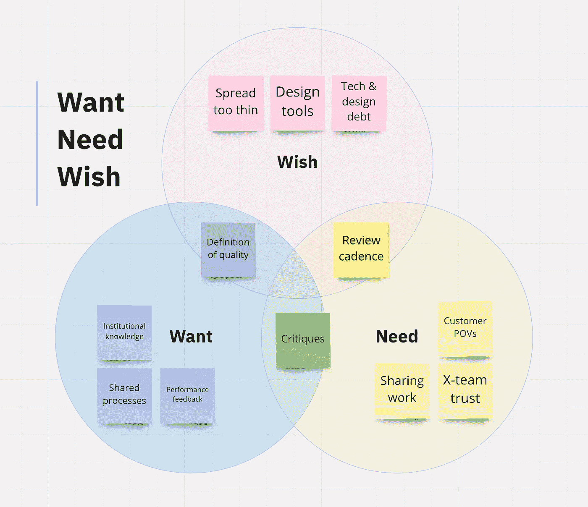

# 设计师们，你们考虑的是管理吗？

> 原文：<https://medium.com/geekculture/designers-are-you-thinking-about-management-c0b786804ba4?source=collection_archive---------6----------------------->

Photo by [Rodion Kutsaev](https://unsplash.com/@frostroomhead?utm_source=unsplash&utm_medium=referral&utm_content=creditCopyText) on [Unsplash](https://unsplash.com/?utm_source=unsplash&utm_medium=referral&utm_content=creditCopyText)

## 设计师如何成为更好的管理者？

做设计师和做经理相似多于不同，所以当新的设计经理(或考虑管理的设计师)向我寻求建议时，我相信他们已经具备了成为伟大经理所需的大部分技能。

*   你知道如何倾听，如何找到问题的根源吗？
*   你能想出创造性的解决方案，并看到他们通过决议吗？
*   你能谨慎地交流，令人信服地分享想法和观点，尊重他人的想法，同时温和地推动他们走向更好的结果吗？

这些都是优秀设计师和优秀经理的共同点，所以这两条职业道路都建立在相同的坚实基础上。

但这就是不同之处，这种不同是显著的，也是成为经理最不和谐的方面之一。突然，一个经理有了*访问*的权限。他们可以看到香肠是如何制作的:优先级是如何建立的，绩效是如何评估的，冲突是如何解决的，以及工资和雇佣决定是如何决定的。这种接触，虽然很可能是作为一名设计师在考虑这条职业道路时梦寐以求的东西(那张桌子上光荣的*座位*，做决定的*权力*，对*控制*的渴望)，但一旦你拥有了它，感觉会完全不同。管理是一个特权和责任并存的全新世界，新的管理者需要做出一个重要的决定:如何处理它？

由于这种接触方式的转变，这成为新任经理面临的主要问题:**你将如何运用你的特权和责任？你会成为什么样的领导？**

# 记住:这不再是你的事了。

大多数新经理在进入角色时没有获得成功所需的支持。2016 年 Grovo 调查显示，高达 98%的经理认为他们和同事需要更多培训，五分之二(或 40%)的新经理对他们在新角色中面临的挑战感到完全没有准备。对于设计师来说，这可能会导致他们花大量时间在那些对经理角色来说并不重要的问题上，因为他们试图找出如何不把事情搞砸——请原谅我的法语。

当我成为 Mozilla 的一名设计主管时，这无疑是我的经历。在那里，我与失去设计师身份做了几个月的斗争。没有适当的支持，我花了太多时间环顾四周问自己:

> 如果我不再制造和运输自己的作品，我是谁？

回想起来似乎很傻，但我花了一两个完整的评估周期来更好地理解我和我的团队的关系，让我看到他们对我的人力支持而不是设计支持的渴望和需要。他们不太关心我个人完成伟大设计的能力，而更关心我对他们完成伟大设计的能力的宣传和指导(包括帮助他们管理他们的时间、注意力、工作关系和职业生涯)，这是我作为团队的一员所能做的最有影响力的事情。

简而言之，这不再是关于我或者我创造的东西。这是关于我的团队和他们的能力。

最终我意识到我需要从以自己为中心转变为以他人为中心；这仍然是一个我可以“设计”的问题，使用我从多年经验中获得的技能，但背景和目标非常重要，并最终影响了我作为经理使用的工具。直到今天，我仍然认为自己是一名设计师，但我现在不再使用 Figma，而是用文字、研究、倾听和重构以及大量的文档和交流来设计解决方案！

**作为一名设计师，你的角色主要是提供设计。作为经理，你的角色主要是支持你的团队**，包括他们的工作和职业生涯。这样，你就在公司的使命和在日常工作中实现这一使命的人之间建立了重要的联系。

我在许多没有做好准备的新经理身上看到的是，他们需要改变对自己的看法(也就是说，少想一点自己)。是的——尽你所能成为最好的经理在经理自己的职业发展中很重要——但我经常看到当焦点转移到他们的团队时，这一点就不言自明了:团队的*和团队*中的*个人如何才能最有效？这样一来，这个角色就不再是管理者的新权力或权限，而是他们选择如何处理这些事情，以及如何集中精力。*

你可能会惊讶，这种观点在经理身上是多么罕见！

# 思考之前先做点梦。

> 当你进入信任和权力的位置时，在你思考之前做一点梦。托尼·莫里森。

我喜欢托尼·莫里森的这句话。对我来说，它承认领导和权威隐含的权力动态，同时鼓励你与现状不同。

如果我们只是“思考”成为新的管理者，或者制定战略并使用我们的左脑来实施和“做”，甚至只是为了符合别人的愿景，那么我们什么时候使用我们大脑的创造性部分来充分想象我们和我们的团队有能力做什么？正如莫里森指出的那样，当我们第一次进入这种类型的职位时，什么时候我们能更好地做好准备去梦想可能性呢？

 [## “古典音乐的变革力量”抄本

### TED Talk Subtitles and Transcript:本杰明·赞德有两个富有感染力的激情:古典音乐和帮助我们所有人…

www.ted.com](https://www.ted.com/talks/benjamin_zander_the_transformative_power_of_classical_music/transcript?language=en) 

有一个 Ted 演讲我也非常喜欢(总有一个 Ted 演讲！乐队指挥本杰明·詹德(Benjamin Zander)说，最好的领导者相信他们的团队可以做到，他们可以迎接你给他们的任何挑战。因此，虽然在思考之前做梦很重要，但相信也很重要。事实上，你的团队*需要*你相信他们——这是领导者的工作。

> “这是一个领导者的特点之一，他从不怀疑他所领导的人民实现他梦想的能力。”本杰明·赞德

做梦是信仰的开始。所以我相信是梦想的部分——而不是思考、实施或评估的部分(这些也很重要，但是以后)——让大多数伟大的设计领导者与众不同。*梦想*是经理角色的一部分，在这一部分中，经理们超越人们认为他们需要的东西，想象出真正可能的东西。这是设计变得伟大的时刻，管理也是如此。

# 试试“需要-想要-愿望”框架。

几个月前，当我开始担任 Webflow 的经理时，为了了解新团队，我使用了 Lattice 的设计总监 Jared Erondu 向我推荐的一种技术。Jared 建议我问我的新同事，他们认为他们需要什么来做好他们的工作，他们希望在接下来的短时间内(比如一两个月)发生什么，以及他们在目前的职位上只能希望得到什么，甚至觉得不可能。

在 1:1 中，当你开始了解他们的新经理或同事时，保持好奇会有所帮助，这是一种系统化的方式来表达你对现有团队的意见和经验的兴趣，向他们表明你在倾听和关心，并开始思考如何通过帮助他们克服现有挑战来成为团队的一员。

一旦你写下结果，你就可以评估在哪里产生最大的影响，团队中最大的共同关注点是什么，以及如何帮助每个人解决他们正在努力解决的问题。最后一点帮助很大，因为你赢得了新队友的信任，尤其是那些向你报告和委托你管理他们职业发展的人。

最后,“愿望”框架强调了当你*梦想*团队的潜力时，你同时在做的事情。

总结一下我认为新的设计经理如何更好地为成功做准备:

1.  认识到你拥有成为一名伟大经理所需的一切。只是，这不再是你一个人的事，而是你的团队的事。
2.  **三思而后行。检查你的特权，想象什么是可能的。相信你的团队能够实现你的梦想。**
3.  **如果框架有帮助，试试“需要-想要-愿望”。**通过好奇和帮助解决现有问题赢得新团队的信任。

我们的行业需要更多伟大的、有思想的、有决心的和有原则的设计领导者，他们能让其他人发光，我相信大多数优秀的设计师已经具备了所需的一切，即使这需要思想上的转变。你可以通过一点自我反省和接受可能性比已经想象的要大的事实来达到目的。

## Webflow 正在招聘一名产品设计经理。

如果你对这种类型的领导感到兴奋，并与一个支持性的设计领导者团队合作，我将聘请一名新的[产品设计经理](https://boards.greenhouse.io/webflow/jobs/2631503)来 Webflow 与我一起工作。我们欢迎来自非传统背景或代表性不足群体的申请人提出申请；我支持你，并承诺你会成功！

如果你想了解更多关于我自己的管理哲学，请阅读:[每个人都很悲伤，越来越悲伤:管理者如何在真正困难的时候提供帮助](/swlh/everyones-sad-and-getting-sadder-c8e6b23e69a5?source=friends_link&sk=83b75365a31d04390879a718edb06965)和[以人为本——领导远程设计团队的策略](https://modus.medium.com/humans-first-strategies-for-leading-remote-design-teams-d08df0c3f662?source=friends_link&sk=ad1ee091ca030e47d03f000cf4298b84)(这本书被改名为 *Ultimate-Guide-etc* ，但我更喜欢原来的标题)。

感谢阅读，祝你好运。