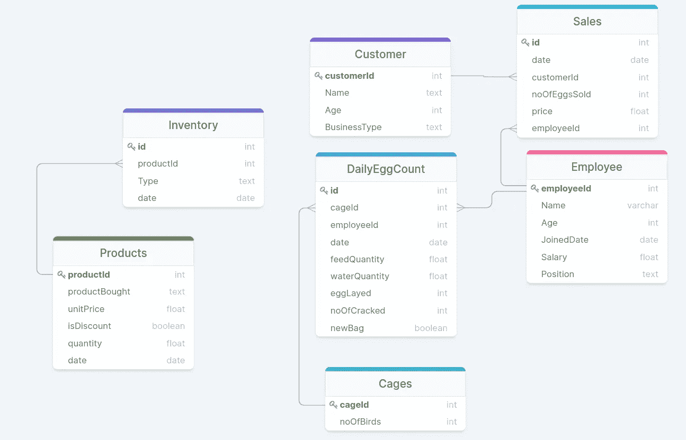

# 设计数据模型

> 原文：<https://medium.com/geekculture/designing-a-data-model-56588cc27215?source=collection_archive---------1----------------------->

## 将企业建模为实体并创建关系。数据工程指南

## 概述

1.  介绍
2.  什么是数据模型
3.  数据模型的优势
4.  设计数据模型的步骤:示例
5.  结论

## 介绍

正确组织文件可确保快速轻松的恢复。如果不组织我们的文件，很多时间会浪费在回答基于文件的问题上。数据行业中表示数据组织的一个常用术语是*数据模型。*

## 什么是数据模型

根据[维基百科](https://en.wikipedia.org/wiki/Data_model)的说法，数据模型是一种抽象模型，它组织数据元素，并标准化它们如何相互关联以及与现实世界实体的属性关联。在这里，实体是我们可以联系的事物，它们构成了我们业务不可分割的一部分，例如客户、产品、员工、库存等。这些实体有其单独的字段或属性，这些字段或属性定义了可以存储在其中的数据类型。例如，实体 Customer 可以有 customer_id、first_name、last_name、age 等属性。

数据建模是为信息系统(数据库)创建数据模型的过程，通过经历某些阶段来表示业务案例，目标是为操作业务应用程序生成高质量、一致和结构化的数据。

上述阶段通常分为三个阶段:

*   概念阶段
*   逻辑阶段
*   物理阶段

**概念阶段**:我把这个阶段称为谈话阶段，在这个阶段，一个工程师与不同的利益相关者谈话，这些利益相关者将使用将要创建的数据库，并试图理解以下内容:

*   当前可用数据源
*   数据库将用于回答的业务问题
*   数据量
*   将如何使用数据库
*   以及任何其他可能有助于更好地理解业务案例的问题。

逻辑阶段:这是工程师开始以逻辑方式构建数据模型的时候。在这里，工程师将对每个实体、其属性进行建模，并形成回答业务问题所需的任何关系。实体关系图(ERD)通常用于显示实体以及它们之间的关系。

物理阶段:在这里，工程师设计数据库的内部模式、数据表、这些表的数据列以及表之间的关系。

逻辑和物理阶段听起来非常相似，但主要区别是它们的用途和各自解释的详细程度。逻辑阶段的结果可用于与利益相关者或业务所有者一起探索概念，而物理阶段的结果通常是数据库设计或基础架构设置，其中选择了数据库风格并指定了数据库大小。

## **数据模型的优势**

*   它确保了业务数据的一致性、高质量和标准
*   它允许企业追溯和改进
*   它可以用来回答特定的业务问题
*   它降低了成本并允许适当操作优化

## 设计数据模型的步骤:示例

我将使用一个家禽企业作为我的案例研究。为了设计数据模型，我将从询问相关问题开始，以帮助我更好地理解用例。像这样的问题；

*   该数据库将用于什么
*   数据库将用于回答哪些业务问题
*   预期的数据大小是多少
*   有哪些可用的数据
*   谁会使用数据库

基于对上述问题的回答，我拥有以下实体:客户、产品、销售、笼子、员工、每日计数。为了定义实体及其属性，我使用了集合符号，如下所示；

下一步是构建一个 ER 图，显示这些实体之间的关系。在这里，我定义了实体之间的关系是如何形成的，以及它们之间存在的关系的类型。通常有三种类型的关系，包括:

*   一对一的关系
*   一对多或多对一关系
*   多对多关系

我不会讨论列出的关系，但我会建议你阅读[这里](https://afteracademy.com/blog/what-are-the-different-types-of-relationships-in-dbms)或[这里](https://database.guide/the-3-types-of-relationships-in-database-design/)来了解更多。

我的 ER 图是这样的:

ER Diagram

此处示例的最后一个阶段是构建数据库设计，也称为物理阶段。我使用了一个托管在 AWS 上的 MySQL 数据库。我编写了 sql 代码来具体化数据库以及将数据加载到数据库中。sql 代码附在下面

上面的 github 要点将表(实体)创建到数据库中，形成这些实体之间的关系，并指定完整性。

## 结论

将数据组织成一种形式，使其一致并符合标准，这对每个企业都很重要。数据建模是做到这一点的一种方式，被认为是数据工程师的一项重要技能，因为它有助于更好地理解数据和业务，也有助于业务的增长和扩展。

数据建模的阶段提供了对业务的独特见解和对用例的理解。感谢阅读