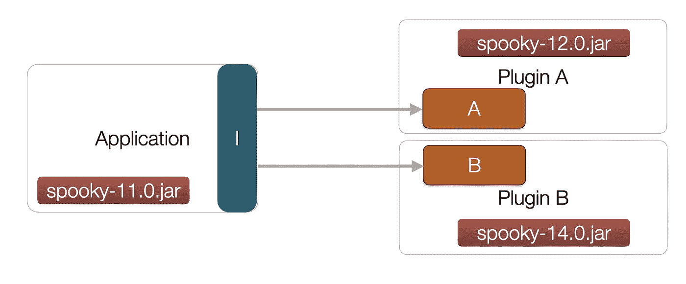
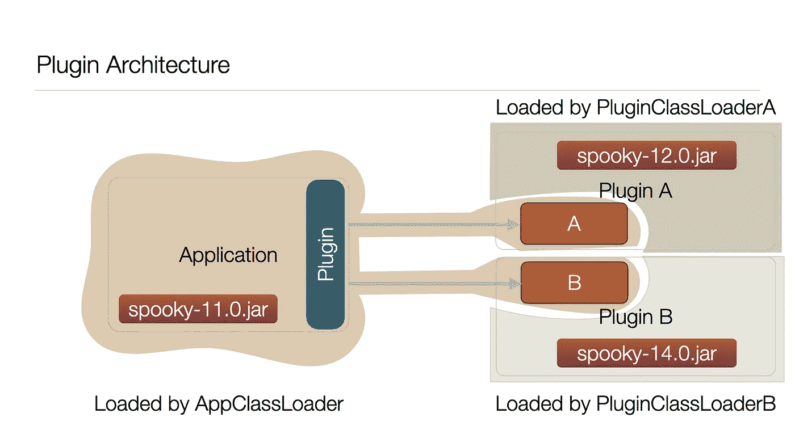

# 用 Java 设计轻量级插件架构

> 原文：<https://medium.com/geekculture/designing-a-lightweight-plugin-architecture-in-java-5eedfeaa92a9?source=collection_archive---------3----------------------->

> 您想让您的 Java 应用程序具有可扩展性并易于其他人添加功能吗？
> 
> 您是否正在与 OSGI 进行斗争，并且正在寻找一个更简单的解决方案？
> 
> 你是否因为你的应用程序与太多东西对话，并且所有东西都在你的类路径中而陷入了类路径地狱？

在本文中，随着应用程序在其生命周期中的成长，我将尝试为人们经常遇到的这些问题提供一些解决方案。

# 我什么时候需要插件架构？

插件架构可能对以下一系列问题有意义

*   你的应用程序提供了一系列的功能，并且它还可以与其他项目进行交互
*   你的应用程序的不同部分做不同的事情，这些事情互不相关，但是它们相互作用，定义明确
*   您需要类路径隔离。您的应用程序具有冲突的可传递依赖关系，这变得越来越难以管理。



Bad dependency situation

# 其他解决方案

在实践中，有各种方法可以用来处理这些问题。

*   明暗法
*   奥斯吉

阴影通过重命名包减轻了一些依赖性问题。然而，它创建了同一个包的多个版本，并可能导致调试噩梦。

OSGI 可能是构建模块化 Java 应用程序的行业标准，但是对于大多数开发人员来说，它太重了，很难使用。

[上的人说什么栈溢出](https://medium.com/u/d53dd768d047?source=post_page-----5eedfeaa92a9--------------------------------)

> “OSGi 带来的痛苦多于好处”
> 
> “我个人(2 年)对 OSGI 的经验是，技术上的花费远远超过了功能上的好处。我遇到过这样的情况，您必须创建/编辑 25 个以上的 pom 文件来实现一个命令行模拟！”

# 编写您自己的基础架构

用 Java 构建一个简单的插件基础设施有几个步骤。为了简单起见，我在 GitHub 上写了一个[快速入门](https://github.com/suvodeep-pyne/java-plugin-quickstart)来帮助你入门。该项目使用了 **maven** 和 **Java 8** ，但是这些原则可以非常容易地扩展到其他构建系统/jdk 版本。

[](https://github.com/suvodeep-pyne/java-plugin-quickstart) [## suvodeep-pyne/Java-插件-快速启动

### Java 插件框架快速入门项目—suvodeep-pyne/Java-plugin-quick start

github.com](https://github.com/suvodeep-pyne/java-plugin-quickstart) 

我们将使用 Java 的`ServiceLoader`来为我们做所有繁重的工作。

让我们从什么分布/tarball 开始。

> 你也可以用一个超级 jar 来做这件事，但是你需要某种结构来安排你的插件和它们的二进制文件。

就我个人而言，我更喜欢发行版，而不是把所有东西都塞进一个大罐子里。

# 分配

设置您的发行版的一种可能方式如下:

```
├── bin # contains your launcher
│ └── launcher.sh
├── lib # contains all jars for your main app
│ ├── java-plugin-quickstart-core-1.0-SNAPSHOT.jar
│ └── java-plugin-quickstart-spi-1.0-SNAPSHOT.jar
└── plugins # dir containing your plugins
 └── foo # An example plugin dir
   └── java-plugin-quickstart-plugin-foo-1.0-SNAPSHOT.jar
```

这是一个非常标准的结构，但我们还是要逐一介绍。

*   包含你的启动器，你的 shell 脚本等等
*   `lib`:包含应用程序类路径中的 jar 和资源。(不是你的插件)
*   `plugins`:包含你所有插件的目录。每个插件本身都包含在一个子目录中。这里 foo 是一个示例插件

# 包装

打包是至关重要的，因为它允许你定义一个关于你的应用程序如何与其插件交互的清晰契约。

*   `spi` : spi 代表服务提供商接口。(早期人们称之为串行外设接口。你挑吧！)`spi`旨在做到极其轻量级，只包含应用程序的基本接口。理想情况下，这里不应该有任何实现或代码。这个包的依赖性应该是最低限度的。目标是所有插件和核心包都依赖于`spi`包，它是应用程序的锚点。
*   `core`:这是你的应用程序，可能使用 spi 接口加载插件，因此依赖于你的`spi`包。
*   `plugin-foo`:你的插件实现依赖于你的`spi`包，并实现一组提供特定特性/扩展的 spi 接口。在大多数情况下，你可能不应该依赖应用程序的任何其他核心包。

# 接口

在构建模块化应用程序时，拥有一套良好、干净的界面至关重要。这里的目标是能够加载一个名为`Foo`的服务类。`Foo`由名为`FooFactory`的类构建，该类通过`Plugin`加载。让我们逐一介绍一下。

我们将从`Plugin`接口开始。

```
public interface Plugin {default List<FooFactory> getFooFactories() {
    return Collections.emptyList();
  }default List<BarFactory> getBarFactories() {
    return Collections.emptyList();
  }
}
```

该接口必须由每个`Plugin`实现。Java 的`ServiceLoader`使用`Plugin`接口来加载插件，并使其对应用程序的其余部分可用。

每个插件可以选择提供一个或多个工厂。所以，一个插件并不局限于某种“类型”。这里使用的工厂模式使得应用程序可以很容易地按需构造服务对象。它还完全控制插件如何构建服务实例。

一个简单的工厂类应该是这样的。这里的`name`定义了创建的对象的种类。

```
public interface FooFactory { // Expected to be unique
  String name(); Foo build(FooContext ctx);
}
```

最后，您的主服务接口看起来类似于:

```
public interface Foo { void doFoo();
}
```

# 编写插件

插件只是一个实现`Plugin`接口并将其暴露给 Java 的`ServiceLoader`的模块。插件模块通常会添加`spi`作为它的依赖项，以便能够实现接口。

`java.util.ServiceLoader`将读取文本文件`resources/META-INF/services/org.spyne.javapluginquickstart.spi.Plugin`来定位插件实现的引用。在这种情况下，清单文件的内容类似于

```
org.spyne.javapluginquickstart.fooplugin.FooPlugin
```

这里有一个完整的例子:

[](https://github.com/suvodeep-pyne/java-plugin-quickstart/blob/master/java-plugin-quickstart-plugin-foo/src/main/resources/META-INF/services/org.spyne.javapluginquickstart.spi.Plugin) [## suvodeep-pyne/Java-插件-快速启动

### Java-suvodeep-pyne/Java-plugin-quick start 中插件框架的快速启动项目

github.com](https://github.com/suvodeep-pyne/java-plugin-quickstart/blob/master/java-plugin-quickstart-plugin-foo/src/main/resources/META-INF/services/org.spyne.javapluginquickstart.spi.Plugin) 

# 加载插件

这是一切都适合的地方。`ServiceLoader`接口使用`URLClassLoader`来加载服务。quickstart 将`URLClassLoader`扩展为`PluginClassLoader`，可以用来限制对主应用程序类加载器中某些类的访问。

因此，类装入器的边界看起来像这样。



Plugin Architecture

# 管理整个事情

您可以构建项目

```
./mvnw install
```

这将在包含启动脚本的`distribution`模块内的`target`目录中构建应用程序发行版。

```
❯ bin/launcher.sh
Hello World!
Loading plugin: plugins/foo
Installing plugin: org.spyne.javapluginquickstart.fooplugin.FooPlugin
I'm a foo dooer!
```

在运行`launcher`时，您会注意到应用程序能够加载，遍历`plugins`目录中的所有目录并安装它们。安装后，核心模块现在可以在运行时访问`Foo`服务。

还要注意，由于系统类加载器不同于`PluginClassLoader`，这个应用程序大部分与插件中的 jar 隔离。不仅如此，每个插件都在自己的类加载器中工作，给每个插件自己的类空间。

> **注意**你仍然**需要这些插件成为应用程序中的好公民**，因为它们仍然运行在同一个 JVM **中。**

# 结论

只要做一点工作，你就可以很容易地用 Java 建立你自己的插件 infra。这是一个更干净的架构，有助于保持模块化，并为应用程序建立一个坚实的框架。

我真的要感谢[阿帕奇皮诺](https://github.com/apache/incubator-pinot)和[脸书普雷斯托 db](https://github.com/prestodb/presto) 团队，他们在开源社区中发布了一些非常惊人的代码。您可以浏览这两个项目，看看它们如何利用类加载器并在代码库中构建模块化。

同样，完整的实现可在下面的回购分享。

[](https://github.com/suvodeep-pyne/java-plugin-quickstart) [## suvodeep-pyne/Java-插件-快速启动

### Java-suvodeep-pyne/Java-plugin-quick start 中插件框架的快速启动项目

github.com](https://github.com/suvodeep-pyne/java-plugin-quickstart) 

希望这有所帮助！如果有任何问题，请随时在 twitter 上联系我或在下面留言。