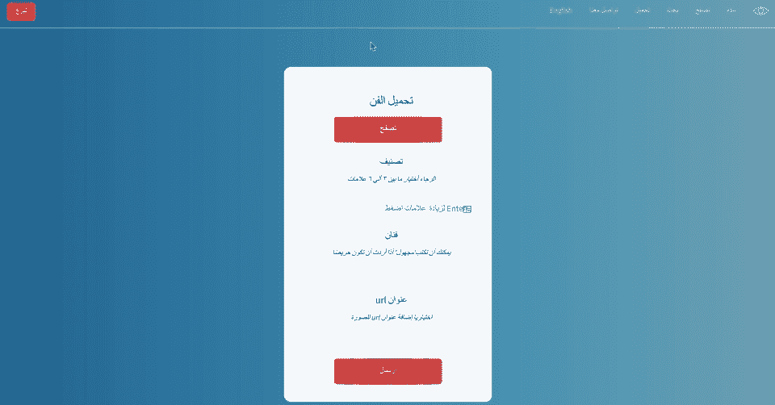
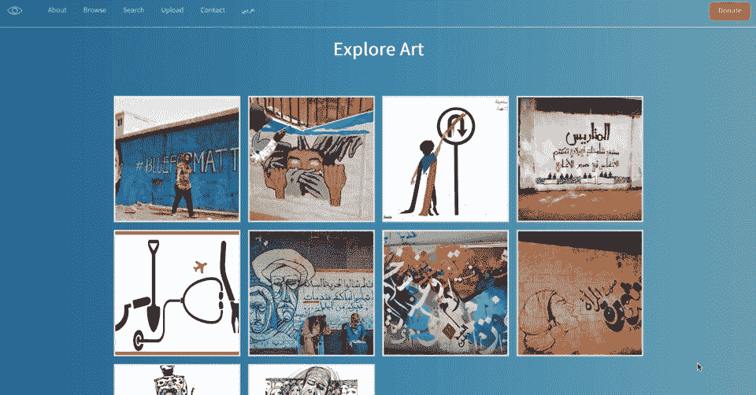
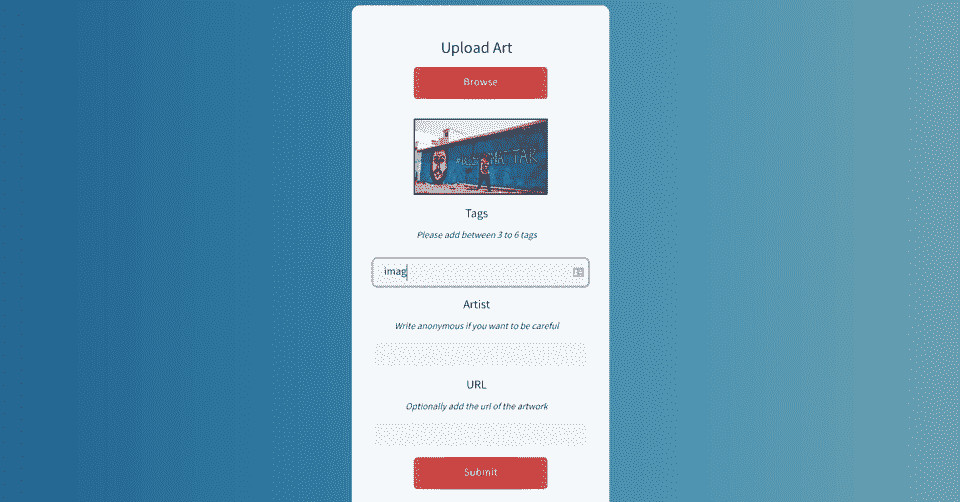

# 设计革命性的网络应用👊第二部分

> 原文：<https://medium.com/geekculture/designing-a-revolutionary-web-app-part-ii-a9b9356143a6?source=collection_archive---------5----------------------->

User journey in uploading an image

# 第二部分— JavaScript/React

这是我的故事的第二部分，关于设计一个网络应用来支持苏丹人民抵抗政变。你可以在这里看到网站[。](https://sudan-art.com/)

你可以在这里看到第一部分。

这一部分有三节:

1.  如何避免布局偏移，并在页面完全加载后只显示一整页的图片；
2.  或者，如何显示图像的占位符，使它们在加载前看起来不错；
3.  如何设计一个简洁的图像标签组件；

## 如何避免布局偏移，并在页面完全加载后只显示一整页的图片

布局变化是一种痛苦。它们看起来很糟糕，会搞乱你网站的搜索引擎优化。这对于我的网站来说是一个特别的问题，因为它在一个漂亮的砖石布局的登陆页面中使用了大量的图片…

…这意味着每次图像下载完成时，布局都会重新配置和移动😱

所以我是这样解决的:

完成大部分工作的函数在第 25–30 行。这利用了一个`useRef`钩子来跟踪自从我将这个`handleOnLoad`函数传递给第 73 行上的每个图像以来，是否所有的图像都已经加载了。

在这个函数中有一个非常简单的 if 语句，它允许我通过使用第 28 行中的`useState`钩子，只加载二十张图片。

我只有 20 张图片，所以这意味着一旦所有的图片都被下载了，这个页面只能加载我在 CSS 中得到的砖石布局。没有布局变化🌟

这是最后的结果:

## 如何显示图像的占位符，使它们在加载前看起来更好

我认为这是一个非常常见的前端问题…你如何在图像加载前显示它的占位符？这通常被称为回退渲染。这样你可以获得更好的用户体验，因为这样你就可以看到图像正在加载，而且你也避免了布局的改变。我真的很讨厌布局转换😢

我在应用程序中解决这个问题的方法是创建一个组件，将每张图片包装在其中:

最后，这并不复杂——它只是利用一个简单的`useState`钩子给你一个占位符，加载到本地 svg 或者给你实际的图像。但是我认为结果非常好——看到渲染之前你得到的黑眼睛标志了吗？那是占位符。

如果你在手机上使用慢速互联网，那么这样看起来会更好😉

## 如何设计一个简洁的图像标签组件

这是我的图像标签组件🎊我觉得这很棒。

作为一般的免责声明，我从[这里](https://dev.to/prvnbist/create-a-tags-input-component-in-reactjs-ki)偷了很多这部分的代码。但这是我的版本:

这里的关键是`addTags`和`removeTags`函数。在第 28 行，`addTags`在析构当前值后将用户输入添加到标签数组中；这意味着您可以一个接一个地构建标签。

然后，remove tags 将通过将用户取消选择的标签与该标签在数组中的索引进行匹配来删除该标签——它获得此信息是因为 map 函数循环遍历第 60 行中的标签。

我发现将`selectedTags`数组保留在父组件中并提升状态更容易，因为这意味着我可以使用该数据进行表单验证，也就是说，如果用户没有输入 3 到 6 个标签，就向用户发送烦人的消息。

这就对了。这很简单，但我认为结果很好，尤其是渐变。