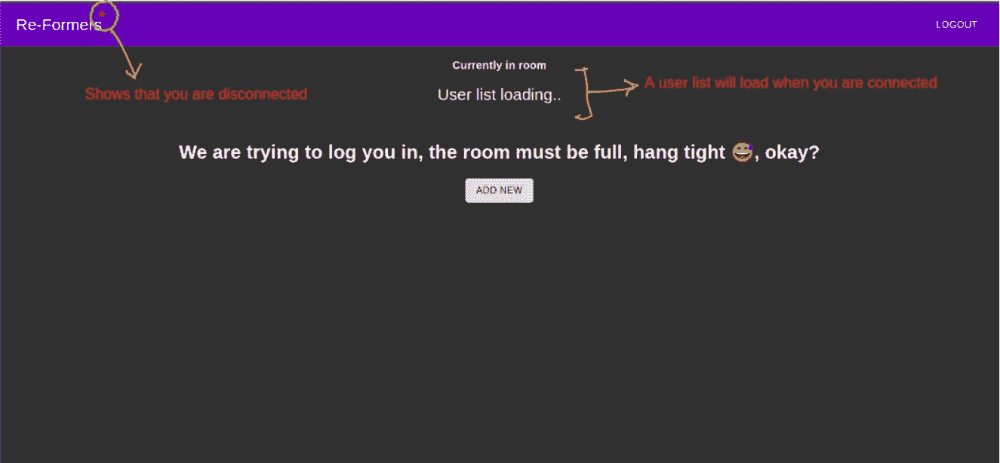
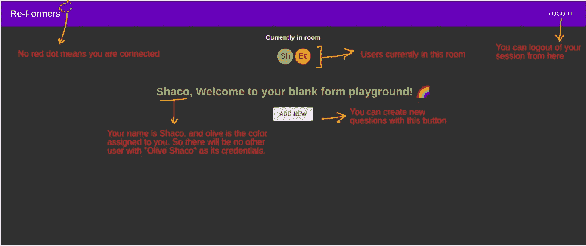
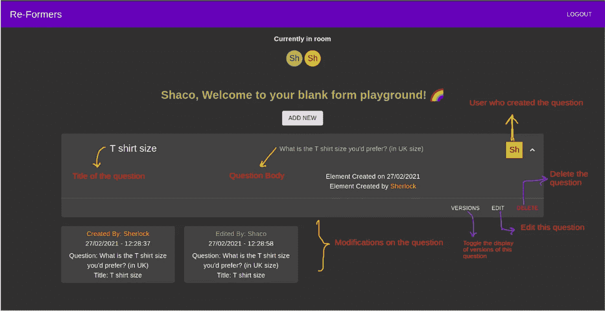
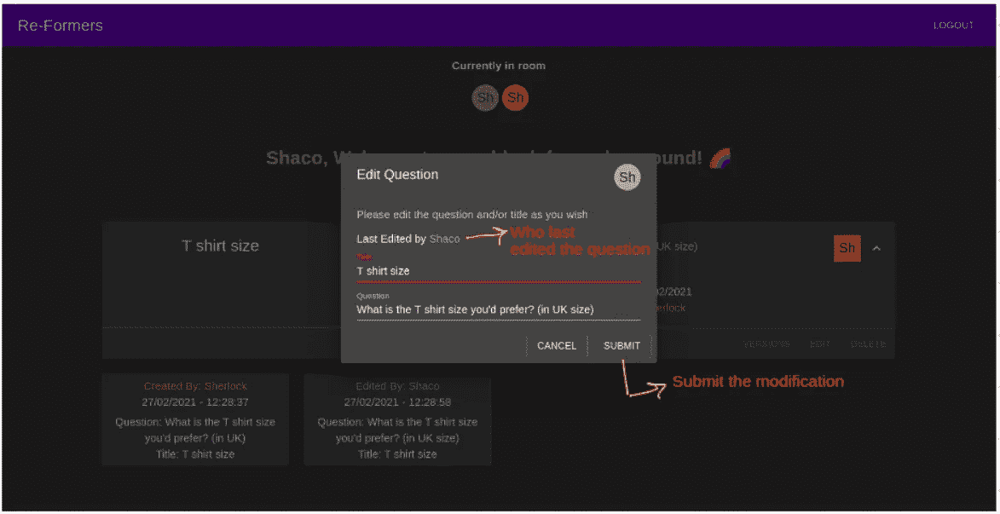
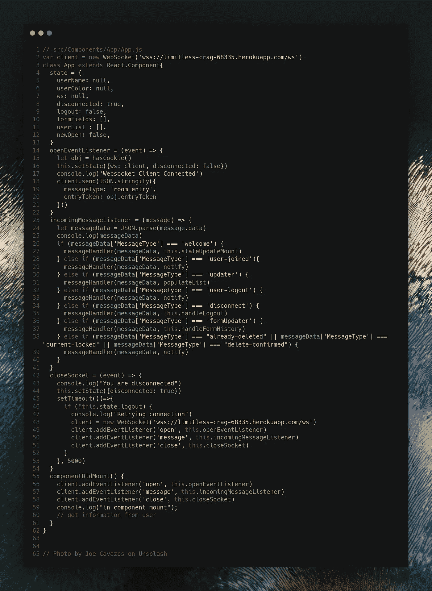
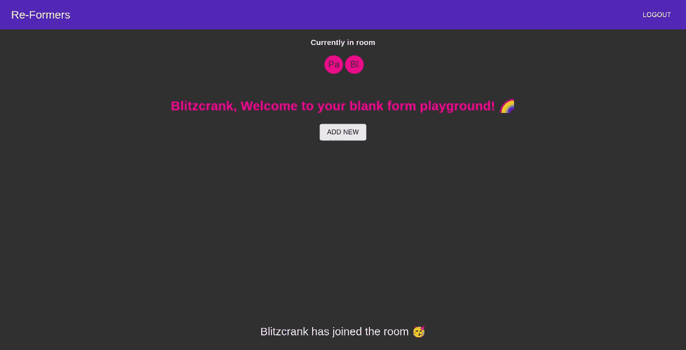
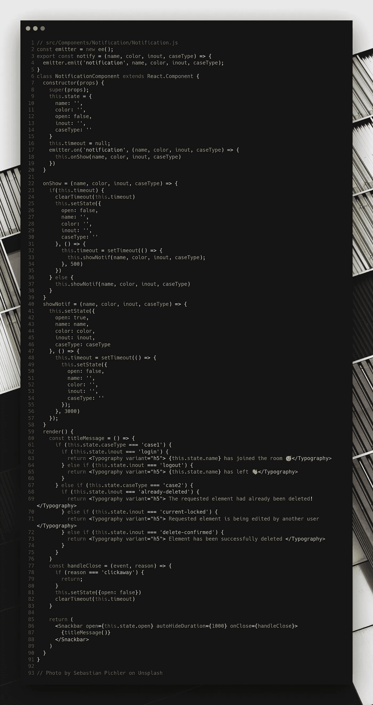
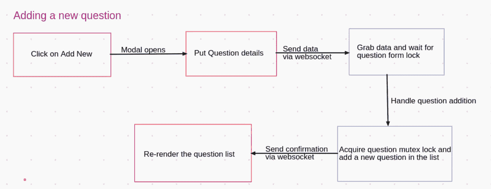
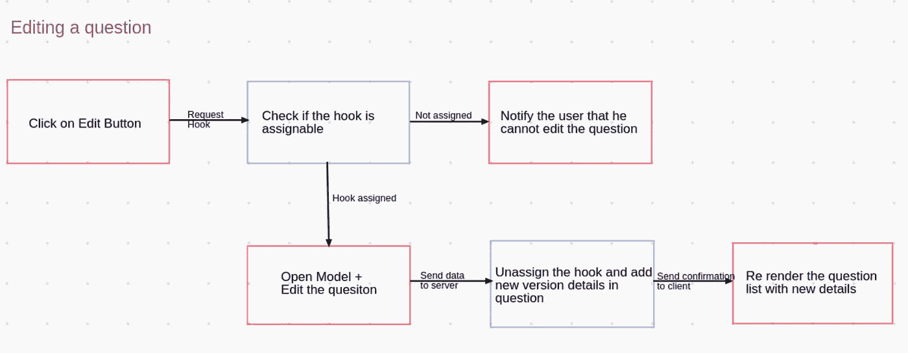

# 在 ReactJS | Reformers ReactJS 实现策略中设计具有通知的 WebSocket 客户端

> 原文：<https://medium.com/geekculture/designing-a-websocket-client-with-notifications-in-reactjs-reformers-reactjs-implementation-c669daf27d46?source=collection_archive---------1----------------------->

欢迎来到 Re-Formers 项目的第三部分，也是最后一部分(使用 WebSockets 的协作表单编辑器)。这篇文章是关于一个 WebSocket 客户端，它处理用户与我们的服务器的交互。你可以在这里找到这个系列的其他文章:

1.  [在 Golang 和 React 中使用 WebSockets | Web Sockets 的协作表单编辑器](/heuristics/collaborative-form-editor-using-websockets-web-sockets-in-golang-and-react-20d123f40447)
2.  [在 Golang 设计 WebSocket 服务器|改革者后端实施策略](/geekculture/designing-a-websocket-server-in-golang-reformers-golang-implementation-strategy-bcd2dc9e368e)
3.  在 ReactJS | Reformers 前端实现策略中设计具有通知的 WebSocket 客户端

## TL；速度三角形定位法(dead reckoning)🤷

我在 ReactJS 中创建了一个客户端，用来与我们的 WebSocket 服务器进行交互，包括通知功能和后端的 WebSocket 连接处理。你可以在这里查看客户端:[改造客户端](https://reformers.netlify.app/)，GitHub 源代码在这里:[uds 5501/改造客户端](https://github.com/uds5501/re-formers)

# 思维过程🧠

因此，我们需要一个客户端与我们的 WebSocket 服务器进行交互。但是还有什么比我们的老反应更好的呢！

我脑海中的思维导图是创建一个能够提供以下功能的客户端

1.  保持与 WebSocket 服务器的持续连接。
2.  处理服务器分配给我们的名称和颜色组合，并妥善保存以备将来使用。
3.  当用户加入/离开房间时处理实时通知
4.  处理实时“房间中的用户”状态
5.  处理实时问题编辑和版本显示。
6.  提供一个选项，让用户根据服务器的指示自行注销，或者单击一个简单的注销。

而这个客户端处理的就是这个！

## 用户界面的线框🗺️

你可以发现 UI 屏幕被分成大约 4-5 个框架。我决定详细阐述其中的 4 个，你可以在这里看到它们。(图片中给出的关于哪个组件做什么的解释)

## 用户输入屏幕

## 用户墙

## 有问题的用户墙🗺️

## 编辑问题

# Techstack 解释🧑‍🏫

我使用经典的 ReactJS(用`create-react-app`作为引导)作为整个应用程序的基础。为了得到一个圆滑的深色主题的 UI，我转向了 **Material-UI** 。为了处理承诺和基于请求的服务，我使用了 **axios。**为了处理 WebSocket 连接，我使用了经典的 **WebSocket** API。为了处理通知的事件发射，我使用了**事件发射器**。正在使用的最后一个不同的包是 **universal-cookie** ，用于在需要时存储和检索入口令牌。

# **web socket 连接是如何处理的？**🔌

WebSocket 连接在 **App** 组件中处理。在初始化时，我创建了一个新的`WebSocket()`对象，将它连接到服务器上适当的端点。一旦连接完毕，我们将三个特定的连接绑定到我们的 WebSocket 客户端。

1.  openEventListener
2.  传入消息监听器
3.  封闭插座

`openEventListener`用于 web 套接字连接已经建立，但客户端尚未通过身份验证的情况。客户端从 cookies(如果存在)发送一个存储的入口令牌，并等待服务器确认是否可以向用户提供入口。

`incomingMessageListener`用于处理服务器传入的消息。传入的消息首先被解析为 JSON 格式，根据`MessageType`是什么，调用`messageHandler`来获取`messageData`并执行适当的操作。

`closeSocket`用于处理 web socket 连接的优雅关闭。关闭时，如果客户端没有自动注销，应用程序每隔 5 秒钟自动尝试再次与服务器建立连接。

# 通知？这很痛苦。🔔

在这个应用程序中，通知处理程序是一个真正令人头疼的问题。事实是，人们可以选择这三种方法中的任何一种来向用户显示通知。

1.  推送通知
2.  自定义通知
3.  零食条通知

推送通知听起来很神奇，的确如此，但是想象一下，30 个用户登录一个房间，编辑多个问题，新用户加入，现有用户离开。这将产生大量的通知，除非你想在客户端的浏览器上发送垃圾邮件，否则这似乎不是一个好的解决方案。当然，你可以完全关闭网站的通知，但我也不想给出这个选项，我希望用户对通知有一个全面的体验。

Snackbar notifications

我最终使用了 Snackbar 通知方法。人们也可以使用自定义通知，但坦率地说，我太懒了，从零开始重新实现轮子，所以 Snackbar。

Snackbar notification component

`notify`方法发出一个`notification`事件(该方法应该由`messageHandler`在收到通知请求时调用)，现在它将调用`showNotif`方法，该方法将显示通知 3 秒钟，然后将组件的状态设置回初始状态。如果已经显示了一个通知，它会给出 0.5 秒的时间来折叠并被一个新的通知取代。

# 问题编辑工作流，一个迷你线程🧵

现在请允许我详细说明一下这个客户端是如何处理问题工作流中的变化的。

## 添加新问题

要添加新问题，用户必须单击 UI 中的“Add New”按钮，这将打开一个新对话框。一旦问题细节被填充，数据就被发送到服务器，其中一个问题编辑处理线程接收请求，并等待直到问题数组的互斥锁可用。
一旦互斥锁被分配给这个线程，一个新的问题就用获得的细节来创建，服务器中的一个后续线程返回确认和一个要呈现的新问题列表。

Flow Diagram for adding a new question

## 编辑问题

要编辑一个现有的问题，用户需要首先请求 edit 挂钩。当且仅当以下条件成立时，服务器确保可以将编辑挂钩给予用户:

*   用户没有已分配的编辑挂钩。
*   正在考虑的问题不会被删除。

如果这些条件为真，我们只需将挂钩分配给客户端，就会打开一个新的对话框，用户可以在其中编辑问题细节。完成后，数据被发送到服务器，问题处理程序线程再次等待分配给它们的互斥锁，分配后，问题的新版本被创建并广播到客户端进行重新呈现。

一个重要的问题是**如果用户分配了一个编辑锁，然后客户端从 web socket 断开连接或者刷新他/她的页面，该怎么办？** 所使用的解决方案非常简单，上述事件中的任何一个都只是取消分配给特定客户端的任何挂钩(通过入口令牌映射)。

# 结论✅

所以你走到了这一步！感谢你阅读了所有的帖子。
最后，我想说的是，WebSockets 对于实时应用程序处理来说是一项了不起的技术，它减少了大量的轮询开销，我们刚刚看到了如何处理多个用户之间的实时连接(虽然有点慢，但使用多线程广播肯定可以得到更好的优化)

# 资源📚

*   [Material-UI](https://material-ui.com/) 风格指南
*   [源代码的 Github 库](https://github.com/uds5501/re-formers)
*   [主网站](https://reformers.netlify.app/)供您亲自尝试
*   一个[微型导轨](https://spring.io/guides/gs/messaging-stomp-websocket/)连接到网络插座
*   [推送通知的 NPM 包](https://www.npmjs.com/package/react-push-notification)