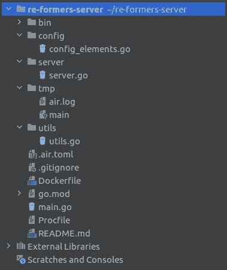
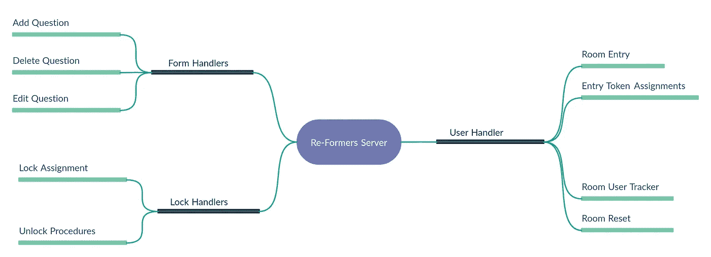
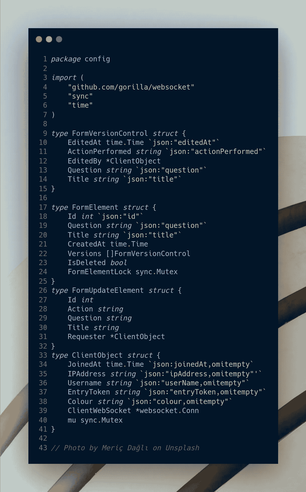
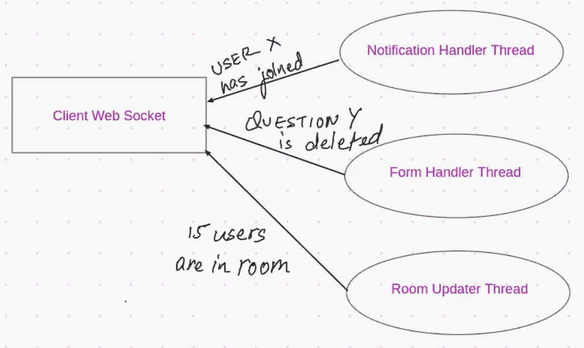
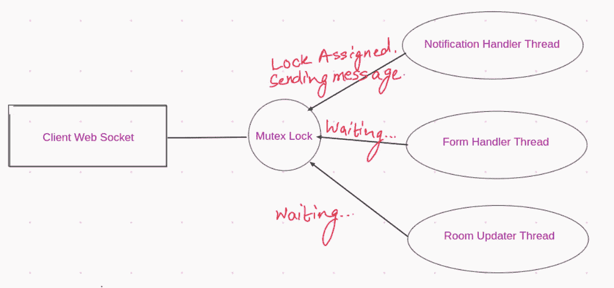
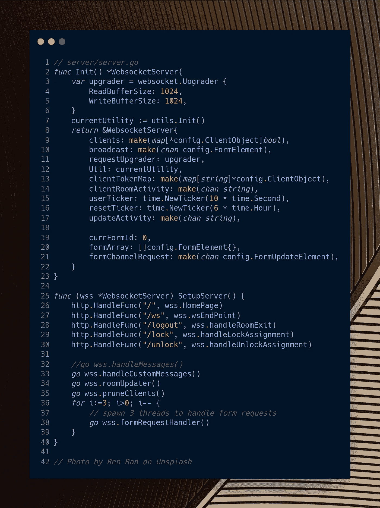
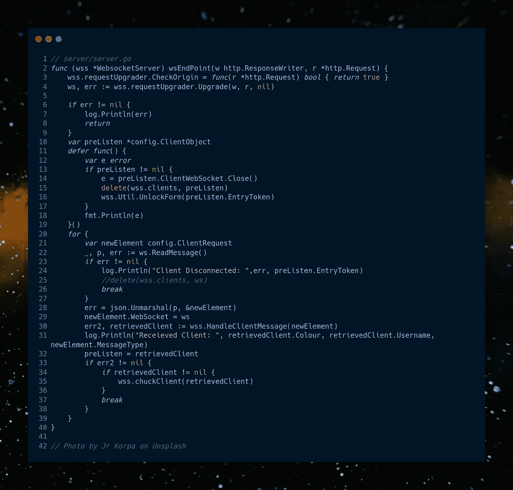
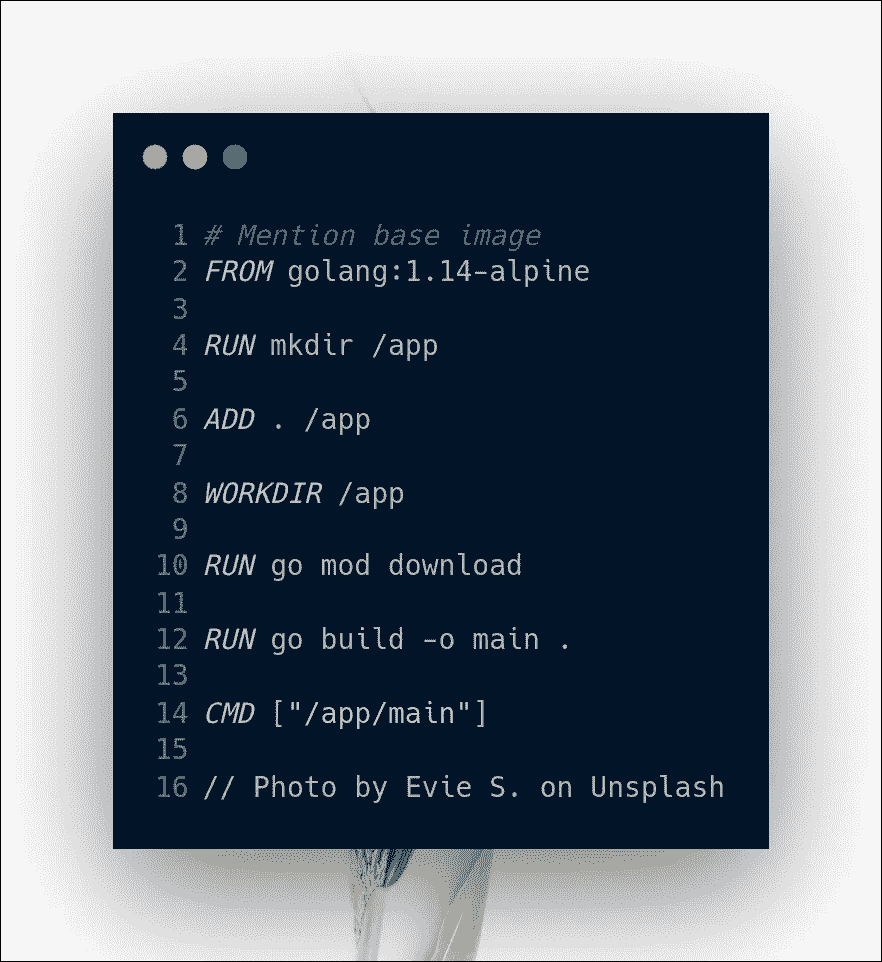
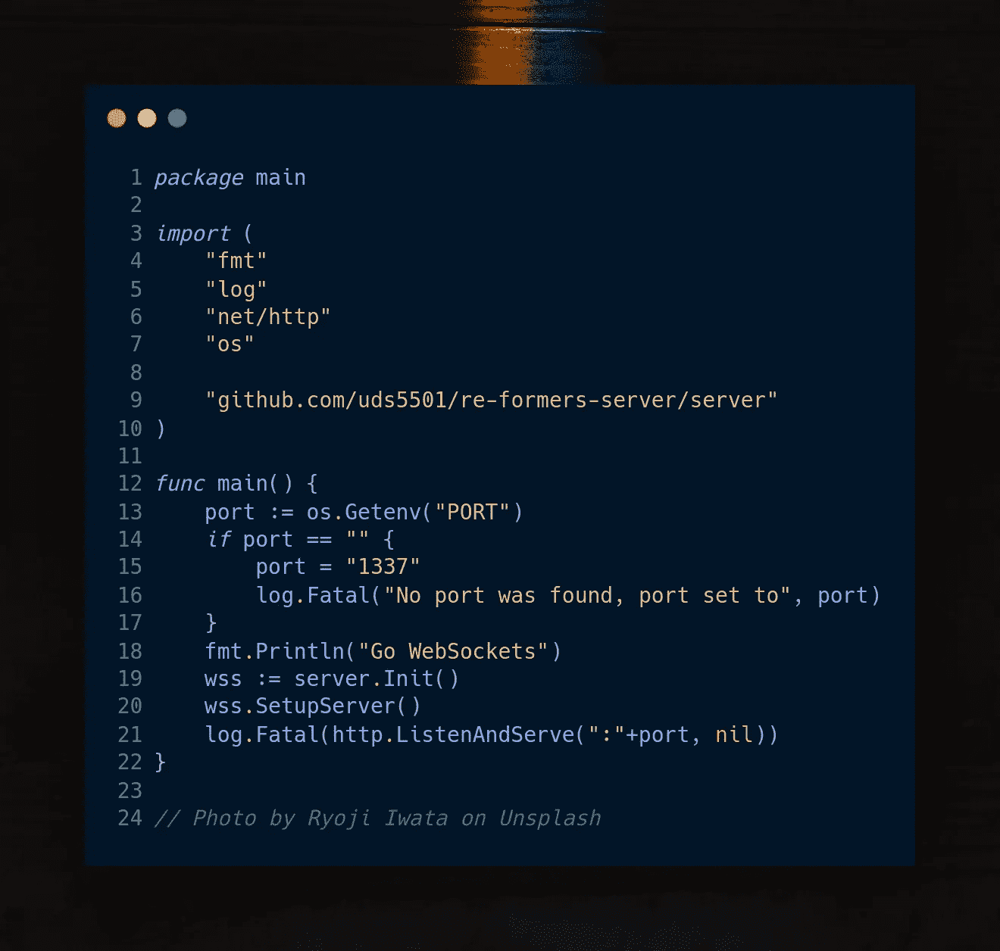

# 在 Golang 中设计 WebSocket 服务器|改革者 Golang 实施策略

> 原文：<https://medium.com/geekculture/designing-a-websocket-server-in-golang-reformers-golang-implementation-strategy-bcd2dc9e368e?source=collection_archive---------1----------------------->

欢迎来到 Re-Formers 项目的第二部分(使用 WebSockets 的协作表单编辑器)。这篇文章是关于 WebSocket 服务器的，它处理每个元素的整个表单同步。你可以在这里找到这个系列的其他文章:

1.  [在 Golang 和 React 中使用 WebSockets | Web Sockets 的协作表单编辑器](/heuristics/collaborative-form-editor-using-websockets-web-sockets-in-golang-and-react-20d123f40447)
2.  在 Golang 中设计 WebSocket 服务器|改革者后端实现策略
3.  [在 ReactJS | Reformers 前端实现策略中设计带通知的 WebSocket 客户端](/geekculture/designing-a-websocket-client-with-notifications-in-reactjs-reformers-reactjs-implementation-c669daf27d46)

## TL；速度三角形定位法(dead reckoning)

下面的 GitHub 存储库将带您进入服务器代码:[re formers-server](https://github.com/uds5501/re-formers-server)并在 docker 容器上运行，您可以使用

```
$ docker pull uddeshyasingh/re-formers-server
$ docker run -p 1337:1337 uddeshyasingh/re-formers-server:latest
```

# 文件夹描述概览🕵️

整个服务器模块由 Dockerfile、Procfile、一些配置元素和两个模块 server 和 Utils 组成



Program folder

**/server** :它包括整个主服务器模块，稍后在 main.go 中调用。这是一个单独的包，因此可以很容易地伸缩。

**/utils** :它包含一个实用函数，用于处理一些工作，比如给客户端一个名称+颜色的组合，将入口标记映射到客户端，将它们分配给编辑钩子等等。

**/tmp** :这是由于使用`air`实时调试器而创建的临时文件，您可以在生产容器中忽略它。

# 它都做些什么？📚



Method Diagram for server

基本上，我们的服务器提供 3 种不同的垂直服务，即表单处理程序、用户处理程序和锁处理程序

## 用户处理程序

1.  处理客户在编辑室的进出
2.  分配和刷新传入客户端的入口令牌
3.  跟踪当前房间中的用户，并帮助将其转发给连接的客户端。
4.  每 6 小时重置整个房间(参与的客户端和当前表单状态)。

## 锁定处理程序

1.  它们有助于为某些表单问题分配锁定，以便多个用户可以编辑它们，而不用担心表单被另一个不知道的用户删除

## 表单处理程序

1.  这有助于添加新问题、删除旧问题和编辑现有问题。
2.  服务器中产生了多个处理程序，以更快的速度帮助和执行请求。
3.  本模块中的每个操作都有一个不同的工作流程，稍后将对其进行描述。

# 配置结构⚙️

总共使用了 7 个结构，我想详细说明其中的一些



在这里，`FormVersionControl`帮助维护关于特定问题的版本控制元素的数据，`ClientObject`顾名思义，存储客户信息。`FormUpdateElement`是一个内部结构，用于传递特定问题所需的更新信息，最后，`FormElement`在表单中存储特定问题的信息。

## 为什么我要使用 sync.mutex？🧵

你可能已经注意到了，我在敏感的元素中使用了互斥锁来确保进程间的同步。下图是在没有使用互斥锁的情况下，它会给出一个错误。



例如，在`ClientObject`结构中，你不能通过 WebSocket 同时推送多个消息**和**。现在，为了确保多个线程不会同时使用 WebSocket ( `clientWebSocket`)。下图解释了修复方法。



Synchronization using mutex locks

## 关于服务器的一点点…💻



我的服务器基本上是一个结构，可以使用`Init()`构造函数独立导出，并在`main.go`中调用。它在`/ws`绑定 WebSocket 处理程序，同时为`roomUpdater`、`pruneClients`和`handleCustomMessages`各生成一个线程，同时为`formRequestHandler`生成 3 个线程，以确保更快地处理问题请求。

每个结构都有一个将 ClientObject 结构存储为布尔值的映射`clients`,一个用于映射条目标记的映射`clientTokenMap`。`clientRoomActivity`存储由`handleCustomMessages`线程处理的用户加入/离开消息。存储在 WebSockets 中的一个`requestUpgrader`。`Util`对于 Util 模块，`userTicker`推送频道中当前用户的更新。`resetTicker`重置整个房间。

`currFormId`为新问题分配新的表单 Id，而`formArray`存储所有问题。`formMutex`如上所述，确保同步和无争用情况。

# 为了赚钱，我们的 WebSocket 处理程序！🥁



在这里，我们正在初始化一个源检查(在任何情况下我们都返回 True ),然后**将**传入的 **HTTP** 请求升级为一个持久的双工连接。我使用[**gorilla**](https://github.com/gorilla/websocket)WebSockets 作为我们的 web socket 连接库。
defer 功能用于确保在启动连接出错的情况下删除注册的客户端。
之后，无限 for 循环用于确保端点始终监听来自客户端的消息，我们将其解组为服务器可读格式，即`clientRequestObject` struct，并将其发送到`HandleClientMessage`方法进行进一步处理，如果这里也出现问题，我们将从映射的客户端连接中丢弃此连接。

# Dockerfile 文件🐳

我的项目档案很标准



如果您有 TLS 证书来确保 WSS 协议连接的建立，而我没有，那么您可以将它部署在一个 VM 上(比如 Azure ),它应该一切正常，所以我决定进行一次平稳的 Heroku 部署。

# Heroku 部署🇭

Heroku dev center 为 Golang 应用在他们的平台上的部署提供了优秀的资源。你可以按照这里给出的步骤:[使用 Go 开始使用 Heroku](https://devcenter.heroku.com/articles/getting-started-with-go?singlepage=true)来部署你自己的版本。

简而言之，你要做的就是:

1.  创建一个 Procfile，它应该包含

```
web: bin/re-formers-server
```

2.在你的主函数中，确保你的应用程序调用`PORT`环境变量，并在它不存在的情况下自动设置它(因为 Heroku 需要它，不要问我为什么)



3.现在只需遵循经典的 Heroku 命令

```
$ heroku create
$ git push heroku main
$ heroku open
```

Tada！

# 唷，终于得出结论了😅

所以在这篇文章中，你对这些特性有了一个基本的概述，它们是做什么的，以及一切是如何保持同步的。在下一篇文章中，你会看到客户端是如何工作的，以及如何在我们的服务器上添加、编辑或删除表单中的问题。抓紧了，你快到终点了；)

# 资源📎

*   [Heroku Go 应用部署](https://devcenter.heroku.com/articles/getting-started-with-go?singlepage=true)
*   服务器的 Github 存储库([uds 5501/re-formers-server](https://github.com/uds5501/re-formers-server))
*   服务器的 Dockerhub 存储库([uddeshyasingh/re-formers-server](https://hub.docker.com/repository/docker/uddeshyasingh/re-formers-server))
*   Gorilla WebSockets [Github 存储库](https://github.com/gorilla/websocket)