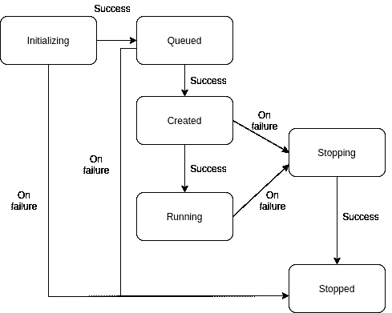

# 用状态机设计复杂的 REST API 结构

> 原文：<https://medium.com/geekculture/designing-complex-rest-api-structure-with-state-machine-cc2b8804d467?source=collection_archive---------11----------------------->

大多数开发人员使用不同的 HTTP 方法编写 REST API，如 GET、POST、PUT、DELETE 和 HEAD。假设我们有一个微服务，它必须处理不同的状态和转换，因此，它应该构建在一个有限状态机中。基本上，所有需要做的就是定义机器中的所有状态，并描述从一个状态到另一个状态的转换。

本文是关于通过 javascript-state-machine 处理 REST APIs 中不同的状态和转换。

**什么是 REST API**

REST 代表 **RE** 表象 **S** 状态 **T** 转移。

> RESTful API 是应用程序**接口** (API)的一种架构风格，它使用 HTTP 请求来访问和使用数据。该数据可用于获取、放置、发布和删除数据类型，这是指读取、更新、创建和删除与资源相关的操作。

REST API 的特性:

1.  可量测性
2.  灵活性和便携性
3.  独立性ˌ自立性

REST API 的设计原则:

1.  统一接口:统一接口让客户机用单一语言与服务器对话，独立于两者的架构后端。
2.  客户机-服务器:客户机和服务器的松散耦合，这样它可以单独和独立地发展。
3.  无状态:REST API 调用可以彼此独立进行，它不应该依赖于存储在服务器中的数据。
4.  缓存:为了管理大量的入站和出站调用，设计应该能够处理可缓存的数据。缓存在客户端完成。
5.  分层系统:几个层一起工作，构建一个层次结构，提供一个更具伸缩性和灵活性的应用程序
6.  按需编码:它允许代码或 applet 通过 API 传输，以便在应用程序中使用。

什么是状态机？

> 状态机图模拟了单个**对象**的行为，指定了**对象**在其响应事件的生命周期中经历的事件序列。

状态机图包括:

1.  州
2.  过渡

假设您的服务需要一个专用资源来运行一个特定的应用程序，这个资源可以是一个 [docker 容器](https://www.docker.com/resources/what-container)。

资源创建的状态机图:



**建筑**:

各国:

*   初始化:资源的初始状态
*   Queued:资源在队列中时的状态
*   已创建:资源已创建
*   正在运行:资源处于运行模式。
*   停止:在任何失败的情况下，停止资源
*   已停止:资源已清理

过渡:

*   最初，资源处于初始化状态，它可以移动到停止或排队。
*   排队后，它可以移动到“已创建”或“已停止”。
*   创建后，可能的转换正在运行或已停止。
*   运行后，可能的转换会在失败时停止。

用于处理状态机的 npm 库:[JavaScript-状态机](https://www.npmjs.com/package/javascript-state-machine)

```
const StateMachine = require('javascript-state-machine');

let fsm = new StateMachine({
  init: 'Initializing',
  transitions: [
    {
      name: 'updateState',
      from: '*',
      to: function (n) {
        return n;
      }
    },
    {
      name: 'queue', from: 'Initializing', to: 'Queued'
    },
    {
      name: 'create', from: 'Queued', to: 'Created'
    },
    {
      name: 'start', from: 'Created', to: 'Running'
    },
    {
      name: 'stop', from: ['Created', 'Running'], to: 'Stopping'
    },
    {
      name: 'stopped', from: ['Initializing', 'Queued', 'Stopping'], to: 'Stopped'
    }
  ],
  methods: {
    onStopped: function() { console.log('State transition to Stopped') }
  },
  data: {
    endState: 'Stopped',
  }
});
```

生命周期事件:每当发生任何转换时跟踪一个动作。

*   onBeforeTransition
*   onAfterTransition
*   过渡
*   单一状态
*   onLeaveState

助手方法:

*   is(state):如果状态为当前状态，则返回 true
*   can(t):如果转换 t 可能，则返回 true
*   transitions():当前状态的可能转换

GitHub repo 上的完整代码:[状态机](https://github.com/maranranu/state-machine)

# 总结:

*   理解 REST API
*   REST API 的特性
*   状态机理解
*   资源处理状态机图
*   Javascript 状态机库及其方法

# 来源:

[](https://restfulapi.net/) [## REST API 教程

### REST 是表述性状态转移的首字母缩写。它是分布式超媒体系统的一种架构风格，并且…

restfulapi.net](https://restfulapi.net/) [](https://www.npmjs.com/package/javascript-state-machine) [## javascript 状态机

### 有限状态机库。3.0 版是对早期版本的重大改写。现有 2.x 用户…

www.npmjs.com](https://www.npmjs.com/package/javascript-state-machine)