# 为下一代眼镜设计

> 原文：<https://medium.com/geekculture/designing-for-the-next-generation-spectacles-af1e824153dd?source=collection_archive---------23----------------------->

## Snap Incs 下一代眼镜展示了未来构建和体验增强现实的样子。

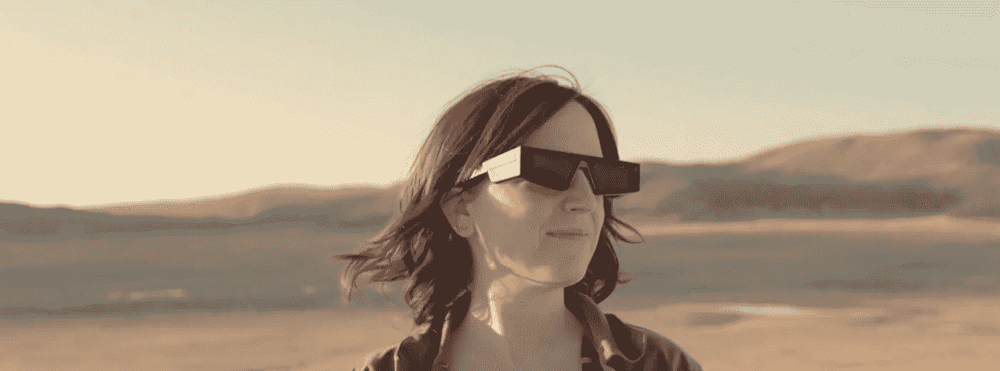

去年 12 月，我发现自己是 Snap Inc .接洽的 7 名创作者之一，他们是第一批为下一代打造体验的人****。**我进行这个项目的旅程改变了我对 AR 和可穿戴设备未来的看法——它带我穿越了新墨西哥州，追逐日光和手机服务，涉及了坏蛋诗人，公路旅行，神秘的嗡嗡声，大量的泡沫芯，只有一个小*在高速公路上对着我的电脑大喊大叫。那么，我在这一路上学到了什么，下一代眼镜对 AR 的未来意味着什么？***

# **硬件:都在里面吗？**

**这种眼镜是一种混合现实波导耳机。如果你以前没有听说过这些，这是一种融合了物理和数字世界的可穿戴计算机，允许你看到你周围世界的全息图并与之互动。你可能听说过 [Magic Leap](https://www.magicleap.com/en-us?utm_term=&utm_campaign=Leads-Search-3&utm_source=adwords&utm_medium=ppc&hsa_acc=7157164001&hsa_cam=13174181173&hsa_grp=126205598847&hsa_ad=522815454877&hsa_src=g&hsa_tgt=dsa-19959388920&hsa_kw=&hsa_mt=b&hsa_net=adwords&hsa_ver=3) 或 [Hololens](https://www.microsoft.com/en-us/hololens) ，这两款都是混合现实耳机。**

**那么是什么让下一代眼镜与众不同呢？**

**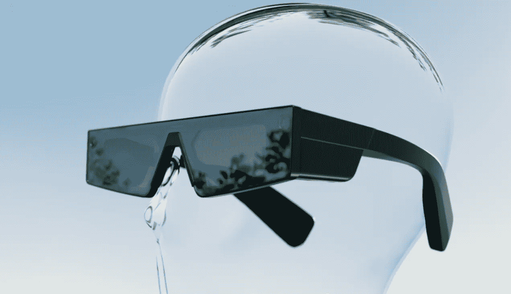**

**The New Snap Spectacles**

**打开盒子，我被他们在中包装的技术震惊了。**134 克，眼镜有一个** **波导显示屏，6 个自由度，26.3 度视野。2 个摄像头、4 个麦克风、扬声器和一个触摸板**。一副太阳镜太贵了。现在，不要误会我——它们是相当大的太阳镜。我有一个小脑袋，他们在我身上看起来很大，但我认为其他一些创作者，如 [Leighton](https://twitter.com/LATE_FX?ref_src=twsrc%5Egoogle%7Ctwcamp%5Eserp%7Ctwgr%5Eauthor) 确实让他们看起来很酷。尽管它们在我脸上很大，但我并不觉得它们很大。**它们很舒服**——我戴了几个小时都没有把耳机挂在脖子上，眼镜杆可以很好地适应我的头部大小，非常舒适。**

**让人们融入其中也非常容易。没有表带，不需要校准，当你把它们从表壳中取出时，它们就会打开。在项目宣布的几天里，我看着朋友们第一次戴上它们，我喜欢这些互动是如此的简单。我想改变的一点是，我希望我可以调整我的 IPD (IPD 是你的虹膜之间的距离)——我的眼睛距离很近，所以我很难用依赖平均 IPD 的设备聚焦我的眼睛。**

**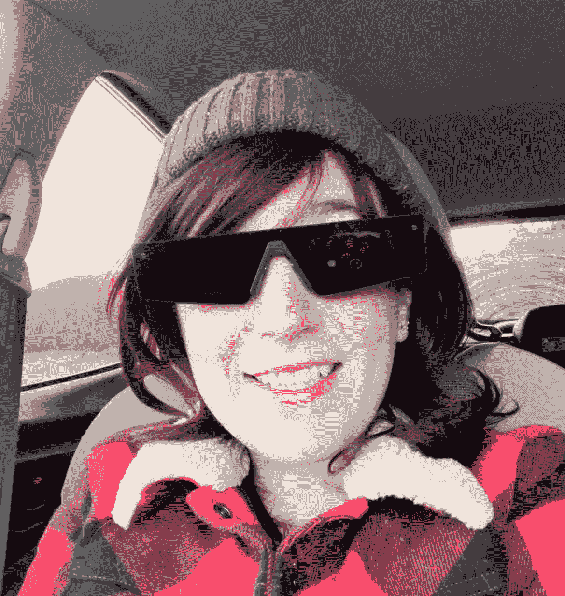**

**Testing out the Spectacles on site at the Valles Caldera**

**另一件让我印象深刻的事情是他们在户外工作得多么好——**在 2000 尼特的亮度下，我能够在明亮的日子里，在强烈的沙漠骄阳下清晰地看到我的经历**。玻璃的颜色有助于这一点，但也使他们在室内工作有点奇怪。在里面戴墨镜很奇怪。不过这也是一个不错的选择——在外面的世界里，看到全息图真正工作，绝对值得在工作室里戴上太阳镜。**

**最大的限制是电池寿命、热量和视野。电池可以持续运行 15 到 30 分钟，但我通常会达到热极限，需要让设备冷却下来，然后再耗尽电池*(我的文件效率很低，所以要有所保留)。*视野很小，比原来的 Hololens 小一点，有趣的是，刚刚勉强垂直。我其实很喜欢垂直视角。我在 AR 中看到的东西，至少在我的项目中，通常是脸、身体、海报，这些通常都是垂直的东西。所以，这感觉很好。**

**让这款耳机真正有趣的不是硬件。**

# **软件和生态系统:下一代眼镜的真正力量**

**近年来，我们已经看到了一些太阳镜形状因素 AR 眼镜。脑海中浮现出真实的画面——它们超级酷！但是这些早期耳机所缺乏的是一个清晰的、可访问的渠道来创造体验并把它们拿到人们手中。**这就是亮点所在——它们与 Snap AR 生态系统完美契合，这具有巨大的意义。****

**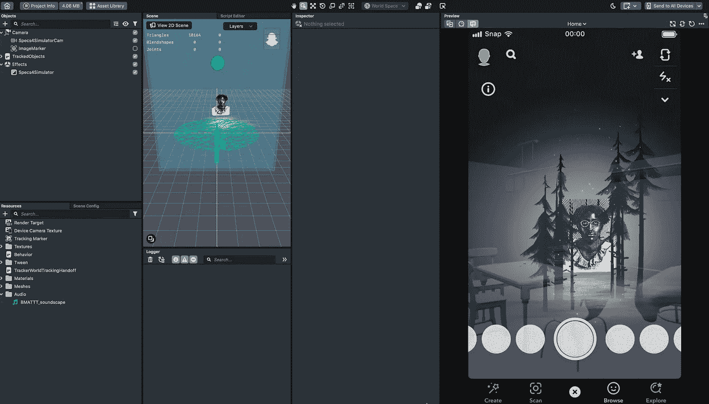**

**Prototyping for the Spectacles in Lens Studio was lightning fast.**

**那么首先，我们来看看 Lens Studio。Snap Lens Studio 自 2017 年以来一直存在——这是一个免费的工具，允许你在 Snapchat 上构建和发布镜头。这是一种荒谬的力量。就像精简版的 Unity，只针对 AR。用它迭代太快了。当我在做一个 Unity 项目时，我经常先在 Spark(Facebook 社交 AR 工具)或 Lens Studio 中勾勒出它的草图，因为从有想法到玩原型之间的时间可能是几分钟。**

**这种减少的摩擦使得在眼镜上工作的想法以一种我从未使用混合现实耳机体验过的方式飞行。这只是…简单。如果我的眼镜、Macbook 和手机在同一个 wifi 网络上，我可以在 Lens Studio 中点击一个按钮，在几秒钟内将体验发送到设备上。文件大小足够小，我可以在远程位置的热点上工作，每隔几分钟就可以推送到设备上。Lens Studio 中的预览很好地模拟了波导行为。我在耳机上录制的视频只需在我的手机上显示，无需插入或下载。有了 Snapchat 生态系统，我的作品已经有了大量的观众。没有定制的本地应用程序可以下载，以便与硬件或穿着硬件的人进行交互。*和*不戴眼镜的人很容易在手机上看到作品。**

**对我来说，这种流畅友好的创作和发布体验比耳机本身更具未来感。我个人使用眼镜的收获更多的是关于 AR *创造*和*平台*的未来，而不是 AR 眼镜的未来(但眼镜超级酷。).**

**那么，为眼镜创作的*是什么样子的呢？***

# **设计探索:未来是…立方体！风向标？路标！**

**从这个项目一开始，我就知道我想做一些与物体或地方相关的东西。**我喜欢基于物理世界的 AR——这种体验扩展了我对现有世界的理解、欣赏和热爱，而不是将我带到全新的现实。****

**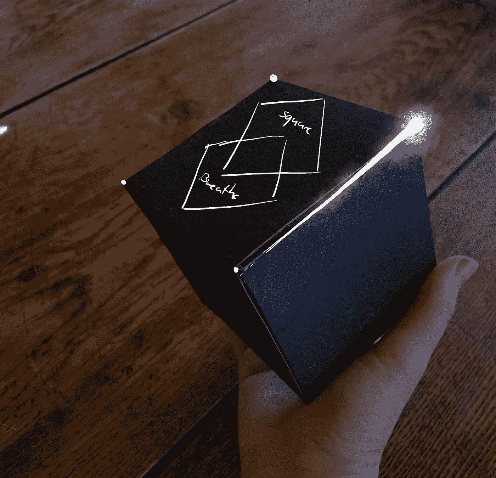**

**A fidget toy that teaches square breathe**

**在登陆路标之前，我经历了几个想法——我从一个教方形呼吸的正念立方体玩具开始(它看起来太像[合并立方体](https://mergeedu.com/cube))。**

**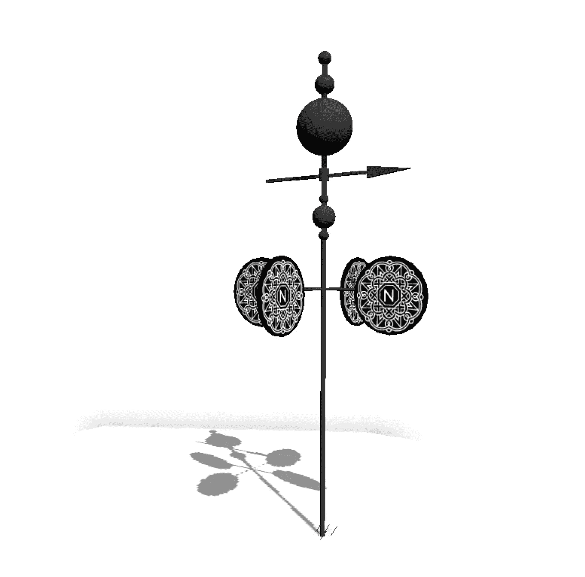**

**Weather Vane Sketch**

**后来我对风向标产生了浓厚的兴趣(我还是想做风向标艺术，[帮我联系气象朋友](https://www.laurencason.com/)！).然后，在一次与一些非常聪明的人的晚餐谈话中，有人提到了历史上的路标，这很合时宜。**

**我一直喜欢历史性的路标——让和我一起公路旅行的人失望的是，我绝对*需要*在所有的路标前停下来。**

**高速公路上这些有趣的标志出现在 30 年代，那时伟大的美国公路旅行的想法刚刚兴起。各州都在想方设法诱使驾车者离开公路，希望他们会把钱和时间花在当地的地标上。所以，他们开始张贴标语。新墨西哥州有 700 多个标志，2007 年，新墨西哥州历史妇女标志倡议启动，全州竖立了 75 个标志，分享妇女的历史。**

**对于 AR 项目来说，这些标志有很多好处——它们很大，对比度非常高，所以它们非常适合图像跟踪。(如果你不熟悉图像跟踪，这是指一种设备，比如你的手机或眼镜，可以检测到 2D 图像，然后根据该图像的位置将增强现实内容放到世界中。)**

**这些标志也意味着让你靠边停车体验——这是我对许多图像跟踪体验的批评之一。它们发生在大街上，走廊上，繁忙的街道上，广告牌上，我应该以每小时 75 英里的速度开车经过…不是超级理想。但是这些国道上的岩石？完美！**

**那么，问题是，在这些路标处会发生什么？我有兴趣探索三个方向。**

****

**How do you expand on these signs?**

**第一个是教育。AR 如何扩展标志的教育内容？你能说出它教给你的地形吗？看到他们牌匾旁边的历史人物了吗？重建一个考古遗址？**

**第二个是隐藏层。这些标记中的许多，嗯，有点无聊(不要来找我历史标记爸爸)。他们可能会告诉我一个城镇的人口，建立它的总督，是哪一年。但你知道，新墨西哥有一些非常酷的怪异历史，可能不会得到政府资助的牌匾。**如果有一个替代的历史标记宇宙，揭示了关于地方的传说和知识以及美丽奇怪的事情**会怎么样？**

**第三个是倾向于新墨西哥州历史妇女标记倡议，并把它作为一个策展项目。与当地的新墨西哥女艺术家合作**创造特定场所的体验，通过今天生活在这里的女性的艺术阐释这些令人惊叹的历史女性的生活**。**

**最后，我决定各做一个。**

# **艺术方向:向光倾斜**

**在我开始建筑之前，我也有一些特别的东西想在艺术和风格方面探索。**

**波导显示器通过衍射和重定向光来形成图像，然后投影到眼睛中。当你戴上这种类型的眼镜时，你看到的图像是由光构成的。**

**这意味着你不能渲染黑色，或者让一些东西看起来更暗——只能更亮。图片是附加的，这可能是限制性的。也就是说，人类的感知是一件有趣的事情。请看这张图片:**

**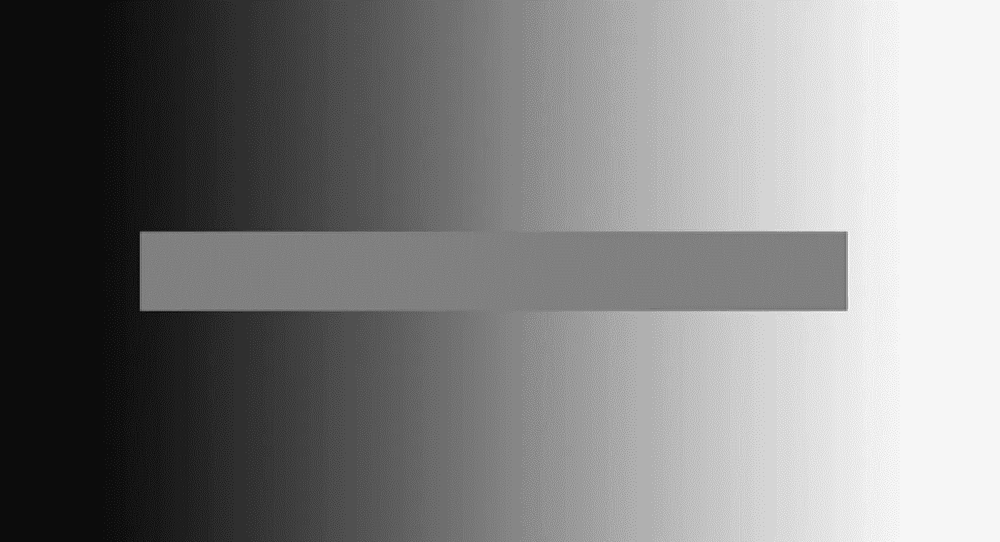**

**The grey bar is all one color.**

**我能把这种视错觉推多远来创造一种更大范围发光的感觉？**

**我也想探索一种更安静、单色、简约的风格。如此多的 AR 是迷幻的最大化主义(这是我喜欢的，并且[在《喵狼](https://www.laurencason.com/meow-wolf1)》中做了很多)，我想挑战自己，探索其他美学。我决定用白色作为我唯一的颜色，倾斜成一种幽灵般短暂的样子，就像光线穿透面纱一样。**

**所以，现在我有了我的概念和我的艺术方向，是时候开始建造了！**

# **制作:制作镜头(和一些假路标)**

****我制作的第一个镜头是 Caldera——基于教育的镜头**。基于巴雷斯格兰德历史标志，它会让你看到山谷火山口的地形图，一个 13 英里宽的火山火山口形成于大约 125 万年前的一次喷发。**

**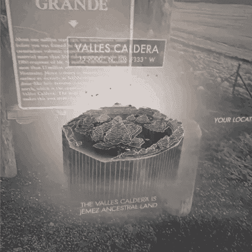**

**Caldera**

**作为第一个镜头，这是很多学习发生的地方。第一件事？在家测试很难。我需要站在标志前，绕着它走，后退，以便理解镜头会有什么样的感觉，而一直开车到标志前是不可行的。**

**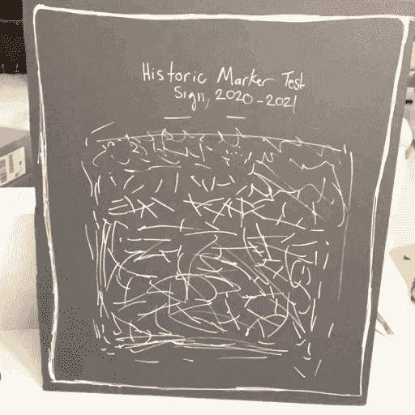**

**My Beautiful Sign.**

****所以，我做的第一件事就是用同样尺寸的泡沫塑料做一个大的假标志(** *如果我想得多一点，我可能会把它做得很漂亮，让互联网上的每个人都看到*)。我能够在家里设置它，并合理地进行迭代。我不会得到同样的照明条件，但它让我解决了规模和位置等问题。如果我能回到过去，我会确保它和历史标志物的颜色一样。假标牌上较暗的背景让我确信事情在视觉上是正常的，但实际上并不是。**

**我还发现戴着眼镜阅读世界空间中的文本并不是一种很好的体验。任何形式的延迟都会让阅读变得非常头痛，而在静态文本中来回移动也不会让人感到特别兴奋。**我原本计划用更多的文字来解释地质特征，但是用配音来代替解释你所看到的地理。****

**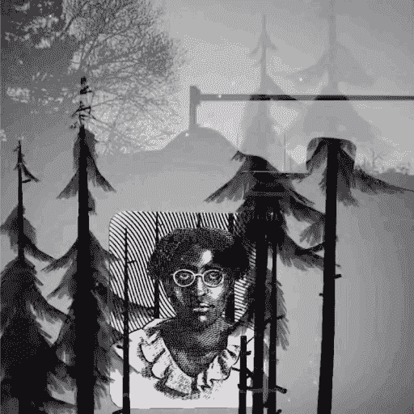**

**Anita**

****我制作的第二个镜头是安妮塔**，它基于银城的安妮塔·斯科特·科尔曼标志。安妮塔·斯科特·科尔曼(Anita Scott Coleman)是世纪之交居住在新墨西哥州的诗人和散文家，她写了西南部的黑人经历。为了这件作品，**我与当地的阿尔伯克基诗人** [**乌木伊希斯布斯**](https://www.ebonyisisbooth.com/) **合作。她表演了安妮塔·斯科特·科尔曼的一首诗《肖像》。当你站在记号笔前时，它被安妮塔的肖像所取代——一片树林渐隐，你会听到埃布尼对这首诗的演绎。安妮塔和她的作品在很多方面都是非凡的，只是无法在路标中完全传达出来，我希望用这个镜头给我们纪念她的地方带来更多的深度。****

**有了安妮塔镜头，我对艺术风格有了很多了解。**我追求的美感确实融入了波导耳机的特性，但我忽略了这款眼镜的一个关键之处——你可以轻松拍摄视频并分享**！这种风格很大程度上依赖于这样一个事实，即眼镜是有色的，黑色是不渲染的，白色是明亮的附加光。眼镜视频捕捉*是否*允许你渲染黑色，*没有*从太阳镜得到的那层色调，白色*没有*比环境更亮。幸运的是，Snap 团队与我合作，在 Lens Studio 中创建了一个特殊的相机，使我能够捕捉到更接近真实生活体验的图像。我非常喜欢这些镜片戴在眼镜上的感觉，但如果我能回到过去，我会更多地考虑许多人体验这些物品的方式，是作为视频还是快照。**

**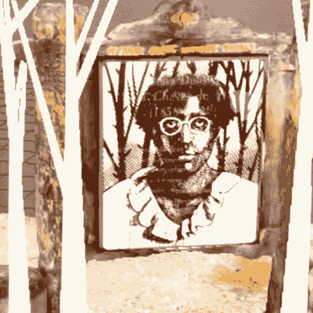**

**Blocking out the experience with a Scaniverse scan.**

**另一个使镜头工作更容易的过程是使用 [**扫描仪**](https://scaniverse.com/) 对标志进行摄影测量扫描。我喜欢在我的 AR 管道中使用 Scaniverse 我可以在几分钟内从我的手机上获得足够好的扫描，并开始在 Maya 中基于真实环境绘制东西。这在解决诸如安妮塔镜头的树木摆放等问题时帮助很大。**

**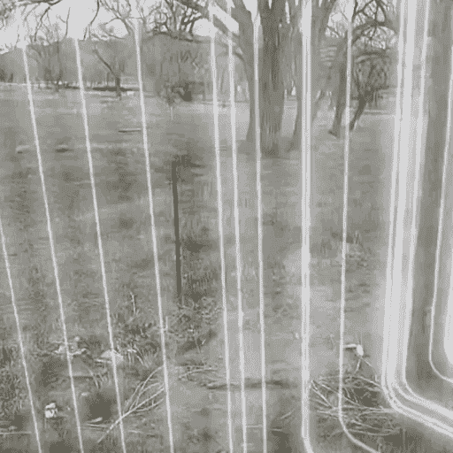**

**Hum**

**我做的最后一个镜头是 Hum。Hum 位于陶斯历史标志处，是陶斯 Hum**的音频可视化器，这是一种传说中的低沉嗡嗡声，大约 2%的人口说他们可以在整个陶斯镇听到。事情是这样的，当我在构建 Hum 的时候，并没有真正的方法在 lens studio 中创建一个音频反应镜头。我使用的解决方法是在 Maya 中使用 MASH 预渲染可视化，并将其作为动画引入。 [Lens Studio 4.0 有一些非常酷的新音频分析工具，](https://lensstudio.snapchat.com/templates/audio/audio-analyzer/)所以我肯定会重新使用这个镜头，使它更具反应性。****

# ****接下来是什么？****

****完成这个项目后，我发现了很多扩展它的方法:****

*   ******用 AR 更新标志**。历史标志物经常让我失望的一件事是，它们中有多少是为了纪念可怕的历史。一个杀害了数百人的征服者，一个淹没并摧毁了神圣土地的大坝，一个邦联将军。我们能把这项技术交到那些故事另一面的人们手中，让他们的历史成为历史吗？****
*   ******利用 AR 重建和揭示考古遗址**。AR 可以让我看到一个过于精致而无法挖掘的房间，看到 400 年前壁画全盛时期的样子。****
*   ****深入探索新墨西哥历史女性标志倡议，并围绕这些历史标志创建一个由当代新墨西哥女性策划的艺术之旅。****
*   ****将该项目扩展到其他州标记程序或牌匾。****
*   ****探索地理定位的陆地确认在 AR 中会是什么样子。AR 能否为我们的视觉创造一个层面，让我们对我们赖以生存的这片被偷走的土地有更深入的了解？****

****对于这些项目中的大多数，我太缺乏文化知识，背景，资金，或者三者的组合来独自承担它们。但是如果你是一个人或一个组织，而*有这些东西，并且你想探索其中的一个想法，[让我们谈谈](https://www.laurencason.com/)。*****

*******归根结底，增强现实令人兴奋的地方在于它能帮助你以不同的方式看待事物。这不是虚拟现实——我们不会进入幻想的新现实。我们正在从新的角度看待我们自己有缺陷的、美丽的、混乱的、真实的世界。至少对我来说，这就是它的特别之处。这就是我希望这项技术在未来融入我们生活的方式。与下一代 Spectacles 合作让我们感觉离未来更近了一步。*******

**********

# *****感谢阅读！*****

*******劳伦·卡森**是一位获奖的**创意技术专家** t 和 **XR 创意总监**位于新墨西哥州圣达菲。*****

*****你可以在 [Instagram](https://www.instagram.com/three.swords/?hl=en) 、 [Twitter](https://twitter.com/miss_lady_pants?ref_src=twsrc%5Egoogle%7Ctwcamp%5Eserp%7Ctwgr%5Eauthor) 、 [Snapchat](https://lensstudio.snapchat.com/creator/lCj9ou_Nm_yED7576tsvgQ) 上关注她，或者[通过她的网站](https://www.laurencason.com/)联系她。*****